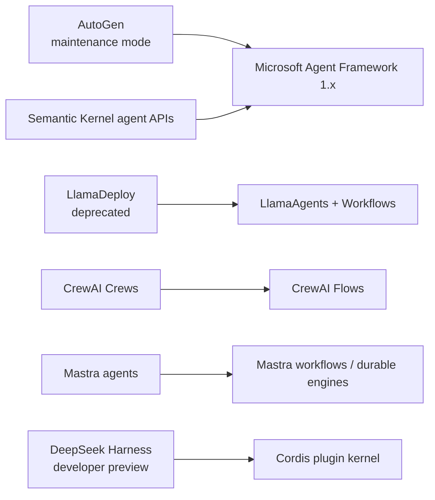

# Framework Lifecycle and Second-Wave Ecosystem — Research Packet

**Research date:** 2026-08-31  
**Status:** Research-backed synthesis  
**Scope:** AutoGen and Semantic Kernel migration, CrewAI, LlamaIndex and LlamaAgents, Mastra, and DeepSeek Harness  
**Freshness:** Recheck every 30–60 days; several surfaces are preview, experimental, newly replaced, or rapidly changing

## Research question

How should a production team evaluate established and newer agent frameworks when project lifecycle, migration direction, workflow durability, state semantics, security posture, and deployment product boundaries matter more than feature breadth?

## Lifecycle map

The transition arrows are adoption facts. A maintained package can still run existing systems, but a new system should not accept migration debt without a workload-specific reason.

## Research method

The packet cross-checked official documentation, repositories, migration guides, architecture notes, changelogs/releases, security statements, source-level contracts, current issue reproductions, and deployment/runtime material. Framework claims such as “production ready,” performance, popularity, and customer outcomes were excluded unless a concrete architecture or failure contract supported them. Issues are used as conformance-test seeds, not prevalence estimates.

## Snapshot comparison

| System | Core shape | Current lifecycle | Strongest fit | Main production caution |
|---|---|---|---|---|
| AutoGen | AgentChat over event-driven Core runtime | Maintenance mode; community-managed; new users directed to MAF | Existing AutoGen systems and migration source behavior | No new features; state snapshots are not a durable process and can be inconsistent while running |
| Semantic Kernel agents | Kernel/plugin-centered provider agent abstractions | Current migration guide directs agent workloads to MAF | Existing SK assets during staged migration | Provider-specific thread types and orchestration history do not map one-to-one |
| CrewAI | Role/task Crews plus event-driven Flows | Active and fast-moving | Python teams that want autonomous Crews inside explicit Flows | Persistence snapshots and experimental conversational surfaces need upgrade/recovery tests |
| LlamaIndex + LlamaAgents | Data/RAG agents plus event-driven Python Workflows and server/durable adapters | Active new stack; LlamaDeploy deprecated | Document-centric, retrieval-heavy, event-driven Python workloads | Product/package transition is recent; Context, Memory, server, and durable adapter are separate owners |
| Mastra | TypeScript agents, memory, workflows, tools, server, and newer durable engines | Active and rapidly expanding | Full-stack TypeScript agent/workflow platform | Snapshot/HITL/concurrency and graceful-shutdown seams are changing quickly |
| DeepSeek Harness | Plugin-composed TypeScript workspace harness on Cordis | Explicit developer preview, breaking changes expected, not security-audited | Harness/plugin research and isolated experimentation | Do not use as sole security boundary or expose its control plane as a production service |

## AutoGen and Semantic Kernel migration findings

The current AutoGen repository states that the project is in maintenance mode, receives no new features or enhancements, is community-managed, and directs new users to Microsoft Agent Framework. It also warns that Microsoft lost administrative control of the `pyautogen` PyPI name after version 0.2.34; old 0.2 users should use the documented `autogen-agentchat` package line instead.

AutoGen v0.4 itself was a ground-up asynchronous, event-driven rewrite of v0.2. It has three layers: Core message-passing/runtime, AgentChat teams, and Extensions. Core offers standalone and distributed runtimes; AgentChat includes round robin, selector, swarm, Magentic-One, GraphFlow, termination conditions, and state save/load.

Those capabilities are useful migration evidence, not a reason to start new strategic work on a maintenance-mode framework. Agent/team `save_state()` returns JSON-oriented internal state, but source cautions against saving while a team is running and states saved before v0.4.9 may not be compatible. Pause/resume is experimental and relies on each custom agent implementing resume correctly. A historical issue also caught non-JSON datetime state despite the documented contract.

Microsoft’s current migration guides map AutoGen and Semantic Kernel agents to Agent Framework. This is behavioral migration, not a package rename:

- AutoGen’s one-tool-iteration defaults differ from MAF’s multi-turn agent loop.
- RoundRobin/Selector/Swarm/Magentic patterns map to different MAF builders.
- MAF sessions may be local or provider-managed; provider resource deletion remains provider-specific.
- Semantic Kernel’s `Kernel`, plugins, provider-specific agent/thread types, and invocation returns become `Agent`/`AIAgent`, direct tools, sessions, and response/update types.
- Existing Semantic Kernel functions and vector-store connectors can support gradual migration.

Migration tests must preserve tool-output visibility, termination behavior, handoff history, structured result shape, thread deletion/retention, streaming order, and persisted state. A current Agent Framework discussion documents a release-candidate change where GroupChat tool outputs stopped broadcasting to downstream agents, illustrating why compile success is not behavioral parity.

Primary evidence: [AutoGen repository status](https://github.com/microsoft/autogen), [v0.2→v0.4 migration](https://microsoft.github.io/autogen/stable/user-guide/agentchat-user-guide/migration-guide.html), [runtime architecture](https://microsoft.github.io/autogen/stable/user-guide/core-user-guide/core-concepts/architecture.html), [AutoGen→MAF migration](https://learn.microsoft.com/en-us/agent-framework/migration-guide/from-autogen/), [Semantic Kernel→MAF migration](https://learn.microsoft.com/en-us/agent-framework/migration-guide/from-semantic-kernel/), and [migration samples](https://github.com/microsoft/agent-framework/tree/main/python/samples/autogen-migration).

## CrewAI findings

CrewAI deliberately separates **Crews**—role/task-based autonomous collaboration—from **Flows**—event-driven start/listen/router control, structured state, persistence, and human feedback. Official production guidance recommends starting with a Flow and embedding agents or Crews only where open-ended agency adds value.

Flow persistence saves state after decorated methods. Current docs distinguish resuming under the same flow UUID from forking a stored snapshot into a new state ID. Class-level persistence saves after every method, so the “latest” row can be a mid-turn checkpoint; current conversational guidance recommends persisting a terminal step when that is the intended state contract. Older unstructured state can also lose newly added defaults on restore, a current issue demonstrates.

Human feedback can pause and route execution. If free-form feedback is mapped to a finite outcome by an LLM, the result is nondeterministic classification—not authorization. Bind approvals to exact effects and perform deterministic commit-time checks. The conversational Flow layer is explicitly experimental and recent issues show custom route replies missing from persisted history. Treat this as a web-state conformance target.

Async and replay failure evidence matters: an issue reports provider exceptions disappearing and leaving a Flow waiting indefinitely; another shows `kickoff_for_each` clearing replay records. Put wall-clock and stuck-run detectors outside the framework, propagate exceptions, and validate replay through the exact package version.

CrewAI AMP is a separate managed deployment/observability/RBAC product. Compare its queueing, identity, data retention, webhooks, scaling, and repair operations separately from the open-source Python runtime.

Primary evidence: [CrewAI concepts](https://docs.crewai.com/core-concepts/Agents), [Flows and persistence](https://github.com/crewAIInc/crewAI/blob/main/docs/v1.15.5/en/concepts/flows.mdx), [production architecture](https://github.com/crewAIInc/crewAI/blob/main/docs/v1.12.2/en/concepts/production-architecture.mdx), [conversational Flow maturity](https://github.com/crewAIInc/crewAI/blob/main/docs/v1.15.2/en/guides/flows/conversational-flows.mdx), and [AMP](https://docs.crewai.com/enterprise/introduction).

## LlamaIndex and LlamaAgents findings

LlamaIndex’s current agent abstractions are built around `FunctionAgent`, `AgentWorkflow`, and event-driven Workflows. `AgentWorkflow` provides a linear handoff/swarm shape; the docs separately show an orchestrator-as-tools pattern and a custom planner. This is good category clarity: use the simple handoff path only when model-selected sequential transfer matches the task.

Workflow `Context` and agent `Memory` are distinct. Context contains workflow runtime and shared step state and can be serialized; Memory contains chat messages and optional long-term blocks. Custom memory may require separate persistence. Human-in-the-loop paths may need both. Deprecated older memory types remain visible in documentation, so migration must identify which memory API produced stored data.

Concurrency requires explicit state discipline. The documented `ctx.store.edit_state()` offers atomic editing within its intended runtime, while community questions show that AgentWorkflow handoffs are sequential and parallel shared state needs custom Workflow design. Nested streaming and same-workflow multiple-run behavior have produced runtime errors; create per-run workflow instances or prove isolation.

The deployment story changed materially. `llama_deploy` is deprecated and directs users to `llama-agents`. The new LlamaAgents stack wraps Workflows with server/client/CLI layers and pluggable durability. The DBOS adapter architecture uses co-located workflow steps, shared PostgreSQL coordination, per-executor ownership, workflow admission queues, event persistence, idle release/resume locks, and version fingerprints. A key upgrade constraint: old-fingerprint workers must remain until their runs drain, and changes inside user step code may not change the wrapper fingerprint. Add application workflow/prompt/tool schema versions rather than relying on engine fingerprints alone.

Primary evidence: [multi-agent patterns](https://github.com/run-llama/llama_index/blob/main/docs/src/content/docs/framework/understanding/agent/multi_agent.md), [Memory vs Context](https://github.com/run-llama/llama_index/blob/main/docs/src/content/docs/framework/module_guides/deploying/agents/memory.mdx), [LlamaAgents repository](https://github.com/run-llama/llama-agents), [DBOS adapter architecture](https://github.com/run-llama/llama-agents/blob/main/packages/llama-agents-dbos/ARCHITECTURE.md), and [deprecated LlamaDeploy](https://github.com/run-llama/llama_deploy).

## Mastra findings

Mastra spans TypeScript agents, Zod-typed tools, provider routing, MCP, memory, workflows, server/storage, tracing/evals, and experimental agent networks. Its workflow snapshots hold paths, step outputs, suspended metadata, and retry state in configured storage. Approval gates an effect; suspension requests information. Automatic conversational resumption depends on configured memory and the same message thread, which is weaker than application-owned approval identity.

The fast-changing combined surface creates adoption risk. Current issue history covers nested resume restarting at the outer workflow, cross-run context pollution under concurrent `foreach`, loss of suspended sibling payloads, missing public recovery fields, approval snapshot lookup, missing active-run discovery for UIs, and graceful shutdown closing PostgreSQL before durable runs persist. Many issues are fixed, but each becomes a regression fixture.

Mastra can run agents through built-in evented execution and integrations such as Inngest/Temporal. Do not collapse all engines into one guarantee. Pin core, storage, server, provider/AI SDK, and engine adapters; prove snapshot format, queue/lease ownership, step retry, streaming, shutdown drain, migration, and repair per engine. Approval/suspend-capable tools may conservatively force sequential tool execution; this trades latency for avoiding sibling suspension races.

RuntimeContext is dependency injection, not a security boundary. Use it to derive user-specific models/tools/instructions, but authorize resources inside tools/workflows and never expose secrets to model-visible prompt construction.

Primary evidence: [Mastra core](https://github.com/mastra-ai/mastra/tree/main/packages/core), [workflow snapshots](https://mastra.ai/reference/workflows/snapshots), [agent approval guidance](https://mastra.ai/blog/human-in-the-loop-when-to-use-agent-approval), [releases](https://github.com/mastra-ai/mastra/releases), and current issue reproductions [#12029](https://github.com/mastra-ai/mastra/issues/12029), [#15552](https://github.com/mastra-ai/mastra/issues/15552), [#16044](https://github.com/mastra-ai/mastra/issues/16044), and [#21193](https://github.com/mastra-ai/mastra/issues/21193).

## DeepSeek Harness findings

DeepSeek Harness is a TypeScript workspace harness where Cordis plugins supply models, tools, sessions, storage, sandboxes, loops, scheduling, subagents, and UI. Cordis provides dependency injection, scoped services, lifecycle-managed effects, events, configuration loading, and service isolation. This is a serious composability design, but the product’s official `SAFETY.md` says it is experimental, not security-audited, not production-ready, and must not be the sole control for untrusted workloads.

Its session model is unusually explicit. An append-only, contiguous `SessionEvent` log is the source of truth; model messages, UI replay, fork, resume, compaction, telemetry, and provenance derive from it. JSONL/Zstandard and SQLite backends share a persistence seam. Flush waits for durable append, crash recovery preserves the interrupted turn, and incomplete tools become `TOOL_NOT_STARTED` or `TOOL_OUTCOME_UNKNOWN` rather than being blindly replayed. The pre-release storage format remains version 0 with no broad compatibility promise.

Plugins are code and capabilities, not declarative permissions. Service isolation controls which instance a plugin sees; it is not an OS sandbox. Hot reload and automatic dependent unload/reload enlarge lifecycle test requirements. A process-global Cordis inspection registry has already caused multi-preset session creation/resume collisions. Corrupted compressed logs can prevent workspace startup.

Security evidence reinforces the official warning. Public discussions report unauthenticated local/LAN web control-plane access, sandbox/approval bypasses, plugin/telemetry poisoning, and subagent/approval propagation gaps against specific release candidates. These reports require maintainer verification and version re-testing, but they are sufficient to reject exposed or sensitive production use at this maturity. Run only in a disposable VM or strongly isolated container, bind loopback, expose no sensitive credentials, pin and audit plugins, and treat session artifacts as sensitive reasoning/tool data.

Primary evidence: [official overview](https://www.deepseek.com/harness/en/), [official safety statement](https://github.com/deepseek-ai/deepseek-harness/blob/master/SAFETY.md), [architecture](https://github.com/deepseek-ai/deepseek-harness/blob/master/docs/architecture.md), [session persistence](https://github.com/deepseek-ai/deepseek-harness/blob/master/docs/subsystems/persistence.md), [Cordis service isolation](https://github.com/deepseek-ai/deepseek-harness/blob/master/docs/user/develop/framework/service.md), and version-specific audit leads [#817](https://github.com/deepseek-ai/deepseek-harness/discussions/817) and [#853](https://github.com/deepseek-ai/deepseek-harness/discussions/853).

## Cross-framework conclusions

- Lifecycle is a hard gate. Maintenance mode, replacement, preview status, and package ownership outweigh feature count.
- “Persistence” can mean a crew/agent snapshot, workflow checkpoint, event log, managed store, or durable engine history; document replay and effect semantics precisely.
- Multi-agent abstractions should be embedded inside explicit workflows unless decentralized coordination wins on repeated workload traces.
- Human feedback routed through an LLM is not deterministic approval.
- A full-stack framework’s packages and deployment product must be tested as one versioned capability profile.
- Event sourcing improves audit and replay only when logs are access-controlled, migratable, bounded, and paired with external-effect receipts.
- Plugins and tools execute with real authority; dependency injection and tool schemas are not containment.

## Excluded or downgraded claims

- Framework-authored “production ready,” “enterprise ready,” speed, cost, and popularity claims were not selection evidence.
- Managed-platform capabilities were not attributed to open-source runtimes.
- Fixed issues were not described as current defects; they became regression tests.
- Preview/experimental features were not promoted because adjacent packages are stable.
- Third-party security reports were not treated as final advisories, but official preview warnings plus reproducible boundary reports informed the risk gate.

## Refresh triggers

- AutoGen maintenance/security policy or MAF migration compatibility change.
- Semantic Kernel agent support/deprecation timeline or migration adapter change.
- CrewAI Flow snapshot schema, conversational graduation, exception propagation, or AMP runtime contract change.
- LlamaAgents server/durable adapter release, LlamaDeploy retirement, context/memory serialization, or version-fingerprint change.
- Mastra durable-agent engine, workflow snapshot, approval/resume, active-run discovery, shutdown, or network stabilization.
- DeepSeek Harness GA/security audit, authentication, session format, sandbox/approval, plugin signing, or compatibility promise.

## Guides supported

- [Selecting across evolving framework ecosystems](../../comparisons/evolving-agent-framework-ecosystems.md)
- [Migrating AutoGen and Semantic Kernel agent systems](../../frameworks/autogen-and-semantic-kernel-migration.md)
- [CrewAI](../../frameworks/crewai.md)
- [LlamaIndex and LlamaAgents](../../frameworks/llamaindex-and-llamaagents.md)
- [Mastra](../../frameworks/mastra.md)
- [DeepSeek Harness](../../frameworks/deepseek-harness.md)
