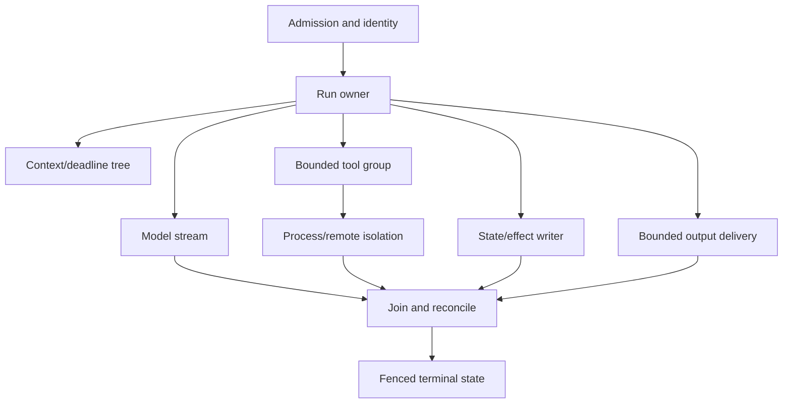

# Research Packet: Go Agent Engineering Deep Dive

> **Research date:** 2026-08-31  
> **Scope:** Production agent services, gateways, tool hosts, protocol adapters, queue workers, and durable activities implemented in Go  
> **Runtime baseline:** Go 1.27.0  
> **Output area:** [Go Agent Engineering](../../languages/go/README.md)  
> **Relationship to prior packet:** This packet deepens runtime and operational mechanics; it does not replace the existing broad [Go agent runtimes packet](go-agent-runtimes.md)

## Research question

What must a production team design, test, and operate differently when an agent runtime is implemented in Go, and which claims are supported by current Go 1.27, official agent/MCP/provider documentation, durable-runtime documentation, and narrowly selected source/issues?

The investigation focused on failure boundaries rather than language advocacy:

- goroutine ownership and cancellation;
- count, byte, rate, tenant, and dependency backpressure;
- HTTP/SSE/WebSocket/MCP stream lifecycle;
- subprocess, filesystem, egress, and sandbox authority;
- JSON v2/schema/structured-output behavior;
- typed errors, retry ownership, idempotency, and ambiguous effects;
- queue leases, state machines, outbox, replay, and durable workers;
- heap/RSS/GC/container CPU and memory behavior;
- profiles, traces, runtime metrics, races, fake time, fuzzing, and load;
- modules, checksums, toolchain/build execution, vulnerability scanning, provenance;
- termination, readiness, rollout, scaling, and durable compatibility;
- exact maturity boundaries of current Go agent/framework/protocol surfaces.

## Method

Research started from primary sources and current release pages:

1. Go 1.27 release notes and standard-library/package documentation.
2. Go team design/operations/security guidance for context, pipelines, HTTP, execution, JSON v2, GC, diagnostics, `synctest`, race, fuzzing, modules, toolchains, `os.Root`, and command-path security.
3. Official OpenAI documentation for the exact distinction between the official Go API helper and official Agents SDK language packages.
4. Official Google ADK and Genkit documentation, Microsoft Agent Framework Go repository/comparison, and official MCP specification/Go SDK documentation/releases.
5. Temporal, Restate, DBOS, and Dapr Go documentation for deterministic replay, activities/steps, durable concurrency, queues, versioning, and cancellation.
6. OpenTelemetry and Kubernetes documentation for signal maturity, instrumentation, pod termination, probes, and draining.
7. A bounded set of Go/MCP issues and source files only where package documentation did not fully expose an operational limitation.

Issue reports were used as mechanism/design evidence, not prevalence estimates. Vendor maturity statements were kept surface-specific. Claims that could not be established from the inspected primary source were omitted or written as validation requirements.

## Executive synthesis

Go's production advantage is not “cheap goroutines.” It is the combination of explicit blocking control flow, context propagation, mature HTTP/process primitives, a small deployment unit, container-aware runtime defaults, and unusually strong first-party diagnostics. The failure mode is equally clear: the language makes it easy to start more concurrent ownership than the architecture can safely end.

The governing model is an owned run tree:

Every child requires an owner, cancellation/close path, join or durable handoff, independent resource limit, and late-result rule. Every external mutation additionally requires a stable effect identity and ambiguous-outcome reconciliation. Every business run that must survive a crash requires durable state; a goroutine is never that state.

## Finding 1: Go 1.27 changes three practical baselines

Go 1.27 is the current stable release at the research snapshot. Three changes materially affect an agent playbook:

1. `encoding/json/v2` and `encoding/json/jsontext` are generally available. V2 chooses stricter defaults such as rejecting invalid UTF-8 and duplicate object names. The v1 `encoding/json` API is backed by the v2 implementation while preserving v1 semantics, although exact error strings may change. A production migration is behavioral and needs fixtures/options/comparison, not a mechanical import rename.
2. The `goroutineleak` pprof profile is GA. It uses runtime/GC reachability to identify a useful class of permanently blocked goroutines. It cannot identify all leaks, including synchronization objects reachable from globals or runnable goroutines.
3. `net/http/httptest.NewTestServer` provides an in-memory fake network suitable for `testing/synctest`, making concurrent HTTP behavior more testable without a real network.

Go 1.27 also adds `synctest.Sleep`. The core `testing/synctest` package graduated to GA in Go 1.25.

Operational consequence: adopt 1.27 intentionally, snapshot JSON wire behavior, add leak-profile collection, and replace wall-clock concurrency tests where the in-memory HTTP/synctest boundary fits.

## Finding 2: context carries lifetime, not correctness

The `context` documentation establishes:

- incoming server paths create contexts and outgoing calls accept/propagate them;
- context is passed explicitly, not stored in structs;
- every returned cancel function must be called to release resources;
- values are for request-scoped data crossing APIs, not optional parameters;
- `WithCancelCause`/`WithTimeoutCause` preserve a diagnostic cause;
- `WithoutCancel` removes cancellation and deadline while retaining values.

Consequences for agent systems:

- separate admission, run, model-attempt, stream-idle, tool, receipt, and shutdown budgets;
- audit channel sends, semaphore acquisition, pipe writes, provider stream reads, and retry sleeps for cancellation;
- fence state transitions after cancellation because cancellation does not roll back a remote commit;
- treat `WithoutCancel` as one ingredient in a short bounded cleanup, never as ownership transfer;
- persist durable cancellation intent separately from an HTTP request context.

`errgroup.WithContext` is a strong default for finite related work. `SetLimit` bounds active functions but makes `Go` block when full; `TryGo` exposes overload to the caller. Neither provides byte bounds, tool cooperation, or durable recovery.

## Finding 3: backpressure must be multi-dimensional

Channels bound elements, not resident bytes. An event channel of capacity 100 can retain a few kilobytes or many gigabytes depending on payload ownership. Agent services need explicit budgets for:

- admitted runs globally/per tenant;
- provider/model requests and token/rate quotas;
- read/write/process/sandbox tool classes;
- database connections/transactions;
- outbound connections per host;
- pending events and total bytes;
- prompt/retrieval/tool-result bytes;
- durable queue leases and activities;
- telemetry queues.

One global semaphore creates head-of-line blocking and multiplies incorrectly across replicas. Per-process limits must be reconciled with global dependency quotas. Overload policy should choose among reject, persist/defer, block, coalesce/drop, or disconnect; correctness records and terminal state may not be dropped to protect a cosmetic stream.

## Finding 4: streaming is a lifecycle, not a response format

`net/http` establishes important mechanics:

- clients/transports should be reused and configured by policy;
- successful response bodies must be closed;
- `ResponseController` can flush and set deadlines where supported, but not after the handler returns;
- `Server.Shutdown` closes listeners/idle connections and waits for active ordinary connections;
- shutdown does not close or wait for hijacked connections such as WebSockets;
- `RegisterOnShutdown` initiates protocol-specific shutdown but is not the waiting owner.

An agent stream needs separate limits for response/body bytes, decompression, pending event bytes, first event, idle gap, and total run. The handler must not return while another goroutine continues writing its `ResponseWriter`.

For MCP 2026-07-28, the transport model is materially different from older tutorials:

- one POST per client message to a single endpoint;
- JSON or a request-scoped SSE response;
- per-request metadata and mirrored standardized headers;
- no protocol-level session or standalone GET stream in this revision;
- closing the SSE response is request cancellation;
- no `Last-Event-ID` resumability for this revision;
- old HTTP+SSE transport is deprecated.

The Go SDK negotiates older revisions. Its current release documentation makes request-cancellation propagation an explicit option and requires stateless mode for the 2026-07-28 HTTP surface. Compatibility must be tested against exact pinned SDK/protocol versions.

## Finding 5: `os/exec` is process control, not sandboxing

The standard library establishes:

- `exec.Command` passes an executable and arguments without shell parsing;
- `CommandContext` defaults to killing the direct process when context ends;
- `Cmd.WaitDelay` bounds child non-exit and I/O pipes kept open after cancellation/process exit;
- zero `WaitDelay` can wait for EOF from pipe descriptors inherited by descendants;
- `os.Process.Kill` kills only that process, not processes it started;
- `ErrDot` prevents implicit execution from the current directory via PATH lookup.

Therefore:

- never compose model input into `sh -c`, `cmd /c`, or PowerShell unless the shell itself runs inside the intended hostile-code sandbox;
- allowlist absolute executable paths and construct a minimal environment;
- drain stdout/stderr concurrently into byte-capped sinks;
- supervise the process tree with OS/container mechanisms (Unix process groups/cgroups, Windows Job Objects, or a sandbox runtime);
- test descendant cleanup on every supported OS;
- place hostile code, package installs, browsers, and untrusted parsers outside the controller process.

The bounded Go issue used here, proposal #50436, is useful because its accepted `Cancel`/`WaitDelay` design discussion explicitly leaves whole-process-group termination to platform-specific mechanisms. It is not evidence that every user encounters the failure.

## Finding 6: `os.Root` improves a capability but is not isolation

Go's traversal-resistant API supports filesystem operations beneath an opened root and prevents ordinary `..`/symlink escape within its documented platform threat model. It is preferable to path cleaning plus prefix checks.

Limitations:

- it does not restrict network, processes, memory, existing file descriptors, or in-process authority;
- bind mounts/privileged filesystem arrangements are outside parts of its threat model;
- platform implementation guarantees differ;
- performance can depend on path complexity;
- security fixes require using supported patched Go releases.

The 2026 Go vulnerability record for an `os.Root` symlink case reinforces the patch-level rule. The stable Go 1.27.0 baseline postdates the affected 1.27 prerelease range reported in that advisory, but deployments still need ongoing patch/advisory monitoring.

## Finding 7: JSON v2 rewards strict new boundaries but demands deliberate migration

Use v2 strict behavior for new effectful tool inputs unless compatibility requirements dictate otherwise. Existing public/durable boundaries need golden cross-version and cross-language fixtures covering:

- absent/null/zero and nil/empty;
- duplicate and case-variant members;
- unknown-member policy;
- invalid UTF-8;
- numbers/ranges/precision;
- bytes, timestamps, durations, UUIDs;
- custom marshal/unmarshal methods and tags;
- provider schema generation subset.

Provider structured output only narrows syntactic/shape uncertainty. Completed output still requires local domain validation and authorization. Partial streamed JSON must never trigger an effect.

SDK response objects should not be the durable schema. Translate them into versioned domain receipts and store raw provider payloads only under explicit privacy/retention policy.

## Finding 8: retry safety is an effect protocol

Go's `errors.Is`/`As` inspect error trees and allow stable classification through wrapping. `errors.Join` represents multiple children. Production code should add context with `%w`, expose stable safe classes, and avoid string parsing.

Default error classes:

| Class | Default |
|---|---|
| Invalid/denied | Terminal |
| Cancelled | Terminal for this owner; join/fence |
| Deadline | Retry only with time and safe semantics |
| Rate limited/unavailable | Bounded backoff with one retry owner |
| Conflict | Re-read/reconcile |
| Ambiguous effect | Query by effect ID before retry |
| Internal invariant | Fail closed and capture evidence |

Multiple retry layers multiply attempts. Provider SDK, HTTP middleware, business code, queue, and durable activity must not all own retries independently.

For every mutation, create a stable effect ID before attempt one, bind it to tenant/operation/canonical request digest, persist state/receipt, and retain it through the longest redelivery window. A timeout/reset does not prove non-commit. Exactly-once workflow step recording does not make an arbitrary remote effect exactly once.

## Finding 9: queues and durable runtimes solve different durability levels

An owned goroutine tree is appropriate for process-local work. A durable queue adds persistence/redelivery but still requires lease, acknowledgement, idempotency, poison-work, fairness, and repair semantics. A database state machine/outbox adds queryable transitions and atomic state-plus-publication. A workflow engine adds replay, durable timers/signals, and versioning.

Current Go options have distinct constraints:

| Runtime | Evidence-backed boundary |
|---|---|
| Temporal | Workflow code deterministic; API/database/model calls in Activities; worker versioning/patching for replay-safe changes |
| Restate | Nondeterminism in `Run`; durable primitives record results; ordinary goroutines/channels/select must not combine blocking Restate operations |
| DBOS | Steps can execute at least once; durable `Go`/`Select` records concurrency choice; queue/version/error serialization behavior is explicit |
| Dapr Workflow | Deterministic orchestration through SDK plus Dapr runtime/sidecar/state-store operational dependencies |

Store versioned domain events/receipts, not framework object graphs. Large histories require compaction/artifact references/engine-supported continuation. Human approval must bind exact effect digest, approver authority, expiry, and current run attempt.

## Finding 10: Go memory limits are soft and incomplete by design

The GC guide defines the runtime memory limit in terms of runtime-managed memory and makes it deliberately soft to avoid indefinite GC thrashing. It excludes important sources such as cgo and child processes. The official guide suggests roughly 5–10% headroom in controlled containers; agent services may need more because subprocess, mapping, sidecar, decompression, and burst buffers can dominate.

Capacity should use peak working set per admitted workload class:

- input/prompt copies;
- retrieval and decoded provider output;
- retained tool results/artifacts;
- event queues and stream buffers;
- goroutine stacks and runtime metadata;
- cgo/native/subprocess memory;
- telemetry queues and profiles.

Since Go 1.25, Linux `GOMAXPROCS` defaults consider cgroup CPU bandwidth limits and update dynamically when not overridden. CPU requests without limits are not used. This improves severe host-core/container-quota mismatch but does not replace cgroup throttling and scheduler-latency observation.

## Finding 11: Go supplies complementary runtime evidence

| Tool | Proves | Limitation |
|---|---|---|
| Race detector | An executed conflicting access | Unexecuted paths; 2–20× time and 5–10× memory typical overhead |
| `testing/synctest` | Fake-time/quiescent concurrent behavior in a bubble | External networks/processes need fakes/supported test facilities |
| Fuzzing | Coverage-guided hostile input properties | Target must be deterministic/fast; not business correctness by itself |
| pprof | CPU, heap, alloc, goroutine, block, mutex, leak evidence | Profiles can add overhead/interfere; no distributed causality |
| Execution trace | Scheduler, goroutine, syscall, GC, parallelism causality | Not a hotspot or distributed trace replacement |
| `runtime/metrics` | Stable runtime counters/distributions | Needs correlation with application/run resources |
| OpenTelemetry | Distributed run/model/tool/effect signals | Runtime health and privacy/cardinality require explicit design |

At the snapshot, OpenTelemetry Go traces and metrics are stable while logs are Beta. Semantic conventions can have their own maturity status. Pprof/trace endpoints should be isolated and authenticated because stacks/profiles can expose sensitive operational detail.

## Finding 12: Go's module trust model is strong but scoped

Default public module downloads are verified against `go.sum` and, for new sums, the public checksum database's transparent log. `GOPRIVATE`, `GONOSUMDB`, and `GOSUMDB=off` change that path. `go mod verify` checks cached content; `govulncheck` uses call-graph reachability to reduce known-vulnerability noise.

None proves maintainer trust, absence of unknown/malicious code, safe generators/tests, secure CI, or hardened deployment.

Release policy should include:

- pinned module/toolchain/build-image/generator inputs;
- reviewed `replace`/private-proxy/checksum settings;
- isolated untrusted tests/generators/builds;
- source and binary vulnerability analysis where appropriate;
- SBOM including native/OS dependencies;
- build metadata, signature/provenance, and digest-pinned deployment;
- exact framework/provider/MCP/durable contract and replay tests.

## Finding 13: graceful shutdown is ordered drain under a harder deadline

Go's `signal.NotifyContext`, `http.Server.Shutdown`, and process-owned supervisors support a clean sequence. Kubernetes termination begins the grace-period countdown before/during `preStop`, sends TERM, marks terminating endpoints unready for regular traffic, and eventually sends KILL.

The application drain budget must be less than platform grace minus preStop, routing propagation, signal/scheduling, and force-close margin.

Order:

1. not ready and no new admission;
2. stop new queue leases/scheduled work;
3. stop listeners and drain ordinary HTTP;
4. notify active run/stream owners;
5. explicitly close/join WebSockets and hijacked connections;
6. checkpoint/release durable work and stop process trees;
7. bounded telemetry flush;
8. force close/exit before platform kill.

Autoscaling should observe the constrained resource: queue age, admission rejection, permits, provider quotas, memory per workload, stream bytes, sandbox capacity, durable schedule-to-start latency, throttling, and scheduler/GC pressure. Scaling replicas cannot increase a shared provider quota; per-process limits multiply.

## Finding 14: the Go agent ecosystem is viable but maturity is surface-specific

### Google ADK Go

ADK Go 2.0 is GA as of 2026-06-30 and requires Go 1.25+. It includes graph/dynamic/collaborative workflows, parallel/loop execution, execution modes, and human-in-the-loop tool confirmation. Exact provider, session, artifact, streaming, telemetry, retry, and deployment behavior still requires pinned-version tests.

### Genkit Go

Genkit Go 1.x core is stable and covers flows, providers, structured output, tools, RAG, telemetry, and developer tooling. Its Full-stack Agents API is Beta, comes from experimental packages, and may break in minor releases. Stable core does not upgrade the Agents surface to GA.

### Microsoft Agent Framework Go

The Go SDK is public preview. Its own repository/comparison describes core agent, tool, workflow, checkpoint, observability, and interoperability support plus gaps relative to .NET, including product integrations and durable/evaluation/RAG/declarative areas at the snapshot. Preview status should drive pinning, adapters, migrations, and rollback planning.

### OpenAI

Official OpenAI documentation lists an official Go API helper (`openai-go/v3`) and labels it Beta. The same official page lists official Agents SDK packages for TypeScript and Python. Therefore “official OpenAI Go SDK” is true for direct API integration; “official OpenAI Agents SDK for Go” was not supported by the checked official list.

### MCP

The official Go SDK is in the Tier 1 set updated for MCP 2026-07-28. SDK tier does not supply tool authorization/sandboxing, and fast-moving negotiation/transport/OAuth behavior requires exact release and compatibility tests.

## Rejected or constrained claims

- **“Goroutines make Go scale automatically.”** Rejected: external quotas, memory, buffers, connections, and fairness dominate.
- **“A buffered channel bounds memory.”** Rejected without a payload-byte bound.
- **“Context cancellation prevents the operation.”** Rejected: it requests stop and does not roll back effects.
- **“`CommandContext` kills the process tree.”** Rejected by standard-library process semantics.
- **“`os.Root` is a sandbox.”** Rejected: it is a traversal-resistant filesystem capability.
- **“Structured output is validated business data.”** Rejected: local domain validation and authorization remain.
- **“Workflow exactly-once means external effect exactly-once.”** Rejected outside a shared transaction/idempotency protocol.
- **“Stable framework means every agent surface is stable.”** Rejected: Genkit core/Agents is the clearest counterexample.
- **“Official provider SDK means official agent SDK.”** Rejected: OpenAI's Go API helper and Agents SDK language list are separate.
- **“Issue reports show common production prevalence.”** Rejected; issues were used only for mechanisms/design constraints.

## Validation and failure-injection backlog

- [ ] Cancel during model stream read, channel send, client write, tool process, and durable activity.
- [ ] Fill each provider/tool/tenant/DB/process/event-byte limiter independently.
- [ ] Stop a stream consumer and prove pending bytes and goroutines remain bounded.
- [ ] Lose a mutation response after commit and reconcile by effect ID.
- [ ] Crash at every boundary between effect reservation, call, receipt, state transition, and acknowledgement.
- [ ] Kill a subprocess that creates descendants on Linux and Windows and prove complete cleanup.
- [ ] Fuzz JSON v2, SSE/MCP/provider event, path/URL, and durable payload boundaries.
- [ ] Compare JSON v1/v2 behavior with golden cross-language fixtures.
- [ ] Replay retained durable histories and payloads against new worker/framework versions.
- [ ] Load maximum prompt/result bytes with slow streams under `GOMEMLIMIT` and CPU throttling.
- [ ] Capture CPU, heap, alloc, block, mutex, goroutine, `goroutineleak`, and execution trace under staged faults.
- [ ] Terminate during active HTTP, WebSocket, MCP, queue, durable, subprocess, and telemetry work.
- [ ] Verify exact ADK/Genkit/MAF/OpenAI/MCP/durable SDK feature/maturity assumptions from pinned modules before adoption.
- [ ] Reproduce release artifacts with verified modules, vulnerability results, SBOM, metadata, and provenance.

## Guide map supported by this packet

- [Go Agent Engineering](../../languages/go/README.md)
- [Service architecture and goroutine ownership](../../languages/go/service-architecture-and-goroutine-ownership.md)
- [Context, deadlines, and shutdown](../../languages/go/context-deadlines-and-shutdown.md)
- [Channels, backpressure, and concurrency limits](../../languages/go/channels-backpressure-and-concurrency-limits.md)
- [HTTP and stream lifecycle](../../languages/go/http-and-stream-lifecycle.md)
- [Tools, processes, and sandboxing](../../languages/go/tools-processes-and-sandboxing.md)
- [Schemas, serialization, and structured output](../../languages/go/schemas-serialization-and-structured-output.md)
- [Typed errors, retries, and idempotency](../../languages/go/typed-errors-retries-and-idempotency.md)
- [Queues, state, and durable workers](../../languages/go/queues-state-and-durable-workers.md)
- [Memory, GC, and container resources](../../languages/go/memory-gc-and-container-resources.md)
- [Observability, profiling, and debugging](../../languages/go/observability-profiling-and-debugging.md)
- [Testing races, fake time, and load](../../languages/go/testing-races-fake-time-and-load.md)
- [Modules, supply chain, and builds](../../languages/go/modules-supply-chain-and-builds.md)
- [Deployment, scaling, and graceful shutdown](../../languages/go/deployment-scaling-and-graceful-shutdown.md)
- [Framework ecosystem and anti-patterns](../../languages/go/framework-ecosystem-and-anti-patterns.md)

## Primary source register

### Go runtime, standard library, and tooling

- [Go 1.27 release notes](https://go.dev/doc/go1.27)
- [Go release history and policy](https://go.dev/doc/devel/release)
- [`context` Go 1.27](https://pkg.go.dev/context@go1.27.0)
- [Go pipelines and cancellation](https://go.dev/blog/pipelines)
- [`errgroup`](https://pkg.go.dev/golang.org/x/sync/errgroup)
- [`semaphore`](https://pkg.go.dev/golang.org/x/sync/semaphore)
- [`net/http` Go 1.27](https://pkg.go.dev/net/http@go1.27.0)
- [`os/exec` Go 1.27](https://pkg.go.dev/os/exec@go1.27.0)
- [`os` Go 1.27](https://pkg.go.dev/os@go1.27.0)
- [Command PATH security](https://go.dev/blog/path-security)
- [Traversal-resistant file APIs](https://go.dev/blog/osroot)
- [JSON v2 migration guide](https://go.dev/doc/jsonv2-migration)
- [`encoding/json/v2`](https://pkg.go.dev/encoding/json/v2@go1.27.0)
- [`encoding/json/jsontext`](https://pkg.go.dev/encoding/json/jsontext@go1.27.0)
- [`errors` Go 1.27](https://pkg.go.dev/errors@go1.27.0)
- [Go garbage collector guide](https://go.dev/doc/gc-guide)
- [Container-aware `GOMAXPROCS`](https://go.dev/blog/container-aware-gomaxprocs)
- [`runtime/metrics`](https://pkg.go.dev/runtime/metrics@go1.27.0)
- [Go diagnostics](https://go.dev/doc/diagnostics)
- [`runtime/pprof`](https://pkg.go.dev/runtime/pprof@go1.27.0)
- [`runtime/trace`](https://pkg.go.dev/runtime/trace@go1.27.0)
- [Testing time with `synctest`](https://go.dev/blog/testing-time)
- [Go race detector](https://go.dev/doc/articles/race_detector)
- [Go fuzzing](https://go.dev/doc/security/fuzz/)
- [Go modules reference](https://go.dev/ref/mod)
- [Go toolchains](https://go.dev/doc/toolchain)
- [Go security](https://go.dev/doc/security/)
- [Go security best practices](https://go.dev/doc/security/best-practices)

### Agent, provider, and protocol ecosystem

- [Google ADK 2.0](https://adk.dev/2.0/)
- [Google ADK Go quickstart](https://adk.dev/get-started/go/)
- [Google ADK release notes](https://adk.dev/release-notes/)
- [Genkit Go 1.0 announcement](https://genkit.dev/blog/announcing-genkit-go-1-0/)
- [Genkit Go overview](https://genkit.dev/docs/go/overview/)
- [Genkit Full-stack Agents](https://genkit.dev/docs/go/agents/overview/)
- [Microsoft Agent Framework for Go](https://github.com/microsoft/agent-framework-go)
- [Microsoft .NET/Go feature comparison](https://github.com/microsoft/agent-framework-go/blob/main/docs/dotnet-go-sdk-feature-comparison.md)
- [OpenAI SDKs and CLI](https://developers.openai.com/api/docs/libraries)
- [MCP 2026-07-28 release](https://blog.modelcontextprotocol.io/posts/2026-07-28/)
- [MCP 2026-07-28 Streamable HTTP specification](https://modelcontextprotocol.io/specification/2026-07-28/basic/transports)
- [Official MCP Go SDK protocol guide](https://github.com/modelcontextprotocol/go-sdk/blob/main/docs/protocol.md)
- [Official MCP Go SDK releases](https://github.com/modelcontextprotocol/go-sdk/releases)

### Durable execution and operations

- [Temporal Go developer guide](https://docs.temporal.io/develop/go)
- [Temporal Go error handling](https://docs.temporal.io/develop/go/best-practices/error-handling)
- [Temporal Go versioning](https://docs.temporal.io/develop/go/workflows/versioning)
- [Restate Go durable steps](https://docs.restate.dev/develop/go/durable-steps)
- [Restate Go concurrent tasks](https://docs.restate.dev/develop/go/concurrent-tasks)
- [Restate Go external events](https://docs.restate.dev/develop/go/external-events)
- [DBOS Go workflows](https://docs.dbos.dev/golang/tutorials/workflow-tutorial)
- [DBOS Go workflows and steps reference](https://docs.dbos.dev/golang/reference/workflows-steps)
- [DBOS Go queues](https://docs.dbos.dev/golang/tutorials/queue-tutorial)
- [Dapr Workflow overview](https://docs.dapr.io/developing-applications/building-blocks/workflow/workflow-overview/)
- [OpenTelemetry Go](https://opentelemetry.io/docs/languages/go/)
- [Kubernetes Pod lifecycle and termination](https://kubernetes.io/docs/concepts/workloads/pods/pod-lifecycle/)
- [Kubernetes probes](https://kubernetes.io/docs/concepts/configuration/liveness-readiness-startup-probes/)

### Bounded issue/advisory evidence

- [Go proposal #50436: `os/exec` cancellation and `WaitDelay`](https://github.com/golang/go/issues/50436)
- [MCP Go SDK issue #410: Streamable HTTP GET behavior](https://github.com/modelcontextprotocol/go-sdk/issues/410)
- [GO-2026-4970: `os.Root` symlink traversal advisory](https://pkg.go.dev/vuln/GO-2026-4970)

## Refresh policy

Refresh this packet when any of the following occurs:

- Go 1.28 or a supported Go security/patch release changes documented behavior;
- JSON v2 compatibility flags/defaults, `goroutineleak`, `synctest`, HTTP/2/3, process, or `os.Root` behavior changes;
- MCP ships a new protocol revision or Go SDK major version;
- ADK, Genkit Agents, Microsoft Agent Framework Go, OpenAI Go, or a durable SDK changes maturity/major version;
- OpenTelemetry Go logs become stable or semantic conventions used here change stability;
- production failure evidence invalidates the resource/ownership recommendations.

