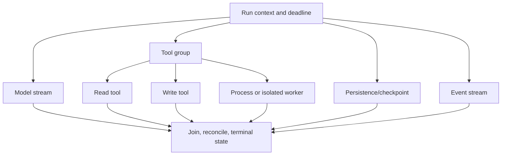
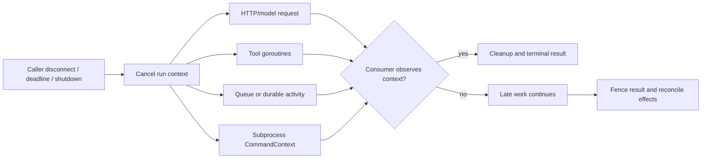
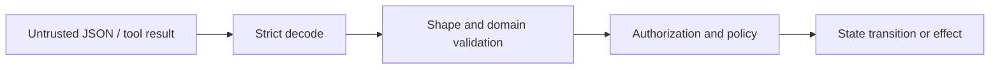

# Research Packet: Go Agent Runtimes

> **Status:** Research-backed synthesis  
> **Research date:** 2026-08-31  
> **Scope:** Production runtime behavior for Go agent APIs, gateways, workers, tools, streams, MCP services, and durable-workflow activities.  
> **Method:** Primary Go runtime and standard-library documentation was cross-checked with official framework, protocol, durable-runtime, observability, and release sources. Product claims are separated from language guarantees; issue reports are used only as adoption-test leads.

## Research questions

1. Where does Go materially improve an agent system rather than merely reimplementing the same model loop?
2. How should goroutine ownership, cancellation, streaming, HTTP reuse, process execution, and memory limits work in production?
3. Which agent, MCP, and durable-runtime capabilities are actually available in Go, at what maturity?
4. What should a team prove before choosing Go over Python or TypeScript/Node.js?

## Snapshot and confidence

| Item | Checked position | Confidence and refresh trigger |
|---|---|---|
| Go toolchain | Go 1.27.0 is the current stable release, published 2026-08-19. The Go project supports the two most recent major releases. | High; refresh at Go 1.28 or a support-policy change. |
| Runtime operations | `context`, goroutines, channels, `net/http`, `os/exec`, pprof, runtime metrics, race detection, and `testing/synctest` are production-grade primitives. | High; refresh when cancellation, HTTP, JSON, or profiling semantics change. |
| Agent SDKs | Google ADK Go 2.0 is GA; Genkit Go 1.x core is stable while its higher-level Agents API is Beta; Microsoft Agent Framework for Go is public preview. OpenAI provides an official Go API client, not an OpenAI Agents SDK for Go. | High for category and dated maturity; refresh every framework release. |
| MCP | The official Go SDK is Tier 1 and the MCP project declared support for the 2026-07-28 protocol. The release train around that protocol was active and conformance fixes continued after initial publication. | Medium-high; pin a stable SDK and run conformance/adoption tests at every protocol revision. |
| Durable execution | Temporal, Restate, DBOS, and Dapr Workflow have Go SDKs. Their replay, retry, versioning, storage, and cancellation models differ. Dapr Agents is a separate Python framework, not a Go capability. | High for availability; verify exact SDK/server compatibility and feature maturity. |
| OpenTelemetry | Go traces and metrics are Stable; logs are Beta. | High; refresh when logs or GenAI semantic conventions stabilize. |

## Finding 1: Go is strongest as an owned service and worker runtime

Go can host the entire agent loop, but its clearest production advantages are operational:

- one compiled service artifact with a small runtime dependency surface;
- inexpensive concurrent I/O with goroutines;
- explicit request-scoped cancellation through `context.Context`;
- strong standard-library HTTP, profiling, testing, and process APIs;
- good fit for gateways, tool services, queue workers, protocol adapters, and durable activities;
- straightforward horizontal replication when state is externalized.

Those advantages do not make a Go agent automatically reliable. Goroutines are cheap, not free. A service can still create an unbounded number of goroutines, retain large prompt buffers, leak response bodies, ignore cancellation, duplicate external effects, or exhaust provider and database pools.

The deciding question is therefore not “can Go call the model?” It is whether the owning team can express the required agent behavior with verified SDKs while preserving explicit run ownership and bounded resources.

## Finding 2: every goroutine needs ownership

A useful run tree is:

The parent must know when each child starts, how it stops, who consumes its result, and who closes any channel it owns. A bare `go f()` is appropriate only when the process truly owns the background lifetime and has a shutdown path.

`errgroup.WithContext` adds error propagation and cancellation for a group of related goroutines. `SetLimit` bounds active goroutines, while `TryGo` supports non-blocking admission. The zero-value group has no limit and does not cancel on error, so those behaviors must not be assumed.

Important constraints:

- the first non-nil error cancels the derived context, but only code observing that context stops;
- `Wait` returns the first non-nil error after all group functions return;
- a goroutine stuck in a library call that ignores context can still block completion;
- `SetLimit` limits goroutines in that group, not provider sockets, database connections, subprocesses, memory, or tenant share;
- changing a group limit while its goroutines are active is unsupported.

Bound each scarce resource separately: admitted runs, model requests, tool class, provider, tenant, database pool, subprocesses, stream bytes, and durable activities.

## Finding 3: `context.Context` is a cancellation signal, not a kill switch

The Go context contract carries deadlines, cancellation, and request-scoped values across API boundaries. It should be the first parameter, not stored permanently in a struct, and not replaced with `context.Background()` inside request work.

Cancellation is cooperative:

- an HTTP request created with a context can stop acquisition, send, and response-body reads;
- a channel send or receive must select on `ctx.Done()` if it may block;
- CPU loops and third-party calls must check or receive the context;
- `exec.CommandContext` can invoke a configured cancellation action, but child-process-tree handling and escalation remain application and OS responsibilities;
- cancellation cannot undo an external write already committed.

`context.WithoutCancel` deliberately detaches work from the parent's cancellation. It is appropriate only for a separately owned, bounded operation such as a short audit write. It must not become the routine way to make timeouts “work.”

Use explicit cancellation causes where diagnosis matters. Keep correlation identifiers and principals in typed context keys, but persist or serialize them explicitly across queues, processes, MCP calls, and durable steps.

## Finding 4: channels provide coordination, not automatic backpressure

An unbuffered channel synchronizes a sender and receiver. A buffered channel bounds the number of queued elements only when its capacity is deliberately finite. Neither bounds the byte size of each element.

For agent event streams:

- define maximum events and bytes per run;
- prefer typed events over raw token fragments;
- coalesce low-value deltas before they fill a queue;
- make producer sends cancellation-aware;
- let the producing side close the channel;
- never close a channel from multiple competing goroutines;
- decide whether a client disconnect cancels, pauses, or detaches the run;
- persist a cursor/checkpoint if reconnection must resume.

`io.Pipe` supplies synchronous handoff: writes block until reads consume the data. It can be useful for streaming encoders and upload bodies, but both ends must be closed on error or cancellation. A channel with a large capacity is not a durable queue.

## Finding 5: HTTP transport ownership determines latency and leaks

`http.Client` and `http.Transport` are safe for concurrent use and should normally be reused. Creating a client or transport for each request defeats connection pooling. Configure a transport intentionally:

- `MaxIdleConns` and `MaxIdleConnsPerHost`;
- `MaxConnsPerHost` for a hard per-host connection ceiling;
- `IdleConnTimeout`;
- TLS and response-header timeouts where appropriate;
- a whole-request deadline through context or client timeout;
- proxy, certificate, and redirect policy.

When `Do` succeeds, close the non-nil response body. For HTTP/1.x connection reuse, the body normally must be read to EOF and closed; current transports may drain a conservative amount on close, but applications should not rely on unlimited draining. Streaming consumers must close promptly on cancellation.

Retries require semantic ownership. The standard transport retries only narrow, safe transport cases. Provider SDKs may retry more. The current OpenAI Go client, for example, retries twice by default and distinguishes overall context timeout from per-retry timeout. Inventory every layer so a run does not multiply retries across SDK, activity, queue, and application loops.

## Finding 6: process execution needs a separate trust and lifecycle boundary

`os/exec` invokes an executable directly and does not implicitly run a shell. Preserve that property:

- pass the executable and arguments separately;
- never concatenate model output into a shell command;
- use an allowlisted executable or operation registry;
- set an explicit working directory and minimal environment;
- bound stdout and stderr bytes;
- drain pipes concurrently before `Wait`;
- set a deadline and a bounded escalation path;
- run hostile code under a separate OS identity and container/VM/sandbox;
- restrict filesystem, network, credentials, CPU, memory, process count, and wall time.

`Cmd.String()` is for debugging and is not guaranteed to be shell-safe input. `StdoutPipe` and `StderrPipe` must be consumed before or concurrently with `Wait`; calling `Run` while separately reading those pipes is incorrect.

`CommandContext` defaults to killing the started process when the context ends. That is not a complete cross-platform process-tree guarantee. If a tool can create descendants, use platform-specific process groups/job objects or a container supervisor and test termination on every supported OS.

## Finding 7: Go types still need runtime boundary validation

Go's static types prevent many internal mistakes. They do not prove that a model, queue message, HTTP body, MCP peer, or tool returned a trustworthy value.

Go 1.27 made `encoding/json/v2` generally available with stricter defaults including rejection of duplicate names and invalid UTF-8 and case-sensitive field matching. Both v1 and v2 still ignore unknown object members by default unless configured to reject them. Migration can also change nil slice/map output from `null` to empty array/object.

For agent schemas:

- cap request and response bytes before decoding;
- reject unknown members where forward-compatibility policy permits;
- reject duplicate members and invalid UTF-8;
- validate required fields, ranges, lengths, enums, identifiers, units, and cross-field rules;
- distinguish absent, null, zero, and default semantics;
- version durable and cross-language payloads;
- test JSON Schema generated for the exact provider subset;
- validate tool results as strictly as arguments;
- authorize after validation and immediately before the effect.

Do not confuse a Go struct, an OpenAPI schema, a provider structured-output schema, and a durable wire contract. They may be related, but each has different compatibility rules.

## Finding 8: agent ecosystem support is real but uneven

| Surface | Go position at 2026-08-31 | Production interpretation |
|---|---|---|
| OpenAI API | Official `openai-go/v3` client with Responses, streaming, request options, and typed generated models | Base API SDK. Build/own the loop or select another framework; it is not the OpenAI Agents SDK. |
| OpenAI Agents SDK | Official agent SDKs are Python and TypeScript | Do not infer Go parity from the base API client. |
| Google ADK | Go 2.0 GA, Go 1.25+, graph/parallel/loop workflows and HITL confirmation | Serious Go agent-framework candidate; verify provider, session, artifact, deployment, and language parity for the exact release. |
| Genkit | Go 1.x stable core for flows, models, tools, RAG, structured output, and telemetry | Core is production-capable; higher-level full-stack Agents API is Beta and imported from experimental packages. |
| Microsoft Agent Framework | Go public preview | Viable for evaluation, not a stable default; declarative agents, RAG, CodeAct, and functional workflows were unavailable in the checked preview. |
| MCP | Official Go SDK, Tier 1; current protocol support announced by MCP project | Pin exact stable release, test negotiation, cancellation, OAuth, transport, schema, and conformance. Protocol support is not authorization or sandboxing. |

Framework maturity labels apply to the product surface, not the Go language. A preview framework can sit on a stable runtime; the combined production profile is still constrained by the preview layer.

## Finding 9: durable execution is a separate architectural choice

| Runtime | Go support | Important boundary |
|---|---|---|
| Temporal | Mature Go SDK; current checked release line 1.44.x | Workflow code must remain deterministic; model calls and external effects belong in Activities. Heartbeats, cancellation, history growth, worker versioning, and payload security need explicit design. |
| Restate | Go SDK and durable steps/workflows | Journaled calls and state survive retries; target-side idempotency and ambiguous-outcome reconciliation still matter. Deployment version pinning is part of correctness. |
| DBOS | Go workflows, steps, queues, messages, events, streams, and durable concurrency helpers | Workflow goroutines/select must use DBOS durable primitives where replay ordering matters. Serialization and error persistence have defined limits. |
| Dapr Workflow | Stable Go SDK support | Deterministic orchestration runs through Dapr sidecar/runtime/state-store components. Dapr Agents is a separate Python framework. |

Do not put a model call directly inside deterministic replay code unless the engine explicitly records it as a durable side effect. Store model/tool receipts, not only final prose. Define activity timeouts, retry classes, idempotency keys, cancellation semantics, version pinning, history/retention limits, and repair procedures before adoption.

A lightweight Genkit flow, goroutine pipeline, or database row is not automatically durable execution. Conversely, a durable engine does not authorize tools or make remote effects exactly once.

## Finding 10: container-aware defaults still need measurement

Go 1.25 made `GOMAXPROCS` container-aware on Linux when a CPU bandwidth limit is present and no manual override disables the behavior. This reduces severe mismatch between host CPU count and container quota, but CPU requests without limits and bursty workloads still require observation.

`GOMEMLIMIT` and `runtime/debug.SetMemoryLimit` set a soft limit on memory managed by the Go runtime. They exclude important sources such as memory managed by C, mappings, and some OS-held memory. Official guidance suggests leaving roughly 5–10% headroom in a controlled container, then measuring the real workload.

Agent services need budgets for:

- live prompts, retrieved documents, and tool results;
- per-run event buffers;
- decompressed HTTP bodies and JSON values;
- connection pools;
- goroutine stacks and retained contexts;
- subprocess/cgo/native memory;
- telemetry batching and profiles.

A low steady-state heap can still fail under concurrent long-context runs. Measure memory per admitted run and gate admission on the whole working set.

## Finding 11: Go has unusually strong concurrency diagnostics

Use several complementary tools:

| Tool | What it can prove | What it cannot prove |
|---|---|---|
| `go test -race` | Races exercised by the test/workload | Unexecuted paths; it adds large CPU and memory overhead. |
| `testing/synctest` | Deterministic fake time and quiescence for supported in-bubble concurrency | Real external network or process behavior without fakes. |
| pprof | CPU, heap, allocation, block, mutex, goroutine, and Go 1.27 `goroutineleak` profiles | Complete business causality or every possible leak. |
| execution trace | Scheduler, goroutine, blocking, GC, and annotated task/region behavior | A substitute for request/run tracing. |
| `runtime/metrics` | Stable runtime counters and histograms | Tenant/run attribution by itself. |
| OpenTelemetry | Distributed model/tool/effect spans and metrics | Runtime health unless explicitly instrumented. |

The Go 1.27 `goroutineleak` profile detects a useful class of permanently blocked goroutines by reachability. It cannot detect every leak, including some objects reachable from globals or runnable goroutines.

Run race-enabled integration/load scenarios periodically. Use `synctest` for deadlines, cancellation, retry timing, and background cleanup, with fake network/process adapters. Capture pprof and trace evidence during staged backpressure, pool starvation, memory spikes, and cancellation storms.

## Finding 12: supply-chain controls are integrated but not automatic

Commit `go.mod` and `go.sum`. By default, the Go command verifies module content against recorded hashes and the public checksum database for public modules. `GOPRIVATE`, `GONOSUMDB`, and `GOSUMDB=off` change that trust model and need policy review.

Use:

- pinned module and toolchain versions;
- `go mod verify`;
- `govulncheck`, which prioritizes known vulnerable functions reachable from the program;
- dependency/license review and an SBOM;
- minimal build images and reproducible build metadata;
- signed/provenanced release artifacts where available;
- a policy for generators, `go:generate`, C toolchains, cgo, and private proxies.

`govulncheck` lowers noise but does not find unknown vulnerabilities, malicious packages, unsafe model-driven behavior, or deployment misconfiguration.

## Decision synthesis

Choose Go when:

- the owning team already runs Go services and on call;
- the component is a gateway, API, protocol adapter, bounded worker, or durable activity;
- concurrency, predictable deployment, low runtime overhead, and operational tooling matter;
- required model/provider features exist in an official base SDK or verified framework;
- Python-native data/evaluation dependencies are not on the hot path.

Do not choose Go merely for:

- “goroutines are faster” without a workload measurement;
- a smaller binary or image while ignoring prompt/tool memory;
- compile-time types without runtime schemas;
- current framework logos without feature-parity tests;
- in-process execution of hostile model-generated code.

If the required agent framework is Python- or TypeScript-first, keep the controller in that runtime and use Go for a gateway, tool service, protocol adapter, or durable activity only when the boundary earns its operational cost.

## Adoption and failure-injection backlog

- [ ] Cancel during a model stream and prove the response body, goroutines, and connection return to a bounded state.
- [ ] Fill every semaphore/pool independently and prove admission remains bounded and tenant-fair.
- [ ] Stop a slow event consumer and prove buffered bytes remain capped.
- [ ] Cancel a subprocess that creates descendants and prove the whole sandbox terminates on each supported OS.
- [ ] Lose a write-tool response after commit and reconcile by effect ID without duplication.
- [ ] Shut down while HTTP, queue, and durable work are active; prove admission stops before drain.
- [ ] Run race-enabled concurrent tool and state tests under realistic load.
- [ ] Use `synctest` to prove deadline, retry, cancellation, and cleanup behavior without wall-clock sleeps.
- [ ] Inspect block, mutex, heap, trace, and `goroutineleak` profiles under staged faults.
- [ ] Verify exact agent framework, MCP protocol, and durable SDK compatibility from pinned modules.
- [ ] Upgrade `encoding/json/v2` with golden cross-language fixtures and strict unknown-field policy.
- [ ] Reproduce the service from source with verified modules, vulnerability scan, SBOM, and release provenance.

## What was excluded

- Language benchmark leaderboards without a representative agent workload.
- Goroutine counts as proof of capacity; memory, external pools, and downstream quotas dominate.
- Vendor “exactly once” wording applied to arbitrary remote effects.
- Framework popularity and download counts.
- Preview/beta features presented as GA.
- Issue reports presented as prevalence estimates or permanent defects.

## Guides supported

- [Go agent runtimes in production](../../languages/go-agent-runtimes.md)
- [Go vs Python vs TypeScript/Node.js](../../comparisons/go-vs-python-vs-typescript-node-agent-runtimes.md)

## Selected primary sources

- [Go 1.27 release notes](https://go.dev/doc/go1.27)
- [Go release history and policy](https://go.dev/doc/devel/release)
- [Go context package](https://pkg.go.dev/context)
- [Go pipelines and cancellation](https://go.dev/blog/pipelines)
- [errgroup](https://pkg.go.dev/golang.org/x/sync/errgroup)
- [weighted semaphore](https://pkg.go.dev/golang.org/x/sync/semaphore)
- [net/http](https://pkg.go.dev/net/http@go1.27.0)
- [os/exec](https://pkg.go.dev/os/exec@go1.27.0)
- [encoding/json/v2 migration guide](https://go.dev/doc/jsonv2-migration)
- [Go garbage collector guide](https://go.dev/doc/gc-guide)
- [container-aware GOMAXPROCS](https://go.dev/blog/container-aware-gomaxprocs)
- [Go diagnostics](https://go.dev/doc/diagnostics)
- [Go race detector](https://go.dev/doc/articles/race_detector)
- [testing/synctest](https://go.dev/blog/testing-time)
- [Go modules reference](https://go.dev/ref/mod)
- [Go security and govulncheck](https://go.dev/doc/security/)
- [OpenAI Go API library](https://github.com/openai/openai-go)
- [OpenAI Agents SDK languages](https://developers.openai.com/api/docs/guides/agents)
- [Google ADK Go quickstart](https://adk.dev/get-started/go/)
- [ADK 2.0 release](https://adk.dev/2.0/)
- [Genkit Go 1.0](https://genkit.dev/blog/announcing-genkit-go-1-0/)
- [Genkit full-stack agents](https://genkit.dev/docs/go/agents/overview/)
- [Microsoft Agent Framework Go](https://learn.microsoft.com/en-us/agent-framework/get-started/)
- [MCP 2026-07-28 release](https://blog.modelcontextprotocol.io/posts/2026-07-28/)
- [Official MCP Go SDK releases](https://github.com/modelcontextprotocol/go-sdk/releases)
- [Temporal Go SDK](https://github.com/temporalio/sdk-go)
- [Restate Go durable steps](https://docs.restate.dev/develop/go/durable-steps)
- [DBOS Go workflows](https://docs.dbos.dev/golang/tutorials/workflow-tutorial)
- [Dapr Go SDK](https://docs.dapr.io/developing-applications/sdks/go/go-client/)
- [OpenTelemetry Go status](https://opentelemetry.io/docs/languages/go/)
