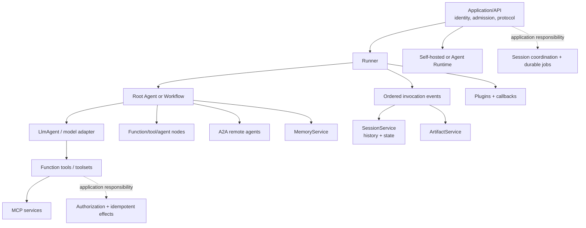

# Google Agent Development Kit — Deep-Dive Research Packet

**Research date:** 2026-08-31  
**Status:** Primary-source-led synthesis with bounded issue evidence  
**Scope:** Google ADK runtime, agents, tools/protocols, data services, ADK 2 workflows, interaction, deployment, evaluation, reliability, security, and cross-language/version behavior  
**Companion guide cluster:** [Google ADK Production Playbook](../../frameworks/google-adk/README.md)

## Research question

What does Google ADK actually own in a production system, which guarantees remain application responsibilities, how do ADK 1 and ADK 2 differ, and how much behavior is genuinely portable across Python, Go, TypeScript, Java, and Kotlin?

## Method

Research proceeded in four passes:

1. **Documented contracts:** official ADK runtime, event, agent, tool, session, workflow, streaming, HITL, deployment, evaluation, observability, and security pages.
2. **Implementation evidence:** current Python runner/base-agent/context/session-service source and ADK 2 workflow implementation guide.
3. **Release evidence:** current Python, Go, TypeScript, Java, and Kotlin release streams, including maintained parallel major lines and fixes at operational seams.
4. **Bounded failure evidence:** reproducible issues/discussions for same-session concurrency, workflow replay, cancellation, MCP lifecycle, confirmation trust, and dependency supply chain.

Issue reports are used only to generate tests and mitigations. They do not establish prevalence, cross-language impact, or current-version impact unless a release/source confirms it.

Primary documentation was preferred. Google Cloud product pages were used for managed Agent Runtime/session/memory/networking behavior. Third-party summaries and generic framework comparisons were excluded.

## Executive findings

1. **The event loop is the architectural center.** The Runner commits state/artifact deltas carried by each event before yielding the event upstream. Events therefore serve output, persistence, control, audit, and replay roles.
2. **ADK data concepts are deliberately separate.** Session events/state, artifact versions, and searchable memory have different services, identities, retention, and consistency behavior.
3. **ADK 2 is a real workflow-runtime change.** Python and Go GA graph workflows—and the experimental TypeScript 2.0 Workflow—add nodes, routes, joins, dynamic scheduling, human input, and event-history rehydration. It is not only a renamed agent API.
4. **Rehydration is not exactly-once execution.** External effects remain outside the session transaction and require operation IDs, downstream idempotency, receipts, and reconciliation.
5. **Language parity is capability-by-capability.** Python 2.8 and Go 2.2 are GA ADK 2 lines. TypeScript 2.0 has the node refactor but still labels Workflow experimental. Java is 1.8; Kotlin is pre-1.0 at 0.8.
6. **The base Runner is not a queue or universal cancellation service.** Application infrastructure owns admission, same-session coordination, detach/resume, deadlines, backpressure, and long-job durability.
7. **HITL must be an application authorization transaction.** Tool confirmation is experimental, documents persistent-session limitations, and cannot safely treat a `user` content role as proof of a human decision.
8. **Plugins/callbacks are control-flow interceptors.** They can short-circuit execution; they are useful policy/telemetry layers but not the final tool authorization boundary.
9. **Managed Agent Runtime is a deployment product, not a property of the SDK.** It reduces infrastructure ownership but does not provide domain authorization, tenant correctness, exactly-once tools, or evaluation by default.
10. **Version pinning is a reliability control.** Release notes across all languages contain fixes precisely at event, replay, confirmation, cancellation, cleanup, and concurrency boundaries.

## Current ecosystem snapshot

| SDK | Release checked | Release date | Status signal | Research implication |
|---|---:|---:|---|---|
| Python | `2.8.0` | 2026-08-25 | ADK 2 GA; `1.39.1` followed on the maintained 1.x line | Pick a major deliberately; do not interpret newest publish date as a migration requirement |
| Go | `2.2.0` | 2026-08-10 | ADK 2 GA; 1.x releases continue | Go 1.25+ requirement and v2 interface changes belong in adoption cost |
| TypeScript | `2.0.0` | 2026-08-20 | Node architecture released; Workflow annotated experimental | Separate required 2.0 API migration from optional graph adoption |
| Java | `1.8.0` | 2026-08-13 | 1.x | Use Java-specific async/session/deployment contracts; do not infer ADK 2 graph behavior |
| Kotlin | `0.8.0` | 2026-08-15 | Pre-1.0 | Expect API/maturity movement; distinguish Android from server JVM |

### Release-note signals

Python 2.8.0 includes Model Armor and evaluation/telemetry additions plus fixes for atomic artifact publication, unsafe YAML deserialization, resume function-response matching, event deduplication, parallel sub-agent errors, prompt/output fencing, and injection/performance issues. Python 2.7 added model capability reporting and fixes for preserving parallel results/thought signatures.

Java releases have fixed Runner sequencing races, managed session event loss, confirmation attribution, and thought/tool parts. Kotlin releases mention cancellation and MCP schema behavior. These are not reasons to reject ADK; they identify the seam-level regression suite a production team must retain.

## Architecture synthesis

### Ownership boundary

| Concern | ADK contribution | Remaining owner |
|---|---|---|
| Agent/model/tool loop | Runner, agents, adapters, event stream | Application budgets, provider policy, public API |
| Conversation persistence | Session services, event/state delta model | Tenant mapping, concurrency policy, retention, migration |
| Workflow progress | Graph scheduling and event-history rehydration | Effect idempotency, compatible deploys, job admission/leases |
| Human input | Confirmation and `RequestInput` primitives | Human identity, authorization, durable decision store, UX |
| Tool integration | Function schemas, contexts, MCP/toolsets | Domain validation, least privilege, timeout, idempotency |
| Remote agents | A2A adapters/cards | Peer identity, authorization, availability, protocol governance |
| Observability/evaluation | Events, plugins, OTel/eval surfaces | Sensitive-data policy, SLOs, datasets, release gates |
| Hosting | Container paths and managed Agent Runtime | Product policy, data governance, downstream correctness |

## Evidence ledger

### Runtime and events

| Claim | Evidence | Consequence |
|---|---|---|
| Runner commits event deltas before yielding | Runtime event-loop documentation and Runner reference | Client-visible events can be treated as committed ADK events, subject to selected service failure semantics |
| Events carry content, metadata, partial/final signals, and actions | Events documentation | Preserve more than text in public normalization and replay records |
| Python async runner is the production-normal path | Runner architecture reference | Sync helper is not durability or isolation |
| Application controls stream consumption | Runner async-generator shape | Backpressure/disconnect policy is external to Runner |

Primary evidence: [runtime](https://adk.dev/runtime/), [event loop](https://adk.dev/runtime/event-loop/), [events](https://adk.dev/events/), [RunConfig](https://adk.dev/runtime/runconfig/), [Runner implementation](https://github.com/google/adk-python/blob/main/src/google/adk/runners.py), and [base agent source](https://github.com/google/adk-python/blob/main/src/google/adk/agents/base_agent.py).

### Agents, instructions, and models

| Claim | Evidence | Consequence |
|---|---|---|
| Description affects model delegation | LLM-agent guide | Agent names/descriptions are behavioral, versioned configuration |
| Instructions can interpolate state/artifacts | LLM-agent guide | Untrusted persisted/retrieved data can enter privileged context |
| Model/provider wrappers vary | Gemini, Anthropic, Agent Platform, and LiteLLM pages | Common `model` interface is not capability parity |
| Model capability reporting was added in Python 2.7 | Python release notes | Prefer explicit capabilities, while retaining exact adapter/model tests |

Primary evidence: [LLM agents](https://adk.dev/agents/llm-agents/), [Gemini](https://adk.dev/agents/models/google-gemini/), [Anthropic](https://adk.dev/agents/models/anthropic/), [Agent Platform models](https://adk.dev/agents/models/agent-platform/), [LiteLLM](https://adk.dev/agents/models/litellm/), [routing](https://adk.dev/agents/models/routing/), and [Python releases](https://github.com/google/adk-python/releases).

### Tools, callbacks, plugins, MCP, and A2A

| Claim | Evidence | Consequence |
|---|---|---|
| Function schemas are generated/declared differently by language | Function-tool guide | Porting tools requires language-specific validation tests |
| Plugins precede object callbacks and can short-circuit | Plugin/callback docs | Order is policy/control flow, not incidental registration |
| MCP toolsets own discovery/transport lifecycle | MCP tool guide | Startup, close, pooling, auth, schema drift, and output limits must be designed |
| A2A is a remote agent boundary | A2A expose/consume guides | Agent cards are discovery, not identity/authorization |

Primary evidence: [function tools](https://adk.dev/tools-custom/function-tools/), [tool performance](https://adk.dev/tools-custom/performance/), [callbacks](https://adk.dev/callbacks/), [plugins](https://adk.dev/plugins/), [MCP tools](https://adk.dev/tools-custom/mcp-tools/), [MCP overview](https://adk.dev/mcp/), [tool auth](https://adk.dev/tools-custom/authentication/), [A2A exposing](https://adk.dev/a2a/quickstart-exposing/), and [Kotlin A2A consumption](https://adk.dev/a2a/quickstart-consuming-kotlin/).

### Sessions, state, artifacts, and memory

| Claim | Evidence | Consequence |
|---|---|---|
| Session identity is app/user/session and holds events/state | Session guide | IDs are tenant-security inputs |
| State scopes use none/`user:`/`app:`/`temp:` | State guide | Prefix choice changes persistence and sharing |
| Direct fetched-session mutation bypasses event tracking | State guide | Writes must flow through contexts/event deltas |
| Database service uses async drivers and layered locking | Session guide and source | Storage integrity improves; semantic concurrent-turn merge remains undefined |
| Artifacts are versioned and can be user-scoped | Artifact guide | Reproducible workflows pin version/checksum |
| Memory ingestion/retrieval semantics differ by service | Memory and Cloud Memory Bank docs | “Session finished” is not “memory searchable” |

Primary evidence: [sessions](https://adk.dev/sessions/session/), [state](https://adk.dev/sessions/state/), [artifacts](https://adk.dev/artifacts/), [memory](https://adk.dev/sessions/memory/), [database service source](https://github.com/google/adk-python/blob/main/src/google/adk/sessions/database_session_service.py), [Memory Bank setup](https://docs.cloud.google.com/gemini-enterprise-agent-platform/scale/memory-bank/setup), and [Memory Bank troubleshooting](https://docs.cloud.google.com/gemini-enterprise-agent-platform/troubleshooting/memory-bank).

### Workflows and replay

| Claim | Evidence | Consequence |
|---|---|---|
| ADK 2 graph workflows are GA in Python and Go | ADK 2 docs/releases | Architecture can rely on graph surface only for those validated lines |
| Scheduling and rehydration use session history | Workflow implementation guide | Event isolation and compatibility become runtime invariants |
| `ctx.run_node` must be awaited | Python context source | Bare tasks escape supervision/cancellation/error collection |
| Graph docs warn some third-party integrations may be incompatible; live execution has a separate runner surface | Graph and streaming docs | Feature composition must be tested, not inferred |
| TypeScript Workflow remains experimental | TypeScript 2.0 release | Do not generalize Python/Go maturity to TypeScript |

Primary evidence: [ADK 2](https://github.com/google/adk-docs/blob/main/docs/2.0/index.md), [graphs](https://adk.dev/graphs/), [routes](https://adk.dev/graphs/routes/), [data handling](https://adk.dev/graphs/data-handling/), [dynamic workflows](https://adk.dev/graphs/dynamic/), [human input](https://adk.dev/graphs/human-input/), [workflow implementation](https://github.com/google/adk-python/blob/main/docs/guides/workflow/workflow/index.md), [context source](https://github.com/google/adk-python/blob/main/src/google/adk/agents/context.py), and [TypeScript releases](https://github.com/google/adk-js/releases).

### Streaming, interruption, and cancellation

| Claim | Evidence | Consequence |
|---|---|---|
| `NONE`, `SSE`, and BIDI/live are distinct run modes | RunConfig/streaming docs | One reconnect/cancellation contract cannot be assumed across modes |
| Cancellation is documented specifically for TypeScript | Cancellation guide | Cross-language cancellation is an adoption test, not a framework-wide guarantee |
| Resume preserves session and invocation/interruption identity | Resume and confirmation/human-input docs | Public API must carry opaque resume correlation safely |
| Tool confirmation is marked experimental | Confirmation guide | Approval requires an application-owned durable/security layer |

Primary evidence: [RunConfig](https://adk.dev/runtime/runconfig/), [streaming guide](https://adk.dev/streaming/dev-guide/part1/), [cancellation](https://adk.dev/runtime/cancel/), [resume](https://adk.dev/runtime/resume/), [tool confirmation](https://adk.dev/tools-custom/confirmation/), and [graph human input](https://adk.dev/graphs/human-input/).

### Deployment and managed services

| Claim | Evidence | Consequence |
|---|---|---|
| ADK can deploy to containers, Cloud Run, GKE, or Agent Runtime | Deployment overview | Hosting choice is separate from framework choice |
| Managed Python packaging is not the local API/web server | Agent Runtime deployment guide | Public API semantics belong to managed runtime or application, not dev server |
| Google naming/API layers coexist | Vertex AI Agent Engine docs and SDK examples | Pin actual resource/API names; do not rename configuration from prose |
| Workload identity and secret manager are preferred | Cloud Run docs | Avoid long-lived service-account/API keys in agent state/prompts |

Primary evidence: [deployment](https://adk.dev/deploy/), [Agent Runtime](https://adk.dev/deploy/agent-runtime/), [deployment details](https://adk.dev/deploy/agent-runtime/deploy/), [Cloud Run](https://adk.dev/deploy/cloud-run/), [GKE](https://adk.dev/deploy/gke/), [Agent Engine overview](https://cloud.google.com/vertex-ai/generative-ai/docs/reasoning-engine/overview), [service identity](https://cloud.google.com/run/docs/configuring/services/service-identity), [secrets](https://cloud.google.com/run/docs/configuring/services/secrets), and [private connectivity](https://cloud.google.com/vertex-ai/generative-ai/docs/agent-engine/private-service-connect-interface).

### Evaluation and observability

| Claim | Evidence | Consequence |
|---|---|---|
| Built-in eval is documented for Python | Evaluation guide | Other languages need application-owned or external eval adapters |
| Evaluation can score response and trajectory | Criteria docs | Safety/correctness often needs deterministic tool-policy assertions |
| OTel feature badges differ by language | Logging/metrics/trace pages | Observability parity must be proved per SDK |
| Debug logging can reveal full prompts | Logging guide | Debug cannot be enabled casually in production |
| BIDI conformance/live eval has limitations | Evaluation/conformance docs | Live interaction needs a separate test harness |

Primary evidence: [evaluation and conformance](https://adk.dev/evaluate/), [criteria](https://adk.dev/evaluate/criteria/), [custom metrics](https://adk.dev/evaluate/custom_metrics/), [observability](https://adk.dev/observability/), [logging](https://adk.dev/observability/logging/), [metrics](https://adk.dev/observability/metrics/), [traces](https://adk.dev/observability/traces/), and [managed evaluation](https://cloud.google.com/vertex-ai/generative-ai/docs/agent-engine/evaluate).

### Security

| Claim | Evidence | Consequence |
|---|---|---|
| ADK safety guidance is layered | Safety guide | Identity, guardrails, sandboxing, eval, and network controls complement one another |
| Agent and user authentication differ | Safety/tool-auth docs | Runtime credentials must not silently replace user authorization |
| Plugins do not replace in-tool checks | Safety/plugin docs | Final authorization belongs at the effect boundary |
| Optional adapter extras can carry supply-chain risk | ADK LiteLLM incident report | Pin/scan dev, eval, CI, and production environments |

Primary evidence: [safety](https://adk.dev/safety/), [tool auth](https://adk.dev/tools-custom/authentication/), [plugins](https://adk.dev/plugins/), [ADK Python security policy](https://github.com/google/adk-python/security), and [LiteLLM incident warning](https://github.com/google/adk-python/issues/5005).

## Bounded failure evidence and required tests

| Evidence | Status at research date | What it does and does not prove | Permanent test/mitigation |
|---|---|---|---|
| [Same-session concurrency discussion #790](https://github.com/google/adk-python/discussions/790) | Historical discussion; current DB service now documents locks | Shows early/current application semantics need care; does not negate later storage locking | Serialize/reject same-session turns and test multi-replica overlap |
| [Shared MCP lifecycle issue #4155](https://github.com/google/adk-python/issues/4155) | Historical version-specific report | Shows ownership/close races can occur; not a current prevalence claim | Run parallel evaluators/runners with independent or verified shared toolsets |
| [Workflow replay issue #6497](https://github.com/google/adk-python/issues/6497) | Closed; reproduced on 2.5.0 | Shows cross-invocation rehydration regression; does not assert 2.8 remains affected | Prior invocation -> LLM -> interrupt -> restart -> resume test |
| [Python cancellation request #4796](https://github.com/google/adk-python/issues/4796) | Open at research date | Indicates no supported external standard `run_async` cancellation contract in reported path | Test disconnect/cancel/provider/tool behavior; do not promise rollback |
| [A2A confirmation issue #6461](https://github.com/google/adk-python/issues/6461) | Open at research date; report covers 2.5.0/main path | Demonstrates role/identity confused-deputy path; not verified across SDKs | Reject peer-origin approval, authenticate endpoints, durable bound decisions, in-tool authorization |
| [LiteLLM supply-chain incident #5005](https://github.com/google/adk-python/issues/5005) | Closed incident guidance | Confirmed affected LiteLLM releases could arrive via optional extras | SBOM/pinning/scanning, credential rotation/IR for affected environments |

## Unresolved or easy-to-misread documentation points

These are not necessarily bugs. They are places where production guidance must remain conditional.

### 1. Tool confirmation versus persistent session services

The tool-confirmation page marks the feature experimental and says `DatabaseSessionService` and `VertexAiSessionService` are unsupported in its known limitations. Elsewhere, persistent sessions and programmatic resume are core production concepts. The narrow conclusion is:

- persistent sessions exist;
- resume mechanisms exist;
- tool confirmation cannot be assumed to combine with those persistent services at this snapshot.

The exact SDK/service/version must pass a cross-process confirmation test. Keep the decision in an application-owned durable store regardless.

### 2. TypeScript 2.0 documentation versus release maturity

The main graph and human-input pages now include TypeScript 2.0 examples and support badges, while the TypeScript 2.0 release still annotates `Workflow` as experimental. This is a maturity distinction, not an absence of the API. Production documentation should say “documented but experimental in TypeScript 2.0,” not “all documented ADK 2 graphs are GA.”

### 3. Java tool-confirmation evidence

The tool-confirmation page's support header lists Python, TypeScript, and Go, but its Boolean-confirmation text and tabs also include Java. This packet treats Java support as ambiguous rather than silently promoting it to supported. Check the Java 1.8 API/release behavior and run remote resume, denial, duplicate, and persistent-service tests before adoption.

### 4. Kotlin MCP evidence

The MCP overview's support badge lists Python, TypeScript, Go, and Java. Kotlin 0.8 release notes mention MCP schema fixes. This may reflect a partial/experimental API or documentation lag. Do not claim Kotlin MCP parity without checking the exact artifact/API and performing transport/lifecycle tests.

### 5. Cancellation evidence

The dedicated cancellation guide documents TypeScript `AbortSignal`, while other language release notes mention cancellation fixes in narrower paths. A fixed internal/live cancellation bug is not the same as a public external-cancel contract. State the contract per runner/mode/language.

### 6. Agent Runtime naming

ADK/Google Cloud pages use Agent Runtime and Agent Platform, while resource/API/client identifiers still include Agent Engine, Reasoning Engine, `reasoningEngines`, and `agent_engines`. Do not “modernize” literal API names based on product prose. Verify current client/library examples.

### 7. Service availability versus deployment availability

Java and Kotlin document managed session clients, but the main ADK managed deployment guide highlights Python and Go. Ability to call a managed session service does not prove the SDK can be packaged/deployed through the same managed Agent Runtime flow.

### 8. Locks versus concurrent-turn semantics

Current `DatabaseSessionService` documents append locks, which improves integrity compared with early same-session discussion evidence. Storage serialization still does not define whether two concurrently planned turns, tool calls, or model contexts should merge. Application admission control remains required.

## Production conformance suite

A candidate version should not ship until these tests pass against production-like services.

### Event and state

- event IDs, invocation IDs, branches, partial/final flags, and action deltas survive normalization;
- context state updates persist; direct fetched-session mutation does not appear in tests/application code;
- multiple replicas cannot semantically overlap one session unless explicitly supported;
- database migration preserves event order and materialized state.

### Model and tools

- exact model adapter supports required tools, schemas, streaming, safety, thought parts, and usage;
- tool authorization derives tenant/principal from trusted context;
- post-commit/pre-result crash reconciles rather than duplicates;
- MCP discovery/schema drift/timeouts/close behavior are bounded;
- A2A peer cannot act as human approver.

### Workflow and resume

- parallel branch failure/cancel/cleanup preserves useful errors and no duplicate effects;
- loop/dynamic fan-out budgets stop reliably;
- prior session invocation does not contaminate a later interrupted run;
- process restart and rolling deployment resume compatible pending work;
- incompatible pending work is drained/version-routed/safely invalidated.

### Streaming and cancellation

- disconnect does not masquerade as cancellation;
- reconnect deduplicates from a durable cursor;
- cancellation during model/tool/parallel/live work has documented, observable milestones;
- committed events/effects remain reconcilable after cancellation.

### Security and tenancy

- cross-tenant session/state/artifact/memory IDs are denied;
- indirect injection from memory/artifact/MCP/A2A/tool output cannot bypass tool policy;
- approval binds identity, action digest, revision, policy, and expiry;
- debug logs/traces do not export prompts, credentials, or sensitive tool payloads;
- optional extras and protocol dependencies are pinned/scanned.

### Evaluation and operations

- deterministic policy tests and response/trajectory eval meet gates;
- human-calibrated judge metrics remain stable;
- all events/spans identify SDK, deployment, agent/graph, prompt, model, tool, and policy versions;
- canary limits and rollback/drain plans work under real persistent sessions.

## Adoption guidance

### Strong fit

ADK is a strong candidate when:

- Google Cloud/Gemini integration is valuable but application-level runtime control is still desired;
- event-sourced sessions, artifacts, and memory are useful explicit concepts;
- Python or Go teams need ADK 2 graph workflows and will test replay/effects;
- multiple language teams can tolerate capability-specific parity rather than a single identical API;
- managed Agent Runtime is an attractive optional deployment target.

### Caution

Proceed with a bounded pilot when:

- TypeScript depends on experimental graph Workflow;
- Java/Kotlin require Python-grade evaluation, graph, or deployment parity;
- long-lived approvals must survive arbitrary worker/revision changes;
- hard external cancellation is a contractual requirement;
- workflows perform high-value writes without downstream idempotency;
- MCP/A2A peers span untrusted organizations.

### Prefer a simpler or additional runtime when

- a deterministic function/service can solve the task without a model loop;
- a small agent plus tools suffices and graph rehydration adds no value;
- the workload needs multi-day, exactly-once-like activity orchestration, timers, compensation, and operator repair—use a durable workflow/job engine around ADK;
- required controls do not exist in the chosen language/version;
- data residency or networking requirements conflict with the selected model/managed services.

## Refresh protocol

Re-run the research when:

- any selected SDK publishes a major/minor release;
- TypeScript Workflow becomes stable or template workflows are removed;
- Java/Kotlin add ADK 2 graph support;
- persistent tool confirmation, cancellation, or live graph support changes;
- session schemas/locking/event formats change;
- MCP/A2A protocol or SDK major versions change;
- Agent Runtime product/API/security/data-governance capabilities change;
- a security advisory affects ADK, LiteLLM, MCP/A2A, serializers, code execution, or telemetry;
- model provider capabilities/deprecations change.

Refresh procedure:

1. read official release notes and migration guides for every pinned component;
2. diff support badges and API references against this packet;
3. recheck open/closed state of bounded issues;
4. run the production conformance suite on candidate versions;
5. update source dates, contradictions, and exact language matrix;
6. record any capability that moved from experimental/preview to stable.

## Source register

### ADK core and runtime

- [ADK documentation](https://adk.dev/)
- [Runtime](https://adk.dev/runtime/)
- [Event loop](https://adk.dev/runtime/event-loop/)
- [Events](https://adk.dev/events/)
- [Run configuration](https://adk.dev/runtime/runconfig/)
- [Python Runner implementation](https://github.com/google/adk-python/blob/main/src/google/adk/runners.py)
- [Python base agent source](https://github.com/google/adk-python/blob/main/src/google/adk/agents/base_agent.py)

### Agents and models

- [LLM agents](https://adk.dev/agents/llm-agents/)
- [Gemini models](https://adk.dev/agents/models/google-gemini/)
- [Anthropic models](https://adk.dev/agents/models/anthropic/)
- [Agent Platform hosted models](https://adk.dev/agents/models/agent-platform/)
- [LiteLLM integration](https://adk.dev/agents/models/litellm/)
- [Model routing](https://adk.dev/agents/models/routing/)

### Tools and protocols

- [Function tools](https://adk.dev/tools-custom/function-tools/)
- [Tool performance](https://adk.dev/tools-custom/performance/)
- [Tool authentication](https://adk.dev/tools-custom/authentication/)
- [Tool confirmation](https://adk.dev/tools-custom/confirmation/)
- [Callbacks](https://adk.dev/callbacks/)
- [Plugins](https://adk.dev/plugins/)
- [MCP tools](https://adk.dev/tools-custom/mcp-tools/)
- [MCP overview](https://adk.dev/mcp/)
- [A2A exposing quickstart](https://adk.dev/a2a/quickstart-exposing/)
- [Kotlin A2A consuming quickstart](https://adk.dev/a2a/quickstart-consuming-kotlin/)

### Sessions and memory

- [Sessions](https://adk.dev/sessions/session/)
- [State](https://adk.dev/sessions/state/)
- [Artifacts](https://adk.dev/artifacts/)
- [Memory](https://adk.dev/sessions/memory/)
- [Python database session service](https://github.com/google/adk-python/blob/main/src/google/adk/sessions/database_session_service.py)
- [Memory Bank setup](https://docs.cloud.google.com/gemini-enterprise-agent-platform/scale/memory-bank/setup)
- [Memory Bank quickstart with ADK](https://docs.cloud.google.com/gemini-enterprise-agent-platform/scale/memory-bank/adk-quickstart)
- [Memory Bank troubleshooting](https://docs.cloud.google.com/gemini-enterprise-agent-platform/troubleshooting/memory-bank)

### Workflows and interaction

- [ADK 2 overview](https://github.com/google/adk-docs/blob/main/docs/2.0/index.md)
- [Graph workflows](https://adk.dev/graphs/)
- [Routes](https://adk.dev/graphs/routes/)
- [Graph data handling](https://adk.dev/graphs/data-handling/)
- [Dynamic workflows](https://adk.dev/graphs/dynamic/)
- [Graph human input](https://adk.dev/graphs/human-input/)
- [Collaborative workflows](https://adk.dev/workflows/collaboration/)
- [Sequential agents](https://adk.dev/agents/workflow-agents/sequential-agents/)
- [Parallel agents](https://adk.dev/agents/workflow-agents/parallel-agents/)
- [Custom agents](https://adk.dev/agents/custom-agents/)
- [Python workflow implementation guide](https://github.com/google/adk-python/blob/main/docs/guides/workflow/workflow/index.md)
- [Python workflow context source](https://github.com/google/adk-python/blob/main/src/google/adk/agents/context.py)
- [Streaming guide](https://adk.dev/streaming/dev-guide/part1/)
- [Cancellation](https://adk.dev/runtime/cancel/)
- [Resume](https://adk.dev/runtime/resume/)

### Deployment and operations

- [Deployment overview](https://adk.dev/deploy/)
- [Agent Runtime](https://adk.dev/deploy/agent-runtime/)
- [Agent Runtime deployment](https://adk.dev/deploy/agent-runtime/deploy/)
- [Cloud Run deployment](https://adk.dev/deploy/cloud-run/)
- [GKE deployment](https://adk.dev/deploy/gke/)
- [Vertex AI Agent Engine / Agent Runtime overview](https://cloud.google.com/vertex-ai/generative-ai/docs/reasoning-engine/overview)
- [Manage sessions with ADK](https://docs.cloud.google.com/gemini-enterprise-agent-platform/scale/sessions/manage-with-adk)
- [Cloud architecture: single-agent ADK system on Cloud Run](https://cloud.google.com/architecture/single-agent-ai-system-adk-cloud-run)
- [Cloud Run service identity](https://cloud.google.com/run/docs/configuring/services/service-identity)
- [Cloud Run secrets](https://cloud.google.com/run/docs/configuring/services/secrets)
- [Agent Engine private connectivity](https://cloud.google.com/vertex-ai/generative-ai/docs/agent-engine/private-service-connect-interface)

### Evaluation, observability, and security

- [Evaluation](https://adk.dev/evaluate/)
- [Evaluation criteria](https://adk.dev/evaluate/criteria/)
- [Custom metrics](https://adk.dev/evaluate/custom_metrics/)
- [Evaluation and conformance testing](https://adk.dev/evaluate/)
- [Observability](https://adk.dev/observability/)
- [Logging](https://adk.dev/observability/logging/)
- [Metrics](https://adk.dev/observability/metrics/)
- [Traces](https://adk.dev/observability/traces/)
- [Safety and security](https://adk.dev/safety/)
- [ADK Python security policy](https://github.com/google/adk-python/security)

### Releases and bounded issues

- [Python releases](https://github.com/google/adk-python/releases)
- [Go releases](https://github.com/google/adk-go/releases)
- [Go v2 migration notes](https://github.com/google/adk-go/blob/main/README-v2.md)
- [TypeScript releases](https://github.com/google/adk-js/releases)
- [Java releases](https://github.com/google/adk-java/releases)
- [Kotlin releases](https://github.com/google/adk-kotlin/releases)
- [Same-session concurrency discussion #790](https://github.com/google/adk-python/discussions/790)
- [MCP lifecycle issue #4155](https://github.com/google/adk-python/issues/4155)
- [Python cancellation request #4796](https://github.com/google/adk-python/issues/4796)
- [Workflow replay issue #6497](https://github.com/google/adk-python/issues/6497)
- [A2A confirmation trust issue #6461](https://github.com/google/adk-python/issues/6461)
- [LiteLLM supply-chain incident #5005](https://github.com/google/adk-python/issues/5005)
