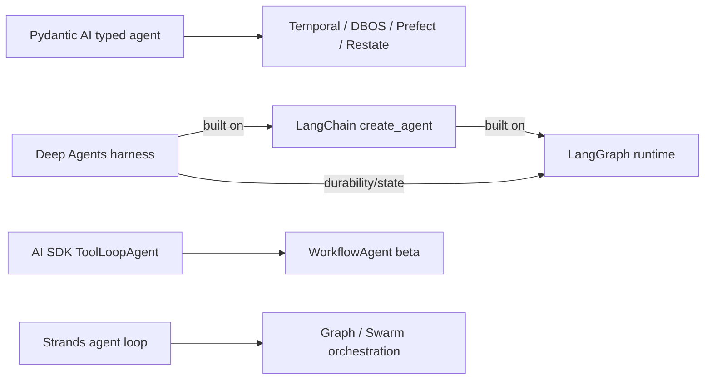

# Independent Agent Frameworks — Research Packet

**Research date:** 2026-08-31  
**Status:** Research-backed synthesis  
**Scope:** LangChain agents, LangGraph, Deep Agents, Pydantic AI, Vercel AI SDK, and Strands Agents  
**Freshness:** Recheck before adoption and every 30–90 days for active framework, workflow, provider-adapter, or persistence surfaces

## Research question

How do the leading non-provider-native frameworks differ in control model, state and replay, type guarantees, durability, harness behavior, language fit, and operational deployment—and which production claims survive failure analysis?

## Category map

These are not one-for-one substitutes:

- LangChain provides a high-level agent/middleware layer.
- LangGraph is a checkpointed state-machine runtime.
- Deep Agents is an opinionated filesystem/planning/subagent harness.
- Pydantic AI centers Python types, dependency injection, validation, and explicit durable integrations.
- Vercel AI SDK centers provider-normalized TypeScript generation, streaming, UI messages, and tool loops; its durable workflow layer is newer.
- Strands centers a lightweight model-driven loop, hooks, provider adapters, sessions, and several multi-agent orchestrators.

## Research method

Evidence came from official documentation, source and changelogs, implementation-oriented references, current security advisories, deployment architecture, production case studies, and issue reproductions. Vendor case-study metrics were not generalized. Issues supply concrete adoption tests, not failure rates.

## Snapshot comparison

| System | Primary control unit | State/recovery center | Strongest differentiator | Main production caution |
|---|---|---|---|---|
| LangChain agents | Middleware-configured model/tool agent | Underlying LangGraph graph and checkpointer | High-level agent construction and model/tool middleware ecosystem | Abstraction hides graph semantics unless the team inspects them |
| LangGraph | State graph or functional workflow, executed in supersteps | Per-thread checkpoints, pending writes, replay/fork | Explicit state, interrupts, time travel, subgraphs, deployment runtime | Resume re-executes node code; side effects must be isolated/idempotent |
| Deep Agents | Opinionated harness profile | LangGraph plus virtual filesystem/store/sandbox backends | Planning, context offload, subagents, memory files, sandbox execution | Tool-level filesystem rules are not necessarily backend enforcement; shared writable memory creates ownership/concurrency risk |
| Pydantic AI | Typed Python agent run and validated model/tool parts | Message history; deferred calls; optional durable-engine capabilities | Type validation, dependency injection, precise retries/failures, four official durable integrations | Retry budgets are layered; cancellation cannot stop sync threads; durable wire/adapters need version tests |
| Vercel AI SDK | TypeScript generation/stream plus `ToolLoopAgent` steps | Application messages; newer `WorkflowAgent` durability | Provider/UI streaming ecosystem, typed local tools, explicit loop preparation | Provider equivalence is conditional; WorkflowAgent is beta and UI/resume seams evolve rapidly |
| Strands Agents | Model-driven agent loop | Session manager snapshots/messages; optional AgentCore services | Small loop, hooks, provider options, MCP, clear limits/cancellation, AWS deployment path | Session restore is not effect-safe durability; multi-agent semantics differ between Python and TypeScript |

## LangChain, LangGraph, and Deep Agents findings

### LangGraph owns replay

LangGraph checkpoints graph state at steps/supersteps and organizes checkpoints by thread. On a failed superstep it retains pending writes from nodes that completed, so successful peers need not rerun. Interrupts persist state and wait until a `Command` resumes the thread.

The important semantic is re-entry: a node containing `interrupt()` starts again from the beginning on resume until execution reaches the matching interrupt. Code before the interrupt can therefore repeat. Interrupt order within a node must remain stable; payloads should be JSON-serializable; effects before the interrupt must be idempotent. Time travel similarly re-executes nodes after the chosen checkpoint, including model calls, external API requests, and interrupts.

Subgraph persistence is explicit: per-invocation, per-thread, or stateless. A stateful subgraph can inherit the parent checkpointer, but parent-level checkpoint granularity may treat the entire subgraph as one step. Reusing the same stateful subgraph concurrently can create namespace conflicts.

LangSmith Agent Server adds an execution service: assistants, threads, runs, persistence, a durable task queue, leases, thread-level run serialization, cancellation signaling, and separate API/worker scaling. Redis carries ephemeral signaling while PostgreSQL holds run data. This is materially more than open-source in-process LangGraph and must be evaluated as a deployment/runtime product.

### LangChain owns convenience and middleware

Current `create_agent` builds on LangGraph. It provides static/dynamic tools, middleware, model selection, structured outputs, tool error handling, and state. The correct adoption question is whether its middleware removes repeated application plumbing while leaving state/effect boundaries visible. A thin LangGraph graph may be easier when workflow state and transitions are the primary design.

### Deep Agents owns an opinionated harness

Deep Agents adds planning, filesystem tools, context offloading, summarization, memory files, sandbox command execution, and synchronous/async subagents. Pluggable backends can route paths to graph state, persistent stores, local files, or sandbox providers.

Security details matter. Current source says filesystem permission rules are enforced in built-in tool middleware, not necessarily in direct backend access. Rules use first-match behavior and default allow when no rule matches. Subagents may replace rather than intersect parent rules. Therefore, use backend/sandbox containment as the hard boundary and tool permissions as defense in depth.

Writable memory files can be shared at agent, user, or organization scope. Whole files may load into the prompt on every conversation. Current issue discussion identifies a real design tension: human-authored instructions and agent-authored memory need separate ownership and context budgets. Use immutable instruction sources, writable generated memory, quotas, optimistic concurrency, review, and rollback.

Primary evidence: [LangGraph persistence](https://docs.langchain.com/oss/python/langgraph/persistence), [interrupts](https://docs.langchain.com/oss/python/langgraph/interrupts), [time travel](https://docs.langchain.com/oss/python/langgraph/use-time-travel), [subgraphs](https://docs.langchain.com/oss/python/langgraph/use-subgraphs), [functional API](https://docs.langchain.com/oss/python/langgraph/functional-api), [Agent Server](https://docs.langchain.com/langsmith/agent-server), [LangChain agents](https://docs.langchain.com/oss/python/langchain/agents), [Deep Agents overview](https://docs.langchain.com/oss/python/deepagents/overview), [subagents](https://docs.langchain.com/oss/python/deepagents/subagents), and [memory](https://docs.langchain.com/oss/python/deepagents/memory). Failure-test leads: [parallel interrupt IDs #6626](https://github.com/langchain-ai/langgraph/issues/6626) and [memory ownership/budget #5720](https://github.com/langchain-ai/deepagents/issues/5720).

## Pydantic AI findings

Pydantic AI makes typed dependencies, tool inputs, model messages, and structured output central. Tool argument validation can produce a model-visible retry prompt; a tool chooses between `ModelRetry`, `ToolFailed`, approval/defer control flow, cancellation, or ordinary exception propagation. This explicit taxonomy is more operationally useful than a generic “automatic retries” switch.

The framework documents five independent retry layers: transport, model fallback, tool, output, and model-request hooks. Tool retry counters are per tool name and reset after success; `N` retries means `N+1` attempts. Whole agent runs are not retried automatically. A model that invents different tool names can receive separate counters, so a run-wide request/turn/cost/deadline budget remains necessary.

Run cancellation cancels and drains async tool tasks, but cannot forcibly stop synchronous worker threads; their later result is discarded while side effects remain. Current cancellation work distinguishes a cancelled control-flow outcome from preservation of already completed messages. In-process cancellation tokens do not cross a serialized durable-activity boundary.

Pydantic AI officially integrates Temporal, DBOS, Prefect, and Restate for durable execution. These integrations move model/tool/capability operations into engine units. That improves recovery but adds a wire protocol and retry boundary. A current issue demonstrates dynamic-tool validation errors being interpreted as durable engine failures rather than normal model-visible corrections—exactly why the framework plus engine combination needs conformance tests.

Versioning and security matter. Stable V2 was released in June 2026; V1 retains a limited security-support window. August 2026 advisories included local web UI tool-execution exposure, UI message confused-deputy paths, unbounded remote-content memory, and telemetry redaction gaps. Pin fixed versions and treat developer UIs and adapters as privileged ingress.

Primary evidence: [agent](https://ai.pydantic.dev/agents/), [advanced tools](https://ai.pydantic.dev/tools-advanced/), [retries](https://ai.pydantic.dev/retries/), [timeouts](https://ai.pydantic.dev/timeouts/), [durable execution](https://ai.pydantic.dev/durable_execution/overview/), [version policy](https://ai.pydantic.dev/version-policy/), [security advisories](https://github.com/pydantic/pydantic-ai/security), [cancellation issue #6460](https://github.com/pydantic/pydantic-ai/issues/6460), and [durable dynamic-tool issue #6979](https://github.com/pydantic/pydantic-ai/issues/6979).

## Vercel AI SDK findings

AI SDK Core normalizes generation, streaming, structured outputs, tools, and many providers in TypeScript. `ToolLoopAgent` packages multi-step execution with a default 20-step stop condition, `prepareStep` for per-step model/tool/message changes, approvals, timeout/abort signals, and lifecycle callbacks. Local tools can be statically typed through Zod/JSON Schema; dynamic tools trade static inference for runtime validation.

The docs explicitly prefer local AI SDK tools for production control and performance while positioning MCP for dynamic/user-provided tools. That is a useful default, not a universal rule—remote tools may be necessary for isolation or ownership.

Tool errors become model-visible `tool-error` parts in multi-step execution, while invalid call/schema and repair errors have separate classes. Abort signals propagate to local tool execution, but the tool must forward them downstream and side effects can still commit.

AI SDK 7 introduced a broader production stack and a durable `WorkflowAgent`. The workflow package changelog remained on a beta line during this research snapshot. Issue evidence shows why Core, agent, UI adapter, provider adapter, and workflow durability must be tested together: lifecycle callback forwarding, constructor/per-call timeout precedence, long-running tool timeout accounting, provider-executed approval resume, sibling tool results during pause, and retry-invalidated UI stream parts have all required fixes or remain active concerns.

Provider abstraction is valuable for syntax and common parts. It does not guarantee identical approval messages, hosted tools, reasoning, usage, tool parallelism, or stream repair. Preserve provider identity and raw diagnostics.

Primary evidence: [AI SDK agents](https://ai-sdk.dev/docs/agents), [loop control](https://ai-sdk.dev/docs/agents/loop-control), [ToolLoopAgent](https://ai-sdk.dev/docs/reference/ai-sdk-core/tool-loop-agent), [tools](https://ai-sdk.dev/docs/ai-sdk-core/tools-and-tool-calling), [telemetry](https://ai-sdk.dev/docs/ai-sdk-core/telemetry), [AI SDK 7](https://vercel.com/blog/ai-sdk-7), [workflow changelog](https://github.com/vercel/ai/blob/main/packages/workflow/CHANGELOG.md), and current issue reproductions [#15864](https://github.com/vercel/ai/issues/15864), [#17310](https://github.com/vercel/ai/issues/17310), and [#18481](https://github.com/vercel/ai/issues/18481).

## Strands Agents findings

Strands provides a compact model → tool → model loop with Python and TypeScript SDKs, multiple model providers, built-in MCP, hooks, sessions, structured streaming, usage/metrics, cancellation, invocation limits, and graph/swarm patterns.

Current loop documentation is unusually precise about cancellation. A cancellation event is polled, propagates to the model provider, cancels in-flight MCP locally on a best-effort basis, and cannot forcibly stop a non-cooperative tool. A signal set before invocation may still persist the user turn and begin then abort one model request. Deadlines therefore need application-level enforcement and downstream propagation.

The default tool executor can run calls concurrently; select the sequential executor when calls depend on ordered shared state. Session managers restore messages and agent state and can persist locally or to S3/custom storage. These snapshots aid continuity but are not a deterministic workflow/effect log.

Strands offers Graph and Swarm. Current docs expose language differences: global limits, handoff input, state sharing, failure status, repetitive-handoff state across resume, and cancellation status are not identical between Python and TypeScript. Graph limits can default to infinity in TypeScript, and cooperative timeouts do not automatically constrain nested orchestrators or tools.

AWS AgentCore is a complementary managed runtime, memory, gateway/identity, observability, and evaluation stack, not part of the open-source loop guarantee. Production reports demonstrate real deployment patterns, including more than 50 specialized Strands agents in one UK-sovereign architecture, but workload outcomes remain case-specific.

Primary evidence: [agent loop](https://strandsagents.com/docs/user-guide/concepts/agents/agent-loop/), [hooks](https://strandsagents.com/docs/user-guide/concepts/agents/hooks/), [sessions](https://strandsagents.com/docs/user-guide/concepts/agents/session-management/), [model providers](https://strandsagents.com/docs/user-guide/concepts/model-providers/), [Graph](https://strandsagents.com/docs/user-guide/concepts/multi-agent/graph/), [Swarm](https://strandsagents.com/docs/user-guide/concepts/multi-agent/swarm/), [production operations](https://strandsagents.com/docs/user-guide/deploy/operating-agents-in-production/), [releases](https://github.com/strands-agents/sdk-python/releases), and [OneAdvanced production architecture](https://aws.amazon.com/blogs/machine-learning/how-oneadvanced-deployed-over-50-ai-agents-on-uk-sovereign-aws/).

## Cross-framework decision matrix

| Dominant requirement | Best starting point | Why | Hard proof |
|---|---|---|---|
| Explicit state graph, checkpoint inspection, replay/fork | LangGraph | State and superstep semantics are first-class | Node re-entry, effect idempotency, subgraph namespaces, store durability |
| Quick middleware-based Python agent | LangChain agents | High-level construction on LangGraph | Hidden graph behavior, provider/tool middleware, upgrade compatibility |
| Filesystem/planning/subagent harness with pluggable backends | Deep Agents | Context offload and harness components included | Sandbox enforcement, permission default, memory ownership, concurrency |
| Typed Python tools/output with exact validation and retry control | Pydantic AI | Strong types and explicit failure taxonomy | Total run budgets, sync-tool cancellation, provider parity |
| Typed Python agent embedded in an existing durable engine | Pydantic AI integration | Maintained Temporal/DBOS/Prefect/Restate bridges | Adapter wire protocol, engine retry mapping, upgrade replay |
| TypeScript full-stack streaming/UI agent | AI SDK Core / ToolLoopAgent | Native web/stream/UI ecosystem and provider breadth | UI/provider/approval/cancel end-to-end test |
| Durable TypeScript agent on Vercel workflow stack | WorkflowAgent, cautiously | Integrated workflow direction | Beta fit, stream retry repair, approval resume, effect safety |
| Lightweight provider-flexible loop with AWS path | Strands | Small core, hooks, OTel, sessions, AgentCore alignment | Language parity, session consistency, cancellation, multi-agent limits |

## Saturation conclusions

- Framework durability is always conditional on the checkpointer/engine/deployment product and effect discipline.
- Interrupt/resume semantics reveal more than feature matrices: ask what code re-executes and what completed siblings retain.
- Type-safe schemas reduce malformed calls, not malicious or semantically invalid actions.
- Provider-neutral APIs normalize a useful subset and must preserve escape hatches plus raw evidence.
- Harness permissions need a harder sandbox/backend boundary.
- UI streams are replicated state machines; retry, reconnect, approval, and late tool results require protocol tests.
- Multi-agent defaults—especially unbounded steps or concurrency—must be replaced by explicit budgets.

## Excluded or downgraded claims

- Download counts, stars, and framework-authored “production ready” statements were not selection evidence.
- Vendor case-study improvements were not generalized beyond their architecture lessons.
- Checkpointing was not called exactly-once execution.
- A provider adapter list was not treated as feature parity.
- In-memory checkpointers and local file sessions were not presented as multi-replica production backends.
- Experimental/beta workflow or lifecycle surfaces were not promoted to stable because the core package was stable.

## Refresh triggers

- LangGraph checkpoint, interrupt, subgraph namespace, Agent Server queue, or durability-mode changes.
- Deep Agents backend permission enforcement, memory ownership/budget, or sandbox lifecycle changes.
- Pydantic AI major version/support window, durable backend protocol, cancellation contract, or security advisory.
- AI SDK major release, WorkflowAgent stabilization, provider protocol revision, or UI retry/resume contract.
- Strands Python/TypeScript limit, cancellation, session, graph/swarm parity, or AgentCore integration change.

## Guides supported

- [Selecting an independent agent framework](../../comparisons/independent-agent-frameworks.md)
- [LangChain, LangGraph, and Deep Agents](../../frameworks/langchain-langgraph-and-deep-agents.md)
- [Pydantic AI](../../frameworks/pydantic-ai.md)
- [Vercel AI SDK](../../frameworks/vercel-ai-sdk.md)
- [Strands Agents](../../frameworks/strands-agents.md)
