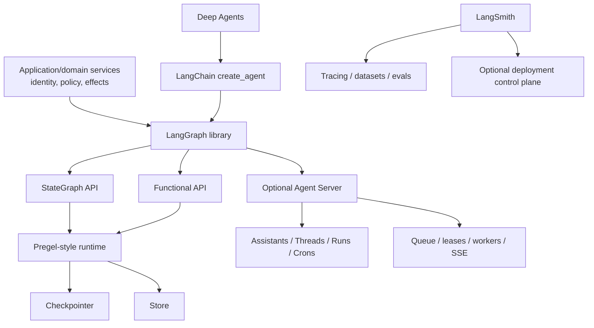

# LangGraph Deep Dive — Research Packet

**Research date:** 2026-08-31
**Status:** Research-backed synthesis and evidence ledger
**Scope:** LangGraph Python runtime and checkpoint family; shared LangGraph.js concepts where verified; Agent Server and LangSmith boundaries; current releases, advisories, and bounded failure reports
**Freshness:** Recheck core/checkpoint/SDK/server compatibility and security before adoption and at least every 30–90 days

## Research question

What does LangGraph actually guarantee as an agent-specific graph/checkpoint runtime, what additional semantics belong to Agent Server or LangSmith, and what production architecture is required around state, interrupts, replay, external effects, deployment, testing, security, and migration?

## Method

Evidence priority:

1. official current LangChain/LangGraph documentation and API reference;
2. official repositories, releases, source-oriented references, threat model, and advisories;
3. official Agent Server/LangSmith architecture, deployment, auth, observability, and evaluation documentation;
4. narrowly selected GitHub issue reproductions as failure-test leads.

Marketing claims, stars, download counts, and vendor case-study outcomes were excluded as reliability evidence. GitHub issues were not used to estimate prevalence. The repository's generated threat model labels itself experimental and non-authoritative; it was used to locate trust boundaries and then treated cautiously.

## Snapshot

| Surface | Checked state | Interpretation |
|---|---|---|
| LangGraph Python | 1.2.11, released 2026-08-11 | Current checked core; v1 stable core with newer 1.2 features |
| Checkpoint core | 4.2.0, released 2026-08-07 | Independently versioned from core |
| Postgres saver | 3.1.2 current checked release | 3.1.1 was security-fix floor for namespace advisory |
| SQLite saver | 3.1.1 current checked release | Local/lightweight; not a multi-tenant production default |
| Python SDK | 0.4.4, released 2026-08-27 | Patches high auth decorator advisory through 0.4.3 |
| LangGraph streaming | v2 unified `StreamPart` from 1.1; v1 still documented as default on the checked page | Pin protocol; newer v3 event projections need separate conformance |
| DeltaChannel | Requires 1.2, beta in checked persistence docs | Storage optimization, not default-safe upgrade |
| Per-node timeout/error handler | Requires 1.2, alpha in checked fault-tolerance docs | Do not build an unpinned production contract around it |
| SDK custom encryption | Beta in checked SDK reference/threat model | Verify server-side behavior, restore, and key rotation |

Package versions are not a compatibility recommendation by themselves. Test the complete lockfile, server image/API, database schema, and language/runtime.

## Category boundaries

### LangGraph library

Low-level orchestration runtime. It defines state channels/reducers, nodes, edges, commands, dynamic sends, supersteps, persistence protocol, interrupts, replay/forks, subgraphs, and streams. It can run without LangChain.

### LangChain agents

`create_agent` is the current high-level model/tool/middleware layer built on LangGraph. The older LangGraph prebuilt `create_react_agent` was deprecated in the v1 line.

### Deep Agents

Opinionated harness above LangChain/LangGraph with planning, files, context offload, memory, subagents, and sandbox adapters. Its permissions/harness behavior should not be projected onto raw LangGraph.

### Agent Server

Execution service. It adds assistants, threads, runs, crons, persistence injection, durable run queue, worker leases, same-thread run serialization, cancellation signaling, and SSE transport. It is not implied by a compiled in-process graph.

### LangSmith

Tracing, observability, datasets, experiments/evaluators, online monitoring, and optional deployment control plane. It is not required for library execution and is not the effect or authorization source of truth.

## Runtime findings

LangGraph uses a message-passing execution model inspired by Pregel. Nodes activated in the same superstep can run in parallel. They see the state at the beginning of that step and return updates, which reducers merge at the boundary.

Implications:

- parallel nodes do not observe each other's same-step writes;
- reducer algebra is an application correctness property;
- static edges and dynamic `Command(goto=...)` can both schedule work if mixed;
- recursion limit bounds supersteps, not model calls, fan-out, bytes, wall time, or cost;
- `compile()` checks topology but cannot prove determinism, effect safety, or migration compatibility.

Graph and Functional authoring APIs use the same runtime. The Functional API records `@task` results and requires deterministic task sequencing across resume. It does not make ordinary-looking external calls safe when left outside tasks.

Primary evidence: [Graph API](https://docs.langchain.com/oss/python/langgraph/graph-api), [Functional API](https://docs.langchain.com/oss/python/langgraph/functional-api), and [Graph API usage](https://docs.langchain.com/oss/python/langgraph/use-graph-api).

## State and reducer findings

State schemas may use `TypedDict`, dataclasses, or Pydantic models. Nodes emit partial updates. Each field has a reducer, defaulting to overwrite. Parallel writers without a suitable reducer can raise a concurrent-update error.

The correct production model is typed, bounded, provenance-aware orchestration state:

- raw evidence rather than rendered prompt strings;
- domain record IDs/versions rather than duplicate business truth;
- stable proposal and effect IDs;
- bounded message/evidence collections;
- deterministic deduplication;
- no long-lived credentials or live clients.

Reducer safety is stronger than “returns a list.” Associativity, commutativity, idempotence under replay, and a size bound should be tested where concurrency/reordering is possible.

Primary evidence: [Graph API state/reducers](https://docs.langchain.com/oss/python/langgraph/graph-api), [Thinking in LangGraph](https://docs.langchain.com/oss/python/langgraph/thinking-in-langgraph), and [common errors](https://docs.langchain.com/oss/python/common-errors).

## Persistence findings

A checkpointer saves `StateSnapshot` data at superstep boundaries under a thread and checkpoint namespace. Node-level task writes inside an in-progress superstep support pending-write recovery: if one parallel node fails, completed siblings may not need to execute again on resume.

This improves recovery but is not an effect receipt. A successful external write can occur before its task result/checkpoint is durable.

### Checkpointer versus Store

- Checkpointer: thread-scoped state history, interrupt/replay/recovery.
- Store: application-defined cross-thread data by namespace/key/search.
- Domain DB: authoritative business records and transactions.

Do not merge these roles. Store namespace is not sufficient authorization.

### Durability modes

| Mode | Documented behavior | Interpretation |
|---|---|---|
| `sync` | Persist changes before the next step starts | Highest graph-state durability, added latency |
| `async` | Persist while next step executes | Default balance; latest checkpoint can be lost on crash |
| `exit` | Persist only on exit, including interrupt/error | Intermediate progress not crash recoverable |

No mode makes a cross-system effect exactly once.

### Growth and serialization

Full accumulated channels at each checkpoint can create superlinear storage. DeltaChannel reduces append-heavy storage but was beta. The default serializer handles more than strict JSON and has had security advisories. Treat checkpoint storage as trusted, access-controlled infrastructure; pin fixed versions, avoid untrusted imports/pickle fallback, validate after load, encrypt sensitive state, and enforce retention.

Primary evidence: [persistence](https://docs.langchain.com/oss/python/langgraph/persistence), [checkpoint reference](https://reference.langchain.com/python/langgraph/checkpoints), and [durability reference](https://reference.langchain.com/python/langgraph/types/Durability).

## Interrupt findings

`interrupt()` persists the pause and surfaces a JSON-safe payload. `Command(resume=...)` on the same thread supplies a return value to the interrupt, but the containing node restarts from the beginning.

Consequences:

- code before interrupt repeats;
- broad exception handling must not swallow interrupt control flow;
- multiple interrupt order must remain stable;
- approval payload and response need schema versions;
- current identity, authorization, proposal hash, expiry, and resource version must be checked on resume;
- the effect belongs after validation and needs an operation ID.

Static before/after breakpoints are debugging primitives; dynamic `interrupt()` is the production control-flow surface.

Primary evidence: [interrupts](https://docs.langchain.com/oss/python/langgraph/interrupts), [Functional API](https://docs.langchain.com/oss/python/langgraph/functional-api), and [time travel](https://docs.langchain.com/oss/python/langgraph/use-time-travel).

## Replay and effects findings

Time travel can replay from a checkpoint or fork with an updated state. Nodes before the checkpoint are skipped; later nodes—including model calls, APIs, and interrupts—execute again.

An external effect needs:

1. stable operation ID;
2. authentication/authorization;
3. unique reservation/effect ledger;
4. downstream idempotency key where supported;
5. receipt persistence;
6. unknown state and reconciliation for ambiguous delivery;
7. separately authorized compensation when needed.

“Rollback” of graph state is not rollback of the external world.

Primary evidence: [time travel](https://docs.langchain.com/oss/python/langgraph/use-time-travel), [Functional API idempotency](https://docs.langchain.com/oss/python/langgraph/functional-api), and [fault tolerance](https://docs.langchain.com/oss/python/langgraph/fault-tolerance).

## Subgraph findings

Current persistence modes:

- per-invocation (default/None): isolated call, inherits parent persistence for interrupt/recovery;
- per-thread (True): state continues across calls, with restrictions on reusing the same subgraph;
- stateless (False): no checkpoint, interrupt, or durable recovery.

State adapters give parent/child graphs a better migration boundary than sharing an entire schema. A Store can mediate cross-graph artifacts but requires independent auth and versioning.

Nested checkpoints are a high-risk conformance seam. Test child interrupt/resume, task reuse, parallel child calls, checkpoint inspection, time travel into the child, and upgrades.

Primary evidence: [subgraphs](https://docs.langchain.com/oss/python/langgraph/use-subgraphs), [persistence namespaces](https://docs.langchain.com/oss/python/langgraph/persistence), and [MULTIPLE_SUBGRAPHS](https://docs.langchain.com/oss/python/langgraph/errors/MULTIPLE_SUBGRAPHS).

## Streaming findings

The v2 stream envelope normalizes `type`, `ns`, and `data` across values, updates, messages, custom, checkpoints, tasks, and debug modes. Subgraph namespaces identify event origin. Event-streaming v3 introduces higher-level typed projections and must be versioned independently.

In Agent Server, Redis transports ephemeral cancellation/signaling/stream pub-sub while PostgreSQL holds durable run/thread state. A disconnected SSE stream is not a stopped run. Clients need reconnect/join and current-state repair.

Agent Server's double-texting choices—enqueue, reject, interrupt, rollback—are not open-source library invocation features. Interrupt and rollback strategies cannot undo an already committed external effect.

Primary evidence: [streaming](https://docs.langchain.com/oss/python/langgraph/streaming), [event streaming](https://docs.langchain.com/oss/python/langgraph/event-streaming), [Agent Server](https://docs.langchain.com/langsmith/agent-server), and [double texting](https://docs.langchain.com/langsmith/double-texting).

## Agent Server findings

Agent Server deployment normally includes:

- API servers for resource/run requests and streaming;
- queue workers for graph execution;
- PostgreSQL for core resources, runs, checkpoints, and Store by default;
- Redis for ephemeral pub/sub/signaling;
- durable queue and worker leases;
- at most one executing run per thread.

Single-host, split API/queue, and distributed runtime modes are documented. API and workers scale separately. The documented default is 10 jobs per worker, and workers fetch greedily; teams must load test their workload. Standalone servers should not run in scale-to-zero serverless environments.

Same-thread serialization does not protect a domain resource shared by two threads. Cancellation is cooperative. PostgreSQL/Redis restore, worker lease expiry, queue age, event-loop blocking, and retained interrupted threads are essential runbook areas.

Primary evidence: [Agent Server](https://docs.langchain.com/langsmith/agent-server), [scaling](https://docs.langchain.com/langsmith/agent-server-scale), [standalone deployment](https://docs.langchain.com/langsmith/deploy-standalone-server), and [platform setup](https://docs.langchain.com/langsmith/platform-setup).

## Security findings

### Default/auth surface

Checked Agent Server auth documentation says self-hosted has no default authentication. Custom `@auth.authenticate` runs for requests and `@auth.on` handles resource/action authorization. Use trusted metadata ownership and fail-closed handlers.

### Current advisory floors

- GHSA-fvww-7h3r-vfhp, published 2026-08-28: resource-scoped Python SDK auth decorators could ignore `actions=`, applying a handler to all actions. Affected 0.1.45–0.4.3; fixed 0.4.4; no workaround.
- GHSA-47pj-3jcm-6whg, published 2026-07-30: Postgres/SQLite Store prefix matching could cross namespace segments. Fixed in both backend packages 3.1.1.

The advisory list also includes serializer/cache/path/SQL issues in 2025–2026. Review the entire official list for the chosen lockfile.

### Security architecture

- model/tool/retrieval/memory inputs are untrusted;
- tool execution requires deterministic policy immediately before effect;
- checkpoints and traces can contain sensitive data;
- namespace, thread ID, and trace project are not tenant boundaries alone;
- Store writes need provenance, quotas, concurrency, review, expiry, and deletion;
- stream modes exposing full/debug state need client-specific filtering;
- runtime context should carry least-privilege capabilities rather than checkpointing credentials.

Primary evidence: [Agent Server auth](https://docs.langchain.com/langsmith/auth), [official advisories](https://github.com/langchain-ai/langgraph/security/advisories), and the [experimental threat model](https://github.com/langchain-ai/langgraph/blob/main/.github/THREAT_MODEL.md).

## Testing, tracing, and evaluation findings

Four suites are necessary:

1. node unit tests;
2. compiled graph/reducer/interrupt/retry tests;
3. saver/server crash, queue, reconnect, and migration tests;
4. outcome, step, trajectory, safety, recovery, and efficiency evaluations.

Keep golden sanitized checkpoint fixtures from the oldest supported version. Trace graph/package/model/prompt/tool/policy versions and operation IDs. Sampling must not omit high-risk/error traces. Trace export failure cannot affect graph correctness.

LangSmith supports offline experiments on datasets and online evaluators on production traces. Agent evaluation can score final response, individual steps, and trajectory. Exact trajectory matches are often too rigid; invariants, required/forbidden actions, and budgets are more robust.

Primary evidence: [LangGraph tests](https://docs.langchain.com/oss/python/langgraph/test), [LangSmith evaluation](https://docs.langchain.com/langsmith/evaluation), [evaluation approaches](https://docs.langchain.com/langsmith/evaluation-approaches), and [trace sampling](https://docs.langchain.com/langsmith/sample-traces).

## Migration findings

Current backward-compatibility guidance says latest graph code applies immediately to resumed threads. It is not pinned per workflow execution.

- interrupted threads cannot safely survive removing/renaming a node they may enter;
- adding optional state is safer than required state;
- renamed fields do not automatically carry old saved values;
- incompatible type/reducer changes can break or alter old state;
- edge topology can change when referenced nodes remain;
- old approval/tool/effect semantics still require application versioning.

Use add-then-remove, tolerant readers, golden checkpoint resume tests, and an explicit drain/migrate/cancel policy.

Primary evidence: [backward compatibility](https://docs.langchain.com/oss/python/langgraph/backward-compatibility), [graph migrations](https://docs.langchain.com/oss/python/langgraph/graph-api), and [releases](https://github.com/langchain-ai/langgraph/releases).

## Bounded failure evidence

| Issue | Observed report | How it is used here |
|---|---|---|
| [#6626](https://github.com/langchain-ai/langgraph/issues/6626) | Parallel tool interrupts could share an ID | Regression fixture for unique multi-interrupt resume |
| [#6792](https://github.com/langchain-ai/langgraph/issues/6792) | Nested entrypoint/subgraph task outputs repeated on resume in reported shapes | Resume invocation-count fixture |
| [#8039](https://github.com/langchain-ai/langgraph/issues/8039) | Reported `sync` pending-write/checkpoint ordering race in 1.2.0/1.2.4 | Host/crash persistence-order fixture |
| [#8458](https://github.com/langchain-ai/langgraph/issues/8458) | Reported time-travel into subgraph reran from start through 1.2.9 | Nested checkpoint replay fixture |

Open/closed status and affected/fixed versions must be rechecked. The safe external-effect contract does not depend on any one issue: effects may repeat.

## Contradictions and reconciliations

### “Resume where it left off” versus node restart

Documentation uses “resume where it left off” at the workflow level while interrupt rules specify that the node restarts from its beginning. Reconciliation: checkpointed graph position is preserved; the Python frame is not.

### “Durable execution” versus repeated effects

Durability refers to persisted graph state/task results and recovery. It cannot atomically include arbitrary external services. Reconciliation: pair graph durability with idempotency and an effect ledger.

### “Time travel / undo” language versus external reality

State can fork or replay. External actions do not automatically reverse. Reconciliation: call it state replay/fork and use explicit compensation.

### “Multi-tenant namespace” versus authorization

Namespaces organize data and can support filtering, but a security advisory demonstrated backend prefix behavior affecting isolation assumptions. Reconciliation: authorization is enforced independently, and namespaces remain organization plus defense in depth.

### Open-source graph versus Agent Server feature claims

Threads/checkpoints exist in the library, but assistants/runs/queue/leases/double-texting are server resources. Reconciliation: every guide names the layer.

## Selection conclusion

Choose LangGraph when explicit state transitions, reducers, interrupts, checkpoint inspection, replay, and nested workflows are requirements the team will actively test and operate.

Choose a thinner model/tool loop when topology and recovery are unnecessary. Choose LangChain `create_agent` for a standard high-level agent loop. Choose Deep Agents for its opinionated harness only after selecting containment. Put LangGraph inside or behind a durable workflow engine when long-lived business-process versioning, timers, compensation, and cross-service orchestration dominate.

Agent Server is attractive when its assistant/thread/run model and managed queue semantics replace real platform work. A custom service is reasonable when the organization already has a mature job/identity platform.

## Excluded or downgraded claims

- “Production ready” and customer logos were not reliability evidence.
- Checkpointing and `sync` durability were not called exactly once.
- Human approval was not called authorization or containment.
- Store semantic search was not treated as truth or access control.
- Same-thread run serialization was not generalized to domain-record serialization.
- Issue reports were not generalized into framework-wide failure rates.
- Alpha/beta features were not promoted because the core release is stable.
- Python and JavaScript parity was not assumed from similar documentation.

## Refresh triggers

- core, checkpoint, saver, SDK, CLI/server, LangChain, or LangSmith release;
- default stream protocol or v3 stabilization;
- change to interrupt matching, subgraph namespace, task reuse, pending writes, durability modes, or DeltaChannel status;
- Agent Server lease, queue, cancellation, thread serialization, backing-store, or deployment-mode change;
- graph backward-compatibility/version-routing guarantee;
- new security advisory or auth/encryption/store behavior;
- changed self-hosted/cloud/hybrid data flow or product packaging.

## Guides supported

- [LangGraph production playbook](../../frameworks/langgraph/README.md)
- [Ecosystem boundaries](../../frameworks/langgraph/ecosystem-boundaries.md)
- [Runtime mental model](../../frameworks/langgraph/runtime-mental-model.md)
- [State, graphs, nodes, and reducers](../../frameworks/langgraph/state-graphs-nodes-and-reducers.md)
- [Persistence, checkpoints, and threads](../../frameworks/langgraph/persistence-checkpoints-and-threads.md)
- [Interrupts and resume](../../frameworks/langgraph/interrupts-human-in-the-loop-and-resume.md)
- [Streaming and events](../../frameworks/langgraph/streaming-events-and-frontends.md)
- [Subgraphs and multi-agent composition](../../frameworks/langgraph/subgraphs-and-multi-agent-composition.md)
- [Models, tools, context, and memory](../../frameworks/langgraph/models-tools-context-and-memory.md)
- [Durability, replay, and effects](../../frameworks/langgraph/durability-replay-and-effects.md)
- [Agent Server operations](../../frameworks/langgraph/agent-server-deployment-and-operations.md)
- [Testing, observability, and evaluation](../../frameworks/langgraph/testing-debugging-observability-and-evaluation.md)
- [Security and multi-tenancy](../../frameworks/langgraph/security-and-multi-tenancy.md)
- [Failure modes and versioning](../../frameworks/langgraph/failure-modes-migrations-and-versioning.md)
- [Selection and alternatives](../../frameworks/langgraph/selection-and-alternatives.md)
