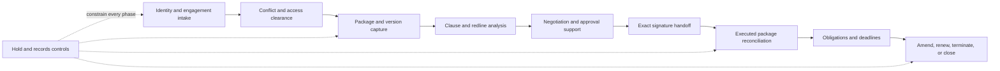

# Legal Matter and Contract Operations Agent Blueprint Research Packet

**Research completed:** 2026-08-31, Asia/Calcutta  
**Research cutoff:** sources accessible on 2026-08-31  
**Status:** researched blueprint baseline; jurisdiction-specific validation remains deployment work  
**Blueprint:** [legal matter and contract operations agent](../../agents/legal-contract-operations-agent/README.md)  
**Category registry entry:** [category 37](../agent-blueprint-category-registry.md)  
**Program contract:** [agent blueprint expansion program](../agent-blueprint-expansion-program.md)  
**Cross-cutting decisions:** [agent blueprint cross-cutting controls](agent-blueprint-cross-cutting-controls.md)

This packet records the evidence and reasoning behind a production blueprint for legal matter and contract operations. It is not legal advice and does not declare a contract enforceable, a communication privileged, a deadline correct, a hold required, or a person authorized to sign. Those determinations depend on facts, jurisdiction, engagement, and qualified professional judgment.

## Research mandate

The research tested whether the category is distinct, whether an agent adds value over deterministic automation, which work may be delegated safely, what evidence must survive the lifecycle, which standards and integrations are actually useful, and which production controls are required.

The required domain boundary was:

- matter, client, counterparty, engagement, and jurisdiction identity;
- confidentiality, privilege assertion, work product, and ethical walls;
- document, package, clause, version, redline, comment, annex, and signature lineage;
- playbook rules, deviations, fallback drafting, obligations, triggers, and deadlines;
- approval and signature handoff;
- legal hold, records retention, disposition, and outside counsel;
- CLM, DMS, e-signature, calendar, identity, e-billing, and counsel integrations; and
- audit, reconciliation, evaluation, release, capacity, cost, and incidents.

Professional authority remains outside the agent: legal interpretation and advice, conflicts resolution and engagement acceptance, negotiation position, privilege and waiver decisions, legally authoritative deadline acceptance, final term acceptance, hold issuance/modification/release, execution formality, signer authority, and signature.

## Research method

Research proceeded in five passes:

1. inspect the repository taxonomy, adjacent blueprints, and canonical state/effect/context/memory/security/evaluation/operations guides;
2. establish primary legal and professional-responsibility baselines in representative U.S., England and Wales, and EU sources;
3. inspect current identity, electronic-signature, records, provenance, document, taxonomy, billing, and content-management standards;
4. inspect current CLM, DMS, and e-signature provider behavior for event, version, retry, and reconciliation realities; and
5. compare public legal NLP datasets and AI-risk sources with the end-to-end production requirement.

Evidence priority was official law and rules, regulator/professional-body guidance, standards bodies, official repositories, official provider documentation, and original research papers. Secondary summaries were not used for core claims. Provider documentation supports connector behavior only; it is not evidence of legal validity. Research papers support evaluation design only; they are not deployment approval.

## Category promotion record

| Promotion gate | Result | Evidence and consequence |
|---|---|---|
| Distinct user and job | Pass | Legal professionals, legal operations, contract managers, records teams, and authorized business owners operate a matter/contract lifecycle distinct from patent search, regulatory monitoring, audit, extraction, and sourcing. |
| Repeated agentic loop | Pass | Evidence retrieval, cross-reference following, clause comparison, exception handling, and cited draft proposals require bounded semantic planning across variable documents. |
| Deterministic alternative tested | Pass with boundary | Forms, template assembly, exact lookup, date computation, routing, signature reminders, retention, and reports should remain deterministic. The agent is justified for variable evidence comparison and drafting, not those controls. |
| Stable evidence objects | Pass | Matter, engagement, parties, artifact bytes, versions, renderings, clause spans, playbook versions, obligations, approvals, effects, receipts, holds, and audit records can be typed and versioned. |
| Consequence boundaries | Pass | D0–D4 tiers make drafting support distinct from professional judgment and external effects. D4 stays proposal-only. |
| Evaluation feasibility | Pass | Exact-source, clause, deviation, obligation, policy, effect, and recovery outcomes are measurable; public datasets supplement a governed local corpus. |
| Production-operability | Pass with prerequisites | Requires matter isolation, exact-version recovery, qualified review, provider governance, idempotency, reconciliation, protected audit, and incident ownership. |
| Non-duplication | Pass | The handoff contracts preserve separate ownership by patent/IP research, regulatory intelligence, compliance audit, document intelligence, and procurement. |

**Promotion decision:** promote category 37 to a full blueprint. The category is valuable only as a constrained legal-operations system, not an autonomous legal decision-maker.

## Current legal and standards baseline

| Area | Current source baseline checked | Engineering conclusion |
|---|---|---|
| Lawyer use of generative AI | ABA Formal Opinion 512, issued 2024-07-29; ABA Model Rules pages accessed 2026-08-31 | Competence, confidentiality, communication, supervision, candor, and fees are live governance concerns; model guidance is not binding in every jurisdiction. |
| England and Wales AI conduct | SRA warning published 2026-08-17; BSB guidance announced 2026-05; Law Society guidance accessed 2026-08-31 | Human responsibility, accuracy, confidentiality, and privilege require local professional controls; do not transpose U.S. model rules. |
| U.S. privilege and preservation | FRE 502, FRCP 26(b)(3), and FRCP 37(e), current pages accessed 2026-08-31 | Confidentiality, privilege, work product, waiver, and preservation are distinct; preservation duty remains fact-specific. |
| Electronic records and signatures | U.S. ESIGN Act; UETA official page; eIDAS as amended by Regulation 2024/1183 | Electronic form is not a complete validity test. Identity, authority, assent, formality, integrity, delivery, and law remain separate. |
| Digital identity | NIST SP 800-63-4 final 2025-07; OpenID Connect Core 1.0 final errata 2; ISO 17442-1:2020 | Authentication, identity proofing, organization identity, and signing authority must not be collapsed. |
| Signature format | ETSI EN 319 142-1 V1.2.1, 2024-01 | PAdES provides technical signature-format requirements; counsel still selects legal execution profile. A later draft/on-approval version is not treated as final. |
| Records and disposition | ISO 15489-1:2016; NIST SP 800-88 Rev. 2 final 2025-09 | Records governance determines retention authority; sanitization determines disposal technique. |
| Content and provenance | OASIS CMIS 1.1 plus errata; W3C PROV; ECMA-376 fifth edition | Generic repository operations, provenance vocabulary, and native-format structure help interoperability but do not replace application lineage or visual verification. |
| Legal taxonomy | SALI LMSS repository accessed 2026-08-31 | Useful optional mapping. Pin a reviewed release or commit because repository main is not final release state. |
| Contract interchange and automation | OASIS eContracts 1.0 committee specification, 2007; OASIS LegalRuleML 1.0, 2021; Accord Project current docs | These are specialized options, not a universal negotiated-contract representation. |
| Contract-management process | WorldCC Contract Management Standard accessed 2026-08-31 | Useful voluntary lifecycle reference; it does not allocate legal or procurement authority automatically. |
| AI risk management | NIST AI 600-1 page updated 2026-04-08; EU AI Act consolidated text dated 2026-07-27; ISO/IEC 42001:2023 | Risk classification follows intended use and jurisdiction. A system is not “high risk” or safe merely because it is called a legal agent. |

## Evidence-backed design decisions

| ID | Decision | Evidence boundary | Blueprint consequence |
|---|---|---|---|
| LCO-01 | Build a legal-operations assistant, not an autonomous lawyer. | Professional rules keep responsibility with lawyers; regulator guidance warns about accuracy, confidentiality, and supervision. | Model verbs are organize, retrieve, compare, draft, flag, and propose. D4 is never executable. |
| LCO-02 | Make matter and engagement authorization precede document analysis. | Duties to current, former, and prospective clients and conflicts processes depend on client/matter identity and scope. | Intake, conflict, engagement, wall, and purpose checks issue a short-lived capability. |
| LCO-03 | Separate confidentiality, privilege assertion, work product, privacy, and contract restrictions. | ABA Rule 1.6 is broader than evidentiary privilege; FRE 502 and FRCP 26 cover different doctrines; UK LPP differs. | Store separate fields, provenance, jurisdiction, and counsel disposition. Labels do not prove protection. |
| LCO-04 | Preserve a contract package and version graph, not a text blob. | OOXML structures and provider versions can diverge from extracted or rendered text; amendments and annexes alter meaning. | Original bytes, native structures, renderings, extraction, package membership, and lineage are separate immutable artifacts. |
| LCO-05 | Treat semantic clause assessment as a cited proposal. | Public legal NLP research demonstrates useful extraction/retrieval but not local playbook or legal conclusion reliability. | Exact spans, playbook version, uncertainty, abstention, and reviewer decision are mandatory. |
| LCO-06 | Govern playbooks as effective-dated legal content. | Local positions and applicability change; taxonomies are not legal truth. | Pin each run to an approved playbook and jurisdiction profile; later changes create new assessments. |
| LCO-07 | Keep authoritative dates deterministic and reviewed. | iCalendar represents calendar data but not legal time rules; legal triggers and calendars vary. | Model extracts candidates; approved rule engine computes; qualified owner accepts critical dates. |
| LCO-08 | Bind approval to exact effects. | Cross-cutting authority research and provider uncertainty show that conversational approval cannot secure changed bytes or recipients. | Approval digests package, signers, recipients, execution profile, policy, conditions, and expiry. |
| LCO-09 | Separate e-signature status from legal validity. | ESIGN, UETA, and eIDAS preserve other substantive/form requirements; identity standards do not prove corporate authority. | Signature manifest covers identity, capacity, authority, assent, formality, bytes, delivery, and completion separately. |
| LCO-10 | Treat callbacks as delivery hints and reconcile provider state. | Google, Microsoft, Ironclad, Adobe, and DocuSign document empty payloads, latest-state deltas, retries, truncation, or manual state. | Authenticate and deduplicate callbacks, then query the source of record before consequential transitions. |
| LCO-11 | Use stable effect identity and an `Unknown` state. | External systems cannot participate in the application's transaction; exactly-once claims do not remove ambiguous commits. | Retries reuse effect ID; timeout after dispatch triggers reconciliation, not blind retry. |
| LCO-12 | Keep legal hold authority with counsel and disposition with governed records controls. | FRCP 37(e) is fact- and forum-specific; ISO 15489 and NIST sanitization address different layers. | Counsel approves hold lifecycle; holds suspend disposition without broadening access; release returns records to schedule review. |
| LCO-13 | Default to one bounded analysis loop. | Extra agents create delegation, shared-state, and evidence complexity without conferring professional independence. | Fixed macro-plan plus bounded evidence exploration; multi-agent design requires measured separability and explicit contracts. |
| LCO-14 | Do not use informal long-term memory for matter knowledge. | Matter isolation, purpose limitation, privilege risk, and source/version requirements conflict with ambient recollection. | Durable task state and governed domain content are explicit; long-term and episodic memory are off or offline by default. |
| LCO-15 | Keep control audit separate from telemetry. | Traces are sampled and risky for confidential content; control evidence must be complete and protected. | Unsampled audit stores IDs, digests, policy, approvals, effects, and receipts; telemetry is minimized. |
| LCO-16 | Evaluate outcome, policy, reliability, and operations independently. | Public datasets measure narrow language tasks and cannot test effects, authorization, or recovery. | A release fails if any applicable gate fails, regardless of average model quality. |
| LCO-17 | Prefer a relational control plane and immutable object store. | Domain records and effects need transactions, versioning, and reconciliation; semantic retrieval is secondary. | SQL and object storage are authoritative; vector/graph systems are optional indexes. |
| LCO-18 | Treat every behavior dependency as release material. | Model, prompt, retrieval, policy, playbook, calendar, and provider changes can alter legal-operational outcomes. | Immutable behavior manifest, eval, approval, canary, rollback, and historical reproducibility. |

## Category separation findings

| Neighbor | Neighbor owns | Legal operations owns | Handoff risk to prevent |
|---|---|---|---|
| Patent/IP research | Prior art, patent families, claim and legal-status evidence | Matter workflow, contract terms, license obligations, approvals | Contract agent should not infer patent validity or infringement. |
| Regulatory intelligence | Official-source acquisition, change/version monitoring, applicability hypothesis | Counsel-approved impact on matter, clause, obligation, or playbook | Monitoring output must not become an authoritative legal requirement automatically. |
| Compliance audit | Engagement-scoped control/evidence testing and assurance result | Legal matter and contract evidence, holds, obligations | Audit request does not confer unrestricted access to privileged matter files. |
| Document intelligence | Safe intake, OCR, extraction, source-grounded facts | Clause semantics, redline/playbook comparison, legal workflow | Legal agent must retain extraction warnings and original lineage, not duplicate parsers silently. |
| Procurement | Need, sourcing, competition, supplier assessment, award | Legal text, deviations, approvals, execution handoff, obligations | Supplier award is not contract acceptance; legal edits do not change sourcing authority. |

The legal operations area may consume artifacts from each neighbor, but it must keep the producer's provenance and uncertainty. It does not become a general enterprise workflow category.

## Lifecycle synthesis

The research supports an explicit separation between proposed and accepted domain records at every semantic boundary: party candidate versus canonical party; privilege assertion versus counsel decision; clause assessment versus accepted position; obligation candidate versus operational obligation; computed deadline candidate versus accepted date; prepared signature package versus approved package; provider completion versus internally verified executed package; proposed hold scope versus issued hold.

## Architecture alternatives considered

| Option | Decision | Reason |
|---|---|---|
| Deterministic forms, templates, search, rules, and schedulers only | Retain as baseline and for predictable subproblems | Safest and cheapest where semantic ambiguity is low; insufficient for variable cross-clause comparison and drafting. |
| Single bounded agent over deterministic control plane | Selected default | Adds semantic flexibility while keeping authority, state, evidence, and effects inspectable. |
| Multi-agent reviewer, negotiator, and memory agents | Reject by default | More identities, prompts, shared state, latency, cost, and failure modes; model disagreement is not qualified legal review. |
| Fully autonomous negotiation | Reject | It would select legal positions, communicate externally, and potentially bind or prejudice the organization. |
| CLM-native assistant only | Conditional | Appropriate if the CLM provides exact versions, access, effect controls, evidence export, evaluation, and reconciliation; otherwise supplement with a control plane. |
| Vector database as contract knowledge base | Reject as authority; allow as index | Approximate retrieval and deletion/access propagation do not satisfy exact version and source requirements alone. |
| Graph database for every clause and party relation | Defer | Relational tables and explicit edges are simpler until measured graph queries or scale justify another store. |
| Computable-contract platform | Specialized option | Valuable for stable, counsel-approved executable templates; most negotiated prose and amendments still require human interpretation. |
| Browser automation for provider effects | Reject as primary mechanism | UI changes and weak idempotency/reconciliation make consequential actions fragile. |

## Legal and professional disagreements

| Issue | Sources or views | Resolution used in blueprint |
|---|---|---|
| Is disclosure of AI use always required? | ABA Formal Opinion 512 discusses circumstances involving communication, informed consent, and fees; other regulators and engagements differ. | Make disclosure a jurisdiction/engagement rule with qualified review, not a universal product toggle. |
| Does confidentiality equal privilege? | Professional confidentiality duties and evidentiary privileges have different scopes; U.S. and UK doctrines differ. | Separate fields and access policy; counsel decides privilege and waiver. |
| Does a digital signature equal a handwritten signature? | eIDAS gives qualified electronic signatures equivalent effect in the EU framework; ESIGN/UETA use different rules and preserve other requirements. | Execution profiles are jurisdiction- and transaction-specific; never generalize one regime globally. |
| Does an e-signature platform's completed state prove execution? | Provider workflows report technical/workflow state and can include manual assertions. | Fetch and reconcile artifacts and evidence; counsel determines legal completion. |
| When is preservation required? | FRCP 37(e) addresses a U.S. federal consequence framework but says it does not create the preservation duty; other forums differ. | Store approved basis and jurisdiction; counsel owns issue/scope/release. |
| Must deletion requests override retention? | Privacy law provides rights and exceptions; holds and legal claims can matter, but scope and precedence are jurisdictional. | Route conflicts through privacy/legal/records owners; preserve decision evidence. |
| Is a legal AI system high risk under the EU AI Act? | Classification turns on intended purpose and listed use contexts; judicial use can differ from ancillary administration. | Perform deployment-specific classification. Do not classify solely from the “legal agent” label. |
| Should approval occur for every tool call? | Broad approval is unusable; no approval is unsafe for consequential effects. | Tier effects: D0/D1 controlled by policy, D2 staged, D3 exact human approval, D4 non-executable. |
| Can “exactly once” solve duplicate legal effects? | Queue and provider boundaries retain ambiguous outcomes despite idempotency mechanisms. | Stable effect identity, `Unknown`, receipts, reconciliation, and human escalation. |

## Standards fit and limitations

| Standard or specification | Good use | Do not assume |
|---|---|---|
| SALI LMSS | Cross-system semantic identifiers and mappings | Repository main is a stable legal taxonomy release or a legal conclusion |
| LEDES and UTBMS | Billing exchange and task/activity coding | Invoice data proves substance, quality, privilege, or outcome |
| OASIS CMIS | Generic content repository operations and capability discovery | Every DMS exposes identical version, hold, permission, or audit semantics |
| W3C PROV | Common provenance concepts for entities, activities, and agents | A generic PROV graph supplies domain invariants or access controls |
| ECMA-376 OOXML | Native Word package and tracked-change structure | Plain-text extraction matches the reviewer's visual document |
| OASIS eContracts 1.0 | Historical generic XML structure for contract documents | Modern universal interoperability or normative legal semantics |
| OASIS LegalRuleML 1.0 | Specialized formal legal-rule representation | Default representation for negotiated clauses and local playbooks |
| Accord Project | Counsel-approved computable templates with data and logic | Automatic conversion of ordinary contracts into authoritative code |
| RFC 5545 | Calendar transport and recurrence representation | Legal deadline interpretation |
| RFC 3161 and RFC 4998 | Timestamp and long-term evidence structures | Signer authority, assent, authenticity of underlying facts, or enforceability |
| RFC 8785 | Canonical JSON for repeatable hashing/signing inputs | Legal truth or non-repudiation by itself |
| NIST SP 800-63-4 | Digital identity proofing, authentication, and federation risk | Employment role or contract-signing authority |
| ISO 17442-1 | Legal entity identification through LEI | Beneficial ownership, affiliation completeness, or individual authority |
| ISO 15489-1 | Records-management concepts and controls | Organization-specific retention periods or legal-hold decisions |
| NIST SP 800-88 Rev. 2 | Media sanitization methods and program guidance | Permission or timing to dispose of a record |

## Integration evidence

| Provider or interface | Primary documentation finding | Design consequence |
|---|---|---|
| Ironclad | Public API covers workflows/records/webhooks; webhook documentation describes retry behavior. Manual-signature workflows can depend on a user marking completion. | Do not interpret a callback or workflow state as signature validity; query and verify exact artifacts. |
| Adobe Acrobat Sign | Webhook guides define subscription/events and validation; event documentation recommends polling backup, and payload guidance describes truncation behavior. | Validate, deduplicate, and reconcile; fetch final resources. |
| DocuSign Connect | Official developer guidance covers HMAC listener validation and event retry metadata. | Verify signatures/HMAC, retain provider event identity, make handler idempotent. |
| Microsoft Graph Drive | Version APIs expose versions with download behavior; delta returns latest state and can omit intermediate history. | Persist exact acquired bytes and provider version; use delta for change discovery, not full event history. |
| Google Drive | Notifications can have empty bodies, channels expire, and message numbers increase without being sequential; change log must be queried. | Renew channels, deduplicate, and query changes/source objects before state transition. |
| OASIS CMIS | Capability model varies by repository. | Negotiate and test provider capabilities instead of assuming holds, versions, or policies. |

The evidence supports a common connector contract rather than a lowest-common-denominator implementation. Provider-specific semantics remain visible, versioned, tested, and reconciled.

## Evaluation evidence and gaps

| Source | Research contribution | Known gap |
|---|---|---|
| CUAD, 2021 | 510 commercial contracts, more than 13,000 annotations, 41 clause types; useful extraction baseline | Static public contracts, limited labels, no local playbook, workflow, effect, or current-law evaluation |
| ContractNLI, 2021 | 607 NDAs with evidence spans; exposes negation and exception difficulty | NDA-focused and not an operational legal lifecycle |
| MAUD, 2023 | 152 merger agreements with roughly 47,000 annotations across 92 questions | Domain-specific, no matter access or production-effect tests |
| ACORD, 2025 | Large clause-retrieval research benchmark with 114 queries and about 126,000 query-clause pairs | Retrieval research remains materially imperfect and does not test downstream authority |
| LegalBench | Broad legal-reasoning task collection | Benchmark performance does not establish competence for a deployment's jurisdiction and workflow |

Therefore, public benchmarks are smoke and component tests. Production gates require licensed local documents, exact-version and matter splits, current playbooks, adjudicated reviewers, policy invariants, integration simulators, failure injection, and time-based holdouts.

## Primary source register

### Professional responsibility and legal doctrine

| Source | Version or publication date | Last checked | Used for |
|---|---|---|---|
| [ABA Formal Opinion 512](https://www.americanbar.org/content/dam/aba/administrative/professional_responsibility/ethics-opinions/aba-formal-opinion-512.pdf) | 2024-07-29 | 2026-08-31 | Lawyer competence, confidentiality, communication, supervision, candor, fees in generative-AI use |
| [ABA Model Rules of Professional Conduct](https://www.americanbar.org/groups/professional_responsibility/publications/model_rules_of_professional_conduct/) | Living model rules | 2026-08-31 | Model-rule baseline; local adoption must be checked |
| [ABA Rule 1.6](https://www.americanbar.org/groups/professional_responsibility/publications/model_rules_of_professional_conduct/rule_1_6_confidentiality_of_information/) | Living page | 2026-08-31 | Confidentiality and reasonable safeguards |
| [ABA Rule 1.7 and comments](https://www.americanbar.org/groups/professional_responsibility/publications/model_rules_of_professional_conduct/rule_1_7_conflict_of_interest_current_clients/comment_on_rule_1_7/) | Living page | 2026-08-31 | Current-client conflicts and identification procedures |
| [ABA Rule 1.9](https://www.americanbar.org/content/aba-cms-dotorg/en/groups/professional_responsibility/publications/model_rules_of_professional_conduct/rule_1_9_duties_of_former_clients/) | Living page | 2026-08-31 | Former-client information and adversity boundary |
| [ABA Rule 1.18](https://www.americanbar.org/groups/professional_responsibility/publications/model_rules_of_professional_conduct/rule_1_18_duties_of_prospective_client/) | Living page | 2026-08-31 | Prospective-client information and intake handling |
| [Federal Rule of Evidence 502](https://www.law.cornell.edu/rules/fre/rule_502) | Current rule page | 2026-08-31 | U.S. federal disclosure and waiver dimensions |
| [Federal Rule of Civil Procedure 26](https://www.law.cornell.edu/rules/frcp/rule_26) | Current rule page | 2026-08-31 | Trial-preparation material and work-product dimension |
| [Federal Rule of Civil Procedure 37](https://www.law.cornell.edu/rules/frcp/rule_37) | Current rule page | 2026-08-31 | U.S. federal ESI preservation consequence framework |
| [SRA warning on misuse of AI](https://guidance.sra.org.uk/solicitors/guidance/misuse-ai/) | 2026-08-17 | 2026-08-31 | England and Wales accuracy, confidentiality, LPP, and responsibility warning |
| [Bar Standards Board AI guidance announcement](https://www.barstandardsboard.org.uk/resources/press-releases/new-guidance-supports-barristers-to-safely-adopt-artificial-intelligence-and-emerging-technologies.html) | 2026-05 | 2026-08-31 | Barrister-specific AI governance signal |
| [Law Society legal professional privilege and confidentiality](https://www.lawsociety.org.uk/topics/data-protection/lpp-and-client-confidentiality) | Living guidance | 2026-08-31 | England and Wales distinction and practical handling |
| [State Bar of California generative-AI practical guidance](https://www.calbar.ca.gov/sites/default/files/portals/0/documents/ethics/Generative-AI-Practical-Guidance.pdf) | Current PDF accessed | 2026-08-31 | State-specific practical comparison; not universal U.S. rule |

### Electronic signature, identity, and evidence

| Source | Version or publication date | Last checked | Used for |
|---|---|---|---|
| [U.S. ESIGN Act, 15 U.S.C. § 7001](https://www.law.cornell.edu/uscode/text/15/7001) | Statutory text | 2026-08-31 | Electronic-form baseline and preserved requirements |
| [Uniform Electronic Transactions Act](https://www.uniformlaws.org/committees/community-home?CommunityKey=2c04b76c-2b7d-4399-977e-d5876ba7e034) | Official uniform-law page | 2026-08-31 | State-enactment research starting point |
| [EU Regulation 2024/1183](https://eur-lex.europa.eu/eli/reg/2024/1183/oj) | 2024 | 2026-08-31 | Amended eIDAS framework and qualified-signature distinction |
| [Consolidated Regulation 910/2014](https://eur-lex.europa.eu/eli/reg/2014/910/2024-10-18) | Consolidated 2024-10-18 | 2026-08-31 | eIDAS consolidated reading point |
| [ETSI EN 319 142-1](https://www.etsi.org/deliver/etsi_EN/319100_319199/31914201/01.02.01_60/en_31914201v010201p.pdf) | V1.2.1, 2024-01 | 2026-08-31 | Published PAdES baseline; later draft status not treated as final |
| [NIST SP 800-63-4](https://pages.nist.gov/800-63-4/) | Final, 2025-07 | 2026-08-31 | Digital identity assurance model |
| [NIST SP 800-63A-4](https://pages.nist.gov/800-63-4/sp800-63a.html) | Final suite, 2025 | 2026-08-31 | Identity-proofing limits and processes |
| [OpenID Connect Core 1.0](https://openid.net/specs/openid-connect-core-1_0.html) | Final errata 2 | 2026-08-31 | Authentication/federation claim boundary |
| [ISO 17442-1:2020](https://www.iso.org/standard/78829.html) | 2020; current page checked | 2026-08-31 | LEI entity-identity scope |
| [GLEIF relationship record format 2.1](https://www.gleif.org/content/4_lei-data/1_access-and-use-lei-data/4_level-2-data-relationship-record-rr-cdf-2-1-format/rr-cdf_version_2.1-documentation.html) | Version 2.1 | 2026-08-31 | Legal-entity relationship data option and limits |
| [RFC 3161](https://www.rfc-editor.org/info/rfc3161) | 2001 | 2026-08-31 | Timestamp evidence primitive |
| [RFC 4998](https://www.rfc-editor.org/info/rfc4998) | 2007 | 2026-08-31 | Evidence record syntax |
| [RFC 8785](https://www.rfc-editor.org/rfc/rfc8785.html) | 2020, informational | 2026-08-31 | Canonical JSON for repeatable digest/signature inputs |

### Documents, legal technology, and records

| Source | Version or publication date | Last checked | Used for |
|---|---|---|---|
| [ECMA-376 Office Open XML](https://ecma-international.org/publications-and-standards/standards/ecma-376/) | Fifth edition | 2026-08-31 | Native Word package and tracked-change structure |
| [W3C PROV overview](https://www.w3.org/TR/prov-overview/) | W3C recommendation family, 2013 | 2026-08-31 | Provenance concepts |
| [OASIS CMIS 1.1](https://www.oasis-open.org/standard/cmisv1-1/) | 1.1 plus errata | 2026-08-31 | Generic content repository interface and capabilities |
| [SALI LMSS repository](https://github.com/sali-legal/LMSS) | Rolling repository | 2026-08-31 | Optional taxonomy and explicit release-pinning warning |
| [LEDES](https://ledes.org/) | Living standards organization | 2026-08-31 | Legal e-billing exchange |
| [UTBMS](https://utbms.com/) | Living resource | 2026-08-31 | Legal task/activity code context |
| [OASIS eContracts 1.0](https://docs.oasis-open.org/legalxml-econtracts/CS01/legalxml-econtracts-specification-1.0.html) | Committee Specification, 2007 | 2026-08-31 | Historical contract XML option and limitation |
| [OASIS LegalRuleML 1.0](https://docs.oasis-open.org/legalruleml/legalruleml-core-spec/v1.0/) | 1.0, 2021 | 2026-08-31 | Specialized legal-rule representation |
| [Accord Project documentation](https://docs.accordproject.org/) | Current docs | 2026-08-31 | Specialized computable-contract option |
| [WorldCC Contract Management Standard](https://www.worldcc.com/knowledge-insights/contract-management-standard.html) | Living voluntary standard | 2026-08-31 | Lifecycle process comparison |
| [RFC 5545 iCalendar](https://www.rfc-editor.org/info/rfc5545) | 2009 | 2026-08-31 | Calendar transport, not legal rule calculation |
| [ISO 15489-1:2016](https://www.iso.org/standard/62542.html) | 2016; current page checked | 2026-08-31 | Records-management concepts and controls |
| [NIST SP 800-88 Rev. 2](https://nvlpubs.nist.gov/nistpubs/SpecialPublications/NIST.SP.800-88r2.pdf) | Final, 2025-09 | 2026-08-31 | Media sanitization, distinct from disposition authority |
| [NARA Universal ERM Requirements](https://www.archives.gov/records-mgmt/policy/universalermrequirements) | Current U.S. federal resource | 2026-08-31 | Federal records requirements example, not universal rule |
| [NARA records freeze FAQ](https://www.archives.gov/files/frc/freeze/records-freeze-faq-2.pdf) | Official U.S. federal FAQ | 2026-08-31 | Freeze implementation example and jurisdiction limitation |

### Provider integration behavior

| Source | Last checked | Used for |
|---|---|---|
| [Ironclad developer hub](https://developer.ironcladapp.com/) | 2026-08-31 | API surface and integration entry point |
| [Ironclad public API overview](https://support.ironcladapp.com/hc/en-us/articles/12278082472855-Ironclad-s-Public-API-Overview) | 2026-08-31 | Workflows, records, and webhooks |
| [Ironclad webhook reference](https://developer.ironcladapp.com/reference/webhooks) | 2026-08-31 | Retries and event behavior |
| [Adobe Acrobat Sign webhook guide](https://opensource.adobe.com/acrobat-sign/developer_guide/webhookapis.html) | 2026-08-31 | Webhook setup, validation, and event design |
| [Adobe Acrobat Sign webhook payload overview](https://opensource.adobe.com/acrobat-sign/acrobat_sign_events/webhookpayloadoverview.html) | 2026-08-31 | Payload scope and truncation considerations |
| [DocuSign HMAC webhook guidance](https://www.docusign.com/blog/developers/dsdev-webhook-listeners-part-1) | 2026-08-31 | Callback authenticity practice |
| [DocuSign Connect 2.0](https://www.docusign.com/blog/developers/connect-20) | 2026-08-31 | Event metadata and retry handling |
| [Microsoft Graph list drive versions](https://learn.microsoft.com/en-us/graph/api/driveitem-list-versions?view=graph-rest-1.0) | 2026-08-31 | DMS-style version retrieval behavior |
| [Microsoft Graph driveItemVersion](https://learn.microsoft.com/en-us/graph/api/resources/driveitemversion?view=graph-rest-1.0) | 2026-08-31 | Version metadata and download URL lifetime caveat |
| [Microsoft Graph delta](https://learn.microsoft.com/en-us/graph/api/driveitem-delta?view=graph-rest-1.0) | 2026-08-31 | Latest-state change discovery limitation |
| [Google Drive push notifications](https://developers.google.com/workspace/drive/api/guides/push) | 2026-08-31 | Empty payloads, message numbering, channel expiry |
| [Google Drive change log](https://developers.google.com/workspace/drive/api/guides/manage-changes) | 2026-08-31 | Reconciliation after notification |

### AI risk, privacy, and evaluation

| Source | Version or publication date | Last checked | Used for |
|---|---|---|---|
| [NIST AI 600-1 Generative AI Profile](https://www.nist.gov/publications/artificial-intelligence-risk-management-framework-generative-artificial-intelligence) | Profile page updated 2026-04-08 | 2026-08-31 | Generative-AI risk framing and control lifecycle |
| [EU AI Act consolidated text](https://eur-lex.europa.eu/eli/reg/2024/1689/2026-07-27/eng) | Consolidated 2026-07-27 | 2026-08-31 | Intended-use and high-risk context research; deployment analysis still required |
| [EDPB Opinion 28/2024](https://www.edpb.europa.eu/documents/opinion-of-the-board-art-64/opinion-282024-on-certain-data-protection-aspects-related-to_en) | 2024 | 2026-08-31 | GDPR personal-data considerations for AI models; not general approval |
| [GDPR Article 5](https://eur-lex.europa.eu/eli/reg/2016/679/art_5/oj), [Article 17](https://eur-lex.europa.eu/eli/reg/2016/679/art_17/oj), and [Article 32](https://eur-lex.europa.eu/eli/reg/2016/679/art_32/oj) | Regulation 2016/679 | 2026-08-31 | Principles, erasure/exception, and security baseline where applicable |
| [ISO/IEC 42001:2023](https://www.iso.org/standard/42001) | 2023 | 2026-08-31 | AI management-system option, not product certification of legal correctness |
| [CUAD](https://www.atticusprojectai.org/cuad/) and [paper](https://arxiv.org/abs/2103.06268) | 2021 | 2026-08-31 | Clause extraction benchmark scope |
| [ContractNLI](https://aclanthology.org/2021.findings-emnlp.164/) | 2021 | 2026-08-31 | Evidence-grounded NDA inference benchmark |
| [MAUD](https://arxiv.org/abs/2301.00876) | 2023 | 2026-08-31 | Merger-agreement benchmark |
| [ACORD](https://arxiv.org/abs/2501.06582) | 2025 | 2026-08-31 | Clause retrieval benchmark and remaining difficulty |
| [LegalBench](https://legalbench.ai/) | Current site | 2026-08-31 | Broad legal reasoning evaluation comparison |

## Claims deliberately excluded

The blueprint does not claim:

- that ABA Model Rules or opinions bind every U.S. lawyer or jurisdiction;
- that SRA, BSB, or Law Society guidance applies outside its professional context;
- that privilege attaches because the system labels material privileged;
- that using an enterprise or non-training model preserves privilege automatically;
- that an electronic signature is enforceable merely because a provider reports completion;
- that NIST identity assurance or an LEI proves company signing authority;
- that a hash or timestamp proves assent, authenticity of the underlying facts, or legal validity;
- that FRCP 37(e) defines preservation duty outside its U.S. federal context;
- that ISO 15489 supplies retention periods or NIST SP 800-88 supplies deletion authority;
- that SALI, OASIS eContracts, LegalRuleML, Accord, CMIS, LEDES, or WorldCC is a universal legal ontology or lifecycle mandate;
- that public legal NLP benchmarks demonstrate production competence;
- that a model or agent disagreement is independent professional review;
- that idempotency creates exactly-once effects across provider boundaries; or
- that every legal-operations deployment has the same EU AI Act, privacy, professional, or records classification.

## Jurisdictional and operational limitations

This packet sampled representative primary sources rather than every jurisdiction. Before deployment, qualified owners must research at least:

- the professional rules and unauthorized-practice boundaries for every service jurisdiction;
- privilege, work-product, waiver, common-interest, and disclosure rules for the matter and forum;
- conflicts, prospective-client, engagement, supervision, client-consent, and AI-disclosure duties;
- governing law, forum, subject-matter, limitation, notice, deadline, and court-calendar rules;
- entity, capacity, authority, witnessing, notarization, deeds, seals, counterparts, delivery, and electronic-signature exclusions;
- privacy, secrecy, localization, transfer, surveillance, employment, and sectoral data rules;
- preservation, discovery, records, statutory retention, erasure, and disposition duties;
- sanctions, export-control, legal-services, and outside-counsel restrictions; and
- whether the system's intended use triggers sectoral or AI-specific regulation.

Operationally, provider documentation can change without the law changing, and law can change without the provider changing. Some standards require licensed full texts. Repository or vendor marketing statements require verification through configuration and failure testing.

## Refresh triggers

Refresh the packet and affected behavior release when any of the following occurs:

- a professional regulator, court, legislature, data-protection authority, or records authority changes relevant rules or guidance;
- a new jurisdiction, contract family, document language, legal subject, signature formality, or preservation forum enters scope;
- engagement terms, client instructions, AI disclosure requirements, or provider approvals change;
- ABA/SRA/BSB/local bar guidance, eIDAS/ESIGN/UETA interpretations, privacy law, discovery rules, or AI regulation materially changes;
- NIST SP 800-63, NIST AI 600-1, ETSI PAdES, ISO 15489, ISO 17442, ISO/IEC 42001, CMIS, SALI LMSS, LEDES, OOXML, or another adopted standard releases a relevant revision;
- CLM, DMS, e-signature, identity, calendar, storage, or model providers change APIs, event semantics, scopes, retention, training, regions, subprocessors, limits, or deprecations;
- a model, prompt, tool, parser, OCR engine, renderer, retrieval policy, memory policy, playbook, calendar, date rule, schema, or authorization policy changes;
- evaluation drift, reviewer disagreement, missed clauses, wrong recipients, duplicate effects, missed deadlines, hold gaps, cross-matter access, or privilege/privacy incidents appear; or
- six months pass for high-change provider and AI-governance sources, or twelve months for otherwise stable standards and legal baselines, whichever approved owner sets shorter.

Each refresh records the source's effective date, checked date, jurisdiction, prior position, new position, impacted guides, impacted behavior releases, migration need, and reviewer.

## Blueprint traceability

| Research area | Implemented in |
|---|---|
| Mission, reserved decisions, deterministic alternative, category seams | [README](../../agents/legal-contract-operations-agent/README.md) and [mission and authority](../../agents/legal-contract-operations-agent/01-mission-boundaries-identity-and-authority.md) |
| Runtime, model boundary, adapters, provider events | [architecture and integrations](../../agents/legal-contract-operations-agent/02-reference-architecture-runtime-and-integrations.md) |
| Client/matter identity, conflicts, privilege, engagement, jurisdiction | [matter intake](../../agents/legal-contract-operations-agent/03-matter-intake-conflicts-privilege-and-jurisdiction.md) |
| Original bytes, package, clauses, versions, redlines, playbooks, drafting | [documents and lineage](../../agents/legal-contract-operations-agent/04-documents-clauses-redlines-playbooks-and-lineage.md) |
| Obligations, deterministic dates, approvals, signature and execution | [obligations and signature](../../agents/legal-contract-operations-agent/05-obligations-deadlines-approvals-and-signature-handoff.md) |
| Holds, retention, disposition, counsel, e-billing | [holds and records](../../agents/legal-contract-operations-agent/06-legal-holds-retention-outside-counsel-and-records.md) |
| Planning, state, events, effects, idempotency, context, memory, compaction, recovery | [state and recovery](../../agents/legal-contract-operations-agent/07-state-events-context-memory-planning-and-recovery.md) |
| Threats, permissions, privacy, providers, audit | [security and audit](../../agents/legal-contract-operations-agent/08-security-privacy-permissions-and-audit.md) |
| Evaluation, failure injection, observability, deployment, SLOs, capacity, cost, releases, incidents | [production operations](../../agents/legal-contract-operations-agent/09-evaluation-observability-deployment-scale-and-incidents.md) |
| Stage 0–6 entry, work, exit evidence, artifacts | [zero-to-production gates](../../agents/legal-contract-operations-agent/10-zero-to-production-stages-and-exit-gates.md) |

## Research conclusion

The strongest sources converge on a narrow engineering posture: legal AI can assist materially, but professional responsibility, confidentiality, exact evidence, local law, and provider uncertainty make application-owned controls indispensable. The production-worthy system is a matter-scoped, evidence-preserving, deterministic control plane with bounded model analysis and explicit human decisions. Its maturity is measured by verified outcomes, safe abstention, exact authority, recoverable effects, and reproducible evidence—not by how autonomous the interface appears.

