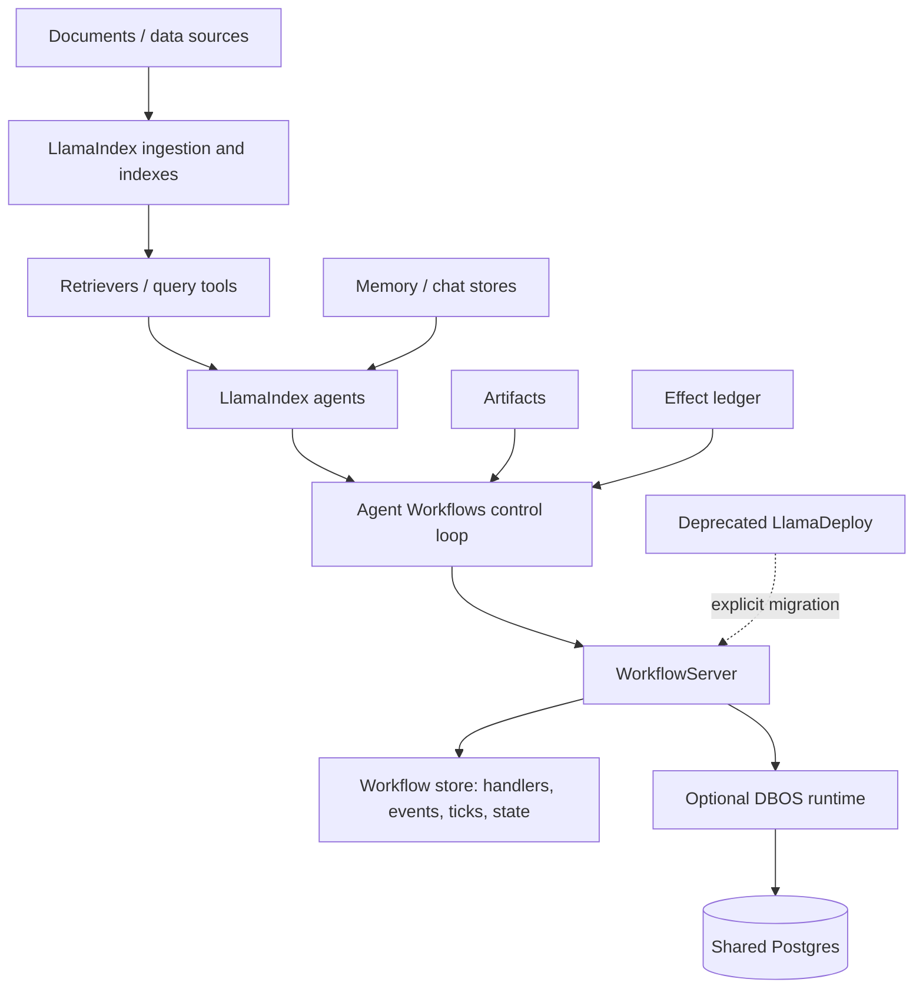
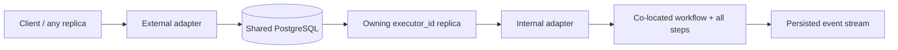

# LlamaIndex and LlamaAgents Deep Dive — Research Packet

**Research date:** 2026-08-31  
**Status:** Research-backed synthesis supporting the dedicated framework guide set  
**Repository snapshots:** `run-llama/llama_index@f87a57b` (2026-08-29) and `run-llama/llama-agents@94f17c9` (2026-08-22)  
**Scope:** LlamaIndex Python data/agent framework, Agent Workflows, current LlamaAgents server/client/durability/deployment stack, and deprecated standalone LlamaDeploy  
**Freshness rule:** Recheck active package, runtime, server, persistence, model/provider, and deployment surfaces every 30–90 days and on every upgrade

## Research questions

1. What is actually included in “LlamaIndex,” “Agent Workflows,” “LlamaAgents,” and “LlamaDeploy” in 2026?
2. Which abstraction should own agent control, retrieval, conversational memory, workflow state, artifacts, external effects, and durable recovery?
3. What are the exact concurrency, retry, snapshot, streaming, human-wait, and recovery semantics?
4. What changes when a Workflow is embedded, served through `WorkflowServer`, or run with DBOS across replicas?
5. Which package/version/migration boundaries can invalidate stored state or in-flight work?
6. Which production claims survive source inspection, release history, security analysis, and bounded failure evidence?
7. When is a simpler loop, deterministic workflow, existing durable engine, or another framework the better choice?

## Evidence method

Research used:

1. current official LlamaIndex and LlamaAgents documentation;
2. repository source at the pinned commits above, including runtime architecture documents, package metadata, tests, examples, server routes/stores, serializers, charts, and changelogs;
3. official releases and migration/deprecation notices;
4. DBOS adapter architecture and current DBOS-linked examples;
5. LlamaIndex security policy and security-sensitive source warnings;
6. bounded GitHub issues/discussions selected for reproducible failure hypotheses;
7. existing repository guides on durability, orchestration, memory, security, and alternative runtimes for cross-checking category claims.

Vendor documentation establishes intended behavior. Current source and tests resolve implementation detail. Issues provide adoption tests, not prevalence. Old documentation was retained only for explicit migration history.

## Second-pass usefulness and contradiction audit

A separate pass re-opened the pinned server API, public server constructor, static debugger page, client stream, DBOS architecture, core vector-filter types, vector retriever, and evaluator surfaces. The pass did not add new topic files; it converted source details into release gates where the first synthesis was accurate but not yet operational enough.

| Pinned observation | Why it matters | Guide action |
|---|---|---|
| `_WorkflowAPI` uses `middleware or [default]` | Passing `middleware=[]` does **not** disable permissive credentialed CORS | Require a non-empty reviewed middleware list and test preflight through ingress |
| The default 500 handler returns the exception string to the client | Internal dependency/type/path details can escape even though the exception is logged | Install a sanitized exception handler; correlate protected logs separately |
| `/handlers` has workflow/status filters but no pagination or tenant predicate | A bare collection route is unsuitable for multi-tenant inventory and can return an unbounded result | Block it or replace it with a tenant-owned, paginated application endpoint |
| Handler/run records do not carry application tenancy automatically | Authentication middleware alone cannot authorize a specific handler/event/cancel action | Resolve every identifier through an application ownership record |
| The debugger root page imports versioned JS/CSS from public jsDelivr URLs | A package version pin is not browser supply-chain isolation | Route-block or self-host reviewed assets under CSP |
| Each stream connection has an unbounded feeder `asyncio.Queue` | A slow consumer can create process-memory pressure in addition to stored-history growth | Add connection/byte/lag limits, slow-reader load tests, and cursor replay |
| Invalid SSE `Last-Event-ID` is ignored | Malformed clients/proxies can fall back to a different query cursor without a protocol error | Contract-test malformed and precedence cases |
| DBOS fingerprints the shared adapter wrapper in a way that may miss ordinary user-step edits | Engine compatibility and application semantic compatibility are different gates | Add an application workflow-contract digest and old-run routing policy |
| Core exposes typed `MetadataFilters`; integration translation remains backend-specific | Constructing a filter object is not evidence that dense/hybrid retrieval enforces tenancy | Add two-tenant canary tests against the exact production integration |
| One aggregate eval suite cannot prove provider, recovery, topology, or canary behavior | Evaluation evidence is environment-dependent | Add PR → integration → staging → shadow → canary promotion gates and manifests |

These observations are version-specific. They should be removed or revised when a later pinned release demonstrably changes the implementation, not copied forward as folklore.

## Terminology and ownership map

| Name | Current meaning | Not the same as |
|---|---|---|
| LlamaIndex | Python data/agent framework: readers, ingestion, nodes, indexes, retrievers, query engines, model/tool integrations, Memory, workflow-based agents | A hosted runtime or security boundary |
| Agent Workflows | Extracted event-driven async runtime published as `llama-index-workflows`, using the current `workflows` import surface in standalone examples | `AgentWorkflow`, which is a prebuilt LlamaIndex multi-agent handoff workflow |
| LlamaIndex agent | `FunctionAgent`, `ReActAgent`, `CodeActAgent`, or related model/tool loop built on Workflows | A durable distributed worker by itself |
| `AgentWorkflow` | Convenience workflow for one or more agents and handoffs; official multi-agent docs describe a linear/swarm-style pattern | A general parallel DAG engine |
| Custom Workflow | Typed events and steps with explicit branches, loops, fan-out/fan-in, waits, state, retries, and resources | A model-decided agent loop |
| Workflow Context | Run/control state, in-flight events/collections, and shared step state | Conversation Memory, document store, artifact store, or effect ledger |
| Memory / chat store | Model-visible messages and optional long-term memory blocks | Complete workflow event stream or evidence archive |
| `WorkflowServer` | ASGI service exposing run/result/event/HITL/cancel APIs with server runtime/store integration | Authentication/authorization/tenancy policy |
| DBOS adapter | Database-coordinated durable runtime with executor ownership and journal recovery | Distributed execution of individual workflow steps |
| `llamactl` / current deployment stack | Local app development, packaging, managed deployment commands, and current control-plane/operator components | Deprecated standalone `llama-deploy` wire/state model |
| LlamaDeploy | Old standalone project, deprecated in its README and 0.9.2 release | A supported target for new production architecture |



## Version snapshot

The LlamaIndex snapshot's generated changelog reported `llama-index-core` 0.14.24 on 2026-08-19. The LlamaAgents repository snapshot declared:

| Package | Version observed |
|---|---:|
| `llama-index-workflows` | 2.23.3 |
| `llama-agents-server` | 0.7.1 |
| `llama-agents-client` | 0.3.12 |
| `llama-agents-dbos` | 0.6.0 |
| `llamactl` | 0.10.3 |
| `llama-agents-core` | 0.10.2 |
| `llama-agents-appserver` | 0.11.6 |
| `llama-agents-control-plane` | 0.12.4 |
| `llama-agents-agentcore` | 0.9.4 |

This is evidence of a rapidly moving, independently versioned package family. It is not a universal compatibility matrix. Server/client/DBOS packages were pre-1.0, while Workflows had already crossed a 2.0 breaking boundary. Production builds need an exact lock and cross-package tests.

## Architecture findings

### Workflows is a reducer-driven event runtime

Current architecture source divides execution into:

- a caller-facing `WorkflowHandler` and external Context face;
- a runtime with external/internal adapters;
- a reducer-style control loop that consumes ticks and emits commands;
- worker-facing internal Context and step functions;
- a state store and event collections;
- resources for non-serialized runtime dependencies.

The default `BasicRuntime` is in-memory asyncio. Runtimes are replaceable and composable through adapter/decorator boundaries. `WorkflowHandler` is awaitable, streams published events, accepts external events, and supports graceful cancellation.

Events are typed Pydantic models. Step signatures declare accepted and returned event types, allowing validation and visualization, but runtime behavior remains dynamic: steps can branch, loop, manually emit events, collect results, wait for external input, and run multiple workers.

### Concurrency has several independent layers

| Layer | Control | Important semantics |
|---|---|---|
| Concurrent workflow runs | `num_concurrent_runs` | Default core limit is process-local; DBOS maps a configured limit to workflow admission queues |
| Step event handling | `@step(num_workers=N)` | Multiple workers can mutate shared state; slow dependencies need separate bulkheads |
| Fan-out/fan-in | list return/list parameter or manual `send_event`/`collect_events` | A list return is an all-or-nothing batch; manually sent events survive even if producer later fails |
| Early collection release | `Take(...)`/collection policy | Unselected sibling work continues; it is not automatically cancelled |
| Downstream systems | provider/database/tool limits | Not protected automatically by workflow worker counts |

Current docs instruct `ctx.store.edit_state()` for atomic compound state updates and warn to keep network/model calls outside the lock. Parallel agents should produce immutable candidates and merge once in a deterministic reducer.

### Resources and artifacts prevent state bloat

Current Workflows resources inject clients, LLMs, retrievers, indexes, database handles, and configuration. A resource is resolved/cached at runtime and recreated on restore rather than serialized into Context. Durable events/state should contain small, versioned identifiers and values.

Large documents, parsed pages, images, raw provider/tool results, embeddings, and evaluation evidence need an external artifact/document store with immutable references, digests, tenant labels, and provenance. The workflow history should coordinate them, not become their payload store.

## Agent, model, and tool findings

### Use the lowest-control abstraction that still exposes required invariants

| Need | Starting point | Escalate when |
|---|---|---|
| One model/tool loop | `FunctionAgent` for function-calling model; `ReActAgent` when ReAct behavior/provider fit is required | Deterministic phases, parallel work, or durable waits matter |
| Simple sequential handoffs | `AgentWorkflow` | Handoff policy, parallel joins, state ownership, or predefined dependencies need control |
| Supervisor retains control | Orchestrator exposes subagents as tools | Planning/execution must be inspected or deterministic |
| Explicit branches, joins, waits, retries, and reducers | Custom Workflow | A separate durable/business engine should own the process |

Official multi-agent guidance identifies `AgentWorkflow`, an orchestrator-as-tools pattern, and a custom planner. The first is described as a linear swarm/handoff pattern. A known DAG should be encoded in Workflow events/steps rather than reconstructed through a handoff prompt.

### Provider abstraction is conditional

Model integrations differ in tool-call/message-block encoding, streaming, reasoning fields, multimodal parts, structured output, parallel calls, token metadata, cancellation, and retry behavior. The core changelog and issues repeatedly include provider-specific fixes. Production conformance tests must use every selected provider/model and preserve raw diagnostics.

Tool schemas validate shape, not authorization or semantic safety. Tools need least privilege, stable operation IDs, server-side tenant policy, timeouts, result-size bounds, receipts, and approval for high-impact effects.

## Data, RAG, indices, and retrieval findings

### Data lineage is the production center

LlamaIndex's RAG model separates Documents, Nodes, readers, transformations, embeddings, indexes/vector stores, retrievers, node postprocessors/rerankers, and response synthesizers. A production record should connect:

```text
source URI/version/digest
  -> parser/reader version
  -> transformation/chunk configuration
  -> node IDs + relationships + metadata
  -> embedding model/version
  -> index/vector collection version
  -> retrieval/rerank configuration
  -> cited nodes in the answer
```

Without that chain, deletion, reindex, audit, evaluation, and rollback become guesses.

### Storage behavior varies by backend

`StorageContext` coordinates document, index, vector, and related stores, but actual persistence semantics come from the selected integration. Vector stores vary in whether they store node text, filter operators, async support, delete/upsert behavior, hybrid/MMR modes, consistency, and namespace guarantees.

The core `VectorStore` protocol notes that an unimplemented async add may call synchronous add. Metadata filter types support a broad operator model, but individual backends can support only a subset. Therefore:

- verify filter pushdown with the real backend;
- make tenant/ACL filters mandatory before top-k retrieval;
- test numeric/string/list types and AND/OR/NOT/nested behavior;
- version node/document IDs and define upsert/delete semantics;
- test partial batch failures and retries for duplicate/missing nodes;
- evaluate retrieval and citation correctness after every parser/chunker/embedder change.

The 0.14.24 changelog fixed lost nodes in ingestion upserts, `condition=None` filter behavior, MMR threshold zero, empty-node handling, and citation-node identity. These fixes were converted into regression tests, not treated as proof of a generally unreliable system.

## Context, Memory, chat stores, and persistence findings

### State classes are not interchangeable

| State class | Owns | Does not own |
|---|---|---|
| Workflow Context/state | Pending events, collection buffers, run state, shared step values | Full chat policy, large content, canonical external effects |
| `Memory` | Model-visible chat messages and optional long-term blocks | Every workflow event or all raw tool/source data |
| Chat store | Persistence for messages/memory records | Workflow scheduling or effect recovery |
| Workflow store/DBOS | Handler/event/tick/state history and recovery coordination | Canonical source documents or semantic memory policy |
| Artifact store | Large/raw immutable data and evidence | Orchestration state machine |
| Effect ledger | External write intent, idempotency, outcome, reconciliation | Model context |

Official Memory documentation says customized Memory often needs to be passed separately because it is not necessarily serialized with Context. HITL may require both. Restore them as a versioned application bundle or reference one authoritative version from the other.

The current `Memory` design supersedes deprecated `ChatMemoryBuffer`, `ChatSummaryMemoryBuffer`, `VectorMemory`, and `SimpleComposableMemory`. Migration must measure recall, token pressure, ordering, multimodal/tool blocks, provenance, and lost fields—not merely successful row conversion.

Issue evidence around source nodes/raw tool output confirms a critical distinction: streamed agent events and chat messages are different projections. Preserve raw tool/provider results and citations in an artifact/provenance path when downstream reconstruction or audit requires them.

## Streaming and human-in-the-loop findings

In-process workflow streams are written inside steps with `ctx.write_event_to_stream()` and consumed through a handler. Current core docs describe the handler stream as single-consumption; applications that need multiple viewers should fan it out or use a persisted server stream.

HITL has two main shapes:

- emit an `InputRequiredEvent`, return control, and consume a later `HumanResponseEvent` in another step;
- call `ctx.wait_for_event()` within a step.

The second shape re-enters the step and replays code before the wait point. All pre-wait effects must be repeat-safe, and responses need a correlation ID, expected event type, principal/role, expiry, and deduplication key.

Cancellation and timeout publish terminal event types but are cooperative. They do not undo committed writes or necessarily stop non-cooperative/synchronous dependencies.

## `WorkflowServer` and client findings

Current server architecture composes:

- Starlette API routes;
- workflow service/lifecycle;
- a runtime decorator chain;
- a workflow store containing handlers, persisted events, ticks, and state stores;
- memory, SQLite, Postgres, and managed Agent Data-related implementations at the researched source snapshot.

The current server source records monotonic event sequence numbers. `/events/{handler_id}` accepts an `after_sequence` cursor; SSE honors `Last-Event-ID`; stores backfill then continue live; heartbeats keep idle SSE connections alive. This supports reconnect and multiple independent subscribers when the backing store/runtime combination is configured appropriately.

### Documentation disagreement found

The official deployment page at the researched snapshot still included an older warning that only one reader could consume a stream and consumed events were unrecoverable. That contradicts:

- current `_api.py` implementation;
- current abstract and concrete workflow-store APIs;
- current `server-architecture.md`;
- source tests around persisted sequence streams.

The guide set follows current source/architecture, records the contradiction, and requires a server/client protocol test for the pinned version. Documentation pages in a fast-moving pre-1.0 package cannot substitute for deployed-wire verification.

## Durability, DBOS, and recovery findings

### Context snapshots are at-least-once

Current durable-workflow docs state that snapshots contain pending events, shared state, and partial fan-in buffers. Completed work represented in the snapshot need not rerun. A step executing at capture/crash can restart from the top. Snapshot frequency trades storage cost against repeated work.

### DBOS model is specific



Key adapter facts from current architecture/source:

- DBOS is a local runtime with database coordination; steps are not distributed workers.
- Each replica owns runs started under its unique `executor_id` and recovers its incomplete runs after restart.
- Cross-replica input and event subscription go through Postgres-backed adapters/stores.
- Per-workflow admission queues are used when `num_concurrent_runs` is configured.
- Queue cancellation is recorded but cannot be processed until the run is admitted.
- Fingerprints protect some code/package changes, but the shared control-loop wrapper may not fingerprint ordinary user step edits.
- Old fingerprints require compatible old workers to drain runs.
- Idle release persists ticks and uses a fenced lifecycle state machine to release, rebuild, and resume a run.
- Removing an executor without drain can strand its owned work unless a higher-level recovery system reassigns it.

Recovery does not provide exactly-once external effects. Every model call, write tool, document upsert, notification, payment, or human response needs a stable operation key and result/receipt reconciliation.

## Observability, evaluation, testing, and debugging findings

Workflows expose internal step-state events when requested and integrate with LlamaIndex instrumentation/OpenTelemetry. `WorkflowTestRunner` can run a workflow, drain the stream, collect events, and return Context for assertions. Useful production evidence spans four layers:

| Layer | Evidence |
|---|---|
| Workflow | run/step/event IDs, queue/wait/retry/cancel state, state size, schema/build version |
| Agent/model/tool | messages/blocks, tool calls/results, provider raw IDs, tokens/cost/latency, retry layers |
| Retrieval/data | corpus/parser/chunker/embedder/index versions, filters, node IDs/scores, reranker, citations |
| Effects/security | principal/tenant/policy, operation ID, approval, target version, outcome/reconciliation |

Trace collection is not an evaluation program. Offline datasets should score retrieval recall/precision, reranking, citation correctness, groundedness, task outcome, tool trajectory, policy compliance, cost, and latency. Compare against one-agent and deterministic baselines. Run failure injection around state/effect boundaries and load tests across parsing, provider throttling, fan-out, store pressure, streams, and long human waits.

Evaluation must also follow an environment ladder. Pull requests can prove schemas and deterministic components; an integration environment proves provider/vector/parser contracts and tenant canaries; staging proves ingress, replay, recovery, and load; shadow traffic compares distributions with effects disabled; a production canary proves real outcomes under bounded exposure. Each result needs an environment fingerprint containing dataset, candidate build, package lock, corpus/index/embedding, prompt/tool/model policy, judge, runtime/store/ingress topology, slices, latency, and cost.

## Security and tenancy findings

LlamaIndex's security policy makes the hosting application responsible for validation, authentication, authorization, rate limiting, SSRF/path controls, prompt injection, and unbounded inputs. Source inspection of `WorkflowServer` added concrete gates:

- default middleware used permissive origin regex, all methods/headers, and credentials;
- an empty middleware list still selected that default through a truthiness fallback;
- the server installed no authentication/tenant policy by default;
- the default unhandled-error response included the exception string;
- `/handlers` had neither application tenant filtering nor pagination;
- the root debugger UI and handler/schema/event/cancel routes need operator/user policy;
- the static debugger referenced public-CDN assets;
- each event-stream response used an unbounded feeder queue, making slow-client lag a memory boundary;
- `accept_context_api` defaulted to false with an explicit warning that restoration can import arbitrary Pydantic types;
- the JSON serializer supports a type allowlist but defaults to unrestricted qualified-name imports when no allowlist is supplied;
- the pickle-capable serializer warns that deserialization can execute code.

Tenant authorization must cover run listing/result/stream/resume/event/cancel/purge, Memory/chat stores, vector retrieval before top-k, indexes/doc stores, artifacts, tools, effects, and telemetry. IDs and namespaces are routing, not proof of authority.

## Deployment and migration findings

### Deployment is a ladder

Start with embedded Workflows, add `WorkflowServer` when an HTTP boundary is useful, add a durable store/runtime only when recovery is required, and adopt the managed/self-hosted control plane only when its operational value exceeds its complexity. Current `llamactl` docs label cloud deployment beta preview.

The self-hosted Helm chart deploys a control plane and Kubernetes operator, manages `LlamaDeployment` CRs, supports app-namespace separation, and enables a default egress policy for operator-managed app pods. Helm does not update/delete CRDs through normal upgrade/uninstall, so the chart documents a separately pinned CRD chart and upgrade order.

### Migration boundaries

| Boundary | Required action |
|---|---|
| Old agent runners/workers -> workflow agents | Capture trajectory/state/stream semantics; redesign with `FunctionAgent`, `ReActAgent`, `AgentWorkflow`, or custom Workflow |
| `llama-index-workflows` v1 -> v2 / LlamaIndex 0.14 | Replace removed checkpointer, sub-workflows, workflow-level stream/send, and stepwise APIs; test old-state migration |
| Deprecated memory types -> `Memory` | Export full history; design chat-store/block policy; measure recall and field preservation |
| `ServiceContext` -> `Settings` | Use global defaults only at startup; use explicit resources/overrides for concurrent tenant/model variation |
| Deprecated LlamaDeploy -> current LlamaAgents | Rebuild config, client/wire protocol, state ownership, auth, events, deployment, and observability; do not rename mechanically |

The deprecated LlamaDeploy 0.9.2 release explicitly points users toward the new workflows direction. Some current LlamaAgents internals retain `llama_deploy` names; this is historical implementation naming, not compatibility.

## Bounded issue and change evidence

These items became targeted tests or cautions. They are not estimates of incidence.

| Evidence | Finding/test derived |
|---|---|
| LlamaIndex #15838, nested/concurrent streaming discussion | Instantiate/isolate runs deliberately; test nested streaming and same-instance concurrency |
| LlamaIndex #18107, Context memory growth (fixed/closed) | Keep heavyweight objects in resources/artifacts; load-test long-lived process and cleanup |
| LlamaIndex #19128, Memory/chat serialization and lost source-node fields | Do not use Memory as lossless workflow/tool evidence; preserve raw artifacts/provenance |
| LlamaIndex #19722, raw tool results and Context-aware tools | Test actual tool Context injection and explicit raw-result persistence for pinned agent version |
| LlamaIndex #22146, shared mutable tool identity report | Do not share mutable tool instances/config across agents without explicit thread-safety/ownership |
| LlamaIndex #17719, awaited AgentWorkflow result omitted tool output (fixed) | Assert final result and streamed tool events/citations separately |
| LlamaIndex #15083, mixed text and tool-call streaming (fixed) | Provider conformance fixture for text plus tool calls in one response |
| LlamaIndex #7054 and #9957, generated Python/SQL risk | Sandbox/least-privilege execution; schema validation is not authorization |
| 0.14.24 fixes for ingestion upserts, filters, MMR, citations, multiblock memory | Add regression fixtures for each used behavior before upgrade |
| LlamaAgents deployment prose vs current server source | Pin and test event-stream cursor/reconnect protocol; prefer source plus runtime tests |

## Decision conclusions

Choose the ecosystem when:

- document parsing, ingestion, indexing, retrieval, extraction, and agent orchestration are central;
- Python async event workflows fit the team and workload;
- the team benefits from using retrieval/query components as agent tools;
- state, artifacts, effects, security, and deployment will have explicit owners;
- the organization accepts the version/test burden of a fast-moving package family.

Prefer a simpler or different shape when:

- retrieval is one small tool in an ordinary application;
- a deterministic pipeline or one agent wins evaluation;
- an existing durable engine already owns the business process;
- individual steps must be distributed independently across a large worker fleet;
- TypeScript full-stack/UI integration dominates;
- preview/pre-1.0 deployment/server maturity exceeds the organization's tolerance.

## Saturation conclusions

Further research stopped changing the following high-confidence conclusions:

1. LlamaIndex data/agents, Agent Workflows, current LlamaAgents delivery layers, and deprecated LlamaDeploy are distinct architectural layers.
2. `AgentWorkflow` is a convenient handoff abstraction, not a replacement for explicit parallel/deterministic Workflow design.
3. Context, Memory, workflow history, artifacts, indexes, and effects have different consistency, size, retention, and replay requirements.
4. Durability is at-least-once at interrupted step/effect boundaries; exactly-once requires application idempotency and reconciliation.
5. DBOS coordinates stateful owning replicas through a database and keeps all steps of a run co-located.
6. Current server event streaming is persisted/cursor-based in source, but fast-moving documentation can lag; protocol tests are mandatory.
7. `WorkflowServer` is an embeddable API component, not an authenticated multitenant service by default.
8. Integration/provider breadth increases the value of LlamaIndex and the size of the compatibility test matrix simultaneously.
9. Production success depends more on lineage, budgets, isolation, replay tests, and version ownership than on adding more agents.
10. Migration from old agents, Workflows v1, deprecated memories, or LlamaDeploy is semantic and stateful—not an import rename.

## Excluded or downgraded claims

- Stars, download counts, marketing superlatives, and “production-ready” labels were not selection evidence.
- Managed deployment was not presented as generally stable while official pages called it beta preview.
- Checkpointing or DBOS journaling was not called exactly-once external execution.
- A vector-store integration list was not treated as uniform filter/upsert/delete/async support.
- A model/provider adapter was not treated as tool-calling or stream parity.
- Issue reports were not generalized into failure rates.
- Old LlamaDeploy documentation was not used to describe current server/runtime behavior.
- In-memory stores, local SQLite, and conversation Memory were not presented as multi-replica effect-safe persistence.
- Multi-agent designs were not assumed to improve quality without an evaluated baseline.

## Primary source register

### Current LlamaIndex

- [Repository](https://github.com/run-llama/llama_index)
- [Generated changelog](https://github.com/run-llama/llama_index/blob/main/CHANGELOG.md)
- [Framework overview](https://developers.llamaindex.ai/python/framework/)
- [RAG concepts](https://developers.llamaindex.ai/python/framework/understanding/rag/)
- [Multi-agent patterns](https://github.com/run-llama/llama_index/blob/main/docs/src/content/docs/framework/understanding/agent/multi_agent.md)
- [Memory and Context distinction](https://github.com/run-llama/llama_index/blob/main/docs/src/content/docs/framework/module_guides/deploying/agents/memory.mdx)
- [Pinned vector-store protocol and filter types](https://github.com/run-llama/llama_index/blob/f87a57b/llama-index-core/llama_index/core/vector_stores/types.py)
- [Pinned vector retriever filter propagation](https://github.com/run-llama/llama_index/blob/f87a57b/llama-index-core/llama_index/core/indices/vector_store/retrievers/retriever.py)
- [Ingestion pipeline source](https://github.com/run-llama/llama_index/blob/main/llama-index-core/llama_index/core/ingestion/pipeline.py)
- [Security policy](https://github.com/run-llama/llama_index/blob/main/SECURITY.md)
- [0.13 workflow-agent migration release](https://github.com/run-llama/llama_index/releases/tag/v0.13.0)
- [0.14 / Workflows 2.0 release](https://github.com/run-llama/llama_index/releases/tag/v0.14.0)

### Current Agent Workflows and LlamaAgents

- [LlamaAgents repository and overview](https://github.com/run-llama/llama-agents)
- [Core runtime architecture](https://github.com/run-llama/llama-agents/blob/main/architecture-docs/core-overview.md)
- [Reducer/control-loop architecture](https://github.com/run-llama/llama-agents/blob/main/architecture-docs/control-loop.md)
- [Pinned server architecture and resumable event streams](https://github.com/run-llama/llama-agents/blob/94f17c9/architecture-docs/server-architecture.md)
- [Workflows documentation](https://developers.llamaindex.ai/python/llamaagents/workflows/)
- [Concurrent execution](https://developers.llamaindex.ai/python/llamaagents/workflows/concurrent_execution/)
- [State management](https://developers.llamaindex.ai/python/llamaagents/workflows/managing_state/)
- [Resources](https://developers.llamaindex.ai/python/llamaagents/workflows/resources/)
- [Retries and error recovery](https://developers.llamaindex.ai/python/llamaagents/workflows/retry_steps/)
- [Durable snapshots](https://developers.llamaindex.ai/python/llamaagents/workflows/durable_workflows/)
- [Streaming](https://developers.llamaindex.ai/python/llamaagents/workflows/streaming/)
- [Human in the loop](https://github.com/run-llama/llama-agents/blob/main/docs/src/content/docs/llamaagents/workflows/human_in_the_loop.md)
- [Testing](https://developers.llamaindex.ai/python/llamaagents/workflows/testing/)
- [Observability](https://developers.llamaindex.ai/python/llamaagents/workflows/observability/)
- [Workflow server deployment](https://developers.llamaindex.ai/python/llamaagents/workflows/deployment/)
- [Python client](https://developers.llamaindex.ai/python/llamaagents/workflows/client/)
- [Pinned server API source](https://github.com/run-llama/llama-agents/blob/94f17c9/packages/llama-agents-server/src/llama_agents/server/_api.py)
- [Pinned server constructor](https://github.com/run-llama/llama-agents/blob/94f17c9/packages/llama-agents-server/src/llama_agents/server/server.py)
- [Pinned debugger page](https://github.com/run-llama/llama-agents/blob/94f17c9/packages/llama-agents-server/src/llama_agents/server/static/index.html)
- [Current serializers](https://github.com/run-llama/llama-agents/blob/main/packages/llama-index-workflows/src/workflows/context/serializers.py)
- [DBOS documentation](https://developers.llamaindex.ai/python/llamaagents/workflows/dbos/)
- [Pinned DBOS adapter architecture](https://github.com/run-llama/llama-agents/blob/94f17c9/packages/llama-agents-dbos/ARCHITECTURE.md)
- [DBOS examples](https://github.com/run-llama/llama-agents/tree/main/examples/dbos)
- [`llamactl` getting started](https://developers.llamaindex.ai/python/llamaagents/llamactl/getting-started/)
- [LlamaAgents Helm chart](https://github.com/run-llama/llama-agents/tree/main/charts/llama-agents)

### Deprecated/migration sources

- [Deprecated LlamaDeploy repository notice](https://github.com/run-llama/llama_deploy)
- [LlamaDeploy 0.9.2 deprecation release](https://github.com/run-llama/llama_deploy/releases/tag/v0.9.2)
- [Historical `ServiceContext` to `Settings` migration](https://docs.llamaindex.ai/en/stable/module_guides/supporting_modules/service_context_migration/)

## Refresh triggers

Refresh the packet and affected guides when:

- `llama-index-core`, Workflows, server, client, DBOS adapter, or `llamactl` changes a used contract;
- server/client reach 1.0 or alter OpenAPI, event envelopes, cursors, result, context, cancellation, or HITL behavior;
- managed LlamaAgents deployment exits beta or changes SLO, tenancy, region, backup, or rollback guarantees;
- Workflows changes reducer, collections, worker retry, catch-error, Context, serializer, resources, cancellation, or snapshot behavior;
- DBOS changes fingerprints, executor ownership, admission queues, cancellation, Conductor failover, or idle release;
- LlamaIndex replaces workflow agents, current Memory/message blocks, ingestion, metadata filters, index persistence, or instrumentation;
- a core or used integration security advisory is published;
- the old LlamaDeploy project/packages are removed or a formal migration tool is released;
- new issue/source evidence invalidates a documented production assumption.

## Guides supported

- [Area README and reading paths](../../frameworks/llamaindex-llamaagents/README.md)
- [Architecture and event workflows](../../frameworks/llamaindex-llamaagents/01-architecture-and-event-workflows.md)
- [Agents, models, and tools](../../frameworks/llamaindex-llamaagents/02-agents-models-and-tools.md)
- [Data, RAG, indices, and retrieval](../../frameworks/llamaindex-llamaagents/03-data-rag-indices-and-retrieval.md)
- [Context, memory, and chat stores](../../frameworks/llamaindex-llamaagents/04-context-memory-and-chat-stores.md)
- [State, events, and persistence](../../frameworks/llamaindex-llamaagents/05-state-events-and-persistence.md)
- [Multi-agent patterns](../../frameworks/llamaindex-llamaagents/06-multi-agent-patterns.md)
- [Streaming, human-in-the-loop, and control](../../frameworks/llamaindex-llamaagents/07-streaming-human-in-the-loop-and-control.md)
- [LlamaAgents server, clients, and executors](../../frameworks/llamaindex-llamaagents/08-llamaagents-server-clients-and-executors.md)
- [Durability, reliability, concurrency, and recovery](../../frameworks/llamaindex-llamaagents/09-durability-reliability-concurrency-and-recovery.md)
- [Observability, evaluation, testing, and debugging](../../frameworks/llamaindex-llamaagents/10-observability-evaluation-testing-and-debugging.md)
- [Security, tenancy, and data governance](../../frameworks/llamaindex-llamaagents/11-security-tenancy-and-data-governance.md)
- [Deployment, scaling, versioning, and migration](../../frameworks/llamaindex-llamaagents/12-deployment-scaling-versioning-and-migration.md)
