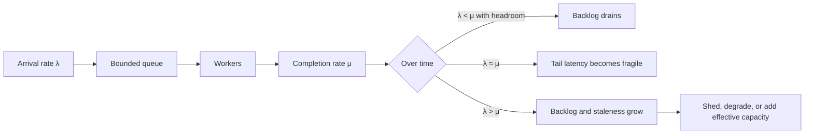
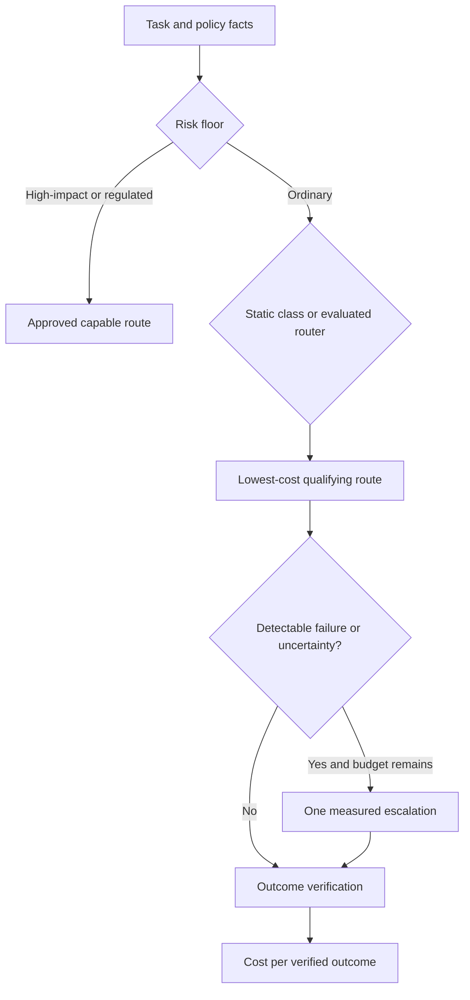
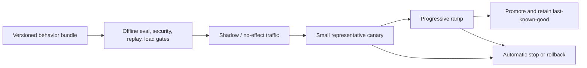

# Research Packet: Production Operations and Agent Architectures

> **Status:** Active research packet  
> **Research date:** 2026-08-30  
> **Scope:** Queues, overload control, retries, capacity, SLOs, model routing, cost and latency, releases, incidents, multi-tenancy, and production control-plane architecture.  
> **Method:** Claims were compared across primary provider documentation, distributed-systems guidance, SRE references, workflow-engine documentation, Kubernetes documentation, and peer-reviewed routing research. Provider limits, product availability, and pricing are volatile and must be rechecked before implementation.

This packet records the evidence and disagreements behind the production-operations guides. It is not a source dump. Its job is to distinguish durable engineering principles from provider-specific mechanisms and benchmark-contingent claims.

## Research questions

1. When does a queue protect an agent platform, and when does it merely hide overload?
2. Which component owns retries, deadlines, admission, and shedding?
3. How should capacity be expressed when model work consumes variable input, output, tool, and human-review resources?
4. Which SLOs describe a useful agent outcome rather than an HTTP response?
5. When does model routing save money without silently reducing task success?
6. What exactly must be versioned, canaried, and rolled back in an agent release?
7. Which control-plane components and isolation boundaries recur across credible production designs?
8. How should interactive and long-running agents share infrastructure without sharing failure modes?

## Finding 1: queues absorb variance; they do not create capacity

Google SRE and the AWS Builders' Library agree on the central overload result: if sustained arrival rate is at least the sustainable completion rate, backlog grows until something fails. A queue converts immediate rejection into delayed work; that can be valuable for bursts, but delay, memory, storage, staleness, and recovery time are real liabilities.

The operationally useful signals are therefore not just queue length:

| Signal | What it reveals | Common blind spot |
|---|---|---|
| Oldest-ready-item age | Whether accepted work is becoming stale | A large queue of fast work can look worse than a small queue of blocked work |
| Schedule latency by class/tenant | User-visible waiting and fairness | A global average conceals starvation |
| Arrival and successful completion rates | Whether backlog can drain | Consumer attempts are not useful throughput |
| Estimated drain time | Recovery horizon after a burst | Assumes service rate remains stable under catch-up load |
| In-flight work and lease age | Saturation and stuck work | Queue depth excludes executing work |
| Retry and redelivery ratio | Amplification and poison work | Retries may be counted as new arrivals |
| Deadline-expired fraction | Work accepted but no longer valuable | Successful completion after deadline is still an SLO failure |

Temporal's task-queue and worker guidance adds an implementation-level lesson: pull-based workers naturally advertise spare capacity, but slot count, pollers, downstream throttles, and workflow-task behavior still determine actual throughput. Multiple partitions and distributed dispatch also weaken intuitive FIFO assumptions. Kubernetes HPA can consume external queue metrics, but a replica controller cannot compensate for provider quotas, tool bottlenecks, cold starts, or a bad per-item service-time distribution.

### Stable conclusion

Use bounded queues to isolate bursts and enable durable scheduling. Admit only work with a plausible completion deadline. Apply backpressure before storage or latency becomes the failure mode, and reserve capacity by workload class or tenant when fairness matters.

### Sources

- [Google SRE: Addressing cascading failures](https://sre.google/sre-book/addressing-cascading-failures/)
- [Google SRE: Service best practices](https://sre.google/sre-book/service-best-practices/)
- [AWS Builders' Library: Avoiding insurmountable queue backlogs](https://aws.amazon.com/builders-library/avoiding-insurmountable-queue-backlogs/)
- [Temporal task queues](https://docs.temporal.io/task-queue)
- [Temporal worker performance](https://docs.temporal.io/develop/worker-performance)
- [Kubernetes horizontal pod autoscaling](https://kubernetes.io/docs/concepts/workloads/autoscaling/horizontal-pod-autoscale/)

## Finding 2: retries are load, and ambiguous effects change the problem

Retries help only when the failure is transient, the next attempt has a useful chance of success, and the system still has time and capacity. Google SRE documents retry amplification across layers; the AWS Builders' Library emphasizes that a timeout does not prove the downstream operation had no effect. Agent systems add long model calls and external tools, so both risks are common.

| Failure class | Default response | Why |
|---|---|---|
| Explicit transient rejection with retry guidance | One owning layer retries with bounded exponential backoff and jitter | The dependency has stated that a later attempt may work |
| Overload or quota exhaustion | Honor `Retry-After`, reduce concurrency, shed low-priority work | Immediate retry worsens the cause |
| Authentication, policy, schema, or spend-cap error | Stop and surface a permanent/configuration failure | Delay does not repair the request |
| Timeout before a read-only result | Retry only inside the remaining deadline and budget | The value of late work declines |
| Timeout around an external write | Reconcile by idempotency key or provider operation ID before retrying | The first attempt may have committed |
| Repeated deterministic model/tool failure | Change input, route, recover, or stop | Repeating the same attempt is not recovery |

OpenAI and Anthropic both publish multiple limit dimensions rather than one simple requests-per-minute number. Limits can be organization-, project-, workspace-, model-, or token-scoped; short bursts can fail even below a minute average. Official SDKs may retry some failures already. Application retries must account for that hidden amplification. Anthropic also documents acceleration limits during sudden ramp-up, while Google Vertex AI distinguishes dynamic shared quota from purchased/provisioned throughput. These details differ, but the architectural conclusion is shared: concurrency control needs a view of the binding resource and the provider response, not a fixed global semaphore.

### Stable conclusion

Assign one retry owner per call chain. Propagate a deadline and attempt budget. Classify failures, honor provider guidance, add jitter, and use a circuit breaker or admission reduction when success probability collapses. External effects require reconciliation and idempotency, not blind replay.

### Sources

- [AWS Builders' Library: Timeouts, retries, and backoff with jitter](https://aws.amazon.com/builders-library/timeouts-retries-and-backoff-with-jitter/)
- [AWS Well-Architected: Limit retries](https://docs.aws.amazon.com/wellarchitected/latest/framework/rel_mitigate_interaction_failure_limit_retries.html)
- [OpenAI rate limits](https://developers.openai.com/api/docs/guides/rate-limits)
- [Anthropic rate limits](https://platform.claude.com/docs/en/api/rate-limits)
- [Google Vertex AI throughput quota](https://docs.cloud.google.com/vertex-ai/generative-ai/docs/resources/throughput-quota)
- [Google Vertex AI HTTP 429 guidance](https://cloud.google.com/vertex-ai/generative-ai/docs/error-code-429)

## Finding 3: capacity is multidimensional and workload-specific

Agent throughput can be limited by model input tokens, generated tokens, requests, concurrent tool sessions, browser/compute sandboxes, database connections, queue partitions, approval operators, or a tenant-specific quota. The binding constraint can change during a run. A single “requests per second” estimate is therefore misleading.

Google's provisioned-throughput guidance explicitly relates capacity to request size, output size, query rate, region, and model version. OpenAI's latency guidance notes that generated tokens are commonly a major latency contributor; reducing input length may have a smaller effect unless the context is very large. Provider documentation also separates online, batch, flexible/best-effort, and provisioned service classes. These mechanisms should be treated as replaceable capacity products, not baked into the architecture.

Capacity planning should maintain workload distributions, not only averages:

- task arrival rate, burst envelope, and tenant skew;
- input/output token percentiles by route and outcome;
- tool fan-out, tool latency, and session duration;
- model and tool retry amplification;
- worker CPU, memory, sandbox, network, and storage occupancy;
- human-approval arrival and service rates;
- success, deadline, and cancellation rates;
- cold-start, failover, and catch-up behavior.

### Stable conclusion

Define separate classes for interactive, background, batch, and effectful work. Model capacity at the scarcest dependency, preserve headroom, and test steady state, spikes, soak, dependency slowdown, noisy-neighbor, and recovery. Autoscale on predictive workload signals and saturation together; never assume adding workers increases provider or human capacity.

### Sources

- [Google Vertex AI: Measure provisioned throughput](https://docs.cloud.google.com/vertex-ai/generative-ai/docs/provisioned-throughput/measure-provisioned-throughput)
- [OpenAI latency optimization](https://developers.openai.com/api/docs/guides/latency-optimization)
- [OpenAI production best practices](https://developers.openai.com/api/docs/guides/production-best-practices)
- [AWS Agentic AI Lens: Concurrent execution](https://docs.aws.amazon.com/wellarchitected/latest/agentic-ai-lens/agentperf02-bp03.html)

## Finding 4: agent SLOs must measure useful outcomes

An HTTP 200 or a completed model response does not show that an agent solved the task, remained within authority, or committed the correct effect. Google SRE's SLO guidance recommends user-centered service-level indicators and burn-rate alerting. Agent services need a small set of operational SLIs plus sampled or delayed quality indicators.

| Outcome dimension | Candidate SLI | Important segmentation |
|---|---|---|
| Admission | accepted or explicitly rejected within a decision target | tenant, priority, workload class |
| Responsiveness | time to first useful progress and time to terminal outcome | interactive versus background |
| Scheduling | ready-to-start latency and oldest eligible age | queue, region, tenant, risk class |
| Completion | deadline-valid terminal completion | task family and dependency route |
| Quality | verified success or rubric pass | evaluator version and confidence |
| Effect safety | authorized effects with verified postconditions; unknown-effect rate | tool, effect type, approval tier |
| Continuity | resumable after interruption without duplicate effect | workflow/version cohort |
| Cost | cost per accepted and per verified-successful task | tenant, task class, route |

Quality often arrives later than latency and availability data. Production dashboards should label provisional success separately from verified success, pin evaluator versions, and watch disagreement or audit sampling. A low error rate can coexist with unacceptable unsafe-effect or abandonment rates.

### Stable conclusion

Start with a handful of task-level SLOs. Use error-budget burn alerts at multiple windows, then attach dependency and component metrics for diagnosis. Never aggregate away tenant, workload, risk, model route, or release cohort when those dimensions control remediation.

### Sources

- [Google SRE Workbook: Implementing SLOs](https://sre.google/workbook/implementing-slos/)
- [Google SRE Workbook: Alerting on SLOs](https://sre.google/workbook/alerting-on-slos/)

## Finding 5: route on measured value, not model prestige or price alone

Official provider guidance generally recommends using a smaller or cheaper model when evaluation shows it meets the quality target. AWS's agent guidance makes the decision more explicit: classify the task, impose quality and risk floors, collect route-level telemetry, and measure cost per useful result. Peer-reviewed routing work explores learned preference routers and cascades.

RouteLLM (ICLR 2025) demonstrates a quality-cost frontier for weak/strong model routing under its benchmark, training data, and model pair. FrugalGPT studies cascades and prompt/model adaptation. LLM-Blender explores ranking and fusing multiple outputs. These works support conditional routing as a valid design space, but their savings figures do not transfer automatically across domains, prices, model versions, tool use, or hidden safety failures.

Important limitations:

- A router cannot escalate failures it cannot detect; model confidence is frequently uncalibrated.
- The routing decision itself adds latency, cost, and a new failure surface.
- Tool schemas, structured-output behavior, context capacity, data policy, and provider capabilities may make models non-interchangeable.
- Learned routers drift when task mix, model versions, prompting, or user behavior changes.
- Routing only successful labels back into training creates feedback loops and hides counterfactual quality.
- Ensembles multiply calls and usually conflict with latency and cost goals; they are a specialized quality strategy, not the default.
- Provider failover is an availability mechanism. It must not silently change safety, retention, region, or effect semantics.

### Stable conclusion

Begin with explicit task and risk rules. Route to the least expensive configuration that passes a versioned evaluation gate; escalate once only when a detectable signal and remaining deadline justify it. Shadow-test changes and optimize cost per verified outcome, not price per call.

### Sources

- [RouteLLM, ICLR 2025](https://proceedings.iclr.cc/paper_files/paper/2025/file/5503a7c69d48a2f86fc00b3dc09de686-Paper-Conference.pdf)
- [RouteLLM repository](https://github.com/lm-sys/RouteLLM)
- [FrugalGPT](https://arxiv.org/abs/2305.05176)
- [LLM-Blender, ACL 2023](https://aclanthology.org/2023.acl-long.792/)
- [AWS Agentic AI Lens: Dynamic model selection](https://docs.aws.amazon.com/wellarchitected/latest/agentic-ai-lens/agentcost02-bp01.html)
- [AWS Agentic AI Lens: Complexity-based routing](https://docs.aws.amazon.com/wellarchitected/latest/agentic-ai-lens/agentperf02-bp02.html)
- [OpenAI cost optimization](https://developers.openai.com/api/docs/guides/cost-optimization)

## Finding 6: caching, batch, and low-priority service classes are economic policies

Prompt caching is valuable when a long, stable prefix is reused. Anthropic's cache documentation exposes an important failure mode: a changing value placed before a breakpoint can cause writes without later reads. Cache-hit rate alone is insufficient; measure eligible tokens, write/read ratio, eviction/TTL behavior, latency, correctness across versions, and the cost of cache invalidation.

Provider batch APIs commonly offer separate capacity or lower prices in exchange for asynchronous completion. OpenAI's current Batch guide advertises a separate limit pool and lower cost with a completion window; Anthropic also documents asynchronous batches whose results may be out of order and should be joined by a caller-supplied identifier. OpenAI Flex and analogous service tiers exchange latency/availability for price. Exact discounts, model support, queue limits, and completion windows are current product facts and should be linked rather than hard-coded into architecture decisions.

### Stable conclusion

Choose an execution class from the user's deadline and business value. Keep interactive traffic out of batch backlogs, and move deferrable evaluations, enrichment, and maintenance to batch or lower-priority capacity. Structure cacheable prefixes deliberately and prove actual read economics.

### Sources

- [Anthropic prompt caching](https://platform.claude.com/docs/en/build-with-claude/prompt-caching)
- [Anthropic batch processing](https://platform.claude.com/docs/en/build-with-claude/batch-processing)
- [Anthropic service tiers](https://platform.claude.com/docs/en/api/service-tiers)
- [OpenAI Batch](https://developers.openai.com/api/docs/guides/batch)
- [OpenAI Flex processing](https://developers.openai.com/api/docs/guides/flex-processing)
- [OpenAI pricing](https://developers.openai.com/api/docs/pricing)

## Finding 7: an agent release is a behavioral bundle

Prompt, model snapshot or alias, tool contract, authorization policy, router, memory/compaction policy, evaluator, workflow graph, and runtime settings can each change behavior. Releasing only application code under a version leaves the actual production system unauditable.

Google SRE's canary guidance requires a control population, representative traffic, enough volume and duration, and both absolute SLO and relative comparisons. Shared dependencies can contaminate a canary. Asynchronous systems are harder: an artifact can be produced now and cause an external effect later, so dry-run, proposal-only, or two-phase evaluation may be required. Temporal worker versioning shows the long-running-workflow implication: existing runs may need to remain pinned while new runs ramp to a new version, with a fast rollback path.

Rollback is not always a binary deployment switch. Schema changes, in-flight plans, memory writes, external effects, and queued work can cross versions. Release design must state whether to finish, migrate, quarantine, or compensate every in-flight cohort.

### Stable conclusion

Create an immutable release manifest for the whole behavior bundle. Gate it with task-level evaluations, security checks, replay and load evidence; shadow or disable effects; canary representative traffic; ramp with cohort-aware telemetry; preserve last-known-good configuration; and rehearse rollback for both new and in-flight runs.

### Sources

- [Google SRE Workbook: Canarying releases](https://sre.google/workbook/canarying-releases/)
- [Temporal worker versioning](https://docs.temporal.io/production-deployment/worker-deployments/worker-versioning)
- [AWS Agentic AI Lens: Versioning and rollback](https://docs.aws.amazon.com/wellarchitected/latest/agentic-ai-lens/agentops02-bp03.html)
- [AWS Agentic AI Lens: CI/CD quality gates](https://docs.aws.amazon.com/wellarchitected/latest/agentic-ai-lens/agentops03-bp02.html)
- [AWS Agentic AI Lens: Versioned configuration](https://docs.aws.amazon.com/wellarchitected/latest/agentic-ai-lens/agentrel08-bp01.html)

## Finding 8: incident control must include effects and autonomy

Google SRE recommends declaring incidents early, assigning command/operations/communications roles, maintaining a working log, mitigating impact before perfect diagnosis, and producing a blameless postmortem. Agent platforms need additional containment controls because an unhealthy system may continue making tool calls or modifying memory even while serving superficially successful responses.

Minimum containment controls include:

- stop admission of new runs by tenant, workflow, route, or region;
- pause or drain specific queues;
- disable an unsafe tool, write class, model route, or protocol peer;
- switch effectful work to propose-only or approval-required mode;
- freeze memory writes while preserving reads and forensic evidence;
- cap fan-out, tool calls, tokens, retries, and concurrency;
- route to a known safe degraded behavior;
- identify and reconcile ambiguous or partially committed external effects.

### Stable conclusion

Design kill switches, queue controls, evidence capture, effect reconciliation, and rollback before the incident. Operators need immutable run/version lineage and a way to distinguish intended, attempted, acknowledged, verified, and unknown effects.

### Sources

- [Google SRE Workbook: Incident response](https://sre.google/workbook/incident-response/)
- [Google SRE: Postmortem culture](https://sre.google/sre-book/postmortem-culture/)

## Finding 9: the recurring production shape is control plane plus isolated execution cells

Across workflow engines, cloud multi-tenant guidance, provider gateways, and agent-specific operational guidance, the reusable architecture is not a single “agent server.” It separates policy and configuration from the execution path, and isolates failures into cells.

| Plane or layer | Owns | Must not become |
|---|---|---|
| Identity and admission | tenant, user, workload class, quota, deadline, policy preconditions | a pass-through API that admits unfinishable work |
| Workflow control | durable run state, scheduling, timers, retries, cancellation, version pin | the owner of domain effects it cannot verify |
| Model gateway | provider/model route, rate budget, cache, request telemetry, policy compatibility | a hidden behavioral router without evaluation lineage |
| Tool gateway | contracts, credentials, authorization, effect identifiers, throttles | a generic proxy that turns model text into ambient authority |
| State services | authoritative run state, artifacts, context, memory, effect ledger | one mutable transcript used as every source of truth |
| Approval and event delivery | human decisions, streaming events, notifications, resumptions | an ephemeral socket that loses durable outcomes |
| Evaluation and operations | traces, SLOs, releases, flags, kill switches, audit | an off-path dashboard unable to contain harm |

AWS's SaaS and Agentic AI guidance emphasizes tenant-aware telemetry and throttling at API, inference, memory, and tool layers. Kubernetes documents the isolation spectrum from namespaces and quotas to sandboxing, dedicated nodes, or clusters; namespaces alone do not create strong tenant isolation. Cell or shard assignment limits blast radius and noisy neighbors, but creates routing, rebalancing, and capacity-fragmentation costs.

### Stable conclusion

Separate the control plane from tenant execution. Use a durable run identity across queues, models, tools, artifacts, approvals, and evaluations. Enforce tenant and workload budgets at every scarce layer. Choose pooled, sandboxed, node-isolated, or dedicated cells according to threat, compliance, and noisy-neighbor risk—not merely customer tier.

### Sources

- [Kubernetes multi-tenancy](https://kubernetes.io/docs/concepts/security/multi-tenancy/)
- [AWS SaaS Lens foundations](https://docs.aws.amazon.com/wellarchitected/latest/saas-lens/foundations.html)
- [AWS Agentic AI Lens: Multi-tenant scaling](https://docs.aws.amazon.com/wellarchitected/latest/agentic-ai-lens/agentperf07.html)
- [AWS Agentic AI Lens: Tenant-aware throttling](https://docs.aws.amazon.com/wellarchitected/latest/agentic-ai-lens/agentperf07-bp02.html)
- [AWS Agentic AI Lens: Asynchronous execution](https://docs.aws.amazon.com/wellarchitected/latest/agentic-ai-lens/agentperf04-bp01.html)

## Disagreements and conditional decisions

| Question | Evidence-backed answer | Why there is no universal choice |
|---|---|---|
| FIFO or priority scheduling? | Prefer explicit classes plus fairness; preserve FIFO only within a class when ordering is meaningful | Strict priority can starve; global FIFO lets bulk or poison work block urgent tasks |
| Autoscale on queue depth or age? | Use age/deadline pressure with arrival, service, saturation, and downstream quota signals | Depth ignores service-time variance; age alone can overreact to one stuck item |
| Retry locally or centrally? | One layer must own the end-to-end attempt budget; a dependency client may implement the mechanical backoff | Provider SDK retries are useful but become dangerous when every layer adds its own loop |
| Static or learned model router? | Static evaluated rules first; learned routing only with enough representative labels, cheap inference, drift controls, and exploration | Benchmarks show opportunity, not domain transfer |
| Canary or blue/green? | Canary for gradual evidence; blue/green for rapid environment swap; both need behavior-version and in-flight-run strategy | Long-running runs and external effects cannot be rolled back like stateless HTTP code |
| Shared pool or dedicated tenant capacity? | Pool ordinary low-risk traffic; isolate by cell, node, account, or cluster as threat and noisy-neighbor risk rise | Strong isolation increases cost and stranded capacity |
| Online, batch, flexible, or provisioned model capacity? | Match the service class to deadline, predictability, and unit economics | Availability, pricing, supported models, and capacity guarantees vary by provider and date |

## Claims deliberately excluded

- Universal percentage savings for any learned router, prompt cache, batch API, or smaller model.
- A fixed provider limit, price, discount, model list, or completion window as an architectural invariant.
- “Exactly once” external effects without a domain-specific idempotency and reconciliation protocol.
- Queue depth alone as an autoscaling policy.
- CPU utilization alone as agent-capacity evidence.
- Model self-confidence alone as an escalation or safety signal.
- A single availability SLO as proof of agent usefulness or safety.
- Namespaces alone as strong multi-tenant isolation.
- Automatic provider failover without a policy, compatibility, and data-governance review.
- A canary that exercises real irreversible effects without a bounded exposure and reconciliation design.

## Derived guide set

This packet supports:

- [Queues, scheduling, and backpressure](../../operations/queues-scheduling-and-backpressure.md)
- [Model routing, cost, and latency](../../operations/model-routing-cost-and-latency.md)
- [Scaling, capacity, and SLOs](../../operations/scaling-capacity-and-slos.md)
- [Deployment, release, and incident response](../../operations/deployment-release-and-incident-response.md)
- [Production agent control plane](../../architectures/production-agent-control-plane.md)
- [Interactive and long-running reference architectures](../../architectures/interactive-and-long-running-reference-architectures.md)

## Refresh triggers

Refresh this packet when any of the following changes materially:

- provider rate-limit, batch, service-tier, prompt-caching, provisioned-throughput, or pricing behavior;
- model routing benchmarks use representative tool-using or high-impact agent tasks rather than mostly static prompts;
- a referenced workflow engine changes task-queue or worker-version semantics;
- release systems add or remove behavior-version, shadow, effect-dry-run, or in-flight migration capabilities;
- multi-tenant platform guidance changes isolation or data-residency requirements;
- production incident evidence reveals a new retry, queue, routing, or external-effect failure mode.

## Research quality note

Primary sources establish mechanisms and durable systems principles; they do not prove that a particular configuration fits every workload. The routing papers are useful evidence of possible cost-quality frontiers, but their numeric results are experimental and distribution-specific. AWS's Agentic AI Lens is a current vendor-authored design framework and was cross-checked against Google SRE, Kubernetes, Temporal, provider documentation, and peer-reviewed research before its recommendations were generalized.
