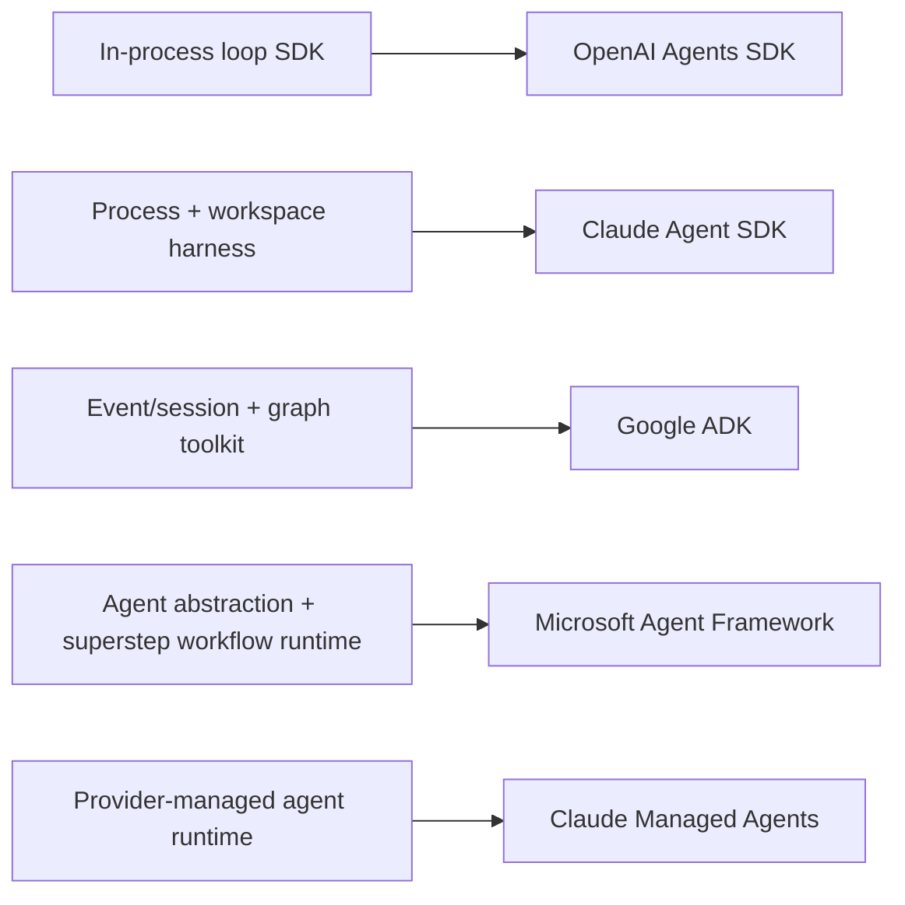
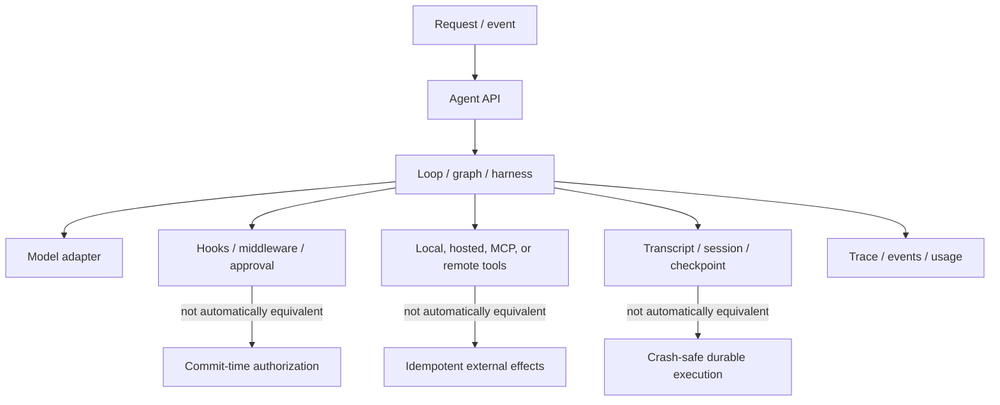

# Provider-Native Agent Frameworks — Research Packet

**Research date:** 2026-08-30  
**Status:** Research-backed synthesis  
**Scope:** OpenAI Agents SDK, Claude Agent SDK and Claude Managed Agents, Google Agent Development Kit (ADK), and Microsoft Agent Framework  
**Freshness:** Recheck quarterly, before adoption, and on any major runtime, persistence, approval, or deployment release

## Research question

What does each provider-native framework actually own, which production guarantees remain application responsibilities, and which workload shape makes its coupling worthwhile?

This packet does not rank vendors by feature count. It compares runtime boundaries: loop ownership, execution location, state authority, pause/resume semantics, tool policy, observability, portability, and operational burden.

## Category correction

“Agent framework” currently covers materially different systems.

The closest substitute for a framework may therefore be a custom loop, a durable workflow engine, or a managed agent service—not another item in the table.

## Evidence method

Research covered current official documentation, repositories, changelogs, implementation references, issue/discussion reproductions, deployment guidance, and provider engineering reports. Issue reports are used as bounded failure evidence, never as prevalence estimates. Marketing performance claims were excluded unless the underlying setup and limitation were useful.

The comparison deliberately tests three kinds of evidence:

1. **Documented contract:** what the maintainer says the API guarantees.
2. **Implementation/release evidence:** how state, cancellation, replay, telemetry, and migrations actually work.
3. **Failure evidence:** reproducible gaps at deployment seams, especially approval, restart, concurrency, and adapter boundaries.

## Current ecosystem snapshot

| System | Real abstraction | Languages in the primary surface | State/resume center | Deployment center | Snapshot maturity signal |
|---|---|---|---|---|---|
| OpenAI Agents SDK | Lightweight agent runner plus tools, handoffs, guardrails, sessions, tracing, and newer sandbox harnesses | Python and TypeScript | Client session, OpenAI continuation, or serializable interrupted `RunState`; these must not be conflated | Application-owned process; optional durable-runtime and sandbox integrations | Fast-moving pre-1.0 Python and TypeScript release lines; capabilities differ by language/release |
| Claude Agent SDK | Claude Code-derived harness controlling a bundled CLI subprocess, workspace, tools, hooks, and transcripts | Python and TypeScript | Disk transcript plus optional external `SessionStore`; filesystem state is separate | Long-lived subprocess and local workspace that the application must isolate and schedule | Production guidance exists, but language parity and durable approval behavior remain uneven |
| Claude Managed Agents | Provider-managed, stateful agent harness and sandbox service | Anthropic client SDK surface across several languages | Server-side session, events, sandbox, and outputs | Anthropic cloud sandbox or self-hosted hands | Beta; stateful retention currently changes ZDR/HIPAA eligibility |
| Google ADK | Multi-language agent toolkit plus event-sourced session services and ADK 2 graph workflows | Python, TypeScript, Go, Java, Kotlin with feature-specific parity | Session event history, state deltas, invocation IDs, and workflow rehydration | Self-hosted containers, Cloud Run/GKE, or managed Agent Runtime | Broad and rapidly evolving; 1.x agent and 2.x workflow surfaces require precise version tests |
| Microsoft Agent Framework | Provider-neutral agent abstraction, middleware, context providers, orchestrations, and superstep workflows | C#, Python, Go; capability parity varies | Agent sessions plus workflow checkpoints at superstep boundaries | Self-hosting, Foundry hosting, and durable integrations | Core has GA releases; individual packages/features retain stable, RC, preview, or experimental labels |

## Cross-framework architecture

Every candidate packages the middle differently. None eliminates the need to prove the three dashed boundaries.

## OpenAI Agents SDK findings

### What it owns well

The SDK makes `Agent` plus `Runner` the in-process loop boundary. It packages model calls, function/hosted/MCP tools, agents-as-tools, handoffs, structured outputs, lifecycle hooks, usage, human approval, and tracing. The OpenAI Responses path is the default; non-OpenAI adapters exist but are described as best-effort beta layers with feature-dependent behavior.

Session ownership is unusually explicit. A run may use client-managed session history or OpenAI-managed continuation (`conversation_id` / `previous_response_id`), but not both. Python offers local, Redis, SQLAlchemy, MongoDB, Dapr, encrypted, and compaction session variants. Automatic compaction can extend the apparent end of a streamed run and performs a recoverable clear-and-rewrite, so concurrent mutation remains a design hazard.

Approval interruptions can serialize `RunState`, including approvals, usage, nested agent-tool resumptions, trace metadata, and application context. The docs correctly warn that serialized context can contain secrets and that long-lived pending work should carry an agent/SDK version marker. Durable integrations are available for Dapr, Temporal, and Restate; the base runner alone should not be advertised as a crash-safe workflow engine.

Tracing covers model generations, tools, handoffs, and guardrails by default, can export through custom processors, and is unavailable under OpenAI Zero Data Retention. Sensitive-payload suppression does not sanitize arbitrary exceptions, logs, or custom telemetry.

### Production boundaries

- Agent input/output guardrails run only at workflow endpoints; function-tool guardrails cover each eligible call. Hosted tools, built-in execution tools, handoffs, and agents-as-tools do not all pass through the same tool-guardrail pipeline.
- Parallel input guardrails reduce latency but may trigger after tokens or side effects have already started. Blocking mode is required when “must not begin” is the policy.
- The SDK occurrence/retry logic is not a downstream exactly-once guarantee. Tool writes still require application operation IDs and reconciliation.
- Python and TypeScript versions and features move independently. At the snapshot, the release streams are still pre-1.0, and Python received the new sandbox/harness surface first.
- Current issue history shows why resume, tracing, and session concurrency need integration tests. Treat issue reports as test-case seeds, not proof that all deployments fail.

Primary evidence: [Agents](https://openai.github.io/openai-agents-python/agents/), [running agents](https://openai.github.io/openai-agents-python/running_agents/), [sessions](https://openai.github.io/openai-agents-python/sessions/), [human in the loop](https://openai.github.io/openai-agents-python/human_in_the_loop/), [guardrails](https://openai.github.io/openai-agents-python/guardrails/), [tracing](https://openai.github.io/openai-agents-python/tracing/), [model/provider caveats](https://openai.github.io/openai-agents-python/models/), [Python releases](https://openai.github.io/openai-agents-python/release/), [TypeScript changelog](https://github.com/openai/openai-agents-js/blob/main/packages/agents/CHANGELOG.md), and [April 2026 sandbox evolution](https://openai.com/index/the-next-evolution-of-the-agents-sdk/).

## Claude Agent SDK and Managed Agents findings

### Agent SDK: a harness process, not a thin API wrapper

The Agent SDK exposes the tool loop and context machinery behind Claude Code. It spawns and supervises a bundled `claude` CLI subprocess that owns a shell, working directory, and local session files. This brings ready-made filesystem, editing, shell, web, MCP, skills, compaction, subagents, and permission behavior—but also makes process isolation, resource sizing, egress, and workspace lifecycle first-class deployment concerns.

The permission pipeline is ordered: hooks, deny rules, permission mode, allow rules, then `canUseTool`. `allowed_tools` is an auto-approval list, not an availability allowlist; combining it with `bypassPermissions` still approves unlisted tools. A locked-down headless configuration requires explicit denies or `dontAsk`. Some parent permission modes are inherited by subagents, so a broad root mode can silently broaden delegated authority.

Sessions persist transcripts, not the filesystem. The external `SessionStore` mirrors local JSONL for cross-host resume, but the documented write path is best-effort: a failed mirror emits `mirror_error`, drops that batch, and continues. Working-directory identity affects lookup. Production recovery therefore needs alerting, transcript conformance tests, and separate artifact/workspace persistence.

Python and TypeScript differ in hook availability, stateless session options, deferred approvals, and cancellation surfaces. Current issue reproductions include pending approval that cannot be recovered after pod loss, callback-hook ordering on resume, hook dispatch ambiguity, and subprocess/session reuse friction. These are especially relevant to multi-pod interactive services.

### Managed Agents: a different operational product

Claude Managed Agents moves the loop, event history, and sandbox lifecycle to a managed service. Agents are versioned; environments are reusable but not versioned; each session receives an isolated sandbox. The service supports event streaming, steering, interrupting, custom-tool callbacks, budgets, web/MCP tools, and cloud or self-hosted hands.

It is not merely “hosted Agent SDK.” Custom tools execute in the client, while built-in tools execute in the session sandbox; retention, session lifecycle, networking, and failure recovery have service-specific contracts. At this snapshot it is beta and stateful sessions are not eligible for ZDR or HIPAA BAA coverage. A managed-vs-self-hosted choice must therefore precede an SDK choice.

Primary evidence: [Agent SDK overview](https://code.claude.com/docs/en/agent-sdk/overview), [agent loop](https://code.claude.com/docs/en/agent-sdk/agent-loop), [permissions](https://code.claude.com/docs/en/agent-sdk/permissions), [hooks](https://code.claude.com/docs/en/agent-sdk/hooks), [sessions](https://code.claude.com/docs/en/agent-sdk/sessions), [external session storage](https://code.claude.com/docs/en/agent-sdk/session-storage), [hosting](https://code.claude.com/docs/en/agent-sdk/hosting), [cost tracking](https://code.claude.com/docs/en/agent-sdk/cost-tracking), [Managed Agents overview](https://platform.claude.com/docs/en/managed-agents/overview), [migration](https://platform.claude.com/docs/en/managed-agents/migration), and [containment engineering report](https://www.anthropic.com/engineering/how-we-contain-claude). Failure-test leads: [durable multi-pod approval gap](https://github.com/anthropics/claude-agent-sdk-python/issues/871), [deferred-resume hook ordering](https://github.com/anthropics/claude-agent-sdk-python/issues/993), and [hook concurrency ambiguity](https://github.com/anthropics/claude-agent-sdk-python/issues/910).

## Google ADK findings

ADK separates `Session`, scoped key/value `State`, searchable `Memory`, `ArtifactService`, and the `Runner` that yields events. State changes should flow through context/event deltas; direct mutation of a fetched session bypasses event tracking. Persistence varies by service, and the in-memory implementation is not a production substitute.

ADK 2 `Workflow` adds graph edges, conditional routing, parallel nodes, joins, dynamic nodes, bounded static concurrency, human-input interruptions, and rehydration from session history. Resume scans prior events, reconstructs completed nodes, and deterministically replays scheduling up to the interruption. That is stronger than transcript continuation, but it also makes event isolation and replay compatibility critical.

Plugins apply runner-wide lifecycle interception before agent callbacks and are a natural place for policy and telemetry. Deployment options range from ordinary containers through Cloud Run/GKE to managed Agent Runtime. Broad language availability is a major strength, but every capability page carries its own support matrix; “ADK supports five languages” does not mean identical workflow, storage, observability, and deployment behavior.

Production evidence suggests three mandatory tests: serialize or reject concurrent turns per session; cancel while tools and streams are active; and replay multiple invocations with human-input interruptions after an upgrade. A July 2026 ADK 2.5.0 reproduction showed replay mixing prior invocation events, while historical discussion documented same-session state races. These are version-specific signals to pin and test, not permanent architectural verdicts.

Primary evidence: [ADK](https://adk.dev/), [sessions](https://adk.dev/sessions/), [state](https://adk.dev/sessions/state/), [plugins](https://adk.dev/plugins/), [observability](https://adk.dev/observability/), [deployment](https://adk.dev/deploy/), [ADK 2 workflow implementation guide](https://github.com/google/adk-python/blob/main/docs/guides/workflow/workflow/index.md), [runner architecture](https://github.com/google/adk-python/blob/main/.agents/skills/adk-architecture/references/interfaces/runner.md), [replay regression #6497](https://github.com/google/adk-python/issues/6497), and [same-session concurrency discussion #790](https://github.com/google/adk-python/discussions/790).

## Microsoft Agent Framework findings

Microsoft Agent Framework combines a provider-neutral agent interface with model/remote-agent clients, middleware, context providers, session state, multi-agent orchestrations, and explicit graph workflows. It is the successor direction to AutoGen and Semantic Kernel agent work; new selection guidance should start here while treating migrations as workload-specific.

Workflows run in supersteps. A checkpoint at a completed superstep captures executor state, next-step messages, pending requests/responses, and shared state. Human requests are re-emitted after restore. This makes the checkpoint boundary inspectable, but it does not make arbitrary tool effects transactional, and mid-superstep work may still need reconciliation.

Middleware exists at agent-run, streaming, function, and chat-client layers. Terminating function middleware can leave a call without its result in history, so short-circuit behavior must preserve transcript invariants. The framework supports multiple providers and remote agent types, which improves architectural portability; actual capability parity still depends on each provider client.

The Python 1.13.0 changelog illustrates both maturity and churn: stable orchestrations coexist with breaking checkpoint/event changes and experimental harness surfaces. Open issues show gaps at nested-tool approval, checkpoint resume with new input, handoff restore, and AG-UI checkpoint exposure. Pin package families together and run contract tests across the exact adapter path, not only the core workflow.

Primary evidence: [overview](https://learn.microsoft.com/en-us/agent-framework/overview/), [agent concepts](https://learn.microsoft.com/en-us/agent-framework/concepts/agents/), [workflows](https://learn.microsoft.com/en-us/agent-framework/concepts/workflows/), [checkpoints](https://learn.microsoft.com/en-us/agent-framework/workflows/checkpoints), [human in the loop](https://learn.microsoft.com/en-us/agent-framework/workflows/human-in-the-loop), [middleware](https://learn.microsoft.com/en-us/agent-framework/agents/middleware/), [Python changelog](https://github.com/microsoft/agent-framework/blob/main/python/CHANGELOG.md), [durable workflow engineering guide](https://devblogs.microsoft.com/dotnet/durable-workflows-in-microsoft-agent-framework/), and [self-hosting](https://learn.microsoft.com/en-us/agent-framework/hosting/self-hosting/). Failure-test leads: [nested approval #4158](https://github.com/microsoft/agent-framework/issues/4158), [handoff checkpoint restore #5621](https://github.com/microsoft/agent-framework/issues/5621), and [AG-UI checkpoint gap #6632](https://github.com/microsoft/agent-framework/issues/6632).

## Decision matrix

| Need | Strong starting candidate | Why | Required proof before adoption |
|---|---|---|---|
| Small OpenAI-first in-process loop | OpenAI Agents SDK | Thin runner, native Responses/tools/tracing, explicit handoffs and interruptions | Language parity, retry occurrence, session concurrency, guardrail coverage |
| Autonomous filesystem/shell worker on infrastructure you control | Claude Agent SDK | Mature opinionated harness and built-in workspace tools | Subprocess density, sandbox/egress, mirror durability, approval recovery |
| Managed long-horizon Claude task | Claude Managed Agents | Server-managed loop, events, stateful sandbox, budget | Beta fit, retention/compliance, environment version ledger, custom-tool recovery |
| Broad language/platform alignment and Google deployment | Google ADK | Service interfaces, events, graph workflows, many deployment targets | Per-language parity, session serialization, upgrade replay, cancellation |
| Provider-neutral enterprise .NET/Python/Go with explicit workflows | Microsoft Agent Framework | Middleware, model-client abstraction, superstep checkpoints, Microsoft hosting ecosystem | Package maturity, adapter parity, checkpoint schema migration, nested approvals |
| Strong portability across all providers | Thin custom domain layer above any candidate | Keeps business state, tool contracts, policy, evals, and effects independent | Exit test that replays the same fixtures through a second adapter |

## Saturation findings

Additional research stopped changing the main recommendations once these patterns repeated:

- Conversation persistence is not durable execution.
- A serializable pause is not safe effect replay.
- Tool approval is not authorization, and a framework “allow list” may only mean auto-approval.
- Provider-neutral model interfaces flatten syntax more reliably than semantics.
- Language parity claims must be checked per feature and version.
- Managed infrastructure moves operational work; it also introduces retention, portability, and service-lifecycle constraints.
- Issue trackers are most useful for designing adversarial adoption tests at boundary seams.

## Excluded or downgraded claims

- Star counts, vendor “production-ready” labels, and unscoped benchmark wins were not used for selection.
- Framework examples using in-memory session stores were not treated as deployment guidance.
- AutoGen or Semantic Kernel agent tutorials were not treated as the default Microsoft path without migration context.
- A framework’s durable integration was not rephrased as durability of its core runner.
- Cross-provider adapters were not assumed to preserve hosted tools, structured output, usage, retries, or streaming semantics.

## Refresh triggers

- OpenAI Agents SDK Python or TypeScript 1.0, or a change to session/RunState/sandbox semantics.
- Claude Agent SDK session-store delivery guarantee, durable deferred approvals, process model, or language parity changes.
- Claude Managed Agents leaves beta or changes retention/compliance, sandbox, event, or budget semantics.
- ADK workflow replay, session locking, cancellation, or language matrices change.
- Microsoft Agent Framework checkpoint format, package stability, AutoGen/Semantic Kernel migration position, or adapter feature contracts change.

## Guides supported by this packet

- [Selecting a provider-native agent framework](../../comparisons/provider-native-agent-frameworks.md)
- [OpenAI Agents SDK](../../frameworks/openai-agents-sdk.md)
- [Claude Agent SDK and Managed Agents](../../frameworks/claude-agent-sdk-and-managed-agents.md)
- [Google Agent Development Kit](../../frameworks/google-adk.md)
- [Microsoft Agent Framework](../../frameworks/microsoft-agent-framework.md)
