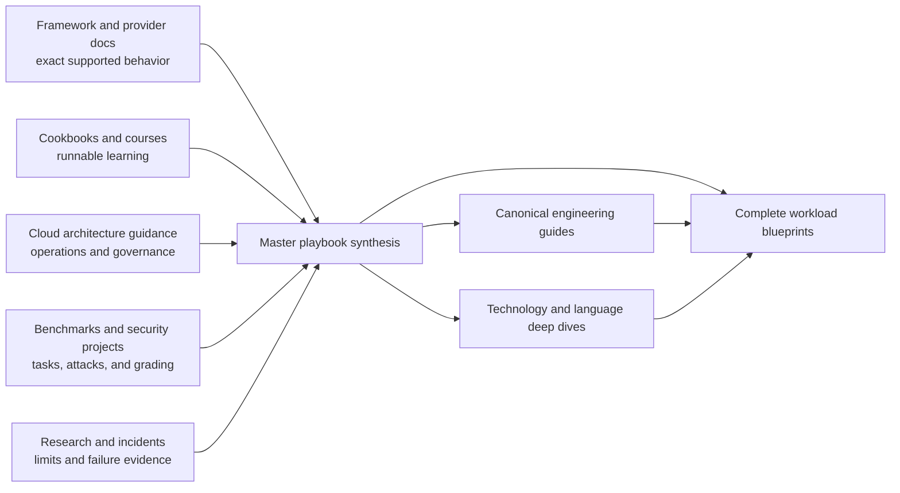
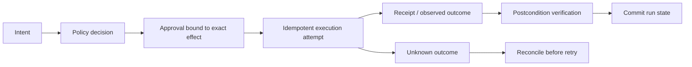

# Public Agent-Engineering Documentation Landscape — Research Packet

> **Status:** Research-backed ecosystem benchmark  
> **Research date:** 2026-08-31  
> **Evidence window:** Public material inspected on 2026-08-31; product, repository, benchmark, and standards status is volatile  
> **Scope:** Framework documentation, provider cookbooks and samples, educational repositories, independent handbooks, cloud reference architectures, evaluation environments, security guidance, observability conventions, and discovery lists  
> **Purpose:** Identify useful gaps this repository can fill without treating raw file count, stars, or marketing claims as quality evidence

## Executive finding

The public ecosystem does not have one obvious, durable winner across agent concepts, implementation, production operations, security, evaluation, language-specific engineering, and workload-specific system design. It has several strong **specialists**:

- framework documentation is usually the best source for exact APIs and intended runtime behavior;
- provider cookbooks and sample repositories are usually the fastest route to working code;
- courses are usually better at progressive learning and exercises;
- cloud architecture centers are usually stronger on governance, deployment, security, and operational checklists;
- benchmark repositories are usually stronger on reproducible tasks and environment-state grading;
- security projects are usually stronger on threat taxonomies and control coverage;
- independent handbooks and tutorial repositories are usually broader and easier to browse across vendors;
- awesome lists are useful discovery indexes, but rarely provide enough evidence for an engineering decision.

The recurring gap is **integration**. A developer still has to join these sources manually to answer a practical question such as:

> How should I build, authorize, evaluate, deploy, recover, and operate a database-operations agent, in my language and risk environment, using either a custom loop, an SDK, or a durable hybrid?

That is the strongest differentiation opportunity for this repository. It should not try to out-copy official API references or out-list discovery catalogs. It should connect exact technology mechanics to framework-neutral production invariants and then apply both to complete, workload-specific agent blueprints.

## Research questions

This benchmark asked:

1. What public resources currently teach agent engineering well?
2. Which layer does each resource own, and what does it deliberately or implicitly leave to the reader?
3. Which gaps remain after combining major framework docs, examples, courses, architecture guidance, security material, and benchmarks?
4. Which real-world agent categories have enough distinct architecture, authority, state, and evaluation concerns to justify dedicated playbooks?
5. How can this repository measure progress without making unverifiable “largest” or “best” claims?

## Method and evidence limits

The review sampled current materials from each major resource class. Primary and project-owned sources were preferred: official documentation, official repositories, standards bodies, project repositories, and benchmark repositories. Independent tutorial repositories and handbooks were included because they are direct comparators for organization and teaching style, not because their self-descriptions prove production quality. Awesome lists were used only to discover categories and projects.

For each resource, the review looked for the following dimensions:

| Dimension | Evidence sought |
|---|---|
| Audience and learning path | Clear prerequisites, reader routes, progressive difficulty, and useful exercises |
| Runtime and state precision | Loop ownership, events, persistence, replay, cancellation, concurrency, and effects |
| Technology specificity | Versioned behavior, package/product boundaries, actual limitations, and migration status |
| Production operations | Deployment, scaling, admission, SLOs, releases, incidents, repair, and cost |
| Security | Identity, permissions, prompt injection, sandboxing, secrets, tenancy, audit, and destructive effects |
| Evaluation | Representative tasks, environment-state checks, trajectory analysis, security tests, and regression workflow |
| Workload completeness | One real agent type carried from requirements through architecture, implementation, hardening, and operations |
| Decision support | Custom versus framework versus hybrid paths; when not to use an agent or multi-agent design |
| Evidence and freshness | Direct sources, dates or versions, changelogs, caveats, and refresh mechanisms |
| Documentation usability | Navigation, diagrams, comparisons, checklists, cross-links, and maintenance boundaries |

This is a representative benchmark, not a census. A missing topic in the sampled public surface does not prove that no page, issue, course, or commercial document covers it. Vendor-authored material establishes product behavior and intended usage, but does not independently validate performance or production outcomes. Repository READMEs describe scope; they do not prove that every child artifact meets that scope. Benchmark scores measure the benchmark distribution and harness, not universal production quality.

## Landscape by resource class

The labels below describe the **typical strength of the sampled class**, not a ranking of individual projects. “Variable” means the class contains both excellent and shallow examples.

| Resource class | API/runtime precision | Progressive learning | Production operations | Security/failure depth | Reproducible evaluation | Cross-vendor decisions | Complete workload blueprints |
|---|---:|---:|---:|---:|---:|---:|---:|
| Official framework/SDK docs | High | Medium–high | Variable | Variable | Medium | Low | Low–medium |
| Provider cookbooks and samples | High for shown path | High | Low–medium | Low–medium | Medium | Low | Medium for one stack |
| Courses and beginner repositories | Medium | High | Low–medium | Low | Low–medium | Medium | Low |
| Cloud architecture/prescriptive guidance | Medium | Medium | High | High | Medium | Low–medium | Medium–high |
| Domain reference workflows/blueprints | Medium–high | Medium | Medium–high | Variable | Low–medium | Low | High for selected domains |
| Independent handbooks/tutorial repos | Variable | High | Variable | Variable | Variable | High | Variable |
| Benchmark and eval environments | Low outside harness | Medium | Low | High for measured failures | High | High | Narrow by design |
| Standards/security projects | Low | Medium | Medium–high | High | Medium | High | Low |
| Awesome/discovery lists | Low | Low | Low | Low | Low | Medium for discovery | Low |

### 1. Official framework and SDK documentation

The best official documentation has grown far beyond a quickstart:

- [LangGraph’s overview](https://docs.langchain.com/oss/python/langgraph/overview) explicitly separates LangChain, LangGraph, Deep Agents, LangSmith observability, and deployment. Its documentation is strong on the graph runtime’s intended durability, streaming, human-in-the-loop, and stateful execution model.
- The [OpenAI Agents SDK documentation](https://openai.github.io/openai-agents-python/) routes readers through agents, tools, sessions, handoffs, human-in-the-loop, tracing, testing, realtime, sandbox agents, and provider boundaries. It also distinguishes using the SDK from directly owning the Responses API loop.
- [Pydantic AI’s documentation](https://pydantic.dev/docs/ai/overview/) exposes typed tools and outputs, providers, context control, evals, OpenTelemetry instrumentation, durable-runtime adapters, harness capabilities, and workload examples in one navigable surface.
- [Google ADK documentation](https://google.github.io/adk-docs/) covers multiple languages and connects development, evaluation, observability, and deployment. Its [Agents CLI development guide](https://google.github.io/agents-cli/guide/development/) presents an explicit understand → scaffold → build → evaluate → deploy → observe lifecycle.
- [LlamaIndex documentation](https://developers.llamaindex.ai/python/framework/) is particularly strong where data, retrieval, indexing, workflows, and agents meet.
- [Mastra documentation](https://mastra.ai/docs) and [CrewAI documentation](https://docs.crewai.com/) provide broad product-specific surfaces spanning tools, memory/state, workflows, observability, and deployment.

What this class does well:

- it is the authority for supported APIs, lifecycle names, configuration, and language/package boundaries;
- it tends to update alongside product releases;
- source-linked documentation and examples can expose actual types, events, defaults, and migrations;
- mature docs increasingly include testing, tracing, evaluation, state, deployment, and security sections.

What it usually does not solve:

- a vendor-neutral choice among custom code, that framework, a workflow engine, or another framework;
- a full real-world workload with independent identity, authorization, effect reconciliation, incident response, and capacity design;
- deep language-runtime consequences beyond the supported package examples;
- an adversarial account of where the product abstraction ends;
- cross-framework contradictions and migration parity;
- operational guidance for infrastructure the vendor does not own.

The implication is not to reproduce these API references. A playbook should pin and cite them, verify ambiguous behavior against source and releases, then explain the production consequence.

### 2. Provider cookbooks and sample repositories

The [OpenAI Cookbook](https://github.com/openai/openai-cookbook) is a large, actively organized collection of runnable notebooks and articles. Its agent topic and registry include SDK patterns, parallel agents, computer use, sandboxed code migration, evals, and product-specific recipes. The repository’s contribution instructions require examples to be executable, secrets to stay out of code, and the registry to remain synchronized.

The [OpenAI Agents SDK examples index](https://github.com/openai/openai-agents-python/blob/main/docs/examples.md) provides concrete patterns for deterministic workflows, routing, agents as tools, parallel execution, guardrails, sessions, and lifecycle hooks. Anthropic’s [Claude Cookbooks](https://github.com/anthropics/claude-cookbooks) similarly expose working patterns, including a research-subagent prompt with an explicit research process. Google’s [ADK samples](https://github.com/google/adk-samples) span multiple implementation languages and use cases.

These collections are excellent for showing a happy path and a real client surface. Their own boundaries matter. The ADK samples repository explicitly says its samples are for demonstration and are not intended as production deployments. AWS samples such as the [autonomous business-insights agent](https://github.com/aws-samples/sample-autonomous-business-insights-with-ai-agent-and-mcp-servers) similarly warn readers to perform security review, error handling, testing, and hardening before production.

What this class does well:

- working code shortens the path from concept to first experiment;
- examples reveal actual message, tool, stream, and state shapes;
- notebooks can teach by progressive modification;
- one provider’s related model, tool, sandbox, eval, and deployment features can be demonstrated together.

Common gaps:

- examples optimize for clarity, not complete failure ownership;
- credentials, tenancy, retries, idempotency, repair, data deletion, and upgrade paths are often simplified;
- a sample that deploys is not automatically an operated reference architecture;
- provider-native examples rarely compare an equivalent custom or hybrid implementation;
- code ages faster than architecture prose and can retain deprecated models or packages.

### 3. Courses and progressive learning repositories

The [Hugging Face Agents Course](https://huggingface.co/learn/agents-course/unit0/introduction) has a strong learner progression: fundamentals, selected frameworks, agentic RAG, a final project, and bonus units for observability and evaluation. It combines explanations, quizzes, notebooks, and publication to Spaces.

Microsoft’s [AI Agents for Beginners](https://github.com/microsoft/ai-agents-for-beginners) uses lessons, videos, notebooks, assignments, knowledge checks, translations, and a changelog. The current repository includes topics beyond the original fundamentals, and its changelog records model and framework migrations rather than silently leaving every old notebook in place.

The independent [GenAI Agents](https://github.com/NirDiamant/GenAI_Agents) repository is strong at breadth of hands-on techniques, while [Agents Towards Production](https://github.com/NirDiamant/agents-towards-production) organizes code-first tutorials around stateful workflows, memory, deployment, security guardrails, scaling, multi-agent work, observability, and evaluation.

What this class does well:

- gives new readers a stable order instead of an encyclopedia;
- uses exercises and projects to create active learning;
- visual, code-first material makes abstract loops and tools tangible;
- multilingual courses widen access.

Common gaps:

- a course necessarily selects a small subset of frameworks and scenarios;
- beginner-friendly examples often omit destructive effects, partial failure, multi-tenancy, and incident operations;
- a linear syllabus is weaker for an experienced engineer who needs one production decision quickly;
- completion of a tutorial is not evidence that a workload is safe or reliable under real distribution shift.

The playbook should retain strong “start here” paths and staged reading without letting the entire repository become a single course sequence.

### 4. Cloud architecture and prescriptive guidance

This is the strongest public class for system-level operational guidance:

- Microsoft’s [AI agent orchestration patterns](https://learn.microsoft.com/en-us/azure/architecture/ai-ml/guide/ai-agent-design-patterns) starts with direct model call versus single-agent versus multi-agent complexity. It documents sequential, concurrent, group-chat, handoff, and Magentic patterns, along with context, state, cost, human input, and common pitfalls.
- The [Google Cloud agentic AI architecture guide index](https://docs.cloud.google.com/architecture/agentic-ai-overview) links component-selection guidance and workload reference architectures, including data-science automation and multi-agent systems. The [component selection guide](https://docs.cloud.google.com/architecture/choose-agentic-ai-architecture-components) explicitly treats architecture as an iterative workload decision.
- AWS Prescriptive Guidance now separates [agentic AI foundations](https://docs.aws.amazon.com/prescriptive-guidance/latest/agentic-ai-foundations/generative-ai-agents.html), [enterprise architecture](https://docs.aws.amazon.com/prescriptive-guidance/latest/govern-architect-agentic-ai/enterprise-architecture.html), [platform selection](https://docs.aws.amazon.com/prescriptive-guidance/latest/agentic-ai-frameworks/platform-selection-considerations.html), [security](https://docs.aws.amazon.com/prescriptive-guidance/latest/agentic-ai-security/introduction.html), and [observability](https://docs.aws.amazon.com/prescriptive-guidance/latest/agentic-ai-serverless/observability-and-monitoring.html).
- AWS’s [agentic security best-practices index](https://docs.aws.amazon.com/prescriptive-guidance/latest/agentic-ai-security/best-practices.html) spans system design, secure development, security evaluation, guardrails, data, infrastructure, detection, incident response, and continuity.

What this class does well:

- connects agent behavior to identity, cloud services, data governance, telemetry, reliability, and deployment;
- uses diagrams and Well-Architected-style considerations;
- is more likely than an SDK quickstart to discuss tenant isolation, quotas, incident response, and cost;
- provides reference components for teams already committed to that cloud.

Common gaps:

- recommendations are shaped around one provider’s managed products;
- reference diagrams can imply that named services solve semantic issues such as authorization, replay safety, and task correctness;
- workload examples are often high-level and stop before precise tool contracts, state schemas, adoption tests, or failure repair;
- comparing equivalent implementations across clouds, frameworks, and languages remains the reader’s work.

The playbook should borrow the architecture discipline, not reproduce provider diagrams with product names changed.

### 5. Domain reference workflows and blueprints

NVIDIA describes AI Blueprints as customizable reference workflows with reference architecture, code, deployment material, and replaceable components. Public examples include [video search and summarization](https://developer.nvidia.com/blog/build-a-video-search-and-summarization-agent-with-nvidia-ai-blueprint), [agentic RAG and dynamic knowledge](https://developer.nvidia.com/blog/traditional-rag-vs-agentic-rag-why-ai-agents-need-dynamic-knowledge-to-get-smarter/), and a [secure agent workspace reference design](https://developer.nvidia.com/blog/how-to-govern-autonomous-agents-in-enterprise-ai-factories/) that covers identity, egress, credentials, policy, audit, review gates, and blast radius.

The public [NVIDIA Generative AI Examples](https://github.com/NVIDIA/GenerativeAIExamples) repository joins reference workflows, notebooks, microservices, guardrails, RAG, tool calling, evaluation, and observability. Google Cloud’s architecture index and AWS’s agentic patterns likewise expose selected domain shapes. Anthropic’s public engineering material explains its [multi-agent research system](https://www.anthropic.com/engineering/multi-agent-research-system), while the [financial-services reference repository](https://github.com/anthropics/financial-services) packages named workflow agents, skills, connectors, managed-agent wrappers, and explicit human-review boundaries. Anthropic’s [defending-code reference harness](https://github.com/anthropics/defending-code-reference-harness) is a useful security-workflow and sandboxing reference, but its current README explicitly says the repository is not maintained; it is architecture evidence, not a current dependency recommendation.

This resource class comes closest to the requested `agents/` direction because it begins with a job rather than a framework. Its main limitation is selection bias: each collection covers the workflows that fit its platform, models, hardware, or commercial audience. Independent alternatives, small-deployment designs, full failure matrices, and comparative language/runtime choices are still uncommon.

### 6. Independent handbooks and broad repositories

The [LLM Agents Ecosystem Handbook](https://github.com/oxbshw/LLM-Agents-Ecosystem-Handbook) is a close organizational comparator. Its README presents concepts, providers, skills, prompts, coding agents, design documents, safety, observability, evals, templates, and blueprints. Its [blueprint index](https://github.com/oxbshw/LLM-Agents-Ecosystem-Handbook/tree/main/blueprints) includes research, coding, customer support, data analysis, personal assistant, multi-agent, RAG, MCP, and secure-action agents, each as a single Markdown blueprint. Its [framework comparison](https://github.com/oxbshw/LLM-Agents-Ecosystem-Handbook/blob/main/docs/framework_comparison.md) provides an accessible cross-vendor decision table and explicitly warns readers to verify changing features upstream.

That repository demonstrates several practices worth matching or exceeding:

- reader-role routes from the root;
- an `llms.txt` surface for machine navigation;
- copy-ready design, approval, eval, and release templates;
- one stack map connecting provider, orchestration, tools, MCP, memory, skills, safety, observability, and deployment;
- concise cross-framework selection guidance.

It also demonstrates the precise opportunity in the current brief: a single blueprint file can be a useful architecture overview, but it cannot by itself become a deep workload playbook for runtime semantics, tools, permissions, failure recovery, eval design, cost, deployment evolution, and implementation alternatives. The differentiator should be depth and evidence per workload, not a larger count of one-page skeletons.

Independent resources can move faster and compare vendors more directly than provider documentation. Their claims must still be checked against current primary sources. Self-described “production-grade” scope is a research lead, not a guarantee.

### 7. Evaluation and benchmark ecosystems

Agent evaluation is increasingly environment-based rather than limited to final-text similarity:

- [SWE-bench](https://github.com/SWE-bench/SWE-bench) evaluates patches against real repository issues in containerized environments and publishes exact harness constraints. It is strong evidence for coding-agent task grading, not a complete coding-agent operational standard.
- [BrowserGym](https://github.com/ServiceNow/BrowserGym) brings WebArena, WorkArena, VisualWebArena, AssistantBench, and other browser-task suites behind a common environment. Its README explicitly says it is a research framework, not a consumer product.
- [OSWorld](https://github.com/xlang-ai/OSWorld) evaluates multimodal agents in real computer environments. The newer [OSWorld 2.0](https://github.com/xlang-ai/OSWorld-V2) pins code, task, asset, and website releases together, which is an important reproducibility lesson.
- [AgentDojo](https://github.com/ethz-spylab/agentdojo) measures both task utility and prompt-injection attack/defense behavior in tool-using environments. Its API is explicitly under development, so benchmark version is part of every meaningful result.
- [BrowseComp](https://openai.com/index/browsecomp/) tests agents on hard-to-find web information, while Anthropic’s [agent-evaluation guide](https://www.anthropic.com/engineering/demystifying-evals-for-ai-agents) explains why multi-turn, state-changing systems require layered grading and trace inspection.
- [τ-bench](https://github.com/sierra-research/tau-bench) models conversations between users and policy-constrained tool agents. Its own README now directs users to a newer successor for corrected tasks, demonstrating why benchmark lineage must be pinned.

What this class does well:

- provides a task distribution, execution environment, grader, and reproducibility contract;
- evaluates actual state changes rather than only fluent final responses;
- makes version, contamination, resource, and harness constraints visible;
- specialized suites expose failure modes that generic QA cannot.

What it does not prove:

- that a production agent is safe with real credentials, users, data, or irreversible actions;
- that one leaderboard score transfers to another organization’s task distribution;
- that latency, cost, operability, auditability, and user experience are acceptable;
- that the benchmark’s model-generated users or graders agree with real users;
- that a high average hides no rare catastrophic failure.

Every workload blueprint should therefore map public benchmarks into a broader evaluation portfolio: deterministic component checks, environment-state tasks, trajectory review, adversarial/security suites, recovery tests, cost/latency budgets, and monitored production outcomes.

### 8. Security, risk, and observability guidance

The [NIST AI Risk Management Framework](https://www.nist.gov/itl/ai-risk-management-framework) and its generative-AI profile provide governance and risk-management foundations. NIST’s [AI Agent Standards Initiative](https://www.nist.gov/news-events/news/2026/02/announcing-ai-agent-standards-initiative-interoperable-and-secure) indicates that agent identity, security, and interoperability are active standards areas rather than settled infrastructure.

The [OWASP Agentic Security Initiative](https://genai.owasp.org/initiatives/agentic-security-initiative/) now publishes a suite rather than one checklist: agentic threats, secure application and MCP guidance, governance material, insecure reference applications, and an agentic Top 10. The [AgentDojo environment](https://github.com/ethz-spylab/agentdojo) supplies a complementary executable security benchmark.

OpenTelemetry’s main semantic-conventions site now points GenAI work to the separate [OpenTelemetry GenAI semantic-conventions repository](https://github.com/open-telemetry/semantic-conventions-genai), which covers GenAI clients, MCP, provider-specific conventions, spans, metrics, events, and reference implementation work. That move is itself a refresh trigger: observability schemas are evolving and must be versioned rather than copied once.

What this class does well:

- names risks that framework feature pages may omit;
- separates governance, threat modeling, preventive controls, detection, and response;
- creates cross-vendor terminology;
- provides a basis for security test cases and audit requirements.

Common gaps:

- broad taxonomies still need workload-specific control placement;
- “use least privilege” does not specify the exact tool, credential, delegation, approval, or revocation contract;
- generic observability conventions do not decide what one workload must trace, retain, redact, or alert on;
- controls need validation under realistic attacks and partial failures.

### 9. Awesome lists as discovery, not evidence

Lists such as [E2B’s Awesome AI Agents](https://github.com/e2b-dev/awesome-ai-agents) are useful for discovering projects. Newer lists segment frameworks, infrastructure, memory, sandboxes, observability, evaluation, and security. Their breadth helps reveal missing categories.

They should not drive production recommendations because:

- inclusion criteria and update cadence vary;
- a one-line description cannot establish semantics, maturity, or security;
- star counts reward visibility, age, marketing, and audience size as well as usefulness;
- abandoned and renamed projects can remain discoverable long after adoption guidance changes;
- similar names may conceal different categories such as an API SDK, workflow runtime, hosted platform, harness, or example agent.

Use lists to seed a source queue, then promote a technology only after official docs, repository state, releases, security policy, and workload fit are researched.

## Common gaps across the public ecosystem

The following gaps remained material after combining the sampled resource classes.

| Gap | Why public resources often miss it | What this repository can provide |
|---|---|---|
| Complete workload design | Official docs organize by feature; tutorials organize by lesson | Multi-guide folders organized around one real agent’s requirements, authority, state, failures, evaluation, and staged deployment |
| Framework-neutral architecture choice | Vendors teach their own stack; independent comparisons are often shallow | Custom, SDK, workflow-engine, and hybrid alternatives with explicit selection and rejection criteria |
| State versus memory versus transcript | Products use overlapping terms and examples rarely survive crashes | Canonical state/event contracts plus workload-specific state ownership, schema, retention, and recovery |
| External-effect correctness | Tool calling demos stop at invocation | Authorization, idempotency, receipts, ambiguous outcomes, compensation, reconciliation, and operator repair |
| Cancellation and long-running work | Happy paths are short; provider “background” and workflow durability differ | Deadline propagation, checkpoints, leases, suspend/resume, version pinning, stuck-run detection, and recovery tests |
| Workload-specific security | Taxonomies are broad and SDK guardrails are local | Tool-by-tool authority maps, identity/delegation, sandbox and network boundaries, injection paths, audit, kill switches, and abuse cases |
| Production failure casebooks | Issues are scattered; docs avoid implying prevalence | Bounded, source-backed failure exemplars converted into adoption tests and incident runbooks |
| Evaluation portfolios | Framework eval docs and public benchmarks each measure a slice | Task suites that join utility, trajectory, policy, security, recovery, latency, cost, and online outcomes |
| Cost per verified outcome | Examples report tokens or price, not retry and recovery amplification | Workload budgets, routing experiments, cache economics, approval cost, concurrency, and failure-amplified spend |
| Language/runtime consequences | Framework examples favor one language; architecture guidance is language-neutral | Deep Python, TypeScript/Node.js, Go, Rust, JVM, and .NET runtime guidance tied back to each workload |
| Upgrade and migration parity | Release notes are local; old tutorials stay searchable | Version snapshots, product/package boundaries, behavioral migration tests, in-flight run strategy, and refresh triggers |
| Multi-tenancy and deletion | Demo data is single-user and disposable | Tenant identity propagation, scoped retrieval, state/artifact isolation, retention, deletion verification, and audit |
| Observability that supports action | Tracing pages show spans; architecture pages show dashboards | Stable run/effect identity, redaction, task-level SLOs, cohorting, incident containment, and trace-to-repair workflows |
| Knowledge-graph navigation | Large collections grow as directory trees | Canonical cross-links, “read this next” routes, decision indexes, evidence packets, and duplicate-content ownership |
| Negative guidance | Examples optimize for successful adoption | Clear non-goals, when a deterministic service is better, when multi-agent adds harm, and what not to automate |

## Real-world agent category coverage and blueprint opportunity

The categories below are separated by **operational boundary**, not persona name. Two categories deserve separate folders when they differ materially in authority, environment, state, failure tolerance, or evaluation—not merely because they serve different departments.

Coverage labels describe the public landscape sampled here:

- **Rich:** multiple serious implementations and/or benchmarks exist.
- **Moderate:** credible patterns and examples exist, but the end-to-end engineering path is fragmented.
- **Sparse:** public material is dominated by demos, generic architectures, or vendor-specific examples.

| Candidate blueprint | Public coverage | Strong public anchors | Missing engineering depth and differentiation opportunity |
|---|---|---|---|
| Software engineering / coding agent | Rich | SWE-bench; provider coding/sandbox examples; coding-agent harness engineering posts | Repository onboarding, workspace isolation, command/network policy, patch provenance, flaky tests, long-horizon state, review authority, merge/deploy boundaries, cost, and recovery as one system |
| Deep research / evidence-synthesis agent | Moderate–rich | BrowseComp; Anthropic multi-agent research; provider web-search examples | Source identity and provenance, search saturation, contradiction handling, dynamic-page evidence, citation verification, parallel budgets, long-run resumption, injection resistance, and freshness |
| Browser workflow automation agent | Rich for research/eval | BrowserGym, WebArena, WorkArena, AgentDojo | Authentication, session isolation, untrusted-page injection, downloads/uploads, transactions, confirmation, rate limits, DOM/visual drift, ambiguous effects, and production monitoring |
| Computer-use / desktop agent | Moderate | OSWorld and OSWorld 2.0; provider computer-use tools | OS account/permission design, desktop secrets, clipboard/files, app installers, accessibility state, screen privacy, VM reset, egress, human takeover, and safe recovery |
| Infrastructure / VPS operations agent | Sparse–moderate | Cloud security and operations guidance; secure agent workspace patterns | Inventory and desired state, read-only diagnosis versus mutation, SSH/credential brokering, blast radius, maintenance windows, config drift, command receipts, rollback, and fleet isolation |
| SRE / incident-response agent | Moderate at architecture level | AWS observer-agent pattern; SRE incident principles; cloud observability guidance | Evidence timeline, incident-command authority, noisy telemetry, hypothesis testing, containment gates, degraded-mode operation, action reconciliation, handoff, postmortem evidence, and rare-event evals |
| DevOps / deployment agent | Sparse–moderate | Coding-agent examples; cloud deployment patterns | Artifact/SBOM identity, environment promotion, policy checks, canary evidence, approval, rollback, in-flight work, secret scope, CI concurrency, and separation from code-generation authority |
| Database operations agent | Sparse | Text-to-SQL/data-agent examples; generic tool and security guidance | Schema and tenant scope, read replicas, query plans, row limits, locks, transactions, migration safety, backups, restore drills, audit, write approvals, and state-based grading |
| Security investigation / triage agent | Moderate in research/security | OWASP ASI, AgentDojo, Anthropic’s defending-code reference harness | Evidence integrity, chain of custody, alert deduplication, hypothesis confidence, malware/untrusted artifacts, sandboxing, containment authority, false-positive cost, escalation, and adversarial evals |
| Data analysis / analytics agent | Moderate–rich in demos | Google Cloud data-science automation architecture; Pydantic AI examples; AWS business-insights sample | Statistical validity, data lineage, semantic layers, reproducible notebooks/queries, PII, row-level access, code sandboxing, uncertainty, chart verification, and decision-impact evals |
| Enterprise knowledge and action agent | Rich for RAG; moderate for action | LlamaIndex ecosystem, cloud RAG architectures, provider file-search examples | ACL-preserving ingestion/retrieval, freshness, deletion, conflicting policy documents, citations, action authority, tenant isolation, feedback poisoning, and retrieval-to-effect traceability |
| Document intelligence / processing agent | Moderate | Cloud document workflows; NVIDIA PDF/reference workflows; provider extraction examples | File provenance, OCR/layout uncertainty, malware, embedded prompt injection, classification, exception queues, versioned extraction schemas, human verification, downstream effects, and retention |
| Back-office workflow agent | Moderate at demo level | Cloud multi-agent workflow automation; policy-constrained tool benchmarks | Deterministic workflow versus agent boundary, case state, duplicate prevention, approvals, SLAs, exception routing, reconciliation, audit, privacy, and safe partial completion |
| Sales / revenue-operations agent | Sparse–moderate | Provider/enterprise samples and tool integrations | CRM source of truth, identity matching, consent, communication approval, deduplication, attribution, regional policy, hallucinated account facts, rate limits, and effect-level evals |
| Executive / personal operations agent | Moderate in demos; sparse in production detail | Personal-assistant blueprints; AgentDojo workspace tasks; calendar/email examples | Delegated identity, email/calendar authority, privacy, cross-account boundaries, scheduling conflicts, impersonation risk, relationship memory, revocation, approval UX, and high-trust failure handling |

### Boundary decisions for the initial blueprint wave

Several tempting categories should not be merged merely to reduce folder count:

- **Infrastructure operations** manages desired machine/service state across a fleet; **SRE incident response** manages time-critical evidence, containment, and coordination during uncertainty.
- **DevOps/deployment** owns artifact promotion and release policy; a **coding agent** should not automatically inherit deployment authority.
- **Browser automation** controls a web surface and authenticated sessions; **computer use** controls a broader OS, files, native applications, and device-level permissions.
- **Enterprise knowledge** owns retrieval, access trimming, and organizational evidence; **document intelligence** owns ingestion, extraction, classification, and document-lifecycle exceptions.
- **Data analysis** owns reproducible analytic reasoning; **database operations** owns database health and state-changing administrative effects.
- **Back-office workflow** is a reusable operational shape, but sales and executive workflows may justify later specialization when their identity, consent, and communication risks produce distinct designs.

The first wave should favor categories with both high practical demand and genuinely different safety/evaluation models. It should not create fifteen folders at once if only a few can meet the depth gate.

## Differentiated opportunities for this repository

### Opportunity 1: make workload folders deeper than public blueprint indexes

One overview file can state an architecture. A complete playbook should let different readers enter through requirements, architecture, tools, state, security, reliability, evaluation, operations, or roadmap without reading a single giant essay. The folder earns its size only if each child guide has an independent question and maintenance boundary.

Each workload area should include, as needed:

- scope, non-goals, autonomy levels, and deterministic alternatives;
- architecture options and a selection matrix;
- runtime/state/event/effect model;
- workload-specific tool catalog and authority tiers;
- context, retrieval, memory, and artifact policy;
- reliability and recovery casebook;
- security threat model and permission design;
- evaluation portfolio and realistic scenarios;
- observability, SLO, cost, and capacity model;
- deployment evolution from small to hardened production;
- concise implementation patterns in the most appropriate languages;
- source register, version/date boundary, contradictions, and refresh triggers.

### Opportunity 2: preserve three architecture paths

Public examples commonly begin after the framework decision. Each blueprint should preserve at least these paths where they are credible:

| Path | Prefer when | Must make explicit |
|---|---|---|
| Custom application loop | Work is short, controlled, and ordinary code provides clearer ownership | Loop, state, retries, tool policy, streaming, and telemetry owned by the application |
| Agent SDK/framework | Its real primitives match the workload and reduce time without hiding critical guarantees | Exact supported semantics, product boundaries, version pin, and exit/migration path |
| Hybrid durable system | Work is long-running/effectful and needs both model-native capability and workflow durability | Which engine owns retries, timers, checkpoints, effects, approvals, versioning, and repair |

The recommendation should begin with the least autonomous, least distributed design that passes representative evaluations. Framework selection is an outcome of the workload analysis, not the table of contents.

### Opportunity 3: treat effects as a first-class learning path

Most public tutorials explain tool invocation better than effect completion. A production playbook can own the missing chain:

Every effectful blueprint should identify who can authorize, what exact object is approved, how retries are deduplicated, how ambiguous outcomes are reconciled, how credentials are scoped, and how an operator repairs partial completion.

### Opportunity 4: publish failure-driven adoption tests

Framework issues, benchmark limitations, and incident reports should not become sensational defect lists. Convert bounded evidence into tests:

- crash between external effect and checkpoint;
- cancellation during a tool or model stream;
- duplicate delivery of an event or approval;
- stale or poisoned memory/retrieval result;
- tool schema or provider-model migration;
- lost browser/native-app session;
- permission revocation during a long run;
- queue recovery after dependency slowdown;
- concurrent edits to shared state;
- restoration of an in-flight run under an older behavior bundle.

This is more useful than claiming a framework “handles reliability.”

### Opportunity 5: define evaluation by workload, not evaluator product

Each blueprint should derive a layered evaluation portfolio:

| Layer | Example evidence |
|---|---|
| Deterministic contracts | schema, policy, authorization, idempotency, state-transition, and tool-adapter tests |
| Representative task outcome | environment state, accepted patch, correct incident timeline, reconciled transaction, verified document fields |
| Trajectory quality | unnecessary tools, loops, missing evidence, unsafe exploration, premature completion, context loss |
| Security/adversarial | direct and indirect injection, confused-deputy paths, credential leakage, memory poisoning, malicious files/pages |
| Recovery | crash, timeout, dependency failure, duplicate event, stale state, version change, and operator repair |
| Operational | latency percentiles, concurrency, queue age, token/tool cost, approval wait, and cost per verified success |
| Online outcome | user correction, reversal, escalation, abandonment, incident, and sampled expert audit |

Public benchmarks should be reused where they fit, but every blueprint must document what they do not measure.

### Opportunity 6: connect framework and language depth to workload decisions

This repository already has substantial multi-guide framework and language areas. The blueprint layer can turn that breadth into useful selection:

- Python may maximize agent/eval library access but requires explicit async/process/resource discipline.
- TypeScript/Node.js may fit browser, UI, and web-integration workloads but needs event-loop, stream, module, and deployment-target clarity.
- Go may fit gateways, tool services, fleet operations, and bounded concurrency while delegating model-specific orchestration to another component.
- Rust may fit high-assurance execution boundaries, sandboxes, and resource-sensitive services, with a smaller agent-framework ecosystem.
- JVM and .NET may fit enterprise identity, existing service estates, and managed cloud integrations, with framework/language parity checked rather than assumed.

The blueprint should state which concern drives language choice and link to the canonical language guide instead of repeating generic runtime advice.

### Opportunity 7: make evidence age visible

Important pages should expose:

- research date and version/commit where relevant;
- maturity label for volatile surfaces;
- primary sources and bounded issue/case evidence;
- contradictions between docs, source, release notes, and product behavior;
- excluded claims;
- trigger-based refresh rules;
- last review outcome, even when no text change was required.

This can outperform a larger but timeless collection because readers can distinguish current guidance from historical description.

### Opportunity 8: optimize for retrieval by both humans and agents

The strongest comparators provide reader routes, concise indexes, machine-readable documentation indexes, templates, and small decision tables. This repository should combine those practices with canonical ownership:

- role- and problem-based entry points;
- `llms.txt` or an equivalent generated index when maintainable;
- one canonical guide for universal invariants;
- reciprocal links from framework/language implementations back to that invariant;
- workload routes that say what to read, skip, and decide;
- page metadata that supports freshness and maturity filtering;
- no isolated deep folder without parent and topic navigation.

## What not to optimize

### Raw file count

Files are maintenance units, not accomplishments. A new file is justified only by a distinct reader question, failure model, and refresh boundary. A thousand interchangeable framework summaries would make the repository larger and less useful.

### GitHub stars

Stars are affected by age, brand, launch timing, audience size, and social distribution. They do not establish runtime semantics, security, maintenance quality, or production fitness. Stars may help discover what many developers are trying, but must not become a selection score.

### Number of frameworks mentioned

A framework name in a table is discovery coverage. Production coverage requires current lifecycle, architecture, state, failure, security, evaluation, deployment, migration, and alternatives evidence appropriate to that technology’s real scope.

### Diagram or word count

Visuals are valuable when they reveal ownership, flow, state, or a decision. Word count is valuable only when it compresses useful research. Decorative diagrams and repeated prose make depth harder to find.

### “Production-ready” labels

The phrase must be decomposed. Does it mean the package is stable, a sample deploys, a hosted platform offers an SLA, a workflow resumes, or one team operates it successfully? None of those alone proves the reader’s workload is safe, correct, or economical.

## A defensible success scorecard

The repository can report measurable progress without claiming an objective global rank.

| Dimension | Measure | Anti-gaming rule |
|---|---|---|
| Ecosystem breadth | Important technology/category areas with a current evidence packet and useful entry point | A name-only row does not count as deep coverage |
| Technology depth | Areas passing architecture, state, failure, security, operations, migration, and source gates | Word/file count is not a substitute |
| Workload completeness | Blueprint folders covering requirements through evaluation and staged production | Generic advice copied across categories does not count |
| Evidence quality | Claims linked to primary sources; versions/dates and contradictions recorded | Marketing copy and awesome-list entries remain discovery only |
| Production usefulness | Concrete decisions, failure matrices, adoption tests, runbooks, code patterns, and checklists | A conceptual overview alone is not “production” |
| Evaluation usefulness | Representative task, security, recovery, cost, and online-evidence plans | One LLM-judge score does not pass the gate |
| Freshness | Percentage of volatile guides within their refresh window and triggers resolved | Editing a date without rechecking sources is not refresh |
| Navigation | Entry-point coverage, reciprocal links, no orphan areas, and successful local-link validation | More indexes are not automatically better |
| Readability | Task-based routes, useful visuals, bounded pages, and reviewed terminology | Simplification must not erase conditions or failure modes |
| Coherence | Contradiction reviews, canonical ownership, and minimal duplication | Repeating the same invariant in every folder reduces the score |

A mature status report should say, for example, “12 workload areas passed the research and production-depth gate as of this date,” not “the world’s best repository.”

## Caveats for “largest,” “deepest,” and “best” claims

- There is no authoritative census of public agent-engineering documentation.
- Repository size can be measured in files, bytes, words, topics, examples, or languages; each favors a different structure and can be gamed.
- Depth is multidimensional. One benchmark repository may be deeper in evaluation than a broad handbook even if it contains less prose.
- Practical usefulness varies by reader, language, provider, risk, and workload.
- Private internal playbooks and commercial documentation are not fully observable.
- The ecosystem changes fast enough that a correct ranking can become stale before publication.
- Comparing licenses, code, notebooks, videos, hosted docs, and Markdown repositories as one unit is inherently imperfect.

Use “largest/deepest/best” as an internal ambition. Public claims should be scoped and reproducible: state the categories counted, evidence date, depth gate, exclusions, and method. Prefer “designed to be a comprehensive, research-backed production playbook” until external evidence supports a stronger statement.

## Periodic refresh protocol

### Scheduled review

| Cadence | Review |
|---|---|
| Every 30–45 days during rapid expansion | Framework/SDK lifecycle, renamed products, new deep areas, benchmark successors, security advisories, and protocol changes |
| Quarterly | Repeat the public-landscape sample across all resource classes; inspect at least one strong new entrant and one major changed incumbent |
| Twice yearly | Reassess workload-category boundaries, language coverage, navigation, source freshness, and whether first-wave blueprints remain the highest-value set |
| Annually | Revisit the success scorecard and public scope statement; archive metrics that reward shallow growth |

### Event-driven refresh triggers

Refresh the relevant comparison immediately when:

- a major framework enters maintenance, changes ownership, reaches GA, or is replaced;
- a provider changes its agent, sandbox, computer-use, background, session, retention, or approval model;
- MCP, A2A, AG-UI, OpenTelemetry GenAI conventions, or agent identity standards change materially;
- NIST, OWASP, MITRE, or another security authority publishes new agent-specific guidance;
- a serious vulnerability or incident changes the threat model;
- a benchmark publishes a new task set, private/verified split, contamination result, or harness version;
- a cloud architecture center publishes a materially new workload or Well-Architected lens;
- an independent handbook demonstrates a navigation, template, eval, or blueprint pattern this repository lacks;
- local-link, source, or freshness checks expose a growing maintenance failure.

### Refresh output

Every ecosystem refresh should produce a small decision record:

1. sources inspected and dates;
2. new/renamed/deprecated technologies;
3. changed maturity or adoption guidance;
4. newly discovered workload/evaluation/security gaps;
5. pages requiring second-pass research;
6. claims intentionally left unchanged and why;
7. next refresh trigger or date.

## Recommended program consequences

1. Keep the current deep framework and language expansion. It addresses a real gap left by overview-only comparisons.
2. Start `docs/agents/` with a small first wave of complete folders, not fifteen simultaneous skeletons.
3. Give each blueprint an evidence packet and a custom/framework/hybrid decision, then perform separate production/security/evaluation review passes.
4. Prioritize coding, deep research, browser automation, computer use, infrastructure/SRE, database operations, security triage, and analytics because they have distinct environments and useful public evaluation or failure evidence.
5. Add document intelligence, enterprise knowledge/action, back-office workflows, DevOps/deployment, revenue operations, and executive operations as evidence and reviewer capacity allow.
6. Convert framework issues, public benchmark limitations, and architecture caveats into bounded adoption tests rather than unqualified warnings.
7. Add a workload coverage matrix to the repository’s research map after the initial blueprint contract exists.
8. Preserve a continuous refinement loop: broad research → deep technical pass → failure/security/operations pass → readability/navigation pass → contradiction/freshness review.

## Primary and direct project sources

### Framework and provider documentation

- [LangGraph overview and ecosystem boundaries](https://docs.langchain.com/oss/python/langgraph/overview)
- [OpenAI Agents SDK documentation](https://openai.github.io/openai-agents-python/)
- [OpenAI Agents SDK examples index](https://github.com/openai/openai-agents-python/blob/main/docs/examples.md)
- [OpenAI Cookbook](https://github.com/openai/openai-cookbook)
- [OpenAI agent cookbook topic](https://developers.openai.com/cookbook/topic/agents)
- [OpenAI eval guide](https://developers.openai.com/api/docs/guides/evals)
- [Anthropic: Building effective agents](https://www.anthropic.com/engineering/building-effective-agents)
- [Anthropic: Effective context engineering for AI agents](https://www.anthropic.com/engineering/effective-context-engineering-for-ai-agents)
- [Anthropic: Demystifying evals for AI agents](https://www.anthropic.com/engineering/demystifying-evals-for-ai-agents)
- [Anthropic engineering index](https://www.anthropic.com/engineering)
- [Google Agent Development Kit documentation](https://google.github.io/adk-docs/)
- [Google Agents CLI development lifecycle](https://google.github.io/agents-cli/guide/development/)
- [Pydantic AI documentation](https://pydantic.dev/docs/ai/overview/)
- [LlamaIndex developer documentation](https://developers.llamaindex.ai/python/framework/)
- [Mastra documentation](https://mastra.ai/docs)
- [CrewAI documentation](https://docs.crewai.com/)

### Courses, samples, and independent comparators

- [Hugging Face Agents Course](https://huggingface.co/learn/agents-course/unit0/introduction)
- [Hugging Face observability and evaluation unit](https://huggingface.co/learn/agents-course/en/bonus-unit2/what-is-agent-observability-and-evaluation)
- [Microsoft AI Agents for Beginners](https://github.com/microsoft/ai-agents-for-beginners)
- [Google ADK samples](https://github.com/google/adk-samples)
- [NirDiamant GenAI Agents](https://github.com/NirDiamant/GenAI_Agents)
- [NirDiamant Agents Towards Production](https://github.com/NirDiamant/agents-towards-production)
- [LLM Agents Ecosystem Handbook](https://github.com/oxbshw/LLM-Agents-Ecosystem-Handbook)
- [E2B Awesome AI Agents](https://github.com/e2b-dev/awesome-ai-agents)

### Architecture and blueprint guidance

- [Microsoft Azure AI agent orchestration patterns](https://learn.microsoft.com/en-us/azure/architecture/ai-ml/guide/ai-agent-design-patterns)
- [Microsoft multiple-agent workflow architecture](https://learn.microsoft.com/en-us/azure/architecture/ai-ml/idea/multiple-agent-workflow-automation)
- [Google Cloud agentic AI architecture guides](https://docs.cloud.google.com/architecture/agentic-ai-overview)
- [Google Cloud component-selection guide](https://docs.cloud.google.com/architecture/choose-agentic-ai-architecture-components)
- [AWS agentic AI foundations](https://docs.aws.amazon.com/prescriptive-guidance/latest/agentic-ai-foundations/generative-ai-agents.html)
- [AWS enterprise agentic architecture](https://docs.aws.amazon.com/prescriptive-guidance/latest/govern-architect-agentic-ai/enterprise-architecture.html)
- [AWS agentic security guidance](https://docs.aws.amazon.com/prescriptive-guidance/latest/agentic-ai-security/introduction.html)
- [AWS observability and monitoring guidance](https://docs.aws.amazon.com/prescriptive-guidance/latest/agentic-ai-serverless/observability-and-monitoring.html)
- [NVIDIA Generative AI Examples](https://github.com/NVIDIA/GenerativeAIExamples)
- [NVIDIA secure agent workspace reference design](https://developer.nvidia.com/blog/how-to-govern-autonomous-agents-in-enterprise-ai-factories/)
- [Anthropic financial-services reference agents](https://github.com/anthropics/financial-services)
- [Anthropic defending-code reference harness](https://github.com/anthropics/defending-code-reference-harness)

### Evaluation, security, risk, and observability

- [SWE-bench](https://github.com/SWE-bench/SWE-bench)
- [BrowserGym](https://github.com/ServiceNow/BrowserGym)
- [OSWorld](https://github.com/xlang-ai/OSWorld)
- [OSWorld 2.0](https://github.com/xlang-ai/OSWorld-V2)
- [AgentDojo](https://github.com/ethz-spylab/agentdojo)
- [τ-bench](https://github.com/sierra-research/tau-bench)
- [OpenAI BrowseComp](https://openai.com/index/browsecomp/)
- [NIST AI Risk Management Framework](https://www.nist.gov/itl/ai-risk-management-framework)
- [NIST AI Agent Standards Initiative](https://www.nist.gov/news-events/news/2026/02/announcing-ai-agent-standards-initiative-interoperable-and-secure)
- [OWASP Agentic Security Initiative](https://genai.owasp.org/initiatives/agentic-security-initiative/)
- [MITRE ATLAS](https://atlas.mitre.org/)
- [OpenTelemetry GenAI semantic conventions](https://github.com/open-telemetry/semantic-conventions-genai)

## Research quality note

This packet reports what the sampled public artifacts visibly cover and where synthesis is still required. It does not infer product guarantees from a feature name, production readiness from a deployment example, prevalence from an issue, quality from a star count, or universal performance from a benchmark. Its conclusions should guide repository priorities; every resulting guide still needs topic-specific primary-source research.
