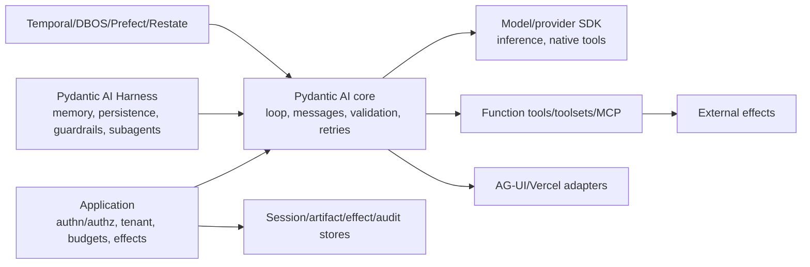

# Pydantic AI Deep Dive — Research Packet

**Research date:** 2026-08-31  
**Status:** Research-backed synthesis and claim ledger  
**Inspected release:** `v2.36.0`, published 2026-08-29  
**Repository snapshot:** official `main` commit `22b3d6a4dc9e409c5a581e4657311b0dfff16256` (2026-08-30)  
**Scope:** Pydantic AI core, first-party Harness boundaries, maintained durable integrations, security advisories and bounded implementation issues

## Research question

What does Pydantic AI V2 actually guarantee across typed agent runs, tools, outputs, history, streaming, provider adapters, multi-agent composition and durable engines—and which production responsibilities remain with the application?

## Method and source policy

Research began with the official documentation and repository, then cross-checked current API/source, V2 release and upgrade material, security advisories, integration documentation and a bounded set of issues containing reproducible failure semantics. Durable claims were checked against official Temporal, DBOS, Prefect and Restate documentation.

Issues are used as adoption-test seeds and evidence of one concrete behavior, not failure-rate estimates. Vendor case-study claims, stars, downloads and unverified comparison claims were excluded. Main-branch material newer than stable was not presented as shipped `v2.36.0` behavior without a release/source check.

The repository was still moving rapidly near the cutoff. The result therefore emphasizes semantic contracts, exact version posture and refresh triggers instead of long copy-paste examples.

## Version snapshot

| Surface | Snapshot | Evidence |
|---|---:|---|
| Pydantic AI stable | `v2.36.0` | [release](https://github.com/pydantic/pydantic-ai/releases/tag/v2.36.0), [releases](https://github.com/pydantic/pydantic-ai/releases) |
| Stable V2 start | 2026-06-23 | [version policy](https://github.com/pydantic/pydantic-ai/blob/main/docs/version-policy.md), [upgrade guide](https://github.com/pydantic/pydantic-ai/blob/main/docs/changelog.md) |
| Python floor | Python 3.10 | [PyPI package](https://pypi.org/project/pydantic-ai/) |
| Default instrumentation format | V5; V6 opt-in | [Logfire/OTel guide](https://github.com/pydantic/pydantic-ai/blob/main/docs/logfire.md) |
| Durable support center | Temporal, DBOS, Prefect, Restate; additional external Kitaru/Airflow docs | [durable overview](https://github.com/pydantic/pydantic-ai/blob/main/docs/durable_execution/overview.md) |
| Security ledger | ten published advisories through cutoff | [official advisories](https://github.com/pydantic/pydantic-ai/security/advisories) |

The version policy permits new message parts, stream events and optional fields in minor releases, plus OpenTelemetry attribute/default changes and beta incompatibility. “Minor compatible” therefore requires tolerant consumers and upgrade tests.

## Boundary map

The strongest conclusions survived all source passes:

- Pydantic validation provides structural parsing/constraints, not truth, provenance, authorization or effect safety.
- A common provider interface does not create feature or semantic parity.
- Message history is model context; client-supplied history is not authentic and core history is not durable workflow state or semantic memory.
- Approval prevents autonomous model execution only when implemented correctly; it is not authorization.
- A durable integration records selected model/tool units under one engine; external effects remain idempotency/reconciliation problems.
- Retry, cancellation and streaming semantics must be tested across the full stack because local, provider, UI and durable boundaries differ.

## Core runtime findings

### Agent and capabilities

`Agent[DepsT, OutputT]` is a reusable configuration object. Runs traverse a pydantic-graph loop through prompt, model-request, tool-call and terminal nodes. Five public execution surfaces trade convenience for control: completed async/sync runs, convenient final-output streaming, raw event streaming and graph iteration.

V2 makes capabilities the main extension primitive. A capability can add tools/native tools, hooks, instructions, settings or model selection. Core contains deep runtime/provider integrations; Pydantic AI Harness contains higher-level memory, step persistence, guardrails, spend, filesystem/shell, planning and subagent behavior. Capability composition adds behavior, not an automatic security or durability guarantee.

Evidence: [agents](https://github.com/pydantic/pydantic-ai/blob/main/docs/agent.md), [capabilities](https://github.com/pydantic/pydantic-ai/blob/main/docs/capabilities/overview.md), [hooks](https://github.com/pydantic/pydantic-ai/blob/main/docs/hooks.md), [dependencies](https://github.com/pydantic/pydantic-ai/blob/main/docs/dependencies.md).

### Instructions and messages

Current-agent `instructions` are re-evaluated and historical instructions are not resent when history is supplied. `system_prompt` parts persist in history. Cross-agent history can therefore retain old system authority and tool context. V2.36 adds stable addressable instruction-part IDs, increasing the importance of stable capability/toolset IDs.

`ModelRequest`/`ModelResponse` and their parts form the portable history protocol. Every run has a new `run_id`; `conversation_id` correlates multi-run conversations. Use `ModelMessagesTypeAdapter` and tolerate new variants. Deserialization validates type shape, not provenance.

Evidence: [agent instructions](https://github.com/pydantic/pydantic-ai/blob/main/docs/agent.md#instructions), [history](https://github.com/pydantic/pydantic-ai/blob/main/docs/message-history.md), [message source](https://github.com/pydantic/pydantic-ai/blob/main/pydantic_ai_slim/pydantic_ai/messages.py), [v2.36 release](https://github.com/pydantic/pydantic-ai/releases/tag/v2.36.0).

### Providers

Model, Provider and Profile separate adapter behavior, client/auth/endpoint configuration and model-family capabilities. V2 `openai:` selects Responses; `openai-chat:` preserves Chat Completions. Settings can be accepted by a common type yet ignored/rejected by a provider. Fallback tries another model, not the same one, and can change policy, retention, tool support, price and semantics.

Evidence: [models/providers](https://github.com/pydantic/pydantic-ai/blob/main/docs/models/overview.md), [OpenAI model](https://github.com/pydantic/pydantic-ai/blob/main/docs/models/openai.md), [settings API](https://github.com/pydantic/pydantic-ai/blob/main/docs/api/settings.md), [HTTP retries](https://github.com/pydantic/pydantic-ai/blob/main/docs/models/http-request-retries.md).

## Tool, output and retry findings

Function signatures become Pydantic schemas and model arguments are validated before a tool body. Toolsets add composition, lifecycle, filtering, prefixing, approval, dynamic loading and execution wrapping. Dynamic visibility is not authorization. A shared authenticated MCP toolset is one identity; per-user runs require separate sessions/instances.

Approval and external execution return `DeferredToolRequests` and resume with `DeferredToolResults`. Resume is a new run. Client histories/approvals are forgeable by design; high-stakes pauses must be server-owned and re-authorized at effect time.

Output has tool, native, prompted and text/function modes. Default tool output is broadly portable; native output is provider-dependent; prompted output is weakest. `StructuredDict` passes a schema but does not runtime-validate the dictionary.

Five retry layers do not share budgets: transport, fallback, tool correction, output correction and model-request hook correction. Tool counters are per name, reset after success and allow `N+1` attempts for `N` retries. `ToolFailed` is a failed result and does not consume the tool retry or successful-tool-call budget. Run request/deadline/effect budgets remain essential.

Evidence: [tools](https://github.com/pydantic/pydantic-ai/blob/main/docs/tools.md), [advanced tools](https://github.com/pydantic/pydantic-ai/blob/main/docs/tools-advanced.md), [toolsets](https://github.com/pydantic/pydantic-ai/blob/main/docs/toolsets.md), [MCP](https://github.com/pydantic/pydantic-ai/blob/main/docs/mcp/client.md), [deferred tools](https://github.com/pydantic/pydantic-ai/blob/main/docs/deferred-tools.md), [output](https://github.com/pydantic/pydantic-ai/blob/main/docs/output.md), [retries](https://github.com/pydantic/pydantic-ai/blob/main/docs/retries.md).

## Streaming, cancellation and UI findings

`run_stream()` finalizes on the first matching output and is not equivalent to full graph completion. Raw event surfaces expose model parts, tools, deferrals and final result but require assembly. Partial structured snapshots are accumulated values; output functions/validators may execute repeatedly while partial.

First-party cancellation produces `RunCancelled` with completed history; external cancellation remains `CancelledError`. Synchronous worker threads and already-issued effects cannot be killed or rolled back. Provider SDKs may stop local iterator consumption without guaranteeing remote generation/billing stopped.

AG-UI and Vercel adapters translate untrusted client input and stateful streams. Build one stream object per run, use explicit IDs in replayable workflows and treat disconnect separately from durable cancellation. The built-in web UI is development tooling.

Evidence: [streaming](https://github.com/pydantic/pydantic-ai/blob/main/docs/agent.md#streaming-all-events), [streamed output](https://github.com/pydantic/pydantic-ai/blob/main/docs/output.md#streamed-results), [UI overview](https://github.com/pydantic/pydantic-ai/blob/main/docs/ui/overview.md), [AG-UI](https://github.com/pydantic/pydantic-ai/blob/main/docs/ui/ag-ui.md), [Vercel AI](https://github.com/pydantic/pydantic-ai/blob/main/docs/ui/vercel-ai.md).

## Usage, history and memory findings

`UsageLimits.request_limit` defaults to 50. Most token and cost checks happen after a provider response, so the crossing request can be billed. Preflight token counting exists for documented providers at extra cost/latency. Unknown price data weakens cost enforcement. Successful-tool count does not bound failed results or business effect magnitude.

Core history serialization is a primitive; the application owns storage and concurrency. `ProcessHistory` replaces live state, so it can break current input, call/result pairing, deferred/tool-search state and `new_messages()` accounting. Harness Step Persistence, Conversation Search and Memory are distinct capabilities, not synonyms for history or durable workflow replay.

Evidence: [usage source](https://github.com/pydantic/pydantic-ai/blob/main/pydantic_ai_slim/pydantic_ai/usage.py), [history](https://github.com/pydantic/pydantic-ai/blob/main/docs/message-history.md), [capabilities](https://github.com/pydantic/pydantic-ai/blob/main/docs/capabilities/overview.md), [Harness](https://pydantic.dev/docs/ai/harness/).

## Durable-engine findings

| Engine | Pydantic mapping | Replay/effect boundary |
|---|---|---|
| Temporal | loop in deterministic workflow; model/MCP/I/O tools in activities | stable names/schemas and payload limits; activity crash window requires idempotency |
| DBOS | workflow plus model/MCP steps; explicit function-tool step semantics | operation order/versioning; transaction strength only inside supported DB boundary |
| Prefect | model/MCP/tools as tasks with cache/result config | cache identity can omit nonserializable scope; persistence/locking determine duplicate behavior |
| Restate | `RestateAgent` in service handler; explicit `run_typed` for tool effects | journal order/versioning; arbitrary tool code is not automatically durable |

Streaming is often buffered inside durable units. Activity/task-side live handlers can repeat. In-process cancellation does not automatically cross the engine. Persisted dependency/context/message types, agent/toolset/operation names and large-payload references are durable contracts.

Evidence: [overview](https://github.com/pydantic/pydantic-ai/blob/main/docs/durable_execution/overview.md), [Temporal](https://github.com/pydantic/pydantic-ai/blob/main/docs/durable_execution/temporal.md), [DBOS](https://github.com/pydantic/pydantic-ai/blob/main/docs/durable_execution/dbos.md), [Prefect](https://github.com/pydantic/pydantic-ai/blob/main/docs/durable_execution/prefect.md), [Restate](https://github.com/pydantic/pydantic-ai/blob/main/docs/durable_execution/restate.md), plus official [Temporal](https://docs.temporal.io/), [DBOS](https://docs.dbos.dev/python/tutorials/workflow-tutorial), [Prefect](https://docs.prefect.io/v3/concepts/caching) and [Restate](https://docs.restate.dev/develop/python/durable-steps) runtime documentation.

## Testing, eval and observability findings

`TestModel` is a procedural schema-valid generator and cannot emulate provider-native tools. `FunctionModel` scripts exact calls, failures, usage and streams. `ALLOW_MODEL_REQUESTS=False` prevents accidental live traffic. A production test strategy needs deterministic unit tests plus bounded provider contracts.

Pydantic Evals supplies typed datasets, cases, evaluators, reports, repeats and span checks. Dataset work is concurrent by default. Task/evaluator retries are separate. Online evaluation drops rather than queues work when its concurrency limit is full; drops need monitoring and shutdown flushing.

Instrumentation is OTel-based, with Logfire optional. Default V5 and experimental GenAI conventions require versioned dashboards. Content/binary/request-parameter flags reduce collection but do not replace source-level redaction. Request and aggregated run usage must not be summed twice.

Evidence: [testing](https://github.com/pydantic/pydantic-ai/blob/main/docs/testing.md), [evals](https://github.com/pydantic/pydantic-ai/blob/main/docs/evals.md), [eval core concepts](https://github.com/pydantic/pydantic-ai/blob/main/docs/evals/core-concepts.md), [Logfire/OTel](https://github.com/pydantic/pydantic-ai/blob/main/docs/logfire.md).

## Security-advisory summary

The ten advisories through the cutoff covered remote URL SSRF, IPv6 transition bypasses, local Web UI XSS/browser/Host exposure, client-uploaded-file confused-deputy behavior, dangling client tool calls, unbounded remote-content memory and telemetry retry-prompt redaction. Current V2 `2.36.0` is newer than all published fixed V2 versions.

Canonical details and exact ranges remain in the [official advisory index](https://github.com/pydantic/pydantic-ai/security/advisories). The supported guide records every advisory and patched version: [security advisories and permission boundaries](../../frameworks/pydantic-ai/security-advisories-and-permissions.md).

The common root is authority confusion at an integration seam: a URL, browser, client message, uploaded-file reference or telemetry serializer obtained more trust/resources than its provenance justified.

## Bounded issue ledger

| Issue | Status at cutoff | Evidence used | Adoption test |
|---|---|---|---|
| [#6460](https://github.com/pydantic/pydantic-ai/issues/6460) | open | absorbed external cancellation can silently complete in edge paths; proposed level-triggered contract | cancel while model/hook/Temporal/parallel tool swallows `CancelledError` |
| [#6979](https://github.com/pydantic/pydantic-ai/issues/6979) | open | dynamic-tool `ValidationError` can become durable-engine retry/failure instead of model correction | malformed dynamic call through each selected engine |
| [#6886](https://github.com/pydantic/pydantic-ai/issues/6886) | open | Temporal activity copy loses delegate mutations to parent `ctx.usage` | nested run under durable activity with parent limit/accounting |
| [#3352](https://github.com/pydantic/pydantic-ai/issues/3352) | open | first-class per-tool usage limits absent | high-cost tool-specific business quota outside aggregate count |

Closed historical issues were not presented as current limitations where current docs/source show the behavior fixed. They remain useful regression seeds only when a guide explicitly labels them historical.

## Production acceptance matrix

- malformed, semantically invalid, unauthorized, stale and oversized inputs/outputs;
- retry multiplication and exact maximum attempts at every layer;
- async/sync/stream/delegate/durable cancellation plus late effects;
- mixed output/function tools under the V2 graceful strategy;
- forged history, approval, system prompt, file and MCP identity;
- context compaction, memory poisoning and provider-incompatible history;
- durable crash before/after external commit, replay and schema/name upgrades;
- provider parity for output, tools, settings, usage and streaming;
- overload, queue shedding, shutdown, exporter/eval drops and recovery;
- every published advisory's exploit class.

## Excluded or downgraded claims

- Type-safe was not treated as secure, truthful, authorized, durable or deterministic.
- A provider/model list was not treated as semantic parity.
- “Durable” was not described as exactly-once external execution.
- Harness Step Persistence was not equated with a workflow engine.
- Client message sanitization was not called authentication.
- Approval was not called authorization.
- `TestModel` or schema-valid eval results were not accepted as provider/semantic proof.
- Cost estimates were not treated as provider billing records.
- Temperature zero, seed or deterministic replay of orchestration was not described as deterministic model output.
- Beta/custom durable extension surfaces were not promoted based only on inclusion in stable core.

## Saturation conclusion

Additional official-source passes repeated the same core boundaries rather than changing the decision model: typed parsing versus semantic authority; context versus persistence; adapter replay versus external effect safety; provider normalization versus parity; and local cancellation/streaming versus distributed settlement. Research was considered saturated when new material primarily added provider- or backend-specific examples to those already documented contracts.

## Guides supported

- [Pydantic AI Production Playbook](../../frameworks/pydantic-ai/README.md)
- fourteen focused guides linked from that index
- existing concise [Pydantic AI overview](../../frameworks/pydantic-ai.md), intentionally not edited by this work

## Refresh triggers

- any Pydantic AI minor/major, V1 support-window change or security advisory;
- additions/changes to message parts, stream events, instructions, output modes or default retry/end behavior;
- provider API/SDK/model profile, native tool, MCP, AG-UI or Vercel protocol change;
- Harness persistence, memory, guardrail, sandbox or subagent change;
- Temporal/DBOS/Prefect/Restate adapter protocol, serializer, hashing, replay/versioning or streaming change;
- OTel GenAI convention or Pydantic instrumentation-default change;
- resolution or material redesign in issues #6460, #6979 or #6886;
- stabilization or compatibility evidence for the v2.36 public custom durable-backend surface.

