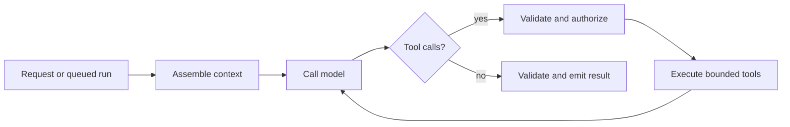
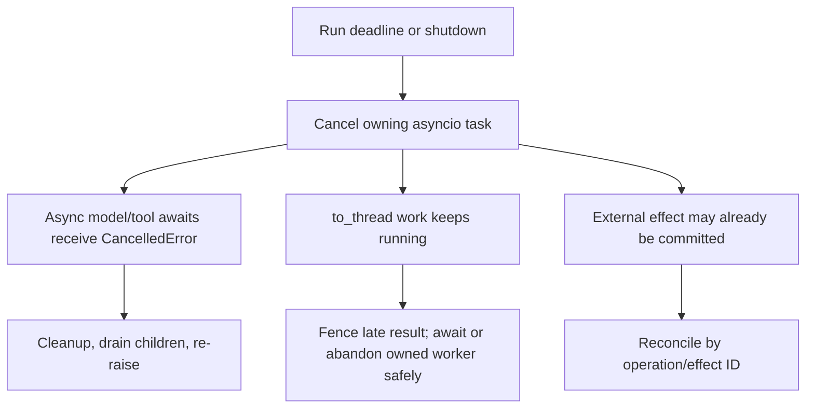
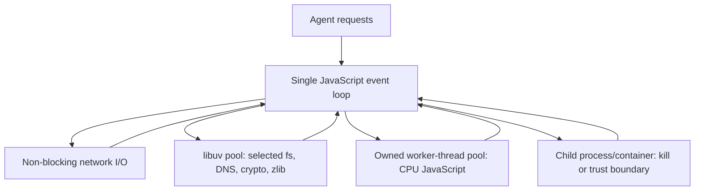

# Research Packet: Python and TypeScript/Node.js Agent Runtimes

> **Status:** Research-backed synthesis  
> **Research date:** 2026-08-31  
> **Scope:** Production runtime behavior for Python and TypeScript/Node.js agent services, workers, tools, streams, and durable-workflow adapters.  
> **Method:** Primary runtime, packaging, validation, framework, deployment, and observability documentation was cross-checked with current repositories and narrowly scoped issue reproductions. Issues are used as test leads, not estimates of prevalence.

## Research questions

1. What actually differs once both languages can call the same models and expose the same tools?
2. How do concurrency, cancellation, CPU isolation, streaming, shutdown, and context propagation fail?
3. Which type and schema guarantees survive at runtime and across durable boundaries?
4. What should teams pin, instrument, test, and re-check before choosing either runtime?

## Snapshot and confidence

| Item | Checked position | Confidence and refresh trigger |
|---|---|---|
| CPython | 3.14.7 is the current stable bugfix release; 3.15 is prerelease. Free-threaded 3.14 is supported but optional. | High; refresh at 3.15 GA or a free-threading phase change. |
| Node.js | 24.20.0 is the latest LTS and 26.8.1 is Current. Node recommends production applications use Active or Maintenance LTS. | High; refresh when 26 enters LTS or the annual release policy changes. |
| OpenAI Agents SDK | Official Python and TypeScript SDKs share the code-first agent surface. | High for language availability; feature parity must be checked per release. |
| OpenTelemetry | Python and JavaScript traces/metrics are stable; logs are still Development. | High; refresh when logs or GenAI semantic conventions stabilize. |
| Framework availability | Both runtimes have mature direct-API and agent-loop options; several important libraries remain language-led or have asymmetric features. | Medium; refresh at each framework major release. |
| Operational issue evidence | Cancellation, streaming, timeout, and connection-pool seams have recent reproducible reports. | Bounded evidence only; convert to regression tests against pinned versions. |

## Finding 1: model parity does not imply runtime parity

Both languages can implement the same logical loop:

The meaningful differences appear below the loop: how work is scheduled, how cancellation propagates, how CPU work is isolated, whether stream consumers apply backpressure, how runtime payloads are validated, what a crash does to in-flight work, and which deployment/runtime APIs are actually available.

### Stable conclusion

Choose by production ownership and the workload's dominant constraints. Do not choose Python because most notebooks use it or TypeScript because the UI does. A small vertical-slice load and failure test is more predictive than framework counts.

## Finding 2: Python is an event-loop runtime with explicit escape hatches

`asyncio` runs cooperative tasks on an event loop. It is a strong fit for concurrent model, database, queue, and tool I/O as long as callbacks do not block. `TaskGroup` supplies structured task ownership: child failures cancel siblings and the context waits for their cleanup. `asyncio.timeout()` also uses cancellation internally.

`CancelledError` directly subclasses `BaseException`. Cleanup should normally occur in `finally`, after which cancellation must be re-raised. Swallowing it can break `TaskGroup` and timeout behavior. `shield()` prevents caller cancellation from being forwarded to the shielded awaitable, but the caller still receives cancellation and must retain a strong task reference.

### Cancellation boundary

Calling synchronous code with `to_thread()` keeps the event loop responsive, but cancelling the await does not kill the thread. This matters for synchronous agent tools: a timed-out call may still mutate external state. Threads need cooperative stop support or effect fencing; hostile or unbounded work belongs in a killable process/container boundary.

For CPU parallelism, Python 3.14 offers three materially different options:

| Mechanism | Good fit | Production cost |
|---|---|---|
| `ThreadPoolExecutor` / `to_thread` | Blocking I/O and C extensions that release the GIL | Shared process; work cannot be forcibly stopped safely. |
| `InterpreterPoolExecutor` | Isolated subinterpreters and true multicore execution | Mutable objects are not shared; serialization/extension compatibility requires testing. |
| `ProcessPoolExecutor` | CPU-heavy or kill-isolation work | Picklable inputs/outputs, importable `__main__`, startup/memory cost, platform limits. |
| Free-threaded CPython | Carefully measured threaded workloads and compatible extensions | Supported but optional in 3.14, not the default; extension and workload readiness are separate gates. |

`InterpreterPoolExecutor` was added in 3.14. Each worker has its own interpreter and GIL, enabling multicore work but requiring explicit data exchange. `ProcessPoolExecutor` also bypasses the GIL but has serialization and lifecycle constraints; invoking executor/future methods from inside its task can deadlock. Python 3.14 also added explicit process-pool terminate and kill operations.

PEP 779 moved free-threaded Python to supported Phase II in 3.14. That does not make it the universal production default: the build remains optional, performance/memory trade-offs exist, and every native dependency needs compatibility evidence.

## Finding 3: Node is an event loop plus several different worker mechanisms

Node executes JavaScript callbacks on one event loop and delegates selected filesystem, DNS, crypto, and compression work to the libuv worker pool. High concurrency comes from keeping per-client callbacks small. A CPU-heavy callback, large synchronous JSON operation, pathological regular expression, or saturated libuv pool can delay unrelated requests and even turn input size into denial of service.

`worker_threads` execute JavaScript in parallel and can share memory. Node's documentation recommends them for CPU-intensive JavaScript, not ordinary I/O; built-in asynchronous I/O is usually more efficient. Worker creation should be pooled and bounded rather than performed per request. Child processes provide a stronger crash/termination boundary at greater serialization and resource cost.

Event-loop utilization and delay histograms are first-class operating signals, not optional profiler trivia. A provider timeout can be observed late or misclassified when CPU work stalls the loop; a reproduced Undici case showed connection timeouts triggered while the loop was CPU-bound. This is a concrete reason to monitor loop lag and isolate CPU work.

## Finding 4: cancellation is cooperative in both languages

Node's `AbortController` and `AbortSignal` are stable. `AbortSignal.timeout()` creates a deadline signal, and `AbortSignal.any()` composes shutdown, caller, and deadline sources. But a signal only notifies consumers. Each HTTP client, SDK, tool, stream transform, worker, and database call must accept and honor it.

| Question | Python | TypeScript/Node.js |
|---|---|---|
| Primary cancellation carrier | Task cancellation / cancel scope | `AbortSignal` |
| Structured ownership | `TaskGroup`; AnyIO task groups/cancel scopes | Library/application convention; own promises, streams, workers explicitly |
| Blocking sync work | Thread continues unless it cooperates | Sync callback blocks loop; worker/process must be terminated explicitly |
| Shielding | `asyncio.shield`, carefully scoped | Separate signal/ownership boundary; do not pass the parent signal blindly |
| External side effect | Cancellation cannot undo commit | Cancellation cannot undo commit |
| Required invariant | Re-raise cancellation after cleanup | Treat abort as terminal, drain/terminate owned work, fence late results |

Recent framework issues show why language-level support is not enough. Pydantic AI's 2026 cancellation work documents cases where swallowed task cancellation could deadlock or silently complete a run. AI SDK reports distinguish model-stream timers, tool-execution timers, platform termination, and user abort. These are excellent test vectors: cancel during model streaming, parallel tools, a synchronous tool, an approval wait, durable resume, and deployment shutdown.

## Finding 5: streams need bounded buffers and explicit ownership

Node streams have built-in backpressure primitives: `write()` signals when the high-water mark is reached, `drain` indicates recovery, and `pipeline` centralizes propagation and cleanup. New iterable streams distinguish pull streams with natural backpressure from push streams that need explicit budgets.

Python async iterators do not automatically bound every producer. Agent SDK queues, callbacks, WebSocket/SSE relays, and background producers need an explicit queue capacity and disconnect policy. Uvicorn can cap concurrent connections/tasks and graceful-shutdown time, but application-level model/tool work still needs run deadlines and cancellation handling.

For either runtime, define:

- maximum buffered events and bytes per run;
- whether low-value deltas coalesce or drop;
- how disconnect maps to pause, cancel, or background continuation;
- who drains the provider response and releases the connection;
- how a reconnect resumes from an event/checkpoint cursor.

## Finding 6: static types do not validate model or tool payloads

Python annotations and TypeScript types help authors and tooling but do not establish trust at runtime. TypeScript explicitly erases types; Node's native TypeScript execution performs type stripping without type checking. Python can receive any runtime object regardless of annotations.

Pydantic and Zod bridge this gap, but their defaults matter:

| Concern | Python/Pydantic | TypeScript/Zod |
|---|---|---|
| Default coercion | Pydantic is generally lax; strict mode must be selected where coercion is unsafe | Zod schemas parse and validate; transforms can make input/output types differ |
| Failure surface | Structured `ValidationError` | Thrown `ZodError` or discriminated `safeParse` result |
| JSON Schema | Generated schemas need dialect/subset review | Native conversion exists; some types/transforms are unrepresentable |
| Performance | Reuse adapters; validate JSON directly where appropriate | Reuse schemas; keep validation off hot token-delta paths unless needed |
| Trust rule | Validate every external boundary | Validate every external boundary |

Provider structured-output subsets are narrower than full JSON Schema. Maintain one wire contract, test generated schema against the exact provider, validate the returned value again, and perform semantic/authorization checks after shape validation.

Never use Python `pickle` or `multiprocessing.Connection.recv()` across an untrusted boundary: unpickling can execute arbitrary code. Prefer explicit JSON/Protobuf-like wire formats for durable state, queues, and polyglot boundaries.

## Finding 7: deployment semantics are part of the runtime choice

### Python service workers

Uvicorn exposes multiple worker processes, concurrency limits, request-count recycling, keep-alive timeouts, worker health checks, and a graceful-shutdown timeout. Multiple workers mean multiple heaps, pools, in-memory caches, and agent registries. Long-lived run state must not rely on a particular worker unless deliberately pinned.

The application must stop admission, propagate cancellation, drain owned tasks, flush telemetry, close clients, and checkpoint or hand off resumable runs before the supervisor's grace period expires.

### Node processes and edge/serverless targets

An uncaught exception places a Node process in an undefined state; official guidance says perform only synchronous cleanup and let an external monitor restart it. The `exit` event cannot perform asynchronous cleanup. Graceful shutdown therefore begins on the termination signal, not in `exit`.

“JavaScript runtime” is not synonymous with “Node.” Next.js documents that its Edge Runtime lacks some Node APIs. Cloudflare provides a growing but still qualified subset, including partial implementations and importable stubs that may throw when called. Serverless platforms impose duration and post-response lifetime rules. Run the full dependency graph against the exact deployment runtime; do not infer compatibility from successful bundling.

## Finding 8: security controls help, but neither runtime is a sandbox

Node's stable permission model restricts filesystem, network, child process, worker, native addon, WASI, inspector, and related access when enabled. The documentation explicitly calls it a seat belt for trusted code, not protection against malicious code, and lists bypass/constraint cases such as symlinks, existing file descriptors, and OS-level signaling.

Python's process, import, serialization, and native-extension flexibility likewise does not create an in-process untrusted-code boundary. For model-generated code, untrusted plugins, shell/browser control, and hostile parsers, use OS identities plus container/VM/sandbox controls, network policy, filesystem scopes, resource limits, and short-lived credentials.

## Finding 9: dependency reproducibility and provenance need deliberate policy

Python now has a standardized `pylock.toml` format for reproducible environments. `pip --require-hashes` requires every dependency to be pinned and hashed; restricting installs to wheels avoids executing source-build paths but may constrain supported platforms. Pin the interpreter and native build image as well as packages.

For Node, commit the lockfile and use frozen/CI installation semantics. npm provenance can link a published package to source and build instructions and logs attestations through Sigstore, but provenance does not prove the code is safe. Verify registry signatures/attestations, minimize install scripts, audit transitive packages, and retain an SBOM.

Node's ESM/CommonJS interop is mature but still a release hazard. Mark the package type explicitly, prefer one distribution format where possible, test conditional exports, and avoid relying on heuristic named-export detection from CommonJS.

## Finding 10: observability must include runtime health

Both OpenTelemetry SDKs report stable traces and metrics and Development logs. Instrument model and tool spans, but also runtime signals:

| Signal | Python | Node.js |
|---|---|---|
| Scheduler health | event-loop lag, runnable task count, executor queue depth | event-loop delay/utilization, libuv/worker queue depth |
| Cancellation | requested, observed, cleanup duration, late result fenced | signal source/reason, observed layer, worker termination, late result fenced |
| Resource ownership | active tasks, threads, processes, HTTP pools | active handles, workers, streams, dispatcher pools |
| Crash evidence | task stacks, process/thread dumps, faulthandler/profile | diagnostic report, uncaught exception monitor, heap/CPU profile |
| Agent dimensions | run/turn/tool/effect IDs, model, release, tenant, deadline | same |

Async context is not magical. Python context variables and Node `AsyncLocalStorage` work through supported asynchronous resources, but custom callbacks, worker/process boundaries, queues, and serialized durable steps need explicit propagation. Node's `AsyncLocalStorage.bind()` and `snapshot()` are stable, while custom thenables/callback APIs may require `AsyncResource`.

## Decision synthesis

| Workload or constraint | Lean Python when | Lean TypeScript/Node.js when |
|---|---|---|
| Evaluation, retrieval, data/ML tooling | Python ecosystem and data team own the workload | Existing JS data stack already meets the need |
| Web product and streaming UI | Backend separation is already accepted | One product team benefits from shared contracts and web-native streams |
| Provider/framework access | Required capability is Python-first | Required capability is TypeScript-first or UI-integrated |
| CPU-heavy local work | Process/subinterpreter/native Python path is owned and measured | Worker pool or external compute service is owned and measured |
| Browser/edge deployment | A server-side Python service is acceptable | Exact edge runtime supports every dependency/API |
| Durable workflow | Selected engine's Python SDK and replay rules fit | Selected engine's TypeScript SDK and replay rules fit |
| Existing estate | Python service ownership is stronger | Node service ownership is stronger |

If no hard requirement decides the choice, build the same production slice in both: stream output, run parallel read tools, gate one write, cancel mid-tool, recover from a crash, validate payloads, and inspect telemetry. Compare p95/p99 latency, event-loop lag, memory per worker, cancellation completion, error diagnosis time, cold start, and total operational complexity.

## Failure-injection backlog derived from issue evidence

- [ ] Cancel a Python run while an async tool catches `CancelledError`; verify the run cannot silently succeed.
- [ ] Cancel while a synchronous Python tool is in a worker thread; verify late effects are fenced and reconciled.
- [ ] Break a streamed Python response early; verify provider stream and spawned tasks close.
- [ ] Stall Node's event loop during an outbound connect; verify loop-delay alarms and timeout classification.
- [ ] Reuse outbound Node connections under concurrency and remote keep-alive churn; verify bounded retries for safe requests.
- [ ] Abort a Node agent during a long-running tool and on platform termination; verify checkpointing does not depend on a grace callback.
- [ ] Let a Node stream consumer fall behind; verify memory stays bounded and cancellation closes the pipeline.
- [ ] Cross worker/process/durable boundaries; verify trace, principal, deadline, idempotency, and release context survives.

## What was excluded

- Popularity rankings and package-download counts: they do not establish production suitability.
- Vendor throughput claims without a reproducible workload: runtime overhead is usually dominated by model/tool latency.
- “GIL-free means Python is now fully parallel”: free threading is optional and dependency/workload readiness remains decisive.
- “TypeScript is runtime type safety”: types are erased and Node's native stripping does no checking.
- “Abort/cancel means rollback”: neither runtime can undo an external commit.
- Open issues as permanent defects: they are version-scoped evidence and regression-test seeds.

## Guides supported

- [Python agent runtimes in production](../../languages/python-agent-runtimes.md)
- [TypeScript and Node.js agent runtimes in production](../../languages/typescript-node-agent-runtimes.md)
- [Python vs TypeScript/Node.js for agent runtimes](../../comparisons/python-vs-typescript-node-agent-runtimes.md)

## Primary sources

### Python runtime, serving, validation, and packaging

- [Python version status](https://devguide.python.org/versions/) — checked 2026-08-31.
- [Python 3.14 release](https://www.python.org/downloads/release/python-3140/) and [3.14 concurrent futures](https://docs.python.org/3.14/library/concurrent.futures.html) — checked 2026-08-31.
- [`asyncio` tasks, cancellation, task groups, timeouts, and shielding](https://docs.python.org/3.14/library/asyncio-task.html) — checked 2026-08-31.
- [`asyncio` platform support](https://docs.python.org/3.14/library/asyncio-platforms.html), [subprocesses](https://docs.python.org/3.14/library/asyncio-subprocess.html), and [runners](https://docs.python.org/3.14/library/asyncio-runner.html) — checked 2026-08-31.
- [PEP 779: supported free-threaded Python](https://peps.python.org/pep-0779/) — checked 2026-08-31.
- [Uvicorn settings](https://www.uvicorn.org/settings/) and [server behavior](https://www.uvicorn.org/server-behavior/) — checked 2026-08-31.
- [Pydantic strict mode](https://pydantic.dev/docs/validation/latest/concepts/strict_mode/) and [performance guidance](https://pydantic.dev/docs/validation/latest/concepts/performance/) — checked 2026-08-31.
- [Python `pylock.toml` specification](https://packaging.python.org/en/latest/specifications/pylock-toml/) and [pip secure installs](https://pip.pypa.io/en/stable/topics/secure-installs/) — checked 2026-08-31.
- [Python serialization security warning](https://docs.python.org/3/library/pickle.html) — checked 2026-08-31.
- [OpenTelemetry Python status](https://opentelemetry.io/docs/languages/python/) — checked 2026-08-31.

### Node.js, TypeScript, validation, deployment, and packaging

- [Node.js release status](https://nodejs.org/en/about/previous-releases) — checked 2026-08-31.
- [Do not block the event loop or worker pool](https://nodejs.org/en/learn/asynchronous-work/dont-block-the-event-loop) and [`worker_threads`](https://nodejs.org/api/worker_threads.html) — checked 2026-08-31.
- [`AbortController` and `AbortSignal`](https://nodejs.org/api/globals.html), [`AsyncLocalStorage`](https://nodejs.org/api/async_context.html), and [performance hooks](https://nodejs.org/api/perf_hooks.html) — checked 2026-08-31.
- [Node streams](https://nodejs.org/api/stream.html) and [iterable stream backpressure](https://nodejs.org/api/stream_iter.html) — checked 2026-08-31.
- [Node process failure semantics](https://nodejs.org/api/process.html) and [permission model](https://nodejs.org/api/permissions.html) — checked 2026-08-31.
- [Native TypeScript type stripping](https://nodejs.org/api/typescript.html) and [TypeScript erased types](https://www.typescriptlang.org/docs/handbook/typescript-from-scratch.html) — checked 2026-08-31.
- [Node package/module rules](https://nodejs.org/api/packages.html) and [publishing one module format](https://nodejs.org/en/learn/modules/publishing-a-package) — checked 2026-08-31.
- [npm clean install](https://docs.npmjs.com/cli/commands/npm-ci/), [audit](https://docs.npmjs.com/cli/audit/), and [provenance](https://docs.npmjs.com/generating-provenance-statements/) — checked 2026-08-31.
- [Zod parsing](https://zod.dev/basics) and [JSON Schema conversion](https://zod.dev/json-schema) — checked 2026-08-31.
- [OpenTelemetry JavaScript status](https://opentelemetry.io/docs/languages/js/) — checked 2026-08-31.
- [Next.js Edge Runtime limits](https://nextjs.org/docs/pages/api-reference/edge), [Cloudflare Node compatibility](https://developers.cloudflare.com/workers/runtime-apis/nodejs/), and [Vercel function runtimes](https://vercel.com/docs/functions/runtimes) — checked 2026-08-31.

### Agent ecosystem and operational evidence

- [OpenAI Agents SDK overview](https://developers.openai.com/api/docs/guides/agents) — official Python/TypeScript availability checked 2026-08-31.
- [LangGraph persistence](https://docs.langchain.com/oss/python/langgraph/persistence), [interrupts](https://docs.langchain.com/oss/python/langgraph/interrupts), and [backward compatibility](https://docs.langchain.com/oss/python/langgraph/backward-compatibility) — checked 2026-08-31.
- [Pydantic AI timeout design](https://github.com/pydantic/pydantic-ai/blob/main/docs/timeouts.md) and [cancellation tracker](https://github.com/pydantic/pydantic-ai/issues/6460) — checked 2026-08-31.
- [AI SDK tools](https://ai-sdk.dev/docs/ai-sdk-core/tools-and-tool-calling), [agent interface](https://ai-sdk.dev/docs/reference/ai-sdk-core/agent), and [telemetry](https://ai-sdk.dev/docs/ai-sdk-core/telemetry) — checked 2026-08-31.
- [Strands language feature matrix](https://strandsagents.com/docs/user-guide/quickstart/overview/) and [tool-executor cancellation](https://strandsagents.com/docs/user-guide/concepts/tools/executors/) — checked 2026-08-31.
- [Undici event-loop timeout reproduction](https://github.com/nodejs/undici/issues/3410), [AI SDK tool-timeout reproduction](https://github.com/vercel/ai/issues/17310), and [deployment abort reproduction](https://github.com/vercel/ai/issues/10844) — test leads checked 2026-08-31.

## Refresh triggers

Refresh immediately when Python 3.15 or Node 26 reaches production/LTS status; free-threading changes phase; Node permissions change threat model; OpenTelemetry logs or GenAI conventions stabilize; a chosen framework changes cancellation or timeout semantics; an edge platform changes compatibility; or a durable runtime changes SDK/replay support.

