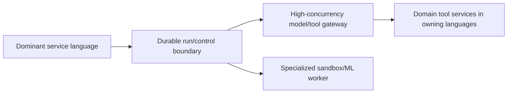

# Research Packet: Runtime Language Selection

> **Status:** Active research packet  
> **Research date:** 2026-08-30  
> **Scope:** Choosing an implementation language for agent APIs, orchestration, gateways, workers, sandboxes, and tool adapters.  
> **Method:** Current official SDK/framework support was checked against primary language/runtime concurrency and cancellation documentation, MCP SDK tiering, OpenTelemetry language status, and production architecture requirements. This packet does not rank languages by popularity.

## Research questions

1. Which constraints actually make a language a good or bad fit for an agent component?
2. How do cancellation, concurrency, blocking work, process control, and type/schema boundaries differ?
3. Which provider, framework, protocol, durable-runtime, and observability capabilities are first-class today?
4. When is a polyglot architecture justified?

## Finding 1: select per component and team, not for “AI” in general

The model call is remote in most systems, so language microbenchmarks rarely decide interactive latency. Queueing, output tokens, tool latency, retries, and orchestration shape usually matter more. Language choice becomes decisive at boundaries: cancellation, high concurrency, browser/sandbox process management, schema generation/validation, durable workflow replay, native dependencies, telemetry, deployment footprint, and operational familiarity.

Rank criteria in this order:

1. existing service/team ownership and on-call competence;
2. mandatory provider/framework/workflow/protocol feature availability;
3. deadline and cancellation propagation through every dependency;
4. I/O concurrency and blocking/CPU isolation model;
5. runtime schema validation and serialization compatibility;
6. sandbox, subprocess, filesystem, and OS-control needs;
7. observability, profiling, debugging, and failure tooling;
8. deployment, startup, memory, supply-chain, and upgrade constraints;
9. only then syntax preference and benchmark throughput.

### Stable conclusion

Use the dominant production language unless a required capability or workload property provides a measured reason to split. The safest runtime is often the one the team can cancel, profile, patch, and operate at 03:00.

## Finding 2: ecosystem breadth and feature parity differ

As of the research date:

- OpenAI's official Agents SDK targets Python and TypeScript, but its April 2026 sandbox/harness expansion launched first in Python with some TypeScript capability still planned.
- Anthropic's general Messages API has official clients for Python, TypeScript, C#, Go, Java, PHP, and Ruby; its Claude Agent SDK is Python/TypeScript.
- Google ADK is available in Python, TypeScript, Go, Java, and Kotlin, but individual plugins/features publish language-specific minimum versions and may not have parity.
- MCP 2026-07-28 listed TypeScript, Python, Go, and C# as Tier 1; Rust supported the revision in beta. The tier system measures conformance and maintenance commitments and changes over time.
- OpenTelemetry currently reports stable traces/metrics for Python, JavaScript, Go, Java, and .NET; log and profile maturity varies. Rust is beta across traces, metrics, and logs at this snapshot.

“The provider has an HTTP SDK” is not equal to “the agent harness, durable integration, tool feature, or protocol capability is first-class.” Build a feature-by-language matrix for the exact release and test it.

### Sources

- [OpenAI developer quickstart and Agents SDK languages](https://platform.openai.com/docs/quickstart/make-your-first-api-request)
- [OpenAI Agents SDK evolution, April 2026](https://openai.com/index/the-next-evolution-of-the-agents-sdk/)
- [Anthropic SDK overview](https://platform.claude.com/docs/en/cli-sdks-libraries/overview)
- [Claude Agent SDK quickstart](https://code.claude.com/docs/en/agent-sdk/quickstart)
- [Google ADK installation](https://adk.dev/get-started/installation/)
- [MCP 2026-07-28 SDK status](https://blog.modelcontextprotocol.io/posts/2026-07-28/)
- [MCP SDK tiering](https://modelcontextprotocol.io/community/sdk-tiers)
- [OpenTelemetry language status](https://opentelemetry.io/docs/languages/)

## Finding 3: cancellation is cooperative everywhere, but failure shapes differ

| Runtime | Primary model | Important production trap |
|---|---|---|
| Python `asyncio` | event loop, coroutines, `TaskGroup`, cancellation exceptions | Swallowing `CancelledError` breaks structured-concurrency/timeout behavior; sync/CPU work blocks unless isolated |
| Node.js/TypeScript | event loop, Promises/streams, `AbortSignal`, workers/processes | Libraries may ignore abort; CPU/blocking work stalls the event loop; TypeScript types vanish at runtime |
| Go | goroutines/channels with explicit `context.Context` deadlines/cancellation | Leaked goroutines or blocked channels; contexts stored at wrong lifetime; cancellation still requires cooperation |
| Java | platform/virtual threads, futures; structured concurrency is preview in Java 25 | Virtual threads improve blocking-I/O throughput, not latency/CPU; pinning and preview API stability matter |
| .NET/C# | Tasks/async-await and `CancellationToken` | Cancellation is a request; code may continue and must use the correct token to reach canceled state |
| Rust/Tokio | futures/tasks; drop/abort or cooperative token | A future may stop at any `await` without async cleanup; cancellation safety and child-task joining require design |

Language cancellation does not prove a remote model or external write stopped. Every runtime still needs an absolute deadline, provider/tool cancellation mapping, stale-attempt fencing, and effect reconciliation.

### Sources

- [Python 3.14 asyncio tasks and cancellation](https://docs.python.org/3/library/asyncio-task.html)
- [Node.js `AbortSignal`](https://nodejs.org/api/globals.html)
- [Go context](https://go.dev/blog/context)
- [Go pipelines and cancellation](https://go.dev/blog/pipelines)
- [Java 25 virtual threads](https://docs.oracle.com/en/java/javase/25/core/virtual-threads.html)
- [Java 25 structured concurrency](https://docs.oracle.com/en/java/javase/25/core/structured-concurrency.html)
- [.NET task cancellation](https://learn.microsoft.com/en-us/dotnet/standard/parallel-programming/task-cancellation)
- [Rust Async Book: blocking and cancellation](https://rust-lang.github.io/async-book/part-guide/more-async-await.html)
- [Rust Async Book: structured concurrency](https://rust-lang.github.io/async-book/part-reference/structured.html)

## Finding 4: language types do not replace wire validation

Python annotations/Pydantic, TypeScript/Zod-style validators, Go structs/tags, Java records/bean validation, .NET types, Kotlin serialization, and Rust Serde can generate or consume JSON schemas. None makes untrusted model/provider/tool payloads safe automatically. Differences in optional/null fields, unknown fields, numeric ranges, enums, date/time, maps, union types, and JSON Schema dialects routinely create cross-language incompatibility.

At every protocol/queue/tool boundary:

- pin the JSON Schema/OpenAPI/protocol dialect and supported subset;
- validate incoming and outgoing payloads at runtime;
- distinguish absent, null, defaulted, and empty values;
- constrain integers/numbers and identifiers explicitly;
- test unknown fields and forward/backward compatibility;
- use canonical fixtures across every language implementation;
- never expose runtime-owned identity, credentials, or policy inputs to the model schema.

### Stable conclusion

Use language types for developer ergonomics and static checking; use an owned wire contract plus conformance fixtures for interoperability.

## Finding 5: language profiles are workload-dependent

| Language/runtime | Strong fit | Main trade-offs at this snapshot |
|---|---|---|
| Python | Fastest access to research, data/ML, agent frameworks, evaluation; broad provider support | Runtime typing discipline, event-loop blocking, process packaging, CPU scaling; feature abundance increases churn |
| TypeScript/Node.js | Web/UI streaming, full-stack teams, provider SDKs, event-driven APIs, tool/MCP ecosystem | Runtime validation required, event-loop blocking, dependency/supply-chain surface, backend/browser trust separation |
| Go | High-concurrency gateways, schedulers, tool/MCP servers, simple static deployments | Fewer first-party agent harnesses and ML libraries; explicit error/serialization plumbing |
| Java | Existing JVM enterprises, high-throughput I/O, mature middleware/telemetry/security, Google ADK | Framework/provider feature parity, larger operational footprint; structured concurrency remains preview in Java 25 |
| Kotlin | JVM services with coroutine expertise, Android/Google ADK environments | Smaller agent-specific ecosystem and current telemetry/SDK parity differences |
| C#/.NET | Microsoft estates, typed services, async/diagnostics, Microsoft Agent Framework, MCP Tier 1 | Provider/framework asymmetry and platform-specific integration assumptions must be checked |
| Rust | Resource-constrained/high-assurance gateways, sandboxes, parsers, native tooling | Smaller agent/provider SDK ecosystem, beta MCP/OTel status at snapshot, higher async/cancellation integration cost |
| Ruby/PHP | Existing product/domain stacks and straightforward API/tool services | Agent-harness and high-scale orchestration depth varies; verify current protocol and telemetry tier rather than assuming absence |

These are starting hypotheses, not rankings. A mature Go team can build a safer agent service than an inexperienced Python team; a Python-only sandbox library can still justify a small isolated Python worker behind a durable boundary.

## Finding 6: polyglot boundaries must earn their cost

Split only for a clear reason such as a first-party-only SDK, native/sandbox dependency, security isolation, or independently scaled gateway. Cross the boundary with a versioned protocol, queue, or workflow activity carrying deadline, cancellation, tenant, release, and trace identity.

Polyglot costs include duplicated SDK wrappers, auth/policy drift, schema translation, tracing propagation, incident ownership, deployment pipelines, dependency patching, local-development friction, and extra network failure modes. Do not create one “AI microservice” just to use a fashionable library if it steals domain authorization and effect semantics from the owning service.

## Decision evidence to collect

- one representative interactive and long-running task implemented or exercised through candidate stacks;
- provider/tool streaming, cancellation, retry, and structured-output compatibility tests;
- durable workflow and versioning support where required;
- load/soak evidence for expected concurrent I/O, result size, and process/sandbox churn;
- failure injection: aborted clients, hung SDK call, blocked event loop/thread, leaked task/goroutine, partial stream, shutdown;
- schema conformance fixtures and unknown-field evolution;
- telemetry completeness and profiler/debugger usability;
- patch cadence, supported runtime versions, dependency/security scan burden;
- team build, review, deploy, and incident-response performance.

## Claims deliberately excluded

- One universal “best language for AI agents.”
- Python being mandatory because models are developed in Python.
- Go/Rust being automatically safer because they compile or use less memory.
- TypeScript static types validating untrusted JSON at runtime.
- Virtual threads, goroutines, async tasks, or event loops removing the need for concurrency limits.
- Cooperative cancellation proving remote work or external effects stopped.
- An official base API client implying full agent-framework feature parity.
- A benchmark of local loops predicting end-to-end agent latency.

## Derived guide

- [Choosing an agent runtime language](../../languages/choosing-an-agent-runtime-language.md)

## Refresh triggers

- agent SDK language support or feature parity changes;
- MCP SDK tier/revision changes after 2026-07-28;
- OpenTelemetry language-component stability changes;
- language/runtime cancellation, structured-concurrency, or LTS changes;
- durable workflow SDK support changes;
- production evidence contradicts a profile or reveals a runtime-specific incident pattern.

