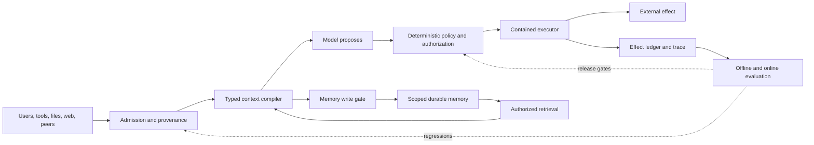

# Security, Evaluation, Context, and Memory Research Packet

> **Status:** Research-backed synthesis  
> **Research window:** 2026-08-30  
> **Scope:** Cross-cutting production controls for agent security, evaluation, observability, context management, compaction, and durable memory.  
> **Refresh triggers:** A new NIST AI RMF revision; an OWASP Agentic Top 10 revision; an MCP authorization revision; OpenTelemetry GenAI conventions reaching stable status; material provider changes to compaction or caching; new prompt-injection or memory-poisoning results that survive adaptive testing; or a major benchmark correction.

This packet records the evidence and disagreements behind the second deep-guide cluster. It is not a source-by-source summary. Its purpose is to preserve what was researched, why some claims were rejected, and where the resulting guidance is stable versus provisional.

## Questions investigated

1. What security boundary remains trustworthy when an agent can be influenced by users, retrieved content, tools, memory, and its own prior outputs?
2. Which controls reduce the probability of a bad proposal, and which controls actually bound the effect of one?
3. How should approval, authorization, sandboxing, network egress, and credential delivery interact?
4. What must an evaluation measure when multiple trajectories can reach the same outcome and one successful trial says little about reliability?
5. Which trace data is needed for debugging, grading, audit, and incident response without turning telemetry into a sensitive-data replica?
6. How should a system allocate a finite context window, preserve continuity through compaction, and distinguish caching from memory?
7. What makes long-term memory safe enough to persist across tasks, users, and time?
8. Which popular claims are benchmark artifacts, vendor-specific observations, or experimental ideas rather than production guarantees?

## Research method and saturation

Research began with standards and current official documentation, then expanded across protocol specifications, framework implementations, engineering incident reports, peer-reviewed papers, benchmarks, repositories, open issues, and a small amount of practitioner discussion used only to find failure hypotheses. Important claims were cross-checked across at least two evidence classes when possible.

Search paths included:

- agentic threat taxonomies, least privilege, complete mediation, capability security, prompt injection, tool poisoning, memory poisoning, sandbox escapes, credential brokerage, and egress controls;
- agent eval datasets, trajectory grading, environment-state grading, repeated reliability, judge bias, leakage, user simulation, trace schemas, and online monitoring;
- long-context utilization, position effects, distraction, provider compaction, caching semantics, long-running harnesses, and checkpoint handoffs;
- framework memory APIs, semantic/episodic/procedural memory, write policies, retrieval, consolidation, temporal updates, forgetting, poisoning, and cross-tenant isolation.

Saturation was considered reached when later searches primarily produced duplicated taxonomies, vendor restatements, or new benchmark scores without changing the architectural conclusions. The packet deliberately does not freeze model-specific success rates: those age faster than the control principles.

## Evidence map

### Standards, taxonomies, and protocol security

| Source | Evidence used | Maturity and caveat |
|---|---|---|
| [NIST AI Risk Management Framework](https://www.nist.gov/itl/ai-risk-management-framework) and [GenAI Profile](https://nvlpubs.nist.gov/nistpubs/ai/NIST.AI.600-1.pdf) | Governance lifecycle, risk ownership, measurement, incident and third-party considerations | Authoritative and broad. AI RMF 1.0 is being revised in 2026; it is not an agent-control specification. |
| [OWASP Top 10 for Agentic Applications 2026](https://genai.owasp.org/resource/owasp-top-10-for-agentic-applications-for-2026/) | Agent-specific threat checklist spanning goals, tools, identity, memory, communication, and cascading failures | Useful enumeration, not evidence that a system is secure. Track final/draft status of adjacent Skills and MCP projects. |
| [MITRE ATLAS](https://atlas.mitre.org/) | Adversary techniques and threat-informed testing vocabulary | Living knowledge base; use for attack coverage, not control certification. |
| [Google Secure AI Framework](https://safety.google/intl/en_us/safety/saif/) | Embed AI risk into ordinary security controls, detection, and response | High-level framework; implementation detail must come from other sources. |
| [MCP specification repository security policy](https://github.com/modelcontextprotocol/modelcontextprotocol/security) | Local servers are trusted like installed software; client, server, and operator responsibilities | Normative trust assumptions are easy for application designers to overlook. |
| [MCP 2026-07-28 authorization security considerations](https://github.com/modelcontextprotocol/modelcontextprotocol/blob/main/docs/specification/2026-07-28/basic/authorization/security-considerations.mdx) | Audience-bound tokens, no token passthrough, PKCE, redirect validation, SSRF precautions, and confused-deputy controls | Version-specific normative source. Refresh on the next protocol revision. |

### Security engineering reports and incidents

| Source | Useful production evidence | Interpretation |
|---|---|---|
| Anthropic, [How we contain Claude across products](https://www.anthropic.com/engineering/how-we-contain-claude) | Approval fatigue; filesystem and network isolation; credentials outside guests; pre-trust configuration execution; allowed-domain exfiltration; isolation-versus-visibility trade-off | Detailed vendor self-report. Product telemetry is not a universal base rate, but the failure shapes generalize. |
| Anthropic, [Claude Code sandboxing](https://www.anthropic.com/engineering/claude-code-sandboxing) | OS sandbox primitives, scoped networking, and fewer approval prompts | Supports containment over per-action prompting; figures are product-specific. |
| Anthropic, [Managed agents](https://www.anthropic.com/engineering/managed-agents) | Separating agent reasoning, execution, session state, and credential delivery | Strong architecture evidence, still one vendor's workload. |
| Microsoft, [When prompts become shells](https://www.microsoft.com/en-us/security/blog/2026/05/07/prompts-become-shells-rce-vulnerabilities-ai-agent-frameworks/) | Semantic Kernel vulnerabilities where prompt-controlled tool arguments crossed into host code execution | Concrete reminder that a valid tool call can still be an exploit path; model alignment cannot repair unsafe sinks. |
| Microsoft, [Least privilege for AI agents](https://learn.microsoft.com/en-us/security/zero-trust/sfi/least-privilege-for-ai-agents) | Agent identity, aggregate permission review, RBAC, and workload isolation | Enterprise-specific examples support general identity principles. |
| Google Security Blog, [layered indirect-prompt-injection defenses](https://security.googleblog.com/2025/06/) | Adversarial training, detectors, system safeguards, and continuous evaluation | Confirms defense-in-depth and that model-layer defenses are probabilistic. |

### Prompt injection and information-flow research

| Source | Contribution | Limitation |
|---|---|---|
| Greshake et al., [Indirect Prompt Injection](https://arxiv.org/abs/2302.12173) | Established that remote content can steer integrated applications without a malicious user prompt | Early systems and models; retain the attack class, not its rates. |
| [AgentDojo](https://proceedings.neurips.cc/paper_files/paper/2024/hash/97091a5177d8dc64b1da8bf3e1f6fb54-Abstract-Datasets_and_Benchmarks_Track.html) | Joint utility/security benchmark with tasks and attacks | Benchmark coverage is bounded and later attacks can adapt to defenses. |
| [InjecAgent](https://arxiv.org/abs/2403.02691) | Broad tool-integrated indirect-injection test set | Historical model results are stale; the scenario taxonomy remains useful. |
| [CaMeL](https://arxiv.org/abs/2503.18813) and [reference repository](https://github.com/google-research/camel-prompt-injection) | Separate control and data flow with capability-style enforcement | Promising architectural direction with expressiveness and integration constraints; not a universal turnkey solution. |
| [MELON](https://proceedings.mlr.press/v267/zhu25z.html) | Prompt-injection defense evaluated in agent settings | One experimental approach, not a system guarantee. |
| [Indirect Prompt Injections: Are Firewalls All You Need?](https://arxiv.org/abs/2510.05244) | Found benchmark bugs and weak attacks; simple filters could saturate tests yet remain bypassable adaptively | Strong warning against declaring prompt injection solved from static benchmark scores. |
| [Security principles for LLM agents](https://arxiv.org/abs/2505.24019) | Least privilege, complete mediation, defense in depth | Position/architecture paper; operational details still workload-specific. |

### Evaluation and observability

| Source | Evidence used | Caveat |
|---|---|---|
| OpenAI, [Evaluate agent workflows](https://developers.openai.com/api/docs/guides/agent-evals), [Trace grading](https://developers.openai.com/api/docs/guides/trace-grading), and [Evaluation best practices](https://developers.openai.com/api/docs/guides/evaluation-best-practices) | Trace-first debugging, datasets for repeatability, task-specific graders, continuous evaluation, and judge calibration | The general methods are durable. The older Evals platform described on some pages becomes read-only on 2026-10-31 and shuts down on 2026-11-30. |
| Anthropic, [Demystifying evals for AI agents](https://www.anthropic.com/engineering/demystifying-evals-for-ai-agents) | Task/trial/grader/transcript vocabulary; code/model/human graders; multiple trials; outcome plus trajectory; production-failure datasets | Practical vendor guide; sample-size heuristics are starting points, not statistical rules. |
| Google ADK, [Why evaluate agents](https://adk.dev/evaluate/) | Final-response and trajectory evaluation, unit-like and integration-like eval sets, user simulation | Exact expected paths can overconstrain valid alternatives unless rubric or partial-order criteria are used. |
| [OpenTelemetry GenAI agent conventions](https://github.com/open-telemetry/semantic-conventions-genai/blob/main/docs/gen-ai/gen-ai-agent-spans.md) | Cross-vendor span vocabulary for agents, workflows, plans, and tools | Explicitly **Development** as of research date. Causal tool links and workflow grouping still have open design issues [#309](https://github.com/open-telemetry/semantic-conventions-genai/issues/309) and [#94](https://github.com/open-telemetry/semantic-conventions-genai/issues/94). |
| [τ-bench](https://proceedings.iclr.cc/paper_files/paper/2025/hash/1b126cc38b8638e07bef37e7b2bb72bf-Abstract-Conference.html) and current [τ²-bench repository](https://github.com/sierra-research/tau2-bench) | Tool/user/policy interaction, state-based grading, and repeated reliability using `pass^k` | Harness, tasks, policies, and simulators evolve; pin versions and do not compare unpinned leaderboard numbers. |
| [MT-Bench and Chatbot Arena](https://papers.neurips.cc/paper_files/paper/2023/hash/91f18a1287b398d378ef22505bf41832-Abstract-Datasets_and_Benchmarks.html) and [G-Eval](https://aclanthology.org/2023.emnlp-main.153/) | LLM judges can correlate with humans but exhibit position, verbosity, self-preference, and source biases | Agreement from one benchmark does not validate a judge for another domain. |
| [Agent-as-a-Judge](https://proceedings.mlr.press/v267/zhuge25a.html) | Agentic graders can inspect richer artifacts | More capable and more expensive does not mean unbiased; evidence is emerging. |
| NIST CAISI, [examples of agents cheating evaluations](https://www.nist.gov/caisi/cheating-ai-agent-evaluations/2-examples-cheating-caisis-agent-evaluations) | Solution leakage and unintended benchmark shortcuts | Supports adversarial harness review. |
| OpenAI, [Separating signal from noise in coding evaluations](https://openai.com/index/separating-signal-from-noise-coding-evaluations/) | Current critique of contamination and design limits in SWE-bench Verified | Vendor analysis and time-sensitive; use as a benchmark-health warning, not a universal verdict on coding ability. |

### Context, compaction, and caching

| Source | Evidence used | Caveat |
|---|---|---|
| OpenAI, [Conversation state](https://developers.openai.com/api/docs/guides/conversation-state), [Compaction](https://developers.openai.com/api/docs/guides/compaction), and [Prompt caching](https://developers.openai.com/api/docs/guides/prompt-caching) | Context billing, state lifetimes, server/stateless compaction, opaque compaction items, stable prefixes, cache metrics | Provider mechanics change; caching is an optimization, not semantic memory or determinism. |
| Anthropic, [Effective context engineering](https://www.anthropic.com/engineering/effective-context-engineering-for-ai-agents), [long-running harness design](https://www.anthropic.com/engineering/harness-design-long-running-apps), and [context windows](https://platform.claude.com/docs/en/build-with-claude/context-windows) | Context as finite attention budget, progressive disclosure, compaction loss, reset/handoff, and high-signal selection | Vendor-specific tooling supports broader context-allocation principles. |
| Google, [Gemini context caching](https://ai.google.dev/gemini-api/docs/caching) and [long context](https://ai.google.dev/gemini-api/docs/long-context) | Implicit/explicit caching, prefix stability, and long-context use | Version and model behavior are volatile. |
| [Lost in the Middle](https://aclanthology.org/2024.tacl-1.9/) | Relevant-information position changes performance in long contexts | Model generations have changed, but position sensitivity invalidates uniform-attention assumptions. |
| [RULER](https://arxiv.org/abs/2404.06654) and [repository](https://github.com/NVIDIA/RULER) | Advertised window size is not the same as effective task context | Synthetic tasks cover only part of production complexity. |
| [LongBench](https://aclanthology.org/2024.acl-long.172/) | Multi-task evidence that long-context capability varies by task and length | Historical model rankings are stale. |
| Chroma, [Context Rot](https://www.trychroma.com/research/context-rot) | Controlled evidence that performance can degrade as input grows even with task difficulty held constant | Industry technical report, not peer reviewed; useful corroboration rather than sole foundation. |

### Memory architecture and attacks

| Source | Evidence used | Caveat |
|---|---|---|
| [LangGraph memory concepts](https://docs.langchain.com/oss/python/concepts/memory), [LlamaIndex Memory](https://developers.llamaindex.ai/python/framework/module_guides/deploying/agents/memory/), [AutoGen Memory](https://microsoft.github.io/autogen/stable/user-guide/agentchat-user-guide/memory.html), [Letta stateful agents](https://docs.letta.com/v1-sdk/concepts/stateful-agents), and [Pydantic AI message history](https://pydantic.dev/docs/ai/core-concepts/message-history/) | Current distinctions among thread history, checkpoints, long-term stores, memory blocks, retrieval, and history processing | Framework categories and defaults disagree. Implementation convenience is not evidence for safe write policy. |
| [CoALA](https://arxiv.org/abs/2309.02427) | Conceptual semantic, episodic, and procedural memory taxonomy | Helpful vocabulary, not a storage architecture. |
| [Generative Agents](https://research.google/pubs/generative-agents-interactive-simulacra-of-human-behavior/) | Memory stream, reflection, retrieval, and planning | Optimized for believable simulation; do not infer production correctness. |
| [MemGPT](https://arxiv.org/abs/2310.08560) | Hierarchical memory and virtual-context management | Research architecture; operational governance is separate. |
| [Reflexion](https://papers.nips.cc/paper_files/paper/2023/hash/1b44b878bb782e6954cd888628510e90-Abstract-Conference.html) | Episodic textual feedback can improve some benchmark tasks | Self-reflection can preserve false explanations; it is not verified learning. |
| [LongMemEval](https://openreview.net/forum?id=pZiyCaVuti) and [MemoryAgentBench](https://arxiv.org/abs/2507.05257) | Extraction, multi-session reasoning, temporal updates, abstention, retrieval, learning, long-range understanding, and forgetting | Benchmark success does not prove tenant isolation, deletion, or poisoning resistance. |
| [AgentPoison](https://proceedings.neurips.cc/paper_files/paper/2024/hash/eb113910e9c3f6242541c1652e30dfd6-Abstract-Conference.html) and [MINJA](https://arxiv.org/abs/2503.03704) | Retrieved experience and memory can be poisoned, including through ordinary interaction paths | Attack rates depend on setup; retain the attack path, not universal percentages. |
| 2026 preprints: [Bad Memory](https://arxiv.org/abs/2607.14611), [From Untrusted Input to Trusted Memory](https://arxiv.org/abs/2606.04329), and [Sleeper Memory Poisoning](https://arxiv.org/abs/2605.15338) | Persistent writes extend injection across sessions and can delay activation | Emerging evidence awaiting broader replication. It strengthens the need for write-time gates but does not establish universal rates. |

## Synthesized architecture

The central conclusion is that the model is a nondeterministic proposal engine, not an authority, database, policy engine, or audit log. Security, reliable evaluation, context continuity, and memory integrity all improve when those responsibilities stay outside the model and exchange typed, versioned records.

### Stable conclusions

1. **Complete mediation belongs at execution time.** A safe prompt, schema, or classifier can reduce unsafe proposals; only a deterministic boundary can deny an unauthorized effect.
2. **Trusted connector does not mean trusted content.** A legitimate browser, repository, email, or MCP server can return attacker-controlled data.
3. **Containment sets the maximum loss.** Filesystem, network, process, credential, and tenant boundaries should remain effective if the model follows the attacker's instructions perfectly.
4. **Evaluation must observe state and behavior.** Grade the resulting environment and effect ledger, then the policy-relevant trajectory; do not accept the agent's narrative as proof.
5. **Reliability is a distribution.** Repeat stochastic tasks, report uncertainty, and distinguish at-least-one success (`pass@k`) from all-trials reliability (`pass^k`).
6. **Context capacity is not context quality.** More tokens can add distraction, stale instructions, conflicts, and attack surface before the hard window limit is reached.
7. **Compaction is a lossy migration.** Preserve raw history and explicit checkpoints, then test behavior across multiple compaction cycles.
8. **Caching, context, session state, workflow state, retrieval, and memory are different mechanisms.** Conflating them hides ownership and correctness bugs.
9. **Durable memory requires a write policy.** Extraction alone is not validation. Record source, scope, trust, time, conflicts, sensitivity, and deletion semantics.
10. **Telemetry schemas need an application-owned core.** OpenTelemetry is a useful transport and vocabulary, but its agent conventions are not yet stable enough to be the sole durable event contract.

## Disagreements and decisions

### Approval versus containment

Approval is valuable for ambiguous, high-impact intent and irreversible effects. It performs poorly as a high-frequency firewall: users habituate, may lack the expertise to inspect commands, and approvals can become stale before commit. The resulting guidance uses approvals selectively and binds them to an exact effect, while containment and commit-time authorization remain always on.

### Prompt-layer defense versus architectural information flow

Prompting, classifiers, delimiters, and adversarial training materially reduce attack probability. Static benchmarks can nevertheless overstate their robustness, especially when the attack adapts. Architectural separation of instructions from untrusted data and capability-scoped execution offers stronger guarantees but can reduce flexibility. Production systems should use both, reserving hard claims for deterministic enforcement.

### Exact trajectory versus valid outcome

Exact tool-call sequences are easy to grade and useful for narrow contracts. They become brittle when many safe solutions exist. The recommended hierarchy is: correct environment state; required and forbidden invariants; partial-order or bounded trajectory properties; then style or efficiency. Exact traces are appropriate only when the sequence itself is a requirement.

### Long context versus curated context

Long windows reduce some retrieval and summarization pressure, but effective use remains task-, position-, and model-dependent. The guidance favors a context compiler with budgets, provenance, progressive disclosure, and ablation tests. A longer window is capacity headroom, not permission to append everything.

### Automatic memory versus gated memory

Frameworks often make automatic extraction and retrieval convenient. Production truth, privacy, and cross-tenant safety require a stricter boundary: proposed memories are candidates until validated and scoped. Hot-path writes improve immediacy but amplify hallucinations and injection; asynchronous consolidation improves governance but introduces lag. The correct choice depends on consequence, not framework default.

### Standard telemetry versus application schema

Adopting OpenTelemetry makes correlation and backend portability easier. Current GenAI agent conventions still have open questions around causality and grouping. The safe approach is a versioned application event envelope mapped onto OTel spans, not an unversioned vendor trace treated as the system of record.

## Claims deliberately excluded

- “Prompt injection is solved” based on one non-adaptive benchmark.
- Universal attack or approval-fatigue percentages derived from one product or model.
- A container by itself is a tenant or hostile-code security boundary.
- An allowlisted domain is safe regardless of method, account, path, payload, or credential provenance.
- LLM-as-judge is ground truth or can replace calibration with domain experts.
- One successful run or a high `pass@k` establishes production reliability.
- Advertised context length equals effective usable context.
- Prompt caching is memory, reduces rate-limit token accounting in all providers, or makes output deterministic.
- A vector database is a complete memory system.
- A model-generated reflection is a verified fact.
- Framework persistence automatically provides privacy, deletion, transactionality, or safe replay.

## Research gaps retained for later packets

- A full multi-tenant identity and incident-response architecture, including key rotation, evidence retention, and forensic replay.
- Protocol-specific MCP server admission, tool mutation, sampling, roots, elicitation, and supply-chain review.
- Workload-specific eval suites for browser, coding, research, support, infrastructure, and financial agents.
- Empirical cost/latency curves for context selection, cache behavior, memory retrieval, and multi-trial release gates.
- Comparative experiments across current provider compaction and context-editing mechanisms.
- Legal and regional retention/deletion requirements for agent traces and memory.
- Replication of 2026 memory-poisoning and deterministic information-flow defenses in realistic production harnesses.

## Guides supported by this packet

- [Agent threat model](../../security/agent-threat-model.md)
- [Prompt injection and untrusted data](../../security/prompt-injection-and-untrusted-data.md)
- [Permissions, sandboxing, and secrets](../../security/permissions-sandboxing-and-secrets.md)
- [Evaluation-driven development](../../evaluation/evaluation-driven-development.md)
- [Trajectory and reliability evaluation](../../evaluation/trajectory-and-reliability-evaluation.md)
- [Observability and tracing](../../evaluation/observability-and-tracing.md)
- [Context engineering](../../context-memory/context-engineering.md)
- [Compaction and continuity](../../context-memory/compaction-and-continuity.md)
- [Memory architecture](../../context-memory/memory-architecture.md)
