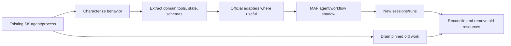

# Research Packet: Semantic Kernel Agent Ecosystem Deep Dive

> **Research date:** 2026-08-31
> **Scope:** Official Microsoft Semantic Kernel documentation, repositories/source, samples, releases, package registries, security advisories, and Microsoft Agent Framework migration direction.
> **Documentation output:** [`docs/frameworks/semantic-kernel/`](../../frameworks/semantic-kernel/README.md)
> **Source snapshot:** `microsoft/semantic-kernel` main commit `a64827ec8c5621eeaf7c4c5dabdb5355bb253177` (observed 2026-08-31; commit dated 2026-08-27).

## Executive conclusion

Semantic Kernel 1.x is an active, production-used integration library whose strategic role has narrowed. Microsoft Agent Framework 1.0 is the successor and the default destination for new Microsoft agent/session/workflow development. The evidence supports a selective strategy:

- retain stable SK kernels, service integrations, plugins/functions, filters, prompt assets, and data-plane components when they provide value;
- isolate domain capabilities, authorization, state, and effects from SK-specific agent types;
- avoid new production dependence on SK agent orchestration or Process Framework packages that remain preview/alpha/experimental;
- migrate agents, threads, and orchestration behavior to MAF in characterized stages;
- verify the exact language/package/provider because .NET, Python, and Java do not have feature or maturity parity;
- treat model-selected tools as a hostile-input execution boundary, reinforced by two critical 2026 SK advisories.

This conclusion is stronger than either “SK is dead” or “SK is still releasing, so nothing changed.” Maintenance, active use, strategic investment, and package maturity are different dimensions.

## Research questions

1. What lifecycle commitment has Microsoft actually published for SK after MAF 1.0?
2. Which SK surfaces are stable and independently retainable?
3. Where do agent/thread/message state and provider resources live?
4. How do plugin invocation and filters behave at the security boundary?
5. Which planner, orchestration, and Process APIs remain, and at what maturity?
6. How are memory/vector abstractions and connectors moving?
7. What are the real streaming, structured-output, observability, and testing obligations?
8. Which security failures have occurred and what architectural controls follow?
9. Where do .NET, Python, and Java differ?
10. What migration path preserves behavior without a high-risk rewrite?

## Method

Research used primary sources only for factual claims about current APIs, versions, support direction, and vulnerabilities:

1. inspected the existing repository's framework and migration documentation to prevent duplication;
2. read the official SK and MAF lifecycle announcements and migration guide;
3. inspected the current SK .NET/Python monorepo and separate Java repository/module structure;
4. compared official package registries with repository package metadata and release notes;
5. read Learn concept pages for kernel, services, agents, threads, function calling, filters, planners, process, vector stores, streaming, and observability;
6. inspected official migration samples for .NET and Python;
7. reviewed every published GitHub security advisory for the SK repository at the cutoff and Microsoft's vulnerability analysis;
8. cross-checked important maturity and behavior claims against source/package metadata where documentation could lag.

Community posts were not used as authority for current product behavior. Open issues and release pull requests were treated only as test leads unless corroborated by released code, documentation, or an advisory.

## Version and lifecycle snapshot

| Item | Verified state on 2026-08-31 | Evidence |
|---|---|---|
| SK repository | Active, not archived; README leads with MAF successor notice | [Repository](https://github.com/microsoft/semantic-kernel) |
| .NET core | `Microsoft.SemanticKernel` 1.80.0, released 2026-08-18 | [NuGet](https://www.nuget.org/packages/Microsoft.SemanticKernel/), [releases](https://github.com/microsoft/semantic-kernel/releases) |
| Python core | `semantic-kernel` 1.44.1, released 2026-08-06; Python 3.10+ | [PyPI](https://pypi.org/project/semantic-kernel/), [pyproject](https://github.com/microsoft/semantic-kernel/blob/main/python/pyproject.toml) |
| Java core | `com.microsoft.semantic-kernel:semantickernel-api` 1.5.0 stable; source main on 1.5.1-SNAPSHOT | [Maven Central](https://central.sonatype.com/artifact/com.microsoft.semantic-kernel/semantickernel-api), [Java repository](https://github.com/microsoft/semantic-kernel-java) |
| MAF | 1.0 generally available in .NET and Python in April 2026 | [MAF 1.0 announcement](https://devblogs.microsoft.com/agent-framework/microsoft-agent-framework-version-1-0/) |
| Lifecycle direction | MAF is successor; new agent investment moves there; SK 1.x remains supported for existing users | [SK and MAF announcement](https://devblogs.microsoft.com/agent-framework/semantic-kernel-and-microsoft-agent-framework/) |
| Exact SK end-of-life | No formal date found | Refresh when an official lifecycle/support page supplies one |

The October 2025 announcement said critical bugs and security issues would continue to be addressed and described support while substantial usage remains and for at least one year after MAF GA. This is useful planning evidence, but not a substitute for contractual support terms.

## Package maturity ledger

### .NET

Checked project metadata at the source snapshot showed:

| Surface | Observed package maturity |
|---|---|
| `Microsoft.SemanticKernel` and core abstractions | Stable 1.80 line |
| `Microsoft.SemanticKernel.Agents.Abstractions` / `.Agents.Core` | Stable 1.80 line |
| Azure AI and OpenAI agent packages | Preview |
| Agent orchestration and runtime abstractions/core/in-process | Preview |
| Magentic orchestration | Preview |
| YAML agent definitions | Beta |
| A2A, Bedrock, Copilot integrations | Alpha |
| Process abstractions/core/local/Dapr runtime | Alpha |

The relevant source roots are [`.NET Agents`](https://github.com/microsoft/semantic-kernel/tree/main/dotnet/src/Agents) and [`.NET Experimental`](https://github.com/microsoft/semantic-kernel/tree/main/dotnet/src/Experimental). Maturity suffixes are part of the adoption contract; the stable core version cannot be transferred to a preview/alpha companion package.

The .NET Core and Abstractions projects target `net10.0`, `net8.0`, and `netstandard2.0` in the checked source. The repository quickstart foregrounds .NET 10+, illustrating that quickstart prerequisites and published target frameworks answer different questions.

### Python

The stable `semantic-kernel` distribution contains a broad surface with optional extras including Anthropic, AWS, Azure, Chroma, Copilot Studio, FAISS, Google, Hugging Face, MCP, Milvus, Mistral, MongoDB, Ollama, ONNX, Oracle, Pinecone, PostgreSQL, Qdrant, realtime, Redis, SQL, USearch, and Weaviate. The [Python package metadata](https://github.com/microsoft/semantic-kernel/blob/main/python/pyproject.toml) is the inventory source.

One stable distribution does not give every nested API the same maturity. Source annotations, documentation warnings, and exact provider/extra tests remain necessary. Python 1.44.0/1.44.1 release notes include behavior marked breaking and MCP/OpenAPI/runtime hardening within the 1.x series.

### Java

Java is maintained in the separate [`microsoft/semantic-kernel-java`](https://github.com/microsoft/semantic-kernel-java) repository. The checked modules include core/API, a chat-completion agent module, AI-service connectors, and multiple data/vector connectors. No equivalent Process Framework or full .NET/Python orchestration module family was found. Maven Central is newer than the Java repository's GitHub release list at this snapshot, so registry metadata must win for the published version.

## Evidence ledger: lifecycle and architecture

| Claim | Evidence | Engineering implication | Confidence |
|---|---|---|---|
| MAF is the strategic successor | Current SK README, October 2025 announcement, MAF 1.0 announcement | Default new Microsoft agent development to MAF | High |
| SK 1.x remains maintained | Active repository and 2026 .NET/Python releases; lifecycle announcement | Patch and operate existing SK systems; do not force an immediate rewrite | High |
| Most new agent investment is in MAF | Official lifecycle announcement | Avoid deepening SK agent/orchestration coupling | High |
| No exact SK EOL date is published | Official sources reviewed supplied direction but no formal EOL date | Maintain a refresh trigger and do not invent a deadline | High |
| Kernel is a lightweight DI/orchestration container | [Kernel documentation](https://learn.microsoft.com/en-us/semantic-kernel/concepts/kernel) | It can be scoped cheaply; heavyweight clients can remain long-lived | High |
| Kernel composition is mutable | Docs recommend transient .NET kernel; source exposes mutable plugin/filter collections | Freeze composition or create scoped kernels | High |
| Kernel clone is not deep object isolation | [`.NET Kernel` source](https://github.com/microsoft/semantic-kernel/blob/main/dotnet/src/SemanticKernel.Abstractions/Kernel.cs) shares service provider/plugin objects while copying collections; Python source has analogous shared callables | Do not use clone as tenant or concurrency isolation | High |
| Connector abstraction cannot guarantee provider parity | Connector-specific release fixes, including Gemini function-list behavior | Maintain an adoption suite per connector/model pair | High |

## Evidence ledger: agents, threads, and messages

| Claim | Evidence | Engineering implication | Confidence |
|---|---|---|---|
| Agent state can be local or provider-hosted | [Agent architecture](https://learn.microsoft.com/en-us/semantic-kernel/frameworks/agent/agent-architecture), [thread API docs](https://learn.microsoft.com/en-us/semantic-kernel/frameworks/agent/agent-api) | Define persistence, retention, concurrency, and deletion per agent/thread family | High |
| Stateful agents can require matching thread types | Agent/thread architecture docs and provider-specific source | Fail fast on mismatches; persist provider mappings | High |
| Provider resources need provider-specific cleanup | Agent architecture and official SK-to-MAF migration guide | Keep a resource ledger and reconciled deletion job | High |
| Python final response carries the thread | Current Python `AgentResponseItem`/agent APIs | Persist the returned thread handle to avoid accidental new conversations | High |
| Streaming messages have distinct content types | [Agent streaming docs](https://learn.microsoft.com/en-us/semantic-kernel/frameworks/agent/agent-streaming) | Normalize typed events instead of string concatenation | High |
| Legacy `AgentGroupChat` is not the future API | Official orchestration guidance points to GroupChatOrchestration; current MAF direction supersedes SK agent expansion | Do not start new production work on legacy group chat | High |
| Thread history is not safe as authoritative business state | Architectural inference from reduction/provider storage/replay behavior | Externalize domain state and idempotency | High (inference) |

## Evidence ledger: plugins, function calling, and filters

| Claim | Evidence | Engineering implication | Confidence |
|---|---|---|---|
| Plugins can contain native, prompt, OpenAPI, and imported functions | [Plugin docs](https://learn.microsoft.com/en-us/semantic-kernel/concepts/plugins/) | Apply one reachability/authorization policy across sources | High |
| Automatic calling serializes schemas, binds calls, invokes, and loops | [Function-calling docs](https://learn.microsoft.com/en-us/semantic-kernel/concepts/ai-services/chat-completion/function-calling/) | Bound turns/tools/time/cost and validate arguments/results | High |
| Function choice supports subsets/required/none/automatic behavior | [Function-choice docs](https://learn.microsoft.com/en-us/semantic-kernel/concepts/ai-services/chat-completion/function-calling/function-choice-behaviors) | Separate advertisement from dispatcher authorization | High |
| Legacy planners were removed/deprecated | [Planning docs](https://learn.microsoft.com/en-us/semantic-kernel/concepts/planning) | Use native function calling; do not build new planner dependencies | High |
| Contextual function selection needs index synchronization | Official function-selection documentation | Version function schemas/descriptions/embeddings and rebuild on change | High |
| .NET/Python expose function, prompt-render, and auto-function filters | [Filter docs](https://learn.microsoft.com/en-us/semantic-kernel/concepts/enterprise-readiness/filters) | Place validation/policy/telemetry at the correct interception point | High |
| Filters can skip work or change results | Around-continuation semantics in docs/source | Treat order as correctness-critical and test it | High |
| .NET DI filter order is not guaranteed | Official filter docs | Register security-significant order explicitly | High |
| Direct/bypass paths can avoid filters | Filter/service invocation boundaries in docs and source | Reauthorize inside each effectful tool | High |

### Derived tool-security invariant

The model decides what it wants to call; the application decides whether it is allowed. This follows from the documented function-call loop plus the official vulnerability record. Tool schema visibility cannot be treated as authorization because a connector bug, imported server, direct dispatcher input, or prompt injection may produce a call outside intended business permissions.

## Evidence ledger: processes and orchestration

| Claim | Evidence | Engineering implication | Confidence |
|---|---|---|---|
| Agent orchestration patterns are experimental | [Orchestration docs](https://learn.microsoft.com/en-us/semantic-kernel/frameworks/agent/agent-orchestration/) and preview packages | Avoid a new critical production dependency without explicit risk acceptance | High |
| Documented patterns include Concurrent, Sequential, Handoff, Group Chat, Magentic | Official orchestration docs and source packages | Choose topology only for a measured coordination need | High |
| Process Framework is experimental | [Process overview](https://learn.microsoft.com/en-us/semantic-kernel/frameworks/process/process-framework) and alpha package metadata | It is not an implied durable workflow guarantee | High |
| Current checked Process runtimes are local and Dapr | [.NET experimental source](https://github.com/microsoft/semantic-kernel/tree/main/dotnet/src/Experimental) and Python source | Verify the runtime/package rather than relying on older diagrams | High |
| An older deployment page describes file/Orleans options not found in current package/source snapshot | [Process deployment page](https://learn.microsoft.com/en-us/semantic-kernel/frameworks/process/process-deployment) versus checked source/module tree | Record as documentation drift; do not promise those options | Medium-high |
| Process events/state do not establish exactly-once external effects | No such guarantee in the reviewed contracts; standard distributed-effect reasoning | Add idempotency, effect ledger, and reconciliation | High (inference) |
| MAF migration samples expose workflow checkpoint/resume concepts | [MAF Python migration samples](https://github.com/microsoft/agent-framework/tree/main/python/samples/semantic-kernel-migration) | Evaluate MAF/durable workflow as target by behavior, not SK type mapping | High |

## Evidence ledger: vector data and memory

| Claim | Evidence | Engineering implication | Confidence |
|---|---|---|---|
| Legacy .NET memory stores are moving to `VectorStore` abstractions | [Memory-store migration guide](https://learn.microsoft.com/en-us/semantic-kernel/support/migration/memory-store-migration) | Migrate schemas and retrieval explicitly, not by mechanical API rename | High |
| New abstractions support richer schemas/filter/index options | Same migration guide and vector documentation | Version schema, metric, dimensions, filters, and embedding model | High |
| .NET providers moved to `CommunityToolkit.VectorData` | SK 1.80 release and [AI Community Toolkit repository](https://github.com/CommunityToolkit/AI) | Track connector ownership/package independently of SK core | High |
| Python connectors remain optional SK extras | Python package metadata | Lock/test the exact extra and its native/transitive dependencies | High |
| Vector maturity differs by language/connector | Official connector docs/package layout | Avoid one global “vector stores are stable” statement | High |
| .NET agent memory providers are experimental | [Agent memory docs](https://learn.microsoft.com/en-us/semantic-kernel/frameworks/agent/agent-memory) | Treat extracted/recalled memories as derived untrusted context, not identity or business truth | High |
| Python in-memory filtering had critical RCE | [GHSA-xjw9-4gw8-4rqx](https://github.com/microsoft/semantic-kernel/security/advisories/GHSA-xjw9-4gw8-4rqx) | Patch to at least 1.39.4; never execute constructed filter expressions | High |
| SK vector search can bridge into MAF tools | [MAF migration guide](https://learn.microsoft.com/en-us/agent-framework/migration-guide/from-semantic-kernel/) | Retain the data plane while replacing the agent layer | High |

## Evidence ledger: streaming and structured output

| Claim | Evidence | Engineering implication | Confidence |
|---|---|---|---|
| Streams contain typed content beyond text | Agent streaming and chat streaming docs | Preserve content/tool/choice IDs and terminal events | High |
| Tool arguments may arrive in fragments | Provider/SK streaming content model | Buffer, cap, parse, validate, then dispatch | High |
| Structured-output APIs are connector/model-specific | Official SK examples and connector execution settings | Conformance-test schema, tools, streaming, refusals, and strictness together | High |
| Schema validity is not semantic correctness or authorization | Architectural consequence of schema scope | Apply domain and policy validation after parsing | High (inference) |
| Prompt template formats vary by language | Supported-language/template docs | Render-test prompts during language migration | High |

## Evidence ledger: observability and testing

| Claim | Evidence | Engineering implication | Confidence |
|---|---|---|---|
| SK integrates OTel logs/metrics/traces in .NET and Python | [Observability docs](https://learn.microsoft.com/en-us/semantic-kernel/concepts/enterprise-readiness/observability/) | Correlate model/function spans under an application run | High |
| Equivalent Java SK telemetry surface was not verified | Official supported-language/observability docs and Java modules reviewed | Instrument application and provider clients directly; do not claim parity | Medium-high |
| GenAI semantic conventions are evolving | SK observability docs and [OTel spec](https://opentelemetry.io/docs/specs/semconv/gen-ai/) | Pin dashboards/export behavior and tolerate convention changes | High |
| Sensitive prompt/completion capture is separately opt-in | SK observability docs and diagnostic switches | Keep it off by default; time-bound and protect incident capture | High |
| Release notes show behavior changes inside 1.x | .NET 1.79/1.80 and Python 1.44.x notes | Pin versions and run behavioral adoption suites | High |

### Minimum executable test set derived from evidence

1. plugin/filter unit tests without a model;
2. explicit filter enter/exit order and bypass-path tests;
3. scripted automatic-loop tests for malformed, excluded, repeated, parallel, and failing tools;
4. exact connector/model tests for tool choice, structured output, refusals, streaming, usage, and cancellation;
5. history reduction and concurrent-thread tests;
6. vector tenancy, stale deletion, reindex, and retrieval-quality tests;
7. hosted resource creation/deletion/reconciliation tests;
8. idempotency and unknown-outcome tests for writes;
9. prompt-injection tests through user, retrieval, tool result, OpenAPI, MCP, filename, and URL channels;
10. side-by-side migration characterization and canary tests.

## Security advisory analysis

### CVE-2026-26030: vector-filter RCE

The official advisory rates the Python issue critical and patches it in 1.39.4. Microsoft's analysis explains that filter construction reached Python evaluation and that blocklist-style controls were bypassable.

Derived controls:

- never interpolate user/model values into executable predicates;
- parse against an allowlisted grammar and use parameterized store APIs;
- patch even test/in-memory components exposed to untrusted queries;
- restrict the service identity and container so a parser defect has limited blast radius;
- test adversarial filter values and nested encodings.

### CVE-2026-25592: host file transfer through Sessions Python plugin

The official advisory patches the .NET plugin in 1.71.0 and Python in 1.39.3. Model-controlled path arguments could cross the sandbox/host boundary.

Derived controls:

- do not expose arbitrary host paths to the model;
- use server-generated artifact IDs and destinations;
- canonicalize beneath an allowlisted root and handle symlink/reparse escapes;
- isolate code execution from host storage and credentials;
- bind approval to an immutable, canonical effect;
- monitor file, child-process, and egress behavior.

### Security direction in later releases

Python 1.44.x release notes show ongoing OpenAPI/MCP hardening: validation of imported paths/URLs, enforcement of exclusions, collision handling, and approval callbacks. These reduce risk but do not supply a complete RBAC, durable approval, sandbox, or network policy system. The application remains the security boundary.

## Release-note test leads

| Release evidence | Why it matters | Adoption test |
|---|---|---|
| .NET 1.80 Gemini connector began honoring the supplied `FunctionChoiceBehavior` list correctly | Common abstractions can leak provider-specific divergence | Send an excluded function name and prove it cannot dispatch |
| .NET 1.80 removed migrated MEVD providers | Package ownership can change without a core architectural rewrite | Build/start with explicit new connector package and schema compatibility test |
| .NET 1.79 tightened mixed-separator UNC paths | Path normalization is a live security boundary | Test Windows/Unix separators, encoding, symlinks/reparse points, and allowlisted roots |
| .NET 1.79/1.80 changed dependencies/OpenAPI defaults | Transitive and network behavior can shift | SBOM diff, redirect/host/timeout tests, canary network traces |
| Python 1.44.x changed MCP approval/collision/exclusion behavior | Imported tool identity and reachability are security-sensitive | Duplicate-name, excluded-tool, reconnect, and approval-resume tests |
| Python 1.44.x marked some runtime behavior breaking | Semantic version alone does not prevent adoption risk | Scripted loop/session regression suite before promotion |

## Migration evidence and staged interpretation

The [official migration guide](https://learn.microsoft.com/en-us/agent-framework/migration-guide/from-semantic-kernel/) and migration sample sets establish several concrete directions:

- MAF agents do not require callers to build around an SK `Kernel` in the same way;
- MAF uses sessions where SK exposes agent-specific thread knowledge to callers;
- provider resource deletion remains provider-specific rather than universally abstracted;
- Python SK 1.38+ exposes `KernelFunction.as_agent_framework_tool` for compatibility;
- vector-store search functions can follow the same adapter path;
- official .NET samples cover side-by-side provider agent and orchestration migration;
- official Python samples compare chat, provider agents, orchestration, SK Process, and MAF workflows.

This supports an incremental strangler pattern, not a flag-day rewrite:

The migration unit is a behavioral seam: one agent/provider, one session owner, one workflow, or one tool surface. State/effect ownership must be fixed before the framework switch, otherwise migration only moves hidden reliability defects.

## Documentation and source discrepancy register

| Discrepancy | Observed evidence | Documentation treatment |
|---|---|---|
| Repository quickstart foregrounds .NET 10+, while checked Core/Abstractions targets include .NET 8 and .NET Standard 2.0 | README versus `.csproj` target frameworks | Distinguish recommended development baseline from published package compatibility |
| Historical Process deployment material mentions file/Orleans options, while current checked source exposes local and Dapr runtimes | [Process deployment page](https://learn.microsoft.com/en-us/semantic-kernel/frameworks/process/process-deployment) versus source/module tree | Do not promise old runtime options; verify exact package and tests |
| Java GitHub release list lags Maven Central stable artifact | GitHub releases versus registry | Use Maven Central/POM for published version |
| One stable Python package contains experimental/mixed-maturity surfaces | Distribution metadata versus API warnings/source | State maturity per feature, not per wheel |
| Stable `Agents.Core` coexists with preview/alpha provider and orchestration packages | NuGet/source package suffixes | Name exact package maturity in architectural decisions |
| Feature matrices and concept pages can predate connector/package moves | Page update dates versus 2026 releases/source | Attach research date and refresh on releases |

### Source-of-truth order used

- For a published version: package registry and package manifest.
- For current source behavior: tagged source where available, otherwise the recorded main commit.
- For supported public behavior: current official product documentation and release notes.
- For lifecycle direction: official Microsoft announcement/support material.
- For vulnerabilities: GitHub Security Advisory/MSRC/CVE record and patched release.
- For production guarantees: explicit contract plus executable recovery/adoption test—never a diagram alone.

## Language-specific conclusions

### .NET

- Best-documented and most modular package ecosystem.
- Kernel/core and Agents.Core stability must be separated from preview/alpha companion packages.
- Vector-provider extraction to `Microsoft.Extensions.VectorData`/CommunityToolkit is an important retained-data-plane direction.
- Explicit filter order and package target frameworks deserve source/package verification.
- MAF migration has first-party side-by-side samples.

### Python

- Broadest single-distribution integration surface through extras.
- Modern agent response/thread and async streaming shapes require careful state handling.
- Compatibility adapters offer the clearest incremental MAF path.
- Recent critical advisories and 1.44.x breaking/hardening notes make strict locking and adversarial tests mandatory.
- A stable wheel version does not imply every orchestration/process/provider API is stable.

### Java

- Separate repository, release cadence, modules, and narrower agent surface.
- Core/function-calling/chat agent/vector connectors can be useful, but .NET/Python guidance cannot be copied wholesale.
- No equivalent Process/orchestration/observability parity was verified.
- Maven Central should be checked even when GitHub Releases appears older.

## Alternatives considered

| Option | Strong fit | Limitation |
|---|---|---|
| Retain focused SK 1.x | Stable existing kernel/plugins/connectors with bounded roadmap | New Microsoft agent investment is elsewhere |
| Microsoft Agent Framework | New Microsoft agent/session/workflow systems and staged SK migration | Still needs application-owned authorization, state, operations, and provider tests |
| Direct provider SDK / `Microsoft.Extensions.AI` | Small single-agent/tool workloads or native-provider features | More explicit provider coupling and application integration |
| Durable workflow engine plus bounded agent activities | Long waits, approvals, effect recovery, timers, operator control | Additional infrastructure and workflow-version discipline |
| SK Process/agent orchestration | Bounded evaluation or existing pinned experimental workload | Alpha/preview maturity and uncertain durability contract |

No evidence supports adding multi-agent orchestration by default. One model with a small authorized tool set and deterministic workflow remains the preferred baseline until independent coordination measurably improves outcomes.

## Guide-set rationale

| Output guide | Why separate |
|---|---|
| [Ecosystem boundaries and lifecycle](../../frameworks/semantic-kernel/ecosystem-boundaries-and-lifecycle.md) | Prevents active maintenance from being confused with strategic investment |
| [Kernel, services, and connectors](../../frameworks/semantic-kernel/kernel-services-and-connectors.md) | Covers mutable composition, service routing, and provider parity |
| [Agents, threads, and messages](../../frameworks/semantic-kernel/agents-threads-and-messages.md) | Makes state/resource ownership explicit |
| [Plugins, functions, and tool calling](../../frameworks/semantic-kernel/plugins-functions-and-tool-calling.md) | Defines the model-to-effect execution boundary |
| [Filters, middleware, and policy](../../frameworks/semantic-kernel/filters-middleware-and-policy.md) | Filter order/bypass limitations require focused treatment |
| [Processes, planning, and orchestration](../../frameworks/semantic-kernel/processes-planning-and-orchestration.md) | Separates removed planners from experimental coordination/runtime APIs |
| [Memory, vector data, and RAG](../../frameworks/semantic-kernel/memory-vector-data-and-rag.md) | Data-plane versioning and connector extraction outlive agent migration |
| [Streaming, structured output, and multimodality](../../frameworks/semantic-kernel/streaming-structured-output-and-multimodality.md) | Typed partial protocols and schema validation create distinct failures |
| [Observability, testing, and debugging](../../frameworks/semantic-kernel/observability-testing-and-debugging.md) | Evidence and adoption tests are required across every boundary |
| [Security, permissions, and tool isolation](../../frameworks/semantic-kernel/security-permissions-and-tool-isolation.md) | Critical advisories demonstrate the need for a dedicated threat model |
| [Reliability, deployment, and operations](../../frameworks/semantic-kernel/reliability-deployment-and-operations.md) | Makes host-owned durability/idempotency/backpressure explicit |
| [Packages, language parity, and migration](../../frameworks/semantic-kernel/packages-language-parity-and-migration.md) | Prevents false parity and provides the staged exit path |

## Open questions and refresh triggers

### Open questions

- Will Microsoft publish a formal SK support/end-of-life schedule after the “at least one year after MAF GA” period?
- Which SK provider-agent, orchestration, YAML, and Process packages will change maturity or stop receiving feature work?
- Will Java receive a first-party MAF migration path or remain a separate SK-focused ecosystem?
- What durability, checkpoint compatibility, and operational guarantees will current MAF workflows document per language?
- Which remaining .NET vector connectors will move, stabilize, or be retired?
- Will SK/MAF adopt stable OpenTelemetry GenAI semantic conventions, and how will field names/redaction defaults change?
- Will imported MCP/OpenAPI approval and tool-identity policies converge across languages?

### Refresh immediately when

- an official SK lifecycle/EOL/security-support date appears;
- the SK repository is archived or release cadence materially changes;
- MAF publishes a migration compatibility change;
- any agent/orchestration/process package changes preview/beta/alpha status;
- NuGet, PyPI, or Maven core versions change with agent, connector, vector, telemetry, or security implications;
- a new GitHub/MSRC advisory affects SK or an official connector;
- vector providers move packages or `Microsoft.Extensions.VectorData` contracts change;
- process/orchestration runtime modules or documented durability guarantees change;
- Java gains/losses major agent or migration capabilities.

## Primary source catalog

### Lifecycle and migration

- [Semantic Kernel repository](https://github.com/microsoft/semantic-kernel)
- [Semantic Kernel and Microsoft Agent Framework](https://devblogs.microsoft.com/agent-framework/semantic-kernel-and-microsoft-agent-framework/)
- [Microsoft Agent Framework 1.0](https://devblogs.microsoft.com/agent-framework/microsoft-agent-framework-version-1-0/)
- [Migration from Semantic Kernel](https://learn.microsoft.com/en-us/agent-framework/migration-guide/from-semantic-kernel/)
- [SK .NET Agent Framework migration samples](https://github.com/microsoft/semantic-kernel/tree/main/dotnet/samples/AgentFrameworkMigration)
- [MAF Python Semantic Kernel migration samples](https://github.com/microsoft/agent-framework/tree/main/python/samples/semantic-kernel-migration)

### Packages, source, and releases

- [Semantic Kernel releases](https://github.com/microsoft/semantic-kernel/releases)
- [Microsoft.SemanticKernel on NuGet](https://www.nuget.org/packages/Microsoft.SemanticKernel/)
- [semantic-kernel on PyPI](https://pypi.org/project/semantic-kernel/)
- [Semantic Kernel Python package metadata](https://github.com/microsoft/semantic-kernel/blob/main/python/pyproject.toml)
- [Semantic Kernel Java repository](https://github.com/microsoft/semantic-kernel-java)
- [Semantic Kernel Java API on Maven Central](https://central.sonatype.com/artifact/com.microsoft.semantic-kernel/semantickernel-api)

### Architecture and execution

- [Kernel](https://learn.microsoft.com/en-us/semantic-kernel/concepts/kernel)
- [AI services](https://learn.microsoft.com/en-us/semantic-kernel/concepts/ai-services/)
- [Plugins](https://learn.microsoft.com/en-us/semantic-kernel/concepts/plugins/)
- [Function calling](https://learn.microsoft.com/en-us/semantic-kernel/concepts/ai-services/chat-completion/function-calling/)
- [Function choice behaviors](https://learn.microsoft.com/en-us/semantic-kernel/concepts/ai-services/chat-completion/function-calling/function-choice-behaviors)
- [Filters](https://learn.microsoft.com/en-us/semantic-kernel/concepts/enterprise-readiness/filters)
- [Planning](https://learn.microsoft.com/en-us/semantic-kernel/concepts/planning)

### Agents, process, data, and telemetry

- [Agent architecture](https://learn.microsoft.com/en-us/semantic-kernel/frameworks/agent/agent-architecture)
- [Common Agent API and thread management](https://learn.microsoft.com/en-us/semantic-kernel/frameworks/agent/agent-api)
- [Agent streaming](https://learn.microsoft.com/en-us/semantic-kernel/frameworks/agent/agent-streaming)
- [Agent orchestration](https://learn.microsoft.com/en-us/semantic-kernel/frameworks/agent/agent-orchestration/)
- [Process Framework](https://learn.microsoft.com/en-us/semantic-kernel/frameworks/process/process-framework)
- [Historical Process deployment page](https://learn.microsoft.com/en-us/semantic-kernel/frameworks/process/process-deployment)
- [Memory-store migration](https://learn.microsoft.com/en-us/semantic-kernel/support/migration/memory-store-migration)
- [Vector-store connectors](https://learn.microsoft.com/en-us/semantic-kernel/concepts/vector-store-connectors/)
- [Experimental agent memory](https://learn.microsoft.com/en-us/semantic-kernel/frameworks/agent/agent-memory)
- [AI Community Toolkit](https://github.com/CommunityToolkit/AI)
- [Semantic Kernel observability](https://learn.microsoft.com/en-us/semantic-kernel/concepts/enterprise-readiness/observability/)

### Security

- [Semantic Kernel security policy](https://github.com/microsoft/semantic-kernel/security/policy)
- [GHSA-xjw9-4gw8-4rqx / CVE-2026-26030](https://github.com/microsoft/semantic-kernel/security/advisories/GHSA-xjw9-4gw8-4rqx)
- [GHSA-2ww3-72rp-wpp4 / CVE-2026-25592](https://github.com/microsoft/semantic-kernel/security/advisories/GHSA-2ww3-72rp-wpp4)
- [Microsoft: When prompts become shells](https://www.microsoft.com/en-us/security/blog/2026/05/07/prompts-become-shells-rce-vulnerabilities-ai-agent-frameworks/)

## Final confidence assessment

Lifecycle direction, stable core versions, published advisories, planner removal, MAF migration adapters, and the broad package-maturity split are high-confidence because multiple primary sources agree. Exact experimental API signatures, individual provider behavior, and old Process deployment claims are intentionally not promoted into stable guarantees. They require exact-version source inspection and executable adoption/recovery tests at implementation time.
