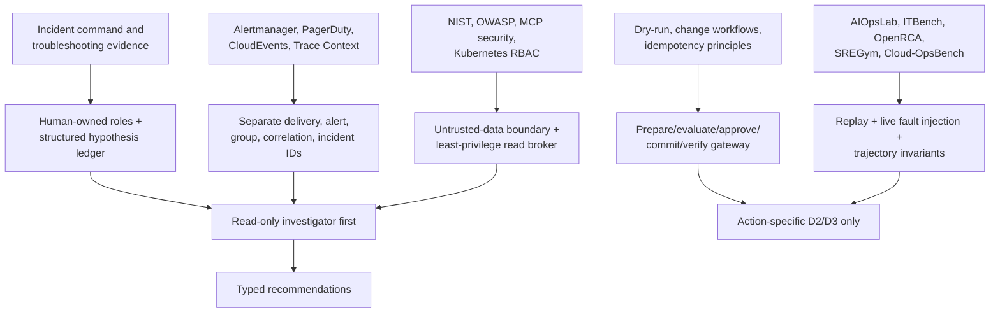

# Research Packet: Production SRE Incident-Response Agent Blueprint

> **Research completed:** 2026-08-31  
> **Blueprint:** [Production SRE Incident-Response Agent](../../agents/sre-incident-response-agent/README.md)  
> **Purpose:** Preserve the primary evidence, dated technical baseline, design synthesis, contradictions, limitations, and refresh triggers used to build the blueprint.

## 1. Research objective

Determine the smallest production architecture that can safely improve SRE incident response across alert intake, evidence gathering, hypothesis management, runbooks, coordination, communications, remediation, rollback, learning, and evaluation—while keeping diagnosis, recommendation, approval, and execution authority distinct.

The research tested these questions:

1. Which incident-management responsibilities must remain human-owned?
2. How should transport duplicate handling, alert grouping, and semantic incident correlation differ?
3. What evidence and timeline semantics prevent stale, missing, or correlated data from becoming false causal claims?
4. What security and distributed-systems guarantees are required before a model-proposed action may affect production?
5. Which capabilities belong to application code versus an agent SDK, graph library, workflow engine, tool protocol, model provider, or incident platform?
6. How should incident-specific evaluation and fault injection determine authority promotion?
7. What current standards, vendor limitations, and emerging benchmarks should be pinned for future refresh?

## 2. Method

Research began with primary operational and standards sources, then used benchmarks and current research to challenge optimistic autonomy assumptions.

### Source priority

1. Standards and government guidance: NIST, W3C, CloudEvents, OpenTelemetry.
2. Official SRE and incident-response material: Google SRE and PagerDuty response documentation.
3. Official infrastructure documentation and repositories: Prometheus Alertmanager, Kubernetes, MCP, AWS Systems Manager.
4. Official model-provider documentation for provider-specific statements.
5. Peer-reviewed papers, project repositories, and recent preprints for evaluation design and empirical limitations.

### Research themes

- incident command, roles, declaration, handoff, on-call, communications, and postmortems;
- alert/event identity, deduplication, grouping, inhibition, correlation, ordering, and provenance;
- paging/incident webhook delivery, change feeds, service catalogs, runbook registries, and ChatOps command surfaces;
- hypothetico-deductive troubleshooting, negative evidence, recovery versus root cause;
- generative/agentic AI risks, prompt injection, identity, least privilege, and tool protocols;
- dry-run, approvals, change workflows, idempotency, concurrency, rollback, and audit;
- OpenTelemetry logs/trace correlation and evolving GenAI conventions;
- live and replay evaluation for cloud/SRE agents, trajectory failures, and fault injection;
- framework/workflow boundaries, current provider tool-calling guidance, runtime choice, cost, and storm scaling.

Claims were cross-checked when they affected authority or data semantics. Vendor-reported results are labeled as case evidence rather than portable performance promises. Preprints and young benchmarks are labeled emerging. The packet records important tensions instead of flattening them into one “best practice.”

## 3. Executive synthesis

### 3.1 Strongly supported conclusions

1. **Incident roles and command must remain explicit.** Google and PagerDuty both describe clear command, delegated operations, communications, and an active record. This supports an agent that assists functions, not an “incident commander agent” that absorbs human authority.
2. **Restore service before demanding complete causal certainty.** Google’s troubleshooting guidance supports evidence-driven hypothesis testing while prioritizing user-impact mitigation. Therefore the system must represent “mitigation justified; root cause unresolved.”
3. **Alert plumbing and incident reasoning are separate.** Alertmanager’s grouping/dedup/inhibition and PagerDuty’s integration-scoped `dedup_key` behavior are protocol/routing mechanisms. Semantic incident correlation must preserve source identities and remain revisable.
4. **Model confidence cannot authorize an effect.** NIST AI 600-1, OWASP agentic risks, and operational evidence all support deterministic policy, least privilege, progressive authorization, and human review for consequential actions.
5. **Writes require a separate effect architecture.** Durable workflow retries are not semantic idempotency. A stable operation ID, canonical plan, exact approval, commit-time validation, provider receipt, ambiguity reconciliation, postcondition verification, and rollback are application guarantees.
6. **Dry-run is necessary but insufficient.** Kubernetes server-side dry-run is valuable because it follows much of authorization/defaulting/admission without persistence, but state can change and external effects may differ. Pair it with current-state validation, canarying, guardrails, and receipts.
7. **Evaluation must grade trajectories.** AIOpsLab, ITBench, OpenRCA, and newer benchmarks emphasize live or heterogeneous operational environments. Final-answer correctness alone cannot detect authority violations, duplicate effects, future leakage, or unsafe exploration.
8. **Start read-only.** Google reports promising internal AI-for-SRE systems and progressive autonomy patterns, while ITBench reports low end-to-end SRE resolution for tested agents. The combined evidence favors D0/D1 usefulness first, then action-specific D2/D3 promotion.

### 3.2 Design derived from the evidence

The default blueprint is a modular control service backed by a relational incident/event store, object artifacts, a queue, and bounded read adapters. A model helps with heterogeneous evidence, hypotheses, summaries, and proposals. Durable workflow is added for long waits and restart safety. Production writes, if any, go through an isolated gateway. Frameworks and protocols are replaceable integration layers rather than the owners of incident state or policy.

## 4. Dated version baseline

| Component | Baseline observed | Why it matters | Refresh condition |
|---|---|---|---|
| NIST SP 800-61 Rev. 3 | Final, April 2025; supersedes Rev. 2 | Current US-government incident-response guidance integrated with CSF 2.0 | NIST revision or errata |
| NIST AI 600-1 | July 2024 | Generative-AI risk profile including confabulation, privacy, and human–AI interaction | New AI RMF profile/revision |
| CloudEvents | 1.0.2; repository baseline current at research | Portable event envelope, not incident semantics | New stable spec or binding used by implementation |
| W3C Trace Context | W3C Recommendation, 23 Nov 2021 | Cross-system request correlation, not business/effect identity | New W3C Recommendation |
| OpenTelemetry Logs | Stable log data model in current specification | Occurrence versus observation time and trace/resource correlation | Stability or data-model change |
| OpenTelemetry semantic conventions | 1.44.0 observed in August 2026 | Current attribute registry; GenAI portions evolve separately | Any pinned convention or GenAI stability change |
| Prometheus Alertmanager | 0.32.1 released 29 Apr 2026 | Current documented grouping/dedup/routing behavior | Upgrade or config semantic change |
| Kubernetes docs | Current docs accessed 2026-08-31; server-side dry-run stable since v1.19 | Authorization, RBAC, dry-run, concurrency, audit | Cluster upgrade/admission/RBAC/audit change |
| MCP | 2025-11-25 latest final; 2026-07-28 release candidate/draft observed | Final core protocol/auth baseline, explicitly experimental Tasks, and non-final stateless-core direction | Finalization of RC, protocol negotiation, Tasks promotion/change, or any server/SDK upgrade |
| OWASP Agentic Applications Top 10 | 2026 list, released Dec 2025 | Current agent-specific threat taxonomy | New list or material guidance update |
| Google AI in SRE guide | 2026 practitioner report | Current large-organization case evidence and progressive authorization pattern | Updated report or underlying system publication |
| AIOpsLab | MLSys 2025 paper and active project | Live environment/fault-injection evaluation pattern | Major release or changed scenario model |
| ITBench | 2025 paper/current repositories | End-to-end SRE task evidence; reported 13.8% resolution in evaluated SRE scenarios | New benchmark version/results |
| OpenRCA | ICLR 2025 publication/repository | Heterogeneous telemetry and RCA evaluation | Dataset/task update |
| SREGym | 2026 project/publication | Emerging live SRE fault benchmark | Stable release, replication, or API change |
| Cloud-OpsBench | March 2026 preprint | Emerging cloud-operations benchmark | Peer review, repository/release, replicated results |
| OpenAI agent/model guidance | Official developer docs accessed 2026-08-31 | One current vendor example for Responses/tool/model controls | Model/API/guide update; recheck before implementation |

Do not infer that the blueprint requires all listed technologies. The table pins the evidence baseline and flags volatile integration claims.

## 5. Evidence map by design decision

| Design decision | Primary evidence | Synthesis and boundary |
|---|---|---|
| Human Incident Command remains authoritative | Google Managing Incidents; Google Workbook Incident Response; PagerDuty roles | Agent supplies state and recommendations; organizational accountability remains human |
| Only Operations changes systems in the role model | Google Managing Incidents | Maps cleanly to a separate effect path; exact local role assignments may differ |
| Page independently of enrichment | Google On-Call; Google AI-in-SRE “AI Alert” case | The report’s read-only enrichment example supports asynchronous assistance; independence is an architectural safety inference |
| Distinguish dedup/group/correlation | Alertmanager overview/config; PagerDuty Event Management | Source routing semantics are narrower than causal incident correlation |
| Preserve occurrence and observation time | OpenTelemetry log data model | Add ingestion/recording time for application needs |
| Hypotheses must be falsifiable and preserve negative evidence | Google Effective Troubleshooting | Implement as a structured ledger with predicted observations and contradictions |
| Mitigation can precede proven root cause | Google Effective Troubleshooting; incident practice | Resolution state must not falsely imply causal closure |
| Least privilege and no ambient agent mutation | NIST AI 600-1; OWASP Agentic 2026; Kubernetes RBAC; MCP security | Split read identities from action-specific gateway identities |
| Treat retrieved/tool content as untrusted | OWASP Agentic 2026; MCP tool/security model; NIST AI 600-1 | Tool description and output cannot change policy or identity |
| Exact approval and progressive authorization | Google AI-in-SRE guide; AWS change workflows as an implementation pattern | Application approval binds canonical effect; vendor workflow is not required |
| Dry-run plus current-state revalidation | Kubernetes API concepts; canary guidance | Dry-run cannot prove unchanged live state or every external side effect |
| Stable effect identity and reconciliation | Distributed effect/idempotency reasoning; provider idempotency contracts must be checked per action | Workflow/activity retries alone are insufficient |
| Canary and rollback under guardrails | Google Canarying Releases; Google Configuration Design | Rollback is itself an effect and can fail |
| Fact-constrained external updates | PagerDuty external communications; role guidance | Default to human Communications review; timing examples are not universal SLAs |
| Blameless postmortem plus owned actions | Google Postmortem Culture; PagerDuty postmortem guidance | Agent drafts; humans validate cause, learning, privacy, and ownership |
| App state differs from telemetry | OpenTelemetry role plus runtime principles | Trace sampling/loss makes telemetry unsuitable as authoritative workflow state |
| Evaluate live, heterogeneous trajectories | AIOpsLab; ITBench; OpenRCA; newer SRE benchmarks | Combine organization replay with isolated live fault injection and hard safety invariants |
| Start D0/D1 and promote specific action classes | Google case studies plus ITBench’s limited evaluated resolution | Promising assistance and weak general autonomy evidence are both true |
| Framework is convenience, not guarantee | Current SDK/provider/protocol docs contrasted with effect requirements | Explicitly test persistence, retry, auth, approvals, and audit per component |
| Adapter semantics are source-specific | PagerDuty webhook behavior; Alertmanager HA/webhooks; GitHub webhook docs; Slack Events API | Pin delivery IDs, signatures, acknowledgment, retry/redelivery, ordering, truncation, disablement, and gap recovery per source |
| Catalog data is discovery context, not runtime authority | Backstage catalog graph, lifecycle, and relation docs | Carry processing/freshness/orphan status; resolve live targets and authorization elsewhere |
| Telemetry partial/missing states must remain distinct | OTLP export semantics; Collector internal telemetry; OTel log model | Preserve rejected counts, coverage, queue/drop health, occurrence/observation time; do not retry OTLP partial success blindly |

## 6. Contradictions and tensions

### 6.1 Promising AI-in-SRE case results versus low benchmark resolution

Google’s 2026 practitioner report describes internal systems with meaningful usage and reported improvements, including a 10% mean-time-to-mitigate reduction for one hypothesis system and participation in thousands of incidents for an operator system. ITBench reports that evaluated agents resolved 13.8% of its SRE scenarios.

These are not directly comparable populations, tasks, organizations, or harnesses. The correct conclusion is neither “agents are ready” nor “agents do not work.” Build high-value read-only assistance; require local incident-specific evaluation before authority.

### 6.2 Alert deduplication versus incident correlation

Alertmanager grouping and PagerDuty `dedup_key` behavior are deterministic delivery/notification semantics. Semantic correlation can use topology, change, time, and causal evidence but is fallible. The blueprint preserves all IDs and represents merge/split as reversible relationships.

### 6.3 Recovery speed versus causal accuracy

Troubleshooting practice favors stopping impact before the entire causal story is established. Postmortems require careful causal analysis. The data model therefore separates effect verification/recovery from root-cause confidence and prevents a successful rollback from automatically becoming a proven single cause.

### 6.4 Human approval versus incident speed

Approval adds latency and can become performative under pressure. Removing it can create unacceptable agency. The blueprint reduces review burden with canonical diffs, precomputed risk, clear expiry, and progressively preauthorized **action classes**—not blanket autonomy.

### 6.5 Dry-run confidence versus live behavior

Kubernetes dry-run is strong and useful, but live state, admission behavior, controllers, quotas, traffic, and downstream systems can differ by commit time. The blueprint requires prepare-time evaluation, commit-time revalidation, canarying, observation, and rollback.

### 6.6 Durable workflow versus exactly-once effect

Workflow engines can replay activities and resume waits. That helps orchestration but creates duplicate-call opportunities. Exactly-once business effect requires stable semantic identity, durable receipt, provider-specific idempotency or state reconciliation, and current-state concurrency controls.

### 6.7 Model confidence versus action risk

Models can express confidence, but confidence may be poorly calibrated and does not encode blast radius, reversibility, or authorization. Low confidence can force human escalation; high confidence cannot raise authority. Deterministic policy evaluates risk and permission from typed state.

### 6.8 Historical incident memory versus anchoring and poisoning

Reviewed postmortems can seed useful hypotheses. They may also be stale, privacy-sensitive, causally wrong, or maliciously altered. Retrieval occurs after current scoping, filters on ownership/version/status, labels analogy, and never establishes current truth.

### 6.9 Multi-agent specialization versus coordination cost

Independent critics may find contradictions and parallel workers may reduce latency. They also duplicate queries, share blind spots, create state conflicts, and increase cost. The default is one coordinator/investigator with deterministic parallel reads. Add specialized model agents only when measured.

### 6.10 Observable reasoning versus chain-of-thought language

The Google practitioner report discusses capturing expert “Chain of Thought.” Model-provider reasoning internals may be hidden, summarized, privacy-sensitive, or inappropriate to persist. The blueprint interprets the operational need as observable decision records: evidence, hypotheses, alternatives, tests, policy decisions, actions, and outcomes—not dependence on private raw chain-of-thought.

### 6.11 Protocol interoperability versus application guarantees

MCP’s current specification can standardize tools and authorization flows. Its protocol/session semantics do not own tenant policy, durable incident state, exact approval, or semantic effect idempotency. Use a protocol behind an application broker, or use simpler typed adapters when interoperability is not valuable.

### 6.12 OpenTelemetry GenAI semantics versus stable internal schema

Standard conventions improve interoperability, but GenAI semantic conventions are evolving and some tool argument/result fields can be sensitive or high-volume. Pin versions, export safe subsets, and keep stable application-owned incident/effect fields.

### 6.13 AWS Change Manager pattern versus current product availability

AWS Change Manager illustrates reviewed runbooks, approvals, concurrency/error thresholds, and rollback workflows. AWS documentation says it is no longer open to new customers as of 7 November 2025. It is cited as a design pattern for existing users and comparative evidence, not recommended as a new universal platform.

### 6.14 External communication cadence versus organization commitments

PagerDuty provides practical timing examples for customer updates. A fixed cadence may be unsuitable for a given incident, industry, or contractual context. The blueprint requires organization-owned templates and expectations while retaining early awareness, factuality, and explicit next-update ownership.

### 6.15 LLM judging versus safety verification

Model judges can assess clarity and usefulness at scale, but they can share model bias and miss boundary violations. Use deterministic state/identity/effect/citation scorers for hard invariants and calibrated human/model review only for qualitative dimensions.

### 6.16 Final protocol baseline versus MCP release-candidate direction

The MCP project’s releases page identifies `2025-11-25` as the latest final release and `2026-07-28` as a release candidate whose specification remains draft and may change. The earlier integrated draft treated `2026-07-28` as final. This packet corrects that stale claim: production designs should pin `2025-11-25` unless they deliberately qualify the RC, and should treat Tasks in the final 2025-11-25 specification as experimental.

### 6.17 Catalog convenience versus live operational truth

Backstage documents its catalog as a processed, eventually consistent view of human mental models rather than exhaustive real-time inventory. It also says `ownedBy` is for ownership display, not runtime authorization. The blueprint can use a catalog to discover owners, declared dependencies, SLOs, and runbooks, but must surface processing/orphan/freshness state and use identity/policy plus live provider state for authority and commit-time targets.

### 6.18 Uniform webhook abstraction versus divergent delivery contracts

PagerDuty retries eligible webhook failures for up to 48 hours and can temporarily disable a subscription after repeated dropped deliveries; Alertmanager HA intentionally permits duplicates; Slack retries failed Events API requests and requires a rapid acknowledgement; GitHub does not automatically redeliver failures. A generic “webhooks are at least once” rule is therefore unsafe. Each adapter needs a source-specific manifest and an authoritative gap-recovery procedure.

## 7. Source inventory

### 7.1 Incident response and SRE practice

| Source | Type | Used for | Limitations |
|---|---|---|---|
| [Google SRE: Managing Incidents](https://sre.google/sre-book/managing-incidents/) | Primary engineering book | Command, Operations, Communications, Planning, live incident record, handoffs | Google-scale practices require local adaptation |
| [Google SRE Workbook: Incident Response](https://sre.google/workbook/incident-response/) | Primary engineering guidance | Declaration, clear command, roles, working record | Organizational model, not software protocol |
| [Google SRE: Effective Troubleshooting](https://sre.google/sre-book/effective-troubleshooting/) | Primary engineering book | Hypothetico-deductive investigation, evidence, mitigation versus cause | Examples predate current agent systems; principles remain relevant |
| [Google SRE Workbook: On-Call](https://sre.google/workbook/on-call/) | Primary engineering guidance | Actionable pages and sustainable on-call | Local page policy varies |
| [Google SRE Workbook: Alerting on SLOs](https://sre.google/workbook/alerting-on-slos/) | Primary engineering guidance | User-impact paging and multiwindow burn rate | Not every incident is captured by SLO alerts |
| [Google SRE Workbook: Canarying Releases](https://sre.google/workbook/canarying-releases/) | Primary engineering guidance | Progressive rollout and evaluation | Canary representativeness is environment-specific |
| [Google SRE Workbook: Configuration Design](https://sre.google/workbook/configuration-design/) | Primary engineering guidance | Safer configuration and rollback | Does not authorize automatic rollback |
| [Google SRE Workbook: Postmortem Culture](https://sre.google/workbook/postmortem-culture/) | Primary engineering guidance | Blameless learning and action follow-through | Requires organizational adoption |
| [Google AI in Reliability Engineering—2026 Practitioner’s Guide](https://sre.google/resources/practices-and-processes/ai-engineering-reliable-operations/) | Official practitioner report | Read-only alert enrichment, progressive authorization, actuation gateway, eval patterns, internal results | Observational/vendor-authored Google evidence; results are not portable |
| [PagerDuty Incident Response](https://response.pagerduty.com/) | Official vendor practice guide | Response lifecycle and templates | Vendor practice, not a formal standard |
| [PagerDuty response roles](https://response.pagerduty.com/before/different_roles/) | Official vendor practice guide | Incident Commander, deputy, scribe, SMEs | Role names and scale vary |
| [PagerDuty: During an Incident](https://response.pagerduty.com/during/during_an_incident/) | Official vendor practice guide | Coordination flow | Organization-specific tooling assumptions |
| [PagerDuty external communication guidelines](https://response.pagerduty.com/during/external_communication_guidelines/) | Official vendor practice guide | Early/cadenced external updates and templates | Timing examples are not universal obligations |
| [PagerDuty effective postmortems](https://response.pagerduty.com/after/effective_post_mortems/) | Official vendor practice guide | Learning and blamelessness | Requires local governance |
| [PagerDuty postmortem template](https://response.pagerduty.com/after/post_mortem_template/) | Official template | Postmortem structure | Template alone does not ensure causal quality |

### 7.2 Alert, event, and observability semantics

| Source | Type | Used for | Limitations |
|---|---|---|---|
| [Prometheus Alertmanager overview](https://prometheus.io/docs/alerting/latest/alertmanager/) | Official docs | Deduplication, grouping, routing, silencing, inhibition | Notification management, not incident causality |
| [Alertmanager configuration](https://prometheus.io/docs/alerting/latest/configuration/) | Official docs | Grouping and inhibition behavior, `group_wait` trade-off | Actual behavior depends on configuration |
| [Alertmanager high availability](https://prometheus.io/docs/alerting/latest/high_availability/) | Official docs | HA delivery considerations | Does not create exactly-once downstream processing |
| [Alertmanager repository/releases](https://github.com/prometheus/alertmanager) | Official repository | Version baseline 0.32.1 | Recheck deployed version |
| [PagerDuty Event Management](https://support.pagerduty.com/main/docs/event-management) | Official docs | `dedup_key` behavior and event lifecycle | Integration/service scoped; product behavior can change |
| [PagerDuty Incidents](https://support.pagerduty.com/main/docs/incidents) | Official docs | Incident object/lifecycle context | Vendor-specific semantics |
| [CloudEvents specification](https://github.com/cloudevents/spec) | Open specification | Event envelope/version baseline | No incident, approval, or effect semantics |
| [W3C Trace Context](https://www.w3.org/TR/trace-context/) | Web standard | Cross-system request correlation | Trace IDs are not incident/effect identities |
| [OpenTelemetry Logs specification](https://opentelemetry.io/docs/specs/otel/logs/) | Open specification | Log correlation and collection model | Implementation and backend support vary |
| [OpenTelemetry Logs data model](https://opentelemetry.io/docs/specs/otel/logs/data-model/) | Open specification | Timestamp/ObservedTimestamp and resource/trace context | Source systems may not provide every field |
| [OpenTelemetry semantic conventions](https://opentelemetry.io/docs/specs/semconv/) | Open specification | Versioned telemetry vocabulary | GenAI conventions and attribute stability evolve |
| [OpenTelemetry Protocol](https://opentelemetry.io/docs/specs/otlp/) | Open specification | Full/partial/failure export, retry, throttling, and message limits | Export semantics do not establish source-query completeness |
| [OpenTelemetry Collector internal telemetry](https://opentelemetry.io/docs/collector/internal-telemetry/) | Official project docs | Queue capacity, refused/enqueue/send failures, data-flow health | Metric names/configuration must match deployed Collector version |
| [PagerDuty webhook behavior](https://github.com/PagerDuty/developer-docs/blob/main/docs/webhooks/02-Behavior.md) | Official developer docs | Timeout, retry/drop/disablement, ordering, at-least-once, `X-Webhook-Id`, size behavior | Documentation warns behavior may change; test deployed subscription |
| [PagerDuty webhook signatures](https://github.com/PagerDuty/developer-docs/blob/main/docs/webhooks/04-Signatures.md) | Official developer docs | Raw-body HMAC verification and rotation | Secret custody and replay policy remain application concerns |
| [GitHub webhook validation](https://docs.github.com/en/webhooks/using-webhooks/validating-webhook-deliveries) | Official product docs | Raw-body HMAC-SHA256 verification | Webhook secret/version remains deployment-specific |
| [GitHub failed webhook delivery](https://docs.github.com/en/webhooks/using-webhooks/handling-failed-webhook-deliveries) | Official product docs | No automatic redelivery; polling/redelivery recovery pattern | Recent-delivery retention and permissions constrain recovery |
| [GitHub deployment events](https://docs.github.com/en/webhooks/webhook-events-and-payloads#deployment_status) | Official product docs | Deployment versus deployment-status change records | Not a complete cross-provider change model |
| [Backstage catalog graph guidance](https://backstage.io/docs/features/software-catalog/creating-the-catalog-graph/) | Official project docs | Human-model scope, caching role, declared ownership/dependencies | Not real-time inventory or runtime authorization |
| [Backstage entity lifecycle](https://backstage.io/docs/features/software-catalog/life-of-an-entity/) | Official project docs | Ingestion/processing/stitching, errors, orphaning | Deployment configuration affects deletion/error behavior |
| [Backstage well-known relations](https://backstage.io/docs/features/software-catalog/well-known-relations/) | Official project docs | Directional ownership/dependency semantics and authorization caveat | Relations may be stale or dangling and need local governance |
| [Slack request verification](https://docs.slack.dev/authentication/verifying-requests-from-slack/) | Official product docs | Raw-body signature, timestamp/replay check, constant-time comparison | Chat identity still needs enterprise/incident-role mapping |
| [Slack Events API](https://docs.slack.dev/apis/events-api/) | Official product docs | Event identity, fast acknowledgment, retries, rate/disablement behavior | Chat delivery is not canonical command or approval state |

### 7.3 Security, identity, protocols, and change safety

| Source | Type | Used for | Limitations |
|---|---|---|---|
| [NIST SP 800-61 Rev. 3](https://doi.org/10.6028/NIST.SP.800-61r3) | Government standard/guidance | Current incident-response baseline | Risk guidance, not an agent implementation |
| [NIST AI 600-1](https://doi.org/10.6028/NIST.AI.600-1) | Government risk profile | Confabulation, privacy, human–AI risks | Cross-sector profile; specialize locally |
| [OWASP Top 10 for Agentic Applications 2026](https://genai.owasp.org/resource/owasp-top-10-for-agentic-applications-for-2026/) | Security community guidance | Goal hijack, tool misuse, identity, supply chain, code execution | Threat taxonomy, not a certification |
| [MCP 2025-11-25 final specification](https://modelcontextprotocol.io/specification/2025-11-25) | Official protocol specification | Latest final baseline at research date | Optional; pin client/server/SDK behavior |
| [MCP 2025-11-25 Tasks](https://modelcontextprotocol.io/specification/2025-11-25/basic/utilities/tasks) | Official protocol specification | Durable task abstraction and context binding | Explicitly experimental in this revision |
| [MCP releases](https://github.com/modelcontextprotocol/modelcontextprotocol/releases) | Official protocol project | Establishes `2026-07-28` as RC/draft and `2025-11-25` as final | Recheck finalization and SDK adoption |
| [MCP 2026-07-28 draft changelog](https://github.com/modelcontextprotocol/modelcontextprotocol/blob/main/docs/specification/2026-07-28/changelog.mdx) | Official draft | Non-final stateless-core/version direction | Do not treat as stable production contract |
| [MCP tools, 2025-11-25](https://modelcontextprotocol.io/specification/2025-11-25/server/tools) | Official specification | Tool discovery/invocation boundary | Tool metadata/results remain untrusted |
| [MCP authorization, 2025-11-25](https://modelcontextprotocol.io/specification/2025-11-25/basic/authorization) | Official specification | Audience binding, confused deputy, no token passthrough | Application policy remains separate |
| [Kubernetes authorization](https://kubernetes.io/docs/reference/access-authn-authz/authorization/) | Official docs | Authorization model | Cluster configuration is authoritative |
| [Kubernetes RBAC good practices](https://kubernetes.io/docs/concepts/security/rbac-good-practices/) | Official docs | Least privilege and escalation hazards | Requires workload-specific review |
| [Kubernetes API concepts](https://kubernetes.io/docs/reference/using-api/api-concepts/) | Official docs | Dry-run and concurrency/resource versions | Dry-run is not live-effect equivalence |
| [Kubernetes auditing](https://kubernetes.io/docs/tasks/debug/debug-cluster/audit/) | Official docs | Security-relevant chronological audit | Volume, policy, and sensitive bodies need management |
| [AWS Systems Manager Change Manager](https://docs.aws.amazon.com/systems-manager/latest/userguide/change-manager.html) | Official product docs | Approved runbooks and change controls | Product-specific; unavailable to new customers from Nov 2025 |
| [AWS Change Manager availability note](https://docs.aws.amazon.com/systems-manager/latest/userguide/change-requests.html) | Official product docs | New-customer limitation date | Existing-customer behavior can still evolve |
| [AWS Automation approvals](https://docs.aws.amazon.com/systems-manager/latest/userguide/running-automations-require-approvals.html) | Official product docs | Approval step pattern | Does not substitute for application effect semantics |

### 7.4 Agent evaluation and current empirical evidence

| Source | Type | Used for | Limitations |
|---|---|---|---|
| [AIOpsLab paper](https://www.microsoft.com/en-us/research/publication/aiopslab-a-holistic-framework-for-evaluating-ai-agents-for-enabling-autonomous-cloud/) | Peer-reviewed project publication | Holistic/live environment, fault/workload injection, agent–cloud interface | Research framework, not a production control plane |
| [AIOpsLab repository](https://github.com/microsoft/AIOpsLab) | Research repository | Implementation/scenario reference | Verify maturity and compatibility before reuse |
| [ITBench paper](https://arxiv.org/abs/2502.05352) | Research paper/preprint record | Static/live SRE scenarios and reported 13.8% result | Specific agents, tasks, versions, and scoring; not universal |
| [ITBench evaluations](https://github.com/itbench-hub/ITBench-Evaluations) | Research repository | Evaluation harness pattern | Research code; inspect releases and security before use |
| [OpenRCA repository](https://github.com/microsoft/OpenRCA) | Peer-reviewed research artifact | Heterogeneous telemetry and RCA task | Focused benchmark, not end-to-end incident authority |
| [OpenRCA paper](https://openreview.net/forum?id=M4qNIzQYpd) | ICLR 2025 paper | RCA dataset/task rationale | Benchmark transfer is limited |
| [Why Agents Fail in Cloud Root Cause Analysis](https://arxiv.org/abs/2602.09937) | 2026 preprint | Failure taxonomy around interpretation/exploration | Emerging, not yet a general prevalence estimate |
| [SREGym repository](https://github.com/SREGym/SREGym) | 2026 research project | Live SRE incident/fault benchmark pattern | Young project; validate release and reproducibility |
| [Cloud-OpsBench](https://arxiv.org/abs/2603.00468) | 2026 preprint | Emerging cloud-operations benchmark | Preprint; recheck peer review and artifacts |

### 7.5 Model-provider implementation evidence

| Source | Type | Used for | Limitations |
|---|---|---|---|
| [OpenAI current model/agent guidance](https://developers.openai.com/api/docs/guides/latest-model) | Official vendor docs | Current Responses guidance, explicit autonomy, tool description, quality/latency/cost evaluation | Vendor-specific and volatile; not the blueprint’s architecture authority |
| [OpenAI Responses API create reference](https://developers.openai.com/api/reference/cli/resources/responses/methods/create) | Official API reference | Structured/function tools and call controls | Syntax and provider controls do not supply semantic authorization/effects |

## 8. Sources considered but deliberately not elevated

- Generic “autonomous SRE agent” marketing pages without reproducible methods were not used for safety or capability claims.
- Community posts were useful for search vocabulary but were not needed when primary sources covered the behavior.
- A single vendor’s autonomy levels were not adopted verbatim; the blueprint defines D0–D4 around actual authority and effect boundaries.
- Tool-protocol or framework examples were not treated as proof of durability, authorization, or exactly-once effects.
- Benchmark leaderboard numbers were not converted into production success probabilities.
- FEMA ICS material was not required for the software blueprint because the selected Google/PagerDuty sources already describe the software-incident adaptation; organizations using formal ICS/NIMS should map local roles explicitly.

## 9. Remaining uncertainties and limitations

1. **No target organization was specified.** Data classifications, regulatory duties, severity model, role names, approval assurance, SLOs, retention, and communication obligations must be specialized.
2. **No live integrations were tested.** Webhook signatures, retry windows, API idempotency, dry-run, rate limits, pagination, partial responses, RBAC, and audit behavior must be verified against deployed versions.
3. **Effect safety is action-specific.** The blueprint cannot prove that restart, scale, rollback, failover, feature-flag, traffic, database, or access actions are safe without provider and service analysis.
4. **Research benchmarks have transfer limits.** Their tasks, telemetry, models, versions, scoring, and fault distributions differ from a production organization.
5. **Google case-study figures are contextual.** They are valuable evidence of feasibility and design, not guaranteed MTTM improvements elsewhere.
6. **Emerging 2026 work may change.** The RCA failure preprint, SREGym, and Cloud-OpsBench should be revisited after peer review, stable releases, and replication.
7. **Protocol/provider details are volatile.** MCP’s 2026-07-28 revision was still an RC/draft at research time; OpenTelemetry GenAI conventions have moved to a separate repository; provider model APIs and model behavior require implementation-time confirmation.
8. **Human factors need local study.** Automation bias, alert fatigue, approval quality, trust, handoff, and communications benefit require responder-centered pilots, not only automated scores.
9. **Security requires a system-specific model.** Network paths, credential escalation, sensitive telemetry, supply chain, insider threats, and tenant architecture were not available.
10. **Cost figures are intentionally absent.** Provider prices, observability costs, volume, and staffing are volatile and organization-specific; build a measured local cost model.

## 10. Refresh triggers

Refresh the relevant guide and this packet when:

- NIST, OWASP, W3C, CloudEvents, OpenTelemetry, Kubernetes, Alertmanager, MCP, or a selected provider changes relevant semantics;
- a deployed incident, paging, observability, cloud, model, tool, workflow, or communications API is upgraded;
- a source changes signature, retry, dedup, ordering, pagination, rate-limit, partial-result, or delivery guarantees;
- an effect provider adds/removes idempotency, plan, dry-run, status, rollback, or concurrency support;
- a runbook, policy, role, tenant model, environment, credential, or audit system changes;
- a model, prompt, context compiler, tool description, framework, workflow engine, or fallback route changes;
- a new benchmark or internal incident reveals materially different investigation or actuation failures;
- a security incident, prompt injection, near miss, duplicate/unknown effect, bad communication, or failed rollback violates an invariant;
- responders show automation bias, low usefulness, missed handoffs, or excessive approval fatigue;
- an action class is considered for D2/D3, expands scope, or fails its promotion gate;
- vendor availability or support changes, including AWS Change Manager’s documented restriction;
- six months elapse without a focused standards/provider/benchmark review, even if no trigger is known.

## 11. Research-to-implementation handoff

Before implementation, convert this research into organization-owned artifacts:

- threat model and data-flow diagram with actual systems and tenants;
- role/RACI and severity/authority policy;
- signed event contracts for each alert source;
- evidence-source matrix with identity, data class, freshness, coverage, rate, and failure semantics;
- service/runbook registry ownership and validation process;
- action-class safety case and effect-provider contract;
- replay corpus, live sandbox, invariant suite, scoring thresholds, and stochastic sample plan;
- latency/cost/capacity budgets and storm test;
- manual takeover, kill switch, credential revocation, reconciliation, and rollback drills;
- version/refresh register owned by an operating team.

The blueprint is complete as an engineering design reference. It is not an authorization to connect a model to production writes.
