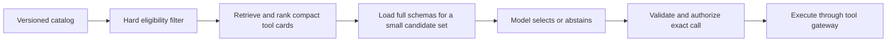
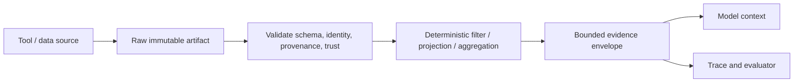

# Research Packet: Tool Fleet Engineering

> **Status:** Active research packet  
> **Research date:** 2026-08-30  
> **Scope:** Tool discovery and selection, registry trust, schema evolution, tool-result reduction and provenance, fleet reliability, and safe retirement.  
> **Protocol baseline:** MCP 2026-07-28 where MCP mechanics are discussed.  
> **Method:** Primary provider/framework/protocol documentation was compared with standards, government security guidance, peer-reviewed tool-retrieval and function-calling benchmarks, and operational API/supply-chain practice. Numeric provider claims are treated as workload-specific and volatile.

This packet extends the single-tool contract into a production catalog. It records what remains true when an agent can access dozens, hundreds, or thousands of capabilities owned by different teams and suppliers.

## Research questions

1. How should an agent find the right tool without placing the full catalog in model context?
2. Which decisions belong to catalog retrieval, eligibility policy, model selection, and authorization?
3. How should tool identity and schemas evolve without silently changing active runs?
4. How should large or untrusted results reach the model without destroying context or provenance?
5. What must a registry prove—and what can it never prove by metadata alone?
6. How are tools onboarded, canaried, observed, contained, deprecated, and removed?

## Finding 1: tool discovery is staged retrieval, not authorization

Provider and framework documentation now exposes multiple mechanisms for reducing the visible tool set: Anthropic tool search, current OpenAI deferred/BYOT tool search and allowed-tool controls, LangChain dynamic selection middleware, Microsoft runtime add/remove and middleware gating, and Google ADK toolset filtering. The implementations differ, but all reveal the same architecture.

The stages answer different questions:

| Stage | Question | Required inputs |
|---|---|---|
| Eligibility | May this principal/run even see or use the capability? | tenant, role, data region, risk/effect class, workflow stage, release, feature flag |
| Retrieval | Which eligible capabilities appear relevant? | objective, current plan step, domain/entity terms, compact metadata |
| Schema loading | What exact contract should the caller see? | pinned tool version and catalog fingerprint |
| Model selection | Which candidate, if any, fits the current semantic need? | candidate definitions, examples, current state |
| Authorization | May this exact operation with canonical arguments commit now? | principal, current resource state, grant/approval, policy, budget |

Retrieval must never expand authority. Filter disallowed tools before retrieval so their names, descriptions, or schemas do not leak capabilities. Recheck authorization at call/commit because the state and arguments were not known during discovery.

Anthropic reports that loading every definition can consume tens of thousands of tokens and says selection degrades as catalogs grow; its tool-search product loads only a few definitions on demand. Those numbers are vendor evaluations, not universal thresholds. ToolRet provides broader independent evidence: generic retrieval models perform imperfectly on 7.6k tasks over a heterogeneous 43k-tool corpus, while many earlier benchmarks hand the model a preselected small candidate set. The durable conclusion is to evaluate the full selection pipeline on the real catalog rather than copy a fixed top-k or tool-count limit.

### Sources

- [Anthropic tool search](https://platform.claude.com/docs/en/agents-and-tools/tool-use/tool-search-tool)
- [Anthropic advanced tool use engineering report](https://www.anthropic.com/engineering/advanced-tool-use)
- [OpenAI current model/tool-search guidance](https://developers.openai.com/api/docs/guides/latest-model)
- [Microsoft Agent Framework function tools](https://learn.microsoft.com/en-us/agent-framework/agents/tools/function-tools)
- [LangChain agents and dynamic tool selection](https://docs.langchain.com/oss/javascript/langchain/agents)
- [Google ADK `MCPToolset`](https://adk.dev/api-reference/typescript/classes/MCPToolset.html)
- [ToolRet, Findings of ACL 2025](https://aclanthology.org/2025.findings-acl.1258/)

## Finding 2: metadata quality and catalog ambiguity dominate many failures

Tool schemas are both machine constraints and model-facing documentation. Official Anthropic guidance emphasizes when/not-when descriptions, parameter semantics, limitations, examples for complex inputs, namespacing, and concise results. OpenAPI requires unique `operationId` values within a description. Frameworks commonly generate schemas from function signatures and docstrings, which is convenient but can turn weak internal names into a production model interface.

A useful compact tool card contains:

- stable namespaced identity, owner, version/digest, lifecycle state;
- one-sentence purpose and explicit when/not-when guidance;
- domain entities, operations, modalities, and search synonyms;
- effect/risk class, data classes, region and runtime constraints;
- authentication/grant type and tenant scope;
- parameter/output field summary plus representative examples;
- timeout, rate/cost class, idempotency/reconciliation support;
- related, superseding, conflicting, or fallback tools;
- provenance and last verified time.

Do not use marketing prose as retrieval metadata. Near-duplicate names and descriptions cause ambiguity; overbroad descriptions win retrieval for unrelated tasks. BiasBusters (ICLR 2026) finds selection bias among functionally equivalent tools, and ToolTweak demonstrates that adversarially manipulated names/descriptions can steer selection. These are research results with bounded setups, but they reinforce a production threat: catalog metadata is an input surface and marketplace ranking is not a trust signal.

### Stable conclusion

Treat tool metadata as versioned production configuration. Lint names, namespace collisions, vague/overlapping descriptions, missing negative guidance, and inconsistent risk labels. Red-team malicious or popularity-optimized entries. Rank relevance only among already eligible tools, then expose a small diverse set with an abstain/no-tool option.

### Sources

- [Anthropic: Define tools](https://platform.claude.com/docs/en/agents-and-tools/tool-use/define-tools)
- [OpenAPI 3.2.0](https://spec.openapis.org/oas/latest.html)
- [BiasBusters, ICLR 2026](https://www.microsoft.com/en-us/research/publication/biasbusters-uncovering-and-mitigating-tool-selection-bias-in-large-language-models/)
- [ToolTweak, ICLR 2026](https://openreview.net/forum?id=dQXa5jvpQN)

## Finding 3: tool-selection evaluation must include abstention and trajectories

The Berkeley Function Calling Leaderboard evolved from single calls into parallel, multi-turn, stateful, and abstention evaluation. ToolRet isolates retrieval against a much larger catalog. Neither substitutes for local outcome and policy evaluation: benchmark tools, model versions, schemas, and environments differ from the production fleet.

Evaluate the stages separately and together:

| Layer | Metrics and failure slices |
|---|---|
| Eligibility | forbidden-tool exposure, tenant/region leaks, missing eligible tool |
| Retrieval | recall@k, nDCG/MRR, latency, candidate diversity, correct-version recall |
| Model choice | correct tool, no-tool/clarification precision, near-duplicate confusion, unnecessary call |
| Arguments | schema validity, semantic validity, resolved entity/resource, invented identifiers |
| Trajectory | ordering, repeated calls, stale schema use, dynamic add/remove, parallel safety |
| Outcome | verified state, effect count, evidence/provenance, cost, deadline, policy violations |

Include negative requests where no tool should run; vague requests requiring clarification; renamed/deprecated tools; permission changes mid-run; misleading metadata; overlapping read/write tools; unavailable dependencies; wrong-region and wrong-tenant candidates; poisoned tool results; and catalog additions/removals. Weight a wrong destructive tool more heavily than a missed optional lookup.

### Sources

- [BFCL paper, ICML 2025](https://proceedings.mlr.press/v267/patil25a.html)
- [ToolRet, Findings of ACL 2025](https://aclanthology.org/2025.findings-acl.1258/)

## Finding 4: protocol discovery and registry discovery are different layers

MCP `tools/list` describes the tools exposed by one server; the operation is paginated and its list can change. The 2026-07-28 release adds explicit caching information for list results and replaces earlier connection assumptions with stateless requests and an optional discovery RPC. An ecosystem registry, by contrast, describes servers/packages that might be installed or connected.

The official MCP Registry is currently preview. Its own documentation says it is a metadata repository, does not host packages, is not intended to be consumed directly by host applications, does not serve private servers, and gives its aggregator API no uptime/durability guarantee. Namespace verification ties a name to a publisher identity; it does not establish safety, quality, uptime, least privilege, or runtime behavior.

This creates three separate inventories:

1. **supplier/server registry:** what can be acquired or connected;
2. **approved internal catalog:** what the organization has reviewed, pinned, configured, and assigned an owner;
3. **per-run exposed set:** the eligible versioned capabilities actually available to the model.

NSA's May 2026 MCP security guidance recommends enterprise controls for authentication, validation, logging, least privilege, network boundaries, and approved server use. Ordinary software supply-chain controls still apply: inspect provenance, pin immutable package/image/artifact digests where possible, lock dependencies, scan, stage, sandbox local processes, restrict egress, and retain a revocation path.

### Freshness disagreement

Some current framework integration pages still describe MCP's older stateful initialization and connection-affinity model. The MCP 2026-07-28 primary specification retired that protocol-level handshake/session. Use a pinned protocol version and conformance tests; treat wrapper documentation as implementation evidence that may lag the standard.

### Sources

- [MCP 2026-07-28 release](https://blog.modelcontextprotocol.io/posts/2026-07-28/)
- [MCP tools specification](https://modelcontextprotocol.io/specification/draft/server/tools)
- [Official MCP Registry overview](https://modelcontextprotocol.io/registry/about)
- [MCP Registry aggregator caveats](https://modelcontextprotocol.io/registry/registry-aggregators)
- [NSA MCP security design considerations](https://www.nsa.gov/Portals/75/documents/Cybersecurity/CSI_MCP_SECURITY.pdf)
- [NIST software supply-chain guidance](https://www.nist.gov/itl/executive-order-14028-improving-nations-cybersecurity/software-supply-chain-security-guidance-14)
- [Google ADK MCP integration page](https://adk.dev/tools-custom/mcp-tools/)

## Finding 5: version the semantic contract, not just JSON shape

A tool change can be syntactically compatible but behaviorally breaking. Examples include changing default scope, sort order, units, authorization, side effects, idempotency, error meaning, freshness, or the resource selected by an identifier. Tight JSON Schema validation catches malformed arguments, not semantic drift.

| Change | Default classification |
|---|---|
| Remove/rename a parameter or output field | Breaking |
| Add a required input | Breaking |
| Narrow an accepted enum/range | Breaking |
| Change type, unit, interpretation, default, or resource resolution | Breaking |
| Read becomes write; effect/risk/open-world behavior increases | Security-breaking; new approval/review required |
| Change idempotency or retry semantics | Reliability-breaking |
| Add an optional input with unchanged old behavior | Usually backward-compatible; test generated clients/model behavior |
| Add an output field | Often compatible for tolerant consumers; strict schemas and prompts may break |
| Improve description/examples without runtime change | Behavioral release: selection can change, so evaluate and canary |

Keep a stable logical tool identity and immutable versioned definitions. Record a content fingerprint of name, descriptions, input/output schemas, security annotations, endpoint/server identity, and relevant capabilities. A version string is self-asserted metadata; observed fingerprints expose undeclared drift.

MCP annotations such as read-only, destructive, idempotent, and open-world are explicitly hints and must be treated as untrusted unless the server is trusted. Changing them is a review signal, not proof of safe behavior. The 2026-07-28 MCP result schema can describe any JSON value under JSON Schema 2020-12; multi-version servers need compatibility tests for older object-only structured-result expectations.

### Stable conclusion

Pin active runs to a reviewed tool contract. Run compatibility, selection, policy, effect, and replay tests on every definition or implementation change. Support overlapping old/new versions, adapters, and a deprecation window; remove only after usage and active-run reachability reach zero or an emergency revoke is required.

### Sources

- [MCP tool annotations risk vocabulary](https://blog.modelcontextprotocol.io/posts/2026-03-16-tool-annotations/)
- [MCP PHP SDK structured output/version notes](https://php.sdk.modelcontextprotocol.io/servers/tools/)
- [JSON Schema 2020-12](https://json-schema.org/draft/2020-12/json-schema-core)
- [Understanding JSON Schema objects](https://json-schema.org/understanding-json-schema/reference/object)

## Finding 6: tool results are evidence envelopes, not transcript dumps

Large tool outputs can consume context, displace instructions and evidence, and make the model manually filter data that deterministic code handles better. Both OpenAI and Anthropic now document programmatic tool calling for bounded filtering, joining, ranking, deduplication, aggregation, and validation before results reach the model. Anthropic reports workload-dependent savings and also documents workloads where the added code-execution overhead costs more. The appropriate decision is empirical and task-shaped.

A result envelope should distinguish:

- transport success from domain success and partial/unknown effect state;
- concise summary from structured fields and raw artifact references;
- source identity, retrieval/observation time, version/ETag, query, and pagination;
- truncation, filtering, missing fields, confidence, warnings, and retry guidance;
- untrusted-content/data labels from instructions;
- effect receipt, idempotency key, postcondition evidence, and reconciliation state.

Use cursors, views, projections, server-side filters, or a sandboxed deterministic reducer. Preserve the raw evidence under access/retention policy so a model summary can be audited. Do not allow generated reducer code to call effectful tools or hide required citations; test the intermediate program output and the final model answer separately.

### Sources

- [OpenAI current programmatic tool-calling guidance](https://developers.openai.com/api/docs/guides/latest-model)
- [Anthropic programmatic tool calling](https://platform.claude.com/docs/en/agents-and-tools/tool-use/programmatic-tool-calling)
- [Anthropic: Code execution with MCP](https://www.anthropic.com/engineering/code-execution-with-mcp)

## Finding 7: tool fleets need a release and operational control plane

A production catalog needs an owner, lifecycle, health, and containment path per version. A useful lifecycle is proposed → quarantined review → staging → shadow/read-only → canary → generally eligible → deprecated → disabled/retired. Discovery metadata changes can alter model behavior even when implementation code does not, so they are releases.

Observe:

- discovery impressions, retrieval rank/score, schema loads, selection, abstention, and denial;
- call volume, argument-validation failures, semantic/policy denials, timeouts, latency, rate limits, retries, and circuit state;
- result bytes/tokens before and after reduction, truncation, artifact access, and provenance gaps;
- effect intended/verified/unknown/compensated counts;
- outcome success, cost per success, wrong-tool errors, user corrections, tenant/region slices;
- definition/runtime fingerprints, dependency versions, credential and certificate expiry, health probes;
- active runs pinned to each version and deprecation usage.

Do not health-check effectful tools by committing production writes. Use contract tests, read-only probes, sandbox tenants, dry-run/prepare operations, or create-and-clean-up fixtures with verified compensation. A fallback tool must be semantically and policy compatible; timeout failover around writes requires reconciliation.

### Stable conclusion

Put registry, eligibility, version pinning, quotas, routing, telemetry, and kill switches in a tool gateway/control plane. Keep credentials and domain authorization inside the execution boundary. Cache catalog snapshots for control-plane outages, but fail closed for expired grants, unknown versions, or unverified high-risk changes.

## Disagreements and conditional decisions

| Question | Default | Conditional alternative |
|---|---|---|
| One tool per operation or grouped actions? | Prefer cohesive task-level tools with distinct read/write risk | Group closely related operations when it reduces ambiguity without hiding effect class or producing a large ambiguous union schema |
| Full catalog or retrieval? | Full small stable set; retrieval when catalog noise/context becomes material | Dynamic workflow-stage exposure can be simpler than semantic retrieval for known processes |
| Lexical, dense, or model retrieval? | Hybrid lexical/exact plus dense, followed by a small rerank | Rules/tags can outperform learned retrieval in narrow regulated catalogs; evaluate all on local hard negatives |
| Direct or programmatic calls? | Direct for semantic decisions, small results, approvals, and evidence-sensitive work | Programmatic for bounded fan-out and deterministic reduction of large structured results |
| Strict schemas? | Strictly validate supported input/output shapes at gateway | Preserve forward-compatible extension fields only when consumers intentionally tolerate and audit them |
| Registry auto-updates? | Pin reviewed immutable artifacts and promote deliberately | Emergency security fixes can revoke immediately, with explicit compatibility and active-run handling |
| Failover tool? | Only a prequalified compatible read route | For writes, reconcile first and use one stable semantic effect ID across any approved provider path |

## Claims deliberately excluded

- A universal maximum number of tools a model can use accurately.
- A universal best `top-k`, embedding model, or similarity threshold.
- Vendor-reported token savings as an expected production result.
- Registry publication, namespace verification, popularity, or annotations as a security certification.
- Semantic version numbers as proof that runtime behavior is unchanged.
- JSON Schema conformance as proof of correct, authorized, or safe behavior.
- Tool-search relevance as permission to reveal or execute a capability.
- Summarization of raw results without retained provenance as reliable evidence.
- Automatic failover of effectful tools after timeout.
- “List changed” notification as sufficient rollout/change control.

## Derived guide set

- [Tool discovery and selection](../../tools/tool-discovery-and-selection.md)
- [Tool registries, versioning, and lifecycle](../../tools/tool-registries-versioning-and-lifecycle.md)
- [Tool results, artifacts, and provenance](../../tools/tool-results-artifacts-and-provenance.md)
- [Tool fleet operations](../../tools/tool-fleet-operations.md)

## Refresh triggers

- tool-search, deferred-loading, allowed-tool, or programmatic-call behavior changes at major providers;
- MCP revision after 2026-07-28 or Registry graduation from preview;
- new evidence on large-catalog retrieval, adversarial metadata, or marketplace bias;
- JSON Schema/OpenAPI dialect changes used by supported gateways;
- a framework changes dynamic tool exposure or schema generation behavior;
- a tool supply-chain incident, undeclared definition drift, wrong-tool incident, or result-provenance failure appears in production.
