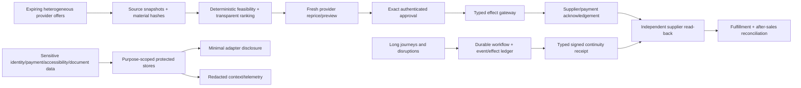

# Research Packet: Travel Booking and Itinerary Operations Agent Blueprint

Status: dated evidence packet for active Pass 1  
Research completed: 2026-08-31  
Blueprint: [travel booking and itinerary operations agent](../../agents/travel-booking-agent/README.md)  
Scope: airline, hotel, rail, GDS/aggregator, traveler identity/consent, payments, refunds, accessibility, privacy, security, runtime, evaluation, and operations

This packet records the primary-source evidence, uncertainty, and architectural decisions used to write the travel-booking-agent guides. It is not a supplier contract, legal opinion, accreditation manual, security attestation, or live capability registry. Production behavior must be verified against the exact provider agreement, credential, market, content source, API/schema, carrier/property/operator, and release under test.

## Research questions

1. Where is the boundary between itinerary coordination and executive operations, customer support, payment/finance, identity, legal/document advice, and supplier fulfillment?
2. What is authoritative at search, quote, reservation, fulfillment, servicing, refund, and settlement stages?
3. Which airline, hotel, rail, GDS, and standards paths are current, and what version/capability uncertainty remains?
4. How should a system prevent duplicate bookings and recover from timeouts, partial fulfillment, cross-channel discrepancies, and non-atomic bundles?
5. What consent, privacy, PCI, identity, accessibility, document-information, passenger-rights, and duty-of-care boundaries apply?
6. Where does a model help, where is a deterministic alternative stronger, and how must the model loop stop?
7. What state, event, context, memory, compaction, effect, observability, deployment, failover, and release controls are required for production?
8. Which measurable gates distinguish Stage 0–6 rather than treating a successful demo as production evidence?

## Method and selection criteria

Research used primary sources first: standards bodies, regulators, official provider documentation/repositories, official API guides, official security specifications, and official framework documentation. Searches were repeated across the commercial lifecycle—search, reprice, hold, booking/order, fulfillment/ticketing, change/exchange, cancel/void/refund, disruption, reconciliation—because provider overview pages often omit the failure semantics that matter.

Sources were selected when they supplied at least one of:

- a current version, release, effective date, or migration state;
- concrete API sequencing, expiry, idempotency, read-back, or error behavior;
- a standards boundary and evidence of uneven implementation;
- an authoritative legal/security/accessibility requirement or current guidance;
- a durable-execution, trace, or event primitive relevant to recovery;
- a contradiction or capability gap that must be visible in the design.

Commercial marketing claims were not treated as operational guarantees. Community sources were not needed for core claims because official documentation exposed enough provider-specific failure behavior; production case-study evidence remains a future validation task with actual supplier contracts and internal incidents. No live provider credentials, sandboxes, paid IATA manuals, accredited ticketing systems, payment systems, or production travel records were available.

## Primary-source register

### Airline standards, distribution, identity, and settlement

| Source | Version/date evidence observed | Used for | Caveat |
|---|---|---|---|
| [IATA airline retailing](https://www.iata.org/en/programs/airline-distribution/retailing/) | Accessed 2026-08-31; public material reflects 2025 Offers and Orders transition and describes NDC 24.1 as a foundation | Offers/Orders direction and current transition framing | Direction is not proof of airline/provider implementation |
| [IATA NDC developer portal](https://developer.iata.org/en/ndc/) | Accessed 2026-08-31 | NDC learning/resources and schema ecosystem | Exact schemas/certification and carrier capability require separate qualification |
| [IATA ONE Order](https://www.iata.org/en/programs/airline-distribution/retailing/one-order/) | Accessed 2026-08-31 | Intended integrated order/delivery/accounting record and migration direction | Legacy PNR/e-ticket/EMD coexistence remains operational reality |
| [IATA AIRIMP 2026 Edition 50](https://www.iata.org/en/store/publications/manuals-standards-and-regulations/airline-industry-reservations-interline-message-procedures---passenger-airimp__airimp/) | Edition 50, effective 2026-06-01 through 2027-05-31 | Current legacy/interline messaging version evidence | Full manual is licensed; public page is not enough to implement messages |
| [IATA passenger developer portal](https://developer.iata.org/en/passenger/) | Accessed 2026-08-31 | Passenger standards/API landscape | Capability remains product/implementation specific |
| [IATA Travel Agent's Handbook, Edition 46](https://www.iata.org/en/fmc-documents/74c3ac97-bb05-4ff4-90e8-15c396dfcb3d/) | 2025 edition | Agent duties, carrier procedures, ticketing time limits, passenger operational contacts/refusal recording | Jurisdiction/airline/contract manuals can add or supersede procedures |
| [IATA BSP](https://www.iata.org/en/services/finance/bsp/) and [BSPlink](https://www.iata.org/en/services/finance/bsp/bsplink) | Accessed 2026-08-31 | Settlement and agent/airline reconciliation boundary | Does not define every provider/payment/accounting workflow |
| [IATA BSP Manual for Agents](https://www.iata.org/contentassets/bfacf03f8e914960898e262df2777352/bsp-manual-for-agents.pdf) | Located public PDF is 2021 | Historical evidence: same-form-of-payment and issuer/airline instruction constraints | Stale for production rules; current manual/airline/contract must be checked |
| [IATA One ID](https://www.iata.org/en/programs/passenger/one-id/) | Accessed 2026-08-31; references Recommended Practices 1701o/1701p/1701q | Consent, selective/minimal credential disclosure, contactless identity direction | Does not itself establish legal basis, availability, or assurance for a deployment |
| [IATA Timatic](https://www.iata.org/timatic) | Accessed 2026-08-31 | Qualified passport/visa/health information service and government-practice caveat | Commercial access; governments/border authorities decide admission; practice may diverge |
| [IATA accessibility program](https://www.iata.org/en/programs/passenger/accessibility/) | Accessed 2026-08-31 | Industry accessibility work and supplier coordination | Legal obligations vary by jurisdiction/operator |
| [IATA SSR code and assistance best practices](https://www.iata.org/contentassets/7b3762815ac44a10b83ccf5560c1b308/best-practices-on-the-application-of-ssr-codes-and-assistance-service.pdf) | Accessed 2026-08-31 | Request/acknowledgement encoding and operating guidance | An SSR code is not a complete functional need or proof of delivery |
| [IATA 2026 finance, retailing, and distribution manual changes](https://www.iata.org/en/publications/newsletters/iata-knowledge-hub/finance-retailing-distribution-key-changes-manuals/) | 2026 update | Need to refresh manuals and settlement/retailing rules | Summary page; exact manuals govern implementations |
| [OpenTravel specification downloads](https://opentravel.org/download-specs/) | Public page lists 1.0 `2024A` and 2.0 `2019A` as latest | Evidence of version-age and deployment ambiguity in travel schemas | Schema line names do not prove provider support or semantic equivalence |

### Airline API and GDS/aggregator behavior

| Source | Version/date evidence observed | Used for | Caveat |
|---|---|---|---|
| [Duffel offers API](https://duffel.com/docs/api/offers/get-offers) | API docs accessed 2026-08-31; v2 site | Provider `expires_at`, typical offer lifetime, retrieve-current and availability caveat | Exact carrier/content behavior varies; “typically” is not a universal TTL |
| [Duffel orders API](https://duffel.com/docs/api/orders) | v2 docs accessed 2026-08-31 | Airline order as source of truth, `synced_at`, instant/pay-later, void and action state | Provider/carrier/product limitations apply |
| [Duffel offer/order conditions](https://duffel.com/docs/guides/displaying-offer-and-order-conditions) | Accessed 2026-08-31 | Null conditions mean unknown; voluntary/involuntary and pre/post-departure distinction | Not a cross-provider rule, but a strong general modeling lesson |
| [Duffel versioning](https://duffel.com/docs/api/overview/versioning), [test mode](https://duffel.com/docs/api/overview/test-mode), and [response handling](https://duffel.com/docs/api/overview/response-handling) | Public docs expose request versioning; accessed 2026-08-31 | Version pinning, sandbox limitations, response classification | Contract tests remain required |
| [Amadeus Self-Service FAQ](https://admin.developers.amadeus.com/self-service/apis-docs/guides/developer-guides/faq/) | Page reports last update 2026-04-20 | Search → Price → Create Orders → Manage; content gaps; fare-rule and consolidator/ticketing boundaries | Self-Service differs materially from Enterprise and contracted content |
| [Amadeus OpenAPI specifications](https://github.com/amadeus4dev/amadeus-open-api-specification) | Repository accessed 2026-08-31 | Reviewable schemas and client generation | Repository schemas are not proof of commercial content or post-sales authority |
| [Travelport Flights v11 API references](https://support.travelport.com/webhelp/jsonapis/airv11/content/air11/APIReferences.htm) | v11 public docs accessed 2026-08-31 | Current API surface | Content-source/market/carrier capability varies |
| [Travelport Flights booking guide](https://developer.travelport.com/docs/flights/guides/booking-and-reservations/flights-booking-guide) | Public page current at access; documents GDS/NDC cache and 30-minute workbench examples | Search/booking/workbench clocks, held vs commit flows, NDC differences | Exact provider configuration controls; TTLs must not be copied universally |
| [Travelport ticketing guide](https://developer.travelport.com/docs/flights/guides/ticketing-guide) | Accessed 2026-08-31 | GDS host vs airline NDC ticketing, payment/commit, EMD | Carrier/content and ticketless cases differ |
| [Travelport exchange/refund/void guide](https://support.travelport.com/webhelp/jsonapis/airv11/content/air11/General/ExchangeRefundGuide.htm) | v11 docs accessed 2026-08-31 | Void/exchange/cancel/refund distinctions, voluntary/involuntary and capability gaps | Public documentation can change; qualify exact Trip Services/content behavior |
| [Travelport reservation retrieve guide](https://developer.travelport.com/docs/flights/guides/booking-and-reservations/reservation-retrieve-guide) | Accessed 2026-08-31 | Independent reservation/order/ticket read-back and NDC locator/passive PNR distinction | Source precedence needs contract-specific decision |
| [Sabre Offers and Orders APIs user guide](https://developer.sabre.com/sites/default/files/2024-06/Sabre%20Offers%20and%20Orders%20APIs%20User%20Guide.pdf) | Public guide is 2024 | Offer/order/create/reprice/fulfill/payment flow evidence and special-service fields | Dated guide; not evidence of 2026 carrier/action availability |
| [Sabre e-ticket coupon documentation](https://developer.sabre.com/soap-api/send-sabre-command/2.0.0/help-documentation/eticketcouponllsrq.html) | Accessed 2026-08-31 | Coupon status vocabulary and explicit warning that Sabre/carrier images can differ | Specific service/PCC access; current provider contract determines use |

### Hotel APIs

| Source | Version/date evidence observed | Used for | Caveat |
|---|---|---|---|
| [Booking.com Demand Orders preview/create](https://developers.booking.com/demand/docs/orders-api/order-preview-create) | Page reported updated roughly two months before research | Preview validates allocation/final price/payment; 15-minute token; create exact product | Partner contract/product/market and API migration state apply |
| [Booking.com Orders overview](https://developers.booking.com/demand/docs/orders-api/overview) and [Orders FAQ](https://developers.booking.com/demand/docs/orders-api/orders-faqs) | Accessed 2026-08-31 | Create/manage/report/reconcile; cancellation state retrieval; special-request uncertainty | Public documentation is not a certification record |
| [Booking.com Orders v3.2 migration](https://developers.booking.com/demand/docs/migration-guide/v3.2/orders/intro) | Beta/migration material accessed 2026-08-31 | Evidence that versions/breaking changes are active | Do not treat beta as current production default |
| [Booking.com sandbox](https://developers.booking.com/demand/docs/getting-started/sandbox) | Accessed 2026-08-31 | Sandbox qualification requirement | Sandbox coverage differs from production |
| [Expedia Rapid shopping and Price Check](https://developers.expediagroup.com/rapid/lodging/shopping/about-shopping-api) | Accessed 2026-08-31 | Price Check, changed price, unavailable and returned-link flow | Partner capability and rate types vary |
| [Expedia Rapid booking](https://developers.expediagroup.com/rapid/lodging/booking/about-booking-api) | Accessed 2026-08-31 | Book from short-lived Price Check link/token | Exact expiry is response/contract specific |
| [Expedia Rapid booking-request handling](https://developers.expediagroup.com/rapid/lodging/reference/handle-booking-reqs) and [common errors](https://developers.expediagroup.com/rapid/lodging/reference/error-responses) | Accessed 2026-08-31 | Same `affiliate_reference_id`, retrieve after missing response, supplier latency/unknown handling | Timing figures are provider guidance, not internal SLO guarantees |
| [Expedia Rapid hold/resume](https://developers.expediagroup.com/rapid/lodging/booking/hold-resume) and [manage booking](https://developers.expediagroup.com/rapid/lodging/manage-booking/about-mg-booking-api) | Accessed 2026-08-31 | Hold auto-release and retrieve/manage obligations | Capability may require enablement |
| [Hotelbeds Booking API](https://developer.hotelbeds.com/documentation/hotels/booking-api/) and [workflow](https://developer.hotelbeds.com/documentation/hotels/booking-api/workflow/) | Accessed 2026-08-31 | Availability, conditional CheckRate, booking/get/modify/cancel/simulate | Contract/certification required |
| [Hotelbeds best practices](https://developer.hotelbeds.com/documentation/hotels/knowledge-base/best-practices/) | Accessed 2026-08-31 | Opaque `rateKey`, `RECHECK`, booking timeout, no blind resend | Must be pinned to actual integration version |
| [Hotelbeds certification](https://developer.hotelbeds.com/documentation/hotels/knowledge-base/certification-process/) | Accessed 2026-08-31 | Certification, voucher/content, destination-time-zone cancellation behavior | Passing certification is necessary, not all failure injection |
| [Hotelbeds mutual authentication](https://developer.hotelbeds.com/documentation/hotels/knowledge-base/mutual-authentication/) | Accessed 2026-08-31 | mTLS for booking operations | Credential deployment/rotation still needs local controls |

### Rail standards and rights

| Source | Version/date evidence observed | Used for | Caveat |
|---|---|---|---|
| [UIC OSDM](https://osdm.io/) and [specification](https://osdm.io/spec/) | Accessed 2026-08-31 | Rail offer/booking/fulfillment/after-sales standard landscape | Implementations vary significantly |
| [OSDM 3.8 release](https://osdm.io/osdm/update/2026/03/25/OSDM-V3.8-released/) | Official release post dated 2026-03-25 | Latest clearly discoverable official release during research | Other public pages contain inconsistent future/implementation labels |
| [OSDM technical principles](https://osdm.io/spec/technical-principles/) | Accessed 2026-08-31; page says 3.x supported and still labels 3.9 planned for June 2026 | Semantic versioning, media-type negotiation, tagged release as final, tolerant reader | Planned-date content appears stale relative to research date |
| [OSDM compliance](https://osdm.io/spec/compliance/) | Accessed 2026-08-31 | Offers, bookings, fulfillments, after-sales qualification areas | Exact test/certification with target system required |
| [OSDM implementations](https://osdm.io/tools/implementations/) | Page says status January 2026 and lists implementations across many versions, including labels beyond the release blog | Evidence of fragmented real implementation versions | Self-reported/status page may be inconsistent; not release authority |
| [UIC OSDM GitHub](https://github.com/UnionInternationalCheminsdeFer/OSDM) and [OSDM testing](https://github.com/UnionInternationalCheminsdeFer/OSDM-testing) | Accessed 2026-08-31 | Exact tag/spec/test qualification path | A repository test suite does not prove a retailer's business capability |
| [EU Regulation 2021/782](https://eur-lex.europa.eu/eli/reg/2021/782/oj?locale=en) | Current official legal text accessed 2026-08-31 | Rail refund/rerouting/assistance/through-ticket and accessibility rights boundary | Applicability and facts require legal/policy determination |

### Passenger rights and consumer disclosure

| Source | Version/date evidence observed | Used for | Caveat |
|---|---|---|---|
| [U.S. DOT airline refunds final rule](https://www.transportation.gov/regulations/federal-register-documents/2024-07177) | 2024 final rule | Automatic-refund/significant-change/ancillary and timing evidence | Applicability and later enforcement developments require current policy |
| [DOT refunds page](https://www.transportation.gov/individuals/aviation-consumer-protection/refunds) and [ticket-refund hub](https://www.transportation.gov/airconsumer/ticket-refunds) | Current pages accessed 2026-08-31; hub includes entries through 2026-07-08 | Need for current, versioned jurisdiction policy and precise customer state | Do not encode one static prompt rule |
| [DOT ancillary fee disclosure final rule](https://www.transportation.gov/regulations/federal-register-documents/2024-08609) | 2024 rule | Mandatory fee disclosure before purchase | Litigation/enforcement/applicability must be checked by legal owner |
| [EU Regulation 261/2004](https://eur-lex.europa.eu/legal-content/EN/TXT/?uri=CELEX%3A32004R0261) | Official current text accessed 2026-08-31 | Reimbursement/rerouting/care/compensation boundary | Amendment proposals are not enacted law; scope/facts matter |
| [European Commission air passenger-rights portal](https://transport.ec.europa.eu/transport-themes/passenger-rights/air_en) | Accessed 2026-08-31 | Current official explanatory portal | Regulation and court interpretations remain decisive |

### Accessibility

| Source | Version/date evidence observed | Used for | Caveat |
|---|---|---|---|
| [WCAG 2.2](https://www.w3.org/TR/WCAG22/) | W3C Recommendation; page republished 2024-12-12 | Accessible approval, authentication, error, focus, target, and interaction design | Conformance requires testing, not checklist-only automation |
| [U.S. DOT passengers with disabilities](https://www.transportation.gov/airconsumer/passengers-disabilities), [traveling with a disability](https://www.transportation.gov/individuals/aviation-consumer-protection/traveling-disability), and [Airline Passengers with Disabilities Bill of Rights](https://www.transportation.gov/airconsumer/disabilitybillofrights) | Current official pages accessed 2026-08-31 | U.S. disability-rights and current enforcement-information boundary | Current pages note evolving enforcement; legal/policy service must refresh |
| [EU Regulation 1107/2006](https://eur-lex.europa.eu/legal-content/EN/TXT/?uri=CELEX%3A32006R1107) | Official text accessed 2026-08-31 | Air travel accessibility rights/assistance in scope | Applicability and operator process vary |

### Identity, privacy, documents, and duty of care

| Source | Version/date evidence observed | Used for | Caveat |
|---|---|---|---|
| [NIST SP 800-63-4](https://www.nist.gov/publications/nist-sp-800-63-4-digital-identity-guidelines) | Final 2025-08-01; supersedes Rev. 3 | Risk-based identity proofing/authentication/federation | U.S. federal guidance, not a complete travel delegation model |
| [OAuth 2.0 Security Best Current Practice, RFC 9700](https://www.rfc-editor.org/info/rfc9700/) | Published 2025-01 | Exact redirects, PKCE, implicit-flow deprecation, sender-constrained/rotating token guidance | Product implementation must choose supported mechanisms correctly |
| [OpenID Connect Core 1.0 incorporating errata set 2](https://openid.net/specs/openid-connect-core-1_0.html) | Current specification page accessed 2026-08-31 | Authenticated subject/session boundary | OIDC authentication is not business delegation or traveler consent |
| [GDPR](https://eur-lex.europa.eu/eli/reg/2016/679/2016-05-04) | Official consolidated legal text accessed 2026-08-31 | Purpose limitation, minimization, accuracy, storage limitation, security/accountability | Applicability/legal basis/DPIA/retention need counsel and controller decisions |
| [EDPB data protection by design/default guidance](https://www.edpb.europa.eu/documents/guideline/guidelines-42019-on-article-25-data-protection-by-design-and-by-default_en) and [guideline index](https://www.edpb.europa.eu/guidelines-relevant-for-controllers-and-processors_en) | Official guidance accessed 2026-08-31 | Privacy architecture and consent-policy refresh | Guidance must be applied to actual controller/processor roles |
| [EU PNR Directive 2016/681](https://eur-lex.europa.eu/eli/dir/2016/681/oj?locale=en) | Official text accessed 2026-08-31 | Evidence that PNR can contain identity/contact/payment/itinerary/SSR/API/historical data | National implementation and legal processing require separate review |
| [ICAO Doc 9303](https://www.icao.int/publications/doc-series/doc-9303) and [ICAO TRIP publications](https://www.icao.int/icao-trip/publications) | Doc 9303 eighth edition 2021; TRIP page lists digital travel credential core principles dated 2025-10 | Machine-readable travel document and digital credential context | Standards do not establish traveler eligibility or implementation availability |
| [ICAO API/PNR guidelines and reporting standards](https://www.icao.int/facilitation-programmes/api-guidelines-and-pnr-reporting-standards) and [Annex 9 publications](https://www.icao.int/facilitation-programmes/Annex9/publications) | Accessed 2026-08-31 | API identity/check-in data vs PNR booking data; sensitivity/accuracy boundary | State/airline implementations and legal access vary |
| [ISO 31030:2021](https://www.iso.org/standard/54204.html) and [ISO committee project page](https://committee.iso.org/sites/tc262/home/projects/published/iso-310302021----managing-travel.html) | Published 2021; ISO page showed systematic review initiated 2026-04 | Organizational travel-risk/duty-of-care structure | Explicitly not a universal leisure-travel rule; full standard is paid |
| [UK government guidance on foreign travel requirement queries](https://assets.publishing.service.gov.uk/media/654281591f1a60000d360c20/Customer%2Bqueries%2Babout%2Bforeign%2Btravel%2B_V3%2BFOR%2BGOV.UK%2Bpublication_.pdf) | Official guidance accessed 2026-08-31 | Requirements change and responsible authority/embassy verification boundary | UK-specific customer guidance, not a global rules engine |

### Payments and security

| Source | Version/date evidence observed | Used for | Caveat |
|---|---|---|---|
| [PCI SSC document library](https://www.pcisecuritystandards.org/document_library/?class=pcidss&doc=pci_dss) and [PCI DSS v4.0.1 announcement](https://blog.pcisecuritystandards.org/just-published-pci-dss-v4-0-1) | v4.0.1 published 2024-06; v4.0 retired 2024-12; future requirements effective 2025-03-31 | Current payment-data security baseline and need to keep credentials from model/logs | PCI scope and validation require a QSA/merchant/payment architecture review |
| [EMV 3-D Secure 2.3.1.1](https://www.emvco.com/dynamic/emv-3-d-secure-whitepaper-v2/3-d-secure-documentation/3-d-secure-specification-v2-3-1/) and [EMV 3DS overview](https://www.emvco.com/emv-technologies/3-d-secure/) | 2.3.1.1 public docs; overview exposed 2.4 draft in 2026 | Payment authentication/version qualification and draft caution | Scheme, issuer, acquirer, PSP, merchant support varies |
| [EBA PSD2/SCA materials](https://www.eba.europa.eu/legacy/regulation-and-policy/regulatory-activities/payment-services-and-electronic-money-0) | Official portal accessed 2026-08-31 | SCA/regulatory payment boundary | Legal regime and payment path-specific implementation required |
| [Visa payment-account tokenization](https://developer.visa.com/capabilities/payment-account-tokenization/token-requestor-api) and [Visa Intelligent Commerce for agents](https://developer.visa.com/use-cases/visa-intelligent-commerce-for-agents) | Current official developer material accessed 2026-08-31 | Token lifecycle/restrictions and emerging agent-specific instruction/authentication direction | Restricted/commercial availability and exact semantics unverified; not a production default |

### AI risk, runtime, events, and observability

| Source | Version/date evidence observed | Used for | Caveat |
|---|---|---|---|
| [NIST AI RMF Generative AI Profile, AI 600-1](https://www.nist.gov/publications/artificial-intelligence-risk-management-framework-generative-artificial-intelligence) | Published 2024-07; page updated 2026-04 | Confabulation and lifecycle risk framing | Cross-sector guidance, not an effect protocol |
| [NIST AI RMF 1.0](https://nvlpubs.nist.gov/nistpubs/ai/NIST.AI.100-1.pdf) | 2023 publication | Govern/map/measure/manage structure | Must be made domain- and control-specific |
| [OWASP Top 10 for Agentic Applications 2026](https://genai.owasp.org/resource/owasp-top-10-for-agentic-applications-for-2026/) | 2026 release | Goal hijack, tool/identity misuse, supply chain, memory poisoning, cascading failure, human overtrust | Community security project, used as threat enumeration rather than compliance standard |
| [Temporal documentation](https://docs.temporal.io/) and [architecture](https://github.com/temporalio/temporal/blob/main/docs/architecture/README.md) | Accessed 2026-08-31 | Durable workflows, event history, replay, activities | Product choice remains architectural; external effects are not automatically exactly once |
| [Temporal retry policies](https://github.com/temporalio/documentation/blob/main/docs/encyclopedia/retry-policies.mdx) | Repository doc accessed 2026-08-31 | Activity retry behavior and need for idempotent/non-retryable effects | Exact deployed server/SDK version must be pinned |
| [CloudEvents specification](https://github.com/cloudevents/spec) | v1.0.2 repository state accessed 2026-08-31 | Portable event envelope | Does not provide ordering, identity, or business idempotency |
| [W3C Trace Context](https://www.w3.org/TR/trace-context/) | W3C Recommendation accessed 2026-08-31 | Cross-service causal trace propagation | Sensitive baggage/attributes still require minimization |
| [OpenTelemetry specification](https://opentelemetry.io/docs/specs/otel/) and [semantic conventions](https://opentelemetry.io/docs/specs/semconv/) | Pages exposed spec 1.60.0 and semconv 1.44.0 during research | Trace/metric/log contracts and pinning | GenAI conventions have evolved; pin local schema and avoid sensitive payloads |
| [OpenTelemetry log data model](https://opentelemetry.io/docs/specs/otel/logs/data-model/) | Stable log data model page accessed 2026-08-31 | Structured log/event correlation | Audit evidence remains separate from diagnostic logs |

## Findings synthesized

### Travel truth is layered and channel-specific

Search observations, priced offers/previews, holds, orders/PNRs/bookings, tickets/EMDs/vouchers/rail fulfillments, supplier read-backs, payment state, and settlement are distinct. IATA's Offers/Orders direction does not erase current legacy records. Travelport explicitly distinguishes GDS and NDC ticketing; Sabre warns its ticket coupon image can differ from a carrier; provider hotel flows require retrieve after ambiguous create. The domain model therefore preserves provider-native identities and an evidence ladder.

### Freshness must be carried with every commercial artifact

Duffel exposes `expires_at`; Booking.com documents a 15-minute preview token; Expedia uses short-lived links; Hotelbeds has conditional CheckRate; Travelport documents different cache/workbench windows. There is no safe universal TTL. The selected design stores provider expiry when supplied, conservative internal margins, clock-skew evidence, input signature, and separate price/terms/topology hashes.

### Missing conditions are not permissions or prohibitions

Duffel explicitly states null conditions are unknown. Other providers can omit, defer, or supply raw fare/rate text. The blueprint uses three-valued knowledge and blocks material T3 action until a current provider quote or human/provider determination exists.

### Search access, ticketing authority, and post-sales authority differ

Amadeus documents content gaps and consolidator/ticketing boundaries. IATA agent/BSP material distinguishes issuer and carrier procedures. Travelport and Sabre flows differ by content and carrier. Provider qualification therefore has rows for search, reprice, hold, create, fulfill, retrieve, exchange/change, void, cancel, refund, and involuntary servicing rather than one “integrated” flag.

### Unknown outcomes are normal distributed-systems states

Expedia's same-reference/retrieve guidance, Hotelbeds' no-blind-resend guidance, and provider retrieve APIs support an explicit effect protocol. A timeout after possible dispatch becomes `unknown`; the coordinator searches by semantic/client reference and reads current resource state before retry. Payment success does not resolve supplier ambiguity. Partial items are not batch-retried.

### Cancellation, compensation, and refund are separate

Cancellation is a new provider effect; compensation is a planned recovery action that can fail or cost money; supplier refund processing is not returned funds; finance reconciliation is separately owned. Legal rights vary and current regulator pages evolve, so the prompt cannot be the rights engine.

### Accessibility is both digital access and supplier fulfillment

WCAG 2.2 governs the interaction target; IATA SSR practices help encode requests; DOT/EU rules supply legal context. A code/request does not prove service delivery. The selected record keeps traveler-described need, normalized requirement, provider encoding, acknowledgement, confirmation, and delivery evidence separately and revalidates them after itinerary/operator changes.

### Travel/document data needs structural privacy controls

ICAO and the EU PNR Directive illustrate the breadth/sensitivity and possible inaccuracy of PNR/API data. GDPR/EDPB and IATA One ID support minimization, purpose, and selective disclosure. Identity-document images/numbers, authentication secrets, PAN/CVV, and raw sensitive service detail stay outside model context, generic memory, telemetry, and cases.

### Models are best at bounded ambiguity, not state or effects

Models add value in preference elicitation, source-grounded comparison, rule-text explanation, and disruption summaries. Deterministic services are stronger for identity, policy, feasibility, clocks, currency, material diff, state transitions, retries, idempotency, and effects. NIST/OWASP risk guidance reinforces abstention, untrusted-content boundaries, and tool/identity/memory controls.

### Durable coordination and typed compaction are necessary

Journeys outlive processes and context windows. Durable workflow/event history provides progress, while supplier systems remain authoritative. A typed continuity receipt preserves scope, itinerary revision, quote hashes/expiry, approval, effects, unknowns, obligations, denied actions, source cursor, omissions, and integrity. Compaction cannot regenerate missing effect facts from prose.

### Scaling must privilege reconciliation and in-travel work

Mass disruption can coincide with provider degradation. Separate queues and provider bulkheads reserve capacity for unknown effects, fulfillment deadlines, refunds, in-travel disruption, and escalation. Search/model work sheds first. Active-active effect execution is rejected without proven fencing and provider semantic identity.

## Boundary decision record

| Concern | Selected owner | Travel-agent responsibility | Reason |
|---|---|---|---|
| Broader schedule/meeting/life objective | Executive/personal operations | Receive typed journey intent; return itinerary/status/obligations | Avoid silent calendar or personal-objective changes |
| Traveler identity/profile | Identity/profile platform | Carry scoped references and freshness; request step-up/consent | Authentication/profile truth cannot live in chat memory |
| Availability/price/rules | Supplier/GDS/aggregator | Store dated observations, reprice, disclose limits | Provider owns inventory/commercial truth |
| Booking/ticket/voucher | Supplier/issuer/retailer | Coordinate exact effect and read-back | Agent cannot manufacture fulfillment |
| Payment | PCI-scoped payment service | Use opaque references and observe status | Keep credentials and payment truth outside model/runtime |
| Accounting/settlement | Finance | Create travel-linked discrepancy/evidence | No model-driven journals or “funds returned” claim |
| Generic customer cases | Customer support | Supply typed travel evidence and deadlines | Avoid duplicating support platform/process |
| Visa/admission/document decision | Government/embassy/carrier/border authority | Provide dated sourced information and verification path | Legal/admission truth is external and dynamic |
| Duty-of-care risk | Organizational risk/security owner | Apply versioned decision and coordinate travel action | Model is not a threat-assessment authority |
| Supplier service delivery | Carrier/hotel/rail/property/station | Request, observe, reconcile, escalate | A request/code is not delivery |

## Architecture decision records

| ADR | Decision | Evidence/rationale | Rejected alternative |
|---|---|---|---|
| T-01 | One durable coordinator per journey/case | Long timers, events, ambiguous effects, disruptions | Transcript-driven open agent loop |
| T-02 | One bounded reasoner, typed services/adapters | Deterministic rules/state/effects are safer; multi-agent roles add shared-state risk | Air/hotel/rail persona swarm |
| T-03 | Control plane separate from data plane | Pin provider/tool/policy/model/authority releases and kill paths | Prompt dynamically decides current capability |
| T-04 | Supplier/profile/payment systems remain authoritative | Provider docs show layered and sometimes conflicting state | Agent memory as unified truth |
| T-05 | Provider qualification is action + channel + market specific | Amadeus/Travelport/OSDM/hotel evidence shows fragmented capability | Single “supports NDC/OSDM/booking” checkbox |
| T-06 | Reprice/preview immediately before exact approval/commit | Provider expiries and changed-price paths | Search result used as durable quote |
| T-07 | Prepare-authorize-commit-observe-reconcile for all writes | Expedia/Hotelbeds/read-back and distributed failure evidence | Generic retry wrapper |
| T-08 | Semantic business operation ID reused across retries | Duplicate prevention and provider client references | Random idempotency key per attempt |
| T-09 | Unknown/partial outcomes are durable states | Timeout/parse/cross-domain ambiguity is unavoidable | Treat timeout as failure |
| T-10 | Cancellation/refund/payment/finance states are separate | Provider and regulator/settlement responsibilities differ | One `cancelled/refunded` boolean |
| T-11 | Accessibility need/request/confirmation/delivery separated | SSR and rights sources show encoding is not delivery | Single SSR string treated as guarantee |
| T-12 | Document information is sourced and bounded; no eligibility decision | Timatic/ICAO/government authority evidence | Model visa adviser |
| T-13 | Hosted/tokenized payment and no credentials in model | PCI/OAuth/payment sources | Card-enabled general agent/browser |
| T-14 | Typed memory layers and loss-aware signed continuity receipt | Long journey plus privacy/effect integrity | Infinite transcript/vector memory |
| T-15 | Parallel bounded reads, serialized resource writes | Search latency vs effect race trade-off | Parallel multi-provider writes |
| T-16 | Cell deployment, critical queue reserves, one fenced writer | Disruption bursts and external-effect safety | Active-active unfenced write failover |
| T-17 | Offline reviewed learning and immutable release manifest | Prevent poisoning/authority drift | Online self-modifying prompt/policy/memory |

## Tool acceptance decisions

| Tool/action | Initial decision | Minimum before promotion |
|---|---|---|
| Static airport/station/property content | Stage 0/1 read | Source/version/update policy, identity mapping, content drift tests |
| Air/hotel/rail search | Stage 1 read-only | Exact market/content coverage, schema, signature, freshness, quotas, no side effects |
| Rule retrieval/explanation | Stage 2 | Raw artifact/provenance, three-valued parser, applicability, injection tests, human fallback |
| Reprice/preview/CheckRate | Stage 3 | Exact provider action, expiry, material diff, fresh approval binding |
| Provider hold/workbench | Stage 4 only | Binding semantics, expiry/release/read-back, idempotency, timeout and orphan drills |
| Book/order create | Stage 5 only | Exact approval, payment sequence, semantic key, supplier lookup/read-back, duplicate/partial drills |
| Ticket/fulfill | Stage 5 independently | Issuer authority, product/document mapping, time limit, retrieval and recovery |
| Change/exchange | Manual until independently qualified | Current order/coupon state, provider quote, old/new fulfillment, voluntary/involuntary path |
| Cancel/void/refund | Manual until independently qualified | Exact scope/quote/rights policy, supplier read-back, payment/finance reconciliation |
| Browser automation | Manual or contained mechanism only | Supplier permission, dedicated identity/session, DOM contract, PCI exclusion, screenshot/evidence, unknown-outcome read-back; never generic browser credential |
| Document/entry rules | Read-only information | Qualified source, exact route/assertions, freshness, authority disclaimer, protected data path |
| Disruption preauthorized effect | Disabled until Stage 6 | Standing instruction, strict caps, current supplier/rights/risk/service/document evidence, kill and mass-event drills |

## Contradictions, ambiguity, and resolution

### OSDM public version inconsistency

The official blog's latest clearly discoverable release during research was 3.8 (2026-03-25). The technical-principles page still described 3.9 as planned for June 2026, while the January 2026 implementation page listed some implementations as 3.10. These labels are not a safe selection mechanism. Resolution: qualify the exact official Git tag/release and target implementation's negotiated media version; record the inconsistency and do not write “latest OSDM is X” into runtime policy.

### Industry transition versus deployed records

IATA describes an Offers/Orders and ONE Order future, while current provider documents still expose PNRs, passive GDS records, tickets, EMDs, carrier coupon images, and BSP processes. Resolution: design for coexistence and typed mapping; do not prematurely collapse fulfillment into an order-only model.

### Provider status divergence

Sabre publicly warns its ticket coupon data can differ from a carrier image; Travelport NDC can have both carrier locator and passive PNR. Resolution: define source precedence per action/contract, retrieve both where required, preserve conflicts, and block writes on material ambiguity.

### Regulator rules and later enforcement information

DOT's 2024 refund final rule is authoritative, while current DOT hubs include later enforcement/discretion entries through 2026. EU legal instruments also have amendment discussions not necessarily enacted. Resolution: versioned jurisdiction policy with effective date, legal owner, fact inputs, and primary sources; no static prompt rule or draft-as-law assumption.

### Public documentation versus commercial capability

Amadeus Self-Service documents major airline/content gaps and consolidator post-sales handling; Travelport, Sabre, Booking.com, Expedia, Hotelbeds, and rail support varies by account/market. Resolution: public docs seed the qualification matrix; contracts, certification, sandbox and live canary evidence decide production cells.

### Security standard versus product availability

PCI DSS, EMV 3DS, OAuth, NIST identity, and Visa agent-token direction establish controls/patterns, but payment product support and scope differ. Resolution: hosted/tokenized qualified payment service, QSA/security review, exact provider/acquirer/scheme qualification, and no model credential access.

## Architecture evidence chain

## Stage evidence mapping

| Stage | Research basis | Required artifact |
|---|---|---|
| 0 | Ownership/legal/security/provider ambiguity | Mission contract, source-of-truth map, schemas, manual runbooks, DPIA/PCI/accessibility/legal review |
| 1 | Provider search/retrieve and version/freshness behavior | Read-only credentials, adapter contract suite, snapshot/provenance/replay and isolation results |
| 2 | NIST/OWASP/model uncertainty + rule/doc boundaries | Grounding/abstention/injection/accessibility evals and deterministic fallback |
| 3 | Duffel/Booking/Expedia/Hotelbeds/Travelport price validation | Reprice/preview, material-diff matrix, exact approval view and zero stale-effect proof |
| 4 | Provider hold/workbench flows | Hold expiry/release/read-back, duplicate/orphan/outage drills |
| 5 | Provider create/fulfillment and unknown-outcome evidence | Semantic effect protocol, payment separation, supplier read-back, partial fulfillment/refund/incident gates |
| 6 | Disruption/duty/operations and provider fragmentation | Cells, reserved queues, failover/game day, canary/rollback, drift, staffed incident and supplier/legal refresh |

## Research-to-guide traceability

| Guide | Evidence clusters |
|---|---|
| [README](../../agents/travel-booking-agent/README.md) | Cross-source truth ladder, ownership, staged authority |
| [01 — mission and stages](../../agents/travel-booking-agent/01-mission-boundaries-workload-fit-and-stages.md) | Provider capability gaps, identity/payment/document boundaries, deterministic/model risk guidance |
| [02 — architecture and runtime](../../agents/travel-booking-agent/02-reference-architecture-control-data-planes-and-runtime.md) | Temporal/durable execution, OAuth/NIST identity, provider qualification, effect isolation |
| [03 — state and events](../../agents/travel-booking-agent/03-traveler-itinerary-order-state-and-events.md) | IATA order/legacy coexistence, provider booking/fulfillment distinctions, CloudEvents, ICAO/PNR sensitivity |
| [04 — search and planning](../../agents/travel-booking-agent/04-search-quotes-rules-inventory-and-planning.md) | Duffel/Travelport/Booking.com/Expedia/Hotelbeds/OSDM freshness, three-valued conditions |
| [05 — providers and security](../../agents/travel-booking-agent/05-providers-tools-security-privacy-and-accessibility.md) | All provider/standard/API matrices, PCI/OAuth/GDPR/WCAG/IATA accessibility/OWASP |
| [06 — effects and after-sales](../../agents/travel-booking-agent/06-booking-ticketing-changes-refunds-and-reconciliation.md) | Provider retry/read-back/ticketing/exchange/refund, BSP and regulator separation |
| [07 — context and memory](../../agents/travel-booking-agent/07-context-memory-compaction-and-continuity.md) | Privacy/minimization, OWASP memory poisoning, durable execution, trace minimization |
| [08 — disruptions and documents](../../agents/travel-booking-agent/08-disruptions-duty-of-care-documents-and-escalation.md) | Passenger rights, ISO 31030, Timatic/ICAO/government, accessibility continuity |
| [09 — evaluation and observability](../../agents/travel-booking-agent/09-evaluation-observability-and-failure-injection.md) | NIST/OWASP, provider contract failure semantics, W3C Trace Context, OpenTelemetry |
| [10 — operations and evolution](../../agents/travel-booking-agent/10-deployment-scaling-incidents-and-governed-evolution.md) | Durable/runtime evidence, provider quotas/failure isolation, security/privacy standards, release/version uncertainty |

## Known limitations

- No provider contract, credentials, sandbox, certification run, PCC/office/accreditation, carrier stock, live GDS/NDC content, hotel partner account, rail retailer, payment processor, or finance system was tested.
- Public provider documentation cannot establish actual carrier/property/operator/content coverage, negotiated/private fares/rates, support hours, SLAs, idempotency guarantees, waiver authority, or market-specific behavior.
- Paid/current IATA manuals, some airline/GDS implementation guides, accreditation/settlement details, and ISO 31030 full text were not available. The public 2021 BSP manual is explicitly treated as stale historical evidence.
- The Sabre Offers/Orders public guide used is dated 2024. A current contracted guide and carrier-specific capability review are required.
- OSDM public pages are inconsistent about planned/released/implemented versions. An exact tag and target implementation must be tested.
- Laws and regulator enforcement can change; no legal opinion was produced. Passenger rights, package-travel classification, accessibility, privacy, consumer disclosure, document, sanctions, tax, and retention policies require jurisdictional counsel.
- No accessibility user testing, screen-reader session, language/localization review, threat model workshop, DPIA, QSA/PCI assessment, penetration test, or incident exercise was performed.
- Suggested SLOs, loop budgets, commit margins, capacity formulas, retry intervals, and stage thresholds are initial engineering targets, not empirically calibrated values.
- No production data or case studies were available to measure provider error rates, traveler preferences, manual workload, fairness, disruption bursts, refund aging, cost, or model performance.
- Visa Intelligent Commerce and other emerging agent-payment material indicates direction, not verified general availability or a selected integration.
- The blueprint does not cover ground transport, cruises, insurance claims, package-tour legal structure, loyalty redemption, corporate expense posting, group/conference travel, unaccompanied minors, medical clearance, charter operations, crew travel, or immigration case management in production depth. Those require separately qualified extensions.

## Refresh plan

| Evidence | Refresh cadence/trigger | Owner to assign | Failure behavior if stale |
|---|---|---|---|
| Provider API/schema/error/idempotency docs | Quarterly and before provider release/migration | Connector owner | Demote affected T2–T4 capability until contract tests pass |
| Carrier/content/product/market matrix | Monthly plus contract/provider notice | Travel supply owner | Disclose reduced coverage; block unsupported writes |
| IATA NDC/ONE Order/AIRIMP/agent/BSP manuals | At annual/manual release and IATA change notice | Air standards/accreditation owner | Keep pinned version; manual review for changed procedure |
| OSDM spec/tags/compliance | Each official release and target retailer change | Rail connector owner | Pin last qualified version; no auto-upgrade |
| Passenger rights/refund/disclosure | Continuous legal monitoring and before jurisdiction launch | Legal/policy owner | Read-only sourced information/manual decision; no automated entitlement |
| Visa/passport/health/advisory data | Per qualified service and before each material itinerary action | Document/risk owner | Block material action or require authority verification |
| Accessibility law/provider practice/WCAG | Semiannual and supplier/UI change | Accessibility owner | Stop affected automation; accessible manual channel |
| PCI DSS/EMV/OAuth/NIST/security guidance | At standard release/advisory and annual review | Security/payment owner | Freeze affected payment/identity changes; follow current incident policy |
| Models/prompts/tools/context/evals | Every release and model/provider change | AI platform owner | Last qualified release or deterministic fallback |
| SLOs/capacity/cost/runbooks | Monthly operational review and after incident | SRE/travel operations | Reduce admission/authority; update staffing/capacity before expansion |
| Research packet itself | At least quarterly; immediately after material source contradiction | Documentation owner | Mark stale sections and link the qualified runtime registry/policy as current authority |

## Completion checklist

- [x] Research date and current-version uncertainty recorded.
- [x] Airline, GDS/aggregator, hotel, rail, identity, payments, accessibility, privacy, security, runtime, and observability primary sources included.
- [x] Search/quote freshness, conditions, holds, booking/ticketing, changes/cancels/refunds, unknown outcomes, and reconciliation synthesized.
- [x] Ownership boundaries and deterministic/model responsibilities decided.
- [x] Contradictions—especially OSDM version labels, ONE Order transition, provider state divergence, and evolving regulator information—made explicit.
- [x] Stage 0–6 evidence and research-to-guide traceability recorded.
- [x] Production limitations and refresh triggers declared.
- [ ] Provider contracts, paid manuals, sandboxes, certification, live canaries, legal/privacy/PCI/accessibility reviews, SLO calibration, and incident game days remain implementation work.
