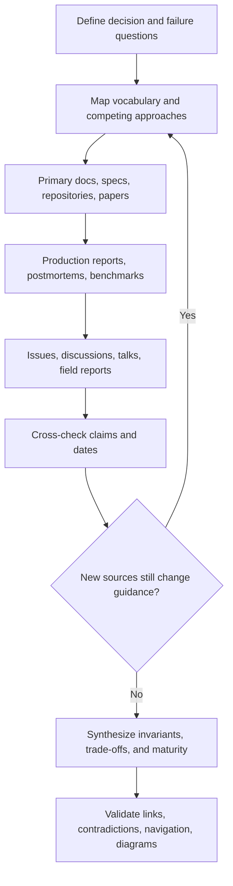

# Research and Documentation Method

**Last updated:** 2026-08-30

## Objective

Produce engineering guidance that is more useful than any single source by triangulating mechanics, operational evidence, failure behavior, and alternatives—without laundering vendor claims into universal truth.

## Research funnel

## 1. Frame a decision, not a keyword

Weak research asks “What is durable execution?” Strong research asks:

- Which state survives which failure?
- What is replayed, retried, or deduplicated?
- Where may nondeterminism occur?
- What happens if a process dies after an effect but before its result is recorded?
- Can a human approval become stale before commit?
- How do cancellation and parallel siblings interact?
- What operational infrastructure and debugging model does the approach require?

These questions expose semantic differences hidden by shared feature names.

## 2. Search multiple source families

| Source family | Questions it answers | Typical blind spot |
|---|---|---|
| Official docs/specs | Current intended mechanics and supported surface | Rarely describes all production failures |
| Source/release history | Actual defaults, types, edge handling, maturity | Time-consuming; internals may change |
| Maintainer discussions/issues | Known limitations and design intent | Reports may be incomplete or misdiagnosed |
| Production engineering reports | Scaling, cost, recovery, human factors | Workload and vendor are specific |
| Papers/benchmarks | Controlled comparisons and failure measurements | Scaffold/data leakage and ecological validity |
| Community field reports | Operational smells and unexpected combinations | Selection bias and unverifiable claims |

Use discovery sources only to find stronger evidence. Important claims should rest on primary or direct evidence wherever possible.

## 3. Triangulate claims

Classify each material claim:

- **Mechanic:** directly established by docs, specification, or code.
- **Observed result:** measured in a stated workload; never generalized beyond it silently.
- **Engineering inference:** derived from multiple mechanics or observations and labeled as such.
- **Recommendation:** a judgment with preconditions, alternatives, and change signals.
- **Open question:** evidence is insufficient or actively conflicting.

For example, “framework X persists state” is a mechanic. “Therefore external writes are exactly once” is usually an invalid inference unless effect and replay semantics establish it.

## 4. Resolve disagreement

When sources disagree, test these explanations before choosing a side:

1. different product versions or model generations;
2. workflow versus open-ended agent workload;
3. local in-process execution versus distributed durable execution;
4. final-answer quality versus trajectory reliability;
5. latency optimization versus strict side-effect prevention;
6. framework abstraction versus provider-specific behavior;
7. marketing scope versus documented guarantee.

Document genuine disagreement. A conditional decision rule is more useful than a false universal answer.

## 5. Determine research saturation

Research is saturated for the current guide when new credible sources no longer materially change:

- the architecture model;
- the major failure modes;
- the decision criteria;
- the maturity label;
- the production checklist;
- the list of important disagreements.

Saturation is topic-specific and temporary. It does not mean the ecosystem has stopped changing.

## 6. Synthesize without copying

- Use sources to support claims, not to dictate the outline.
- Prefer a canonical vocabulary that works across frameworks.
- Separate universal invariants from implementation examples.
- Attribute vendor-specific measurements and avoid headline-only numbers.
- Quote rarely and briefly; paraphrase and compare.
- Preserve dates and version context for volatile claims.

## 7. Review and refresh

Before promotion to **Reviewed**:

- [ ] Re-open current primary sources.
- [ ] Check deprecations and latest stable versions.
- [ ] Validate all relative and external links.
- [ ] Check Mermaid syntax and accessible labels.
- [ ] Confirm recommendation preconditions and counterexamples.
- [ ] Ensure failure recovery does not promise stronger semantics than the evidence.
- [ ] Update all relevant indexes.

Refresh immediately when a recorded trigger fires; otherwise revisit volatile framework/protocol documents within 90 days and stable conceptual guides within 180 days.

