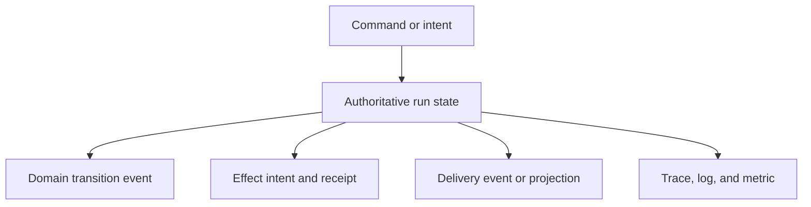
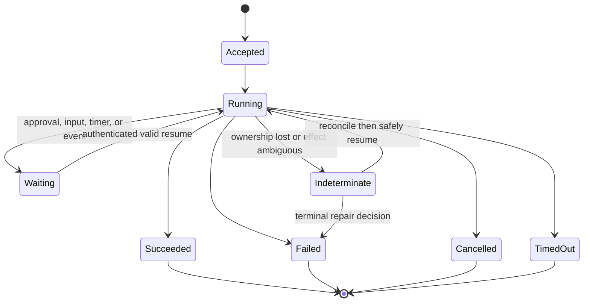
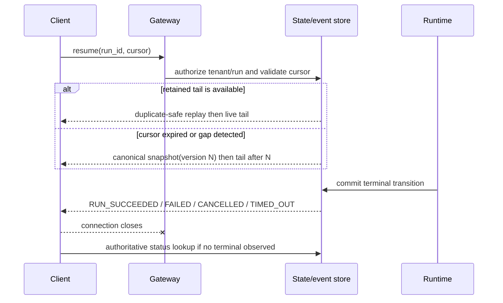
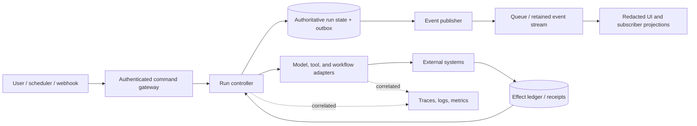

# Agent State and Event Contracts

> **Status:** Research-backed draft  
> **Last researched:** 2026-08-31  
> **Scope:** Application-owned run state, event identity, ordering, replay, streaming, effect evidence, and telemetry across agent frameworks and transports  
> **Research packet:** [Agent state and event contracts](../research/packets/agent-state-and-event-contracts.md)

## Production position

Own a small, versioned state-and-event contract outside the agent framework. Framework callbacks, token streams, workflow checkpoints, queue messages, and traces are useful inputs, but none is automatically the authoritative record of what a run may do next or whether an external effect happened.

The contract must survive process loss, duplicate delivery, reconnects, framework replacement, and retries. At minimum it needs stable identities, fenced state transitions, one explicit terminal outcome, effect receipts, and documented replay semantics.

## Keep six records separate



| Record | Question it answers | Reliability requirement |
|---|---|---|
| Command or intent | What did a user, timer, model, or operator request? | Authenticate, authorize, validate, deduplicate where needed |
| Authoritative run state | What may execute or commit next? | Transactional transition, version fence, single current owner |
| Domain event | Which meaningful transition occurred? | Immutable identity, schema version, declared ordering scope |
| Effect intent and receipt | What external business action was attempted or confirmed? | Stable effect ID, idempotency or reconciliation evidence |
| Delivery event | What should a UI or subscriber render now? | Replay, snapshot, coalescing, and gap behavior are explicit |
| Telemetry | Why did the system behave this way? | Correlated, redacted, sampled, and never authoritative |

One implementation may write several records in one transaction, but their meanings remain distinct. A workflow checkpoint is not proof that a payment committed. A token delta is not durable state. A sampled trace is not an audit ledger. A connection closing is not a successful terminal event.

## Identity model

Use separate identifiers for separate retry and ownership boundaries.

| Identity | Stable meaning | Changes when |
|---|---|---|
| `conversation_id` | User-visible continuity containing one or more runs | A new continuity domain is created |
| `run_id` | One accepted execution from start to a terminal or suspended outcome | The objective is restarted as a new execution |
| `attempt_id` | One lease or retry execution of a run or step | Work is retried or ownership transfers |
| `step_id` | One logical model, tool, approval, or workflow step | The logical step changes, not merely its retry |
| `tool_call_id` | One model-requested tool invocation | The model proposes a distinct call |
| `effect_id` | One intended external business effect across retries | The intended business action changes |
| `event_id` | One immutable event occurrence and duplicate-delivery identity | A new event is created, including a new projection event |
| `parent_id` / `causation_id` | Delegation, branch, fork, or causal lineage | The causal relationship changes |
| trace and span IDs | Diagnostic path through services | A trace boundary or span changes |
| release/schema/policy versions | How stored data and decisions must be interpreted | Code, contract, prompt, model route, or policy changes |

Do not substitute a convenient framework ID without documenting its lifecycle. In particular:

- a retry normally gets a new `attempt_id` but retains the same `effect_id`;
- a transport replay can create a new delivery attempt without creating a new domain event;
- a trace may be restarted at a trust boundary while the business `run_id` stays constant;
- a resumed conversation may contain a new run rather than extending the previous terminal run;
- parallel child runs need explicit parentage rather than a shared ambiguous thread ID.

CloudEvents uses `source` plus `id` as the duplicate identity of an event envelope. That is a useful convention, not a substitute for run, step, tenant, effect, or causal identity.

## Authoritative run state

A practical state machine distinguishes waiting, cancellation, timeout, failure, and ambiguity from success.



Names may vary, but enforce these invariants:

1. Start is accepted once for a canonical run ID.
2. Only the current lease or state version can advance the run.
3. Waiting records the reason, resume identity, expiry, and required authority.
4. A stream ending before a terminal event becomes incomplete or indeterminate, never implicit success.
5. Exactly one terminal outcome wins; late attempts and duplicate terminal events are rejected and diagnosed.
6. An ambiguous external outcome enters reconciliation instead of blind retry.
7. Terminal repair is an authenticated, audited state transition rather than a database edit.

Use a compare-and-set version, fencing token, or equivalent transactional precondition for every authoritative transition. A worker that loses its lease may still finish late; it must not overwrite the state written by its successor or authorize a new effect.

### Example transition

```text
load run where run_id = R
require run.state = RUNNING
require run.state_version = 17
require run.owner_fence = F

transaction:
  insert domain_event(event_id=E, run_id=R, sequence=42, type=RUN_WAITING)
  update run
    set state=WAITING, wait_reason=APPROVAL, state_version=18
    where run_id=R and state_version=17 and owner_fence=F

require exactly one run row updated
publish a redacted delivery projection after commit
```

The database and message broker may require an outbox or equivalent mechanism so a committed transition is eventually published without making the broker the source of truth.

## Event envelope

Use CloudEvents directly when it fits the deployment, or borrow its clear separation of envelope and typed data. An internal agent event typically needs additional execution fields.

```json
{
  "event_id": "evt_01...",
  "event_type": "agent.tool.effect_committed",
  "event_version": 2,
  "source": "urn:agent-runtime:payments-worker",
  "occurred_at": "2026-08-31T12:34:56.789Z",
  "tenant_id": "tenant_ref",
  "conversation_id": "conv_01...",
  "run_id": "run_01...",
  "attempt_id": "attempt_03...",
  "step_id": "step_07...",
  "effect_id": "effect_order_123_refund",
  "causation_id": "evt_earlier...",
  "sequence": 42,
  "state_version": 18,
  "schema_id": "agent-events/2",
  "release_id": "runtime-2026-08-31.4",
  "policy_version": "effects-17",
  "traceparent": "00-...-...-01",
  "data": {
    "receipt_ref": "receipt_01...",
    "outcome": "confirmed"
  }
}
```

The example is a design shape, not a universal mandatory schema. Keep these rules:

- identity and discriminator fields are immutable;
- tenant and principal fields come from trusted application context, never model output;
- `event_type` and `event_version` select a closed, validated payload schema;
- timestamps aid diagnosis but do not define a global order;
- `sequence` states its scope, such as one run or one partition;
- sensitive content is replaced by references or redacted projections;
- unknown event versions fail safely or go through an explicit compatibility path;
- raw/custom events remain namespaced, size-bounded, and non-authoritative until translated.

Do not expose the full internal envelope to every client. Generate a least-privilege projection that omits internal policy reasoning, credentials, hidden prompts, raw tool output, and cross-tenant identifiers.

## Ordering and concurrency

Global total order is rarely necessary and is expensive to promise. Define the smallest useful ordering domains:

- monotonic sequence within one run's authoritative stream;
- start, delta, and end order within one message;
- arguments, execution, and result order within one tool call;
- state versions for writes to the authoritative run record;
- explicit causation and parent references across parallel branches;
- broker partition rules when consumers depend on per-run order.

Arrival time is not occurrence order. Wall clocks drift, retries arrive late, and concurrent producers can allocate conflicting sequence numbers. If more than one producer writes to the same ordered stream, give one component sequencing authority or use a transactional allocator. Otherwise declare events only partially ordered and make consumers merge by identity and causality.

Reducers must state whether operations are commutative and idempotent. Appending two independent observations may commute; assigning a status or spending a budget normally does not. Do not copy a framework's reducer behavior into durable business state without examining these properties.

## Snapshots, deltas, and checkpoints

A delta is valid only against a known base. Every snapshot/delta contract should define:

| Concern | Required rule |
|---|---|
| Target | Entity ID, tenant, and schema |
| Base | Required `state_version` or cursor |
| Operation | Typed patch/reducer with validation and size limits |
| Result | Deterministic resulting version |
| Conflict | Reject, retry from fresh snapshot, or explicitly merge |
| Recovery | Snapshot plus tail when a delta is missing |
| Retention | How long snapshots, events, and cursors remain usable |

Periodic snapshots bound recovery time; they do not erase event identity or concurrency requirements. A checkpoint represents recoverable control state at a documented boundary. It does not prove an external effect committed, and it does not necessarily contain every ephemeral delivery event.

Version serialized state and keep historical fixtures. Before deploying a schema or workflow change, replay representative old state/events through the new reader. For long-running executions choose an explicit pin, migrate, version-branch, cancel/restart, or operator-repair policy.

## Delivery, reconnect, and replay

Name the guarantee at each hop. At-most-once can lose events. At-least-once can duplicate them. Any exactly-once claim must name its transaction, deduplication key, retention, and failure boundary.

Server-Sent Events supplies `id` and `Last-Event-ID`, but the server still owns retention and replay. WebSockets likewise provide a connection, not an event log. For every client transport document:

- cursor format, scope, expiry, and tenant binding;
- replay retention by time and count/bytes;
- duplicate and ordering behavior;
- slow-consumer buffering, coalescing, overflow, and disconnect policy;
- heartbeat meaning and timeout behavior;
- whether disconnect cancels execution;
- authentication and authorization on every resume;
- snapshot recovery when the cursor is unavailable;
- terminal-state lookup when live delivery ends early.



Persist semantic boundaries—accepted input, validated tool call, approval decision, effect intent/receipt, durable wait, completed artifact, and terminal outcome. Token, typing, and reasoning deltas are usually ephemeral delivery data and may be coalesced or discarded. If exact transcript reconstruction is a product requirement, make retention, encryption, deletion, and user access explicit.

## Effects and ambiguity

The event contract complements, but does not replace, idempotency and effect control.

1. Create a stable `effect_id` before an external write.
2. Persist effect intent and target/business preconditions.
3. Pass an idempotency or operation key when the target supports it.
4. Record a validated receipt or independently observed outcome.
5. If the call times out after possible acceptance, mark the effect indeterminate.
6. Reconcile by operation ID or target state before retrying.
7. Fence late attempts and duplicate approvals from committing again.

The durable run may be certain that a tool activity was scheduled while uncertain whether the external system committed. Preserve that distinction in state and user-facing status.

## Telemetry boundary

Correlate telemetry with application identities, but never derive authority from telemetry. W3C `traceparent` and `tracestate` describe diagnostic propagation, not authorization, tenant membership, idempotency, or business identity.

OpenTelemetry GenAI semantic conventions remain Development as of the research snapshot. Pin the convention version and use stable application attributes for:

- run, attempt, step, tool call, and effect IDs;
- privacy-safe tenant and release references;
- schema, prompt, model route, and policy versions;
- queue wait, lease, retry, and cancellation ownership;
- terminal class and reconciliation outcome.

Prompt, message, instruction, tool arguments/results, and model outputs may be sensitive. Content capture should be opt-in, classified, redacted, access-controlled, and retained independently from low-risk operational metadata. Prove that sampling or a telemetry outage cannot prevent recovery or alter run correctness.

## Adapter contract

A framework-to-application adapter is a semantic translator, not a field copier. For every supported framework version, specify and test:

- which framework objects map to conversation, run, attempt, step, tool, and trace identities;
- how start, finish, error, cancel, timeout, interrupt, and approval map to the application state machine;
- how partial tool arguments, model deltas, and final messages are framed;
- whether internal retries are visible as attempts or hidden implementation detail;
- what is committed before publication and what remains ephemeral;
- how upstream malformed events, duplicate terminal events, or early stream closure fail;
- how resume, checkpoint, fork, and child-agent lineage map;
- which source event/schema versions the adapter accepts.

Framework upgrades can alter event names, nesting, IDs, retry behavior, and terminal ordering without changing the application's intended semantics. Keep contract tests at the adapter boundary and retain captured fixtures for supported versions.

## Reference architecture



The database need not be one product, and an event-sourced design is not mandatory. The invariant is ownership: one authoritative transition boundary, durable effect evidence, eventual publication, and projections that can be rebuilt or replaced.

## Failure-injection matrix

| Test | Required result |
|---|---|
| Stream ends before a terminal event | Consumer reports incomplete/indeterminate and checks authoritative status |
| Every event is delivered twice | State, projections, approvals, and effects remain correct |
| Parallel tool events arrive out of order | Causal merge is deterministic or the violation is rejected |
| One delta is dropped | Consumer detects the version gap and obtains a snapshot/tail |
| Cursor is expired, forged, or cross-tenant | Resume is rejected or safely re-snapshotted without existence leakage |
| Crash follows effect commit but precedes receipt persistence | Reconciliation uses stable effect identity before retry |
| Old lease publishes after takeover | State/effect fence rejects the stale attempt |
| Two terminal events are emitted | One wins; the other is rejected and observable |
| Subscriber is slow | Memory stays bounded under documented coalescing/drop/disconnect policy |
| Schema or release changes mid-run | Pinning, compatibility, migration, or explicit repair applies |
| Telemetry is sampled or unavailable | Authoritative execution and recovery are unchanged |
| Payload is oversized, deeply nested, or unknown | Validation rejects it before expensive allocation or effects |

## Production checklist

- [ ] Conversation, run, attempt, step, tool call, effect, event, and trace identities are distinct.
- [ ] The authoritative state machine includes waiting, cancellation, timeout, failure, and indeterminate outcomes.
- [ ] State transitions use a transaction plus state-version or ownership fencing.
- [ ] Exactly one terminal outcome is required; stream closure is never success.
- [ ] Event schemas, ordering scopes, duplicate keys, and compatibility rules are documented.
- [ ] Snapshots and deltas include base/result versions and a gap-recovery path.
- [ ] Every transport names replay retention, cursor, slow-consumer, and disconnect behavior.
- [ ] Durable semantic events are separated from lossy presentation deltas.
- [ ] External effects have stable identity, receipts, and ambiguity reconciliation.
- [ ] Internal envelopes are projected and redacted before untrusted delivery.
- [ ] Telemetry is correlated but cannot authorize, deduplicate, or recover work.
- [ ] Framework adapters have versioned fixtures and malformed-stream contract tests.
- [ ] Operators can inspect, reconcile, repair, and audit terminal corrections.
- [ ] The failure-injection matrix runs against every runtime/transport combination.

## Related guides

- [Run controls](run-controls.md)
- [Durable execution](durable-execution.md)
- [Idempotency and side effects](../reliability/idempotency-and-side-effects.md)
- [Runtime failure taxonomy](../reliability/failure-taxonomy.md)
- [Queues, scheduling, and backpressure](../operations/queues-scheduling-and-backpressure.md)
- [Agent-user interaction with AG-UI](../protocols/agent-user-interaction-protocol.md)
- [Tool results, artifacts, and provenance](../tools/tool-results-artifacts-and-provenance.md)
- [Observability and tracing](../evaluation/observability-and-tracing.md)
- [Delegation, handoffs, and shared state](../orchestration/delegation-handoffs-and-shared-state.md)
- [Compaction and continuity](../context-memory/compaction-and-continuity.md)
- [Production agent control plane](../architectures/production-agent-control-plane.md)

## Selected sources

- [CloudEvents specification](https://github.com/cloudevents/spec/blob/main/cloudevents/spec.md)
- [CloudEvents primer](https://github.com/cloudevents/spec/blob/main/cloudevents/primer.md)
- [W3C Trace Context](https://www.w3.org/TR/trace-context/)
- [WHATWG Server-Sent Events](https://html.spec.whatwg.org/multipage/server-sent-events.html)
- [OpenTelemetry GenAI agent spans](https://github.com/open-telemetry/semantic-conventions-genai/blob/main/docs/gen-ai/gen-ai-agent-spans.md)
- [OpenTelemetry semantic-convention changelog](https://github.com/open-telemetry/semantic-conventions/blob/main/CHANGELOG.md)
- [AG-UI event definitions](https://github.com/ag-ui-protocol/ag-ui/blob/main/docs/sdk/js/core/events.mdx)
- [AG-UI core architecture](https://docs.ag-ui.com/concepts/architecture)

