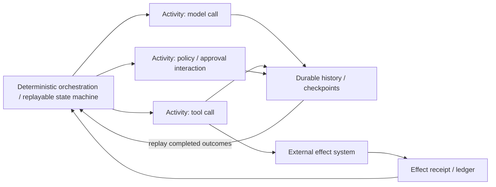
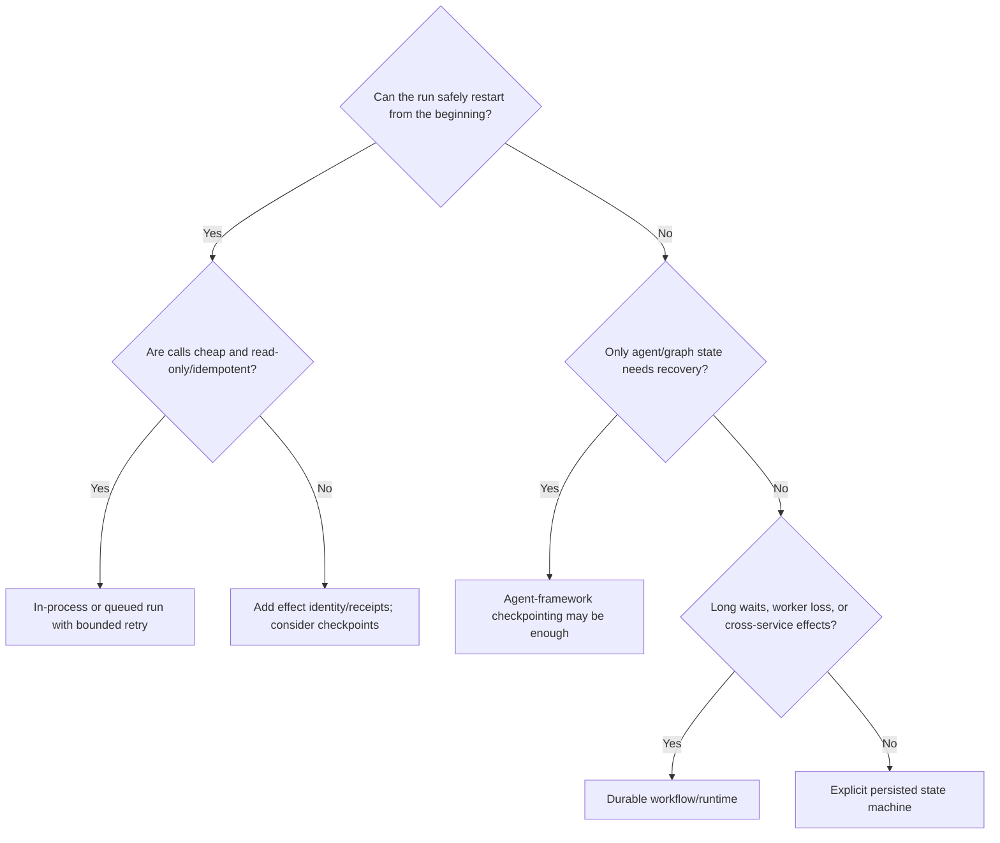
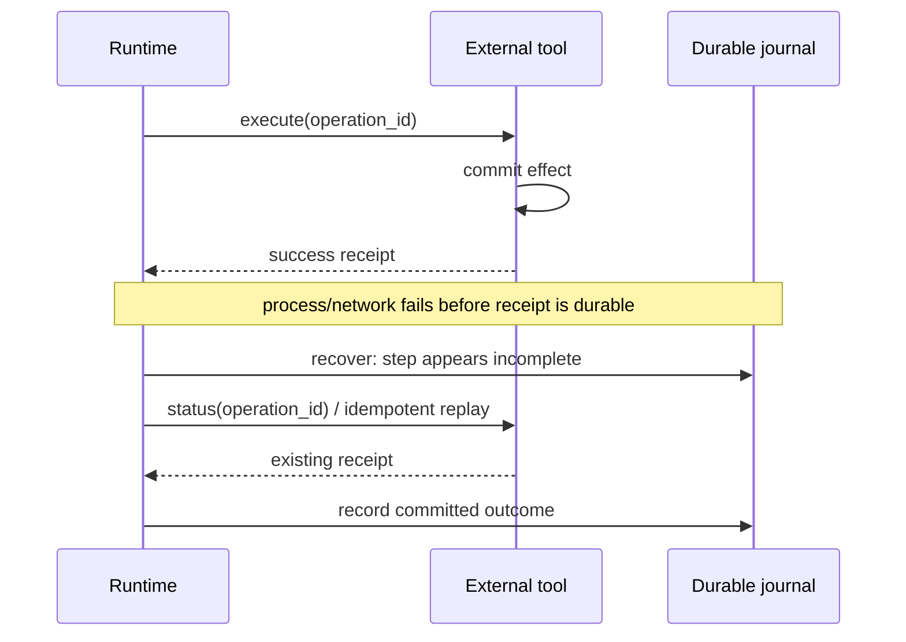
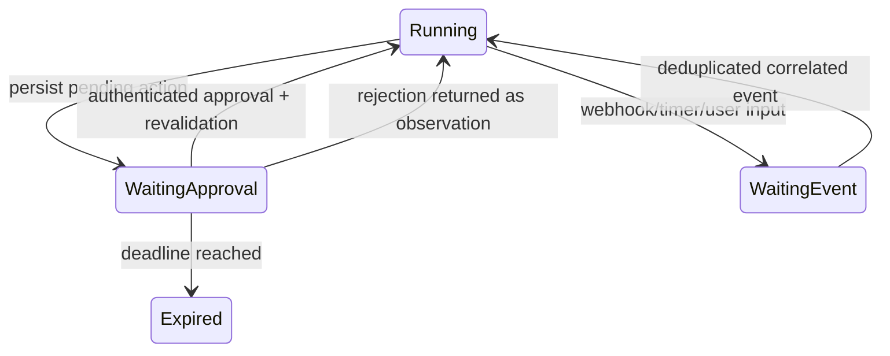

# Durable Execution for Agents

> **Status:** Research-backed draft  
> **Last researched:** 2026-08-30  
> **Scope:** Choosing and designing recovery for long-running, stateful agent work across crashes, waits, retries, and redeployments  
> **Research packet:** [Core agent loop and runtime boundary](../research/packets/core-agent-runtime.md)

## Production position

Durable execution is justified when a run must survive process loss or long waits without restarting completed model/tool work, especially when it crosses external side effects or human approval.

Durability does not make a nondeterministic tool safe to retry and does not create exactly-once external effects by itself.

## What must survive?

Start with the failure requirement, not a product.

| Required survival | Minimum mechanism |
|---|---|
| One request within one healthy process | In-memory loop with timeouts and cancellation |
| User conversation across requests | Session store or provider-managed conversation state |
| Agent graph after application restart | Durable checkpoints with stable run/thread ID |
| Long wait for approval/webhook/timer | Durable waiting state plus authenticated resume event |
| Multi-step work across worker loss | Replay/recovery runtime or explicit state machine with leases |
| External writes without duplication | Durable control flow **plus** idempotency/effect ledger/reconciliation |
| Version upgrades during active runs | Versioned workflow/state/event schema and migration policy |

Conversation persistence, memory, checkpointing, queue delivery, and durable execution are related but not interchangeable.

## Core model

The orchestration layer must reproduce the same next step during replay. Nondeterministic operations—model inference, current time, random values, database/network reads, and external tools—run in recorded activities/steps/tasks or behind an equivalent explicit transition.

Temporal's agent reference architecture states this rule directly: workflows orchestrate and activities execute. DBOS similarly requires deterministic workflow functions and puts nondeterministic work in steps. Restate uses a journal so completed calls are replayed from recorded results. The programming interfaces differ, but the invariant is the same.

## Durability levels

| Level | Recovery behavior | Suitable for | Hidden trap |
|---|---|---|---|
| Process-local loop | Restart whole run | Short, read-only, cheap tasks | Lost progress and repeated calls |
| Application snapshots | Load last saved state and continue custom code | Controlled simple flows | Owning schema, locking, migration, and partial-effect logic |
| Agent graph checkpoints | Resume at graph/super-step boundary | Human interrupts, state inspection, agent-specific graphs | External effect atomicity is still separate |
| Queue + database state machine | Redeliver job and transition explicit state | Teams with strong distributed-systems platform | Easy to grow into an undocumented workflow engine |
| Durable workflow engine | Replay history and retry incomplete units | Long waits, failure recovery, multi-service effects | Determinism/version constraints and platform operations |

Choose the lowest level that satisfies recovery semantics. A durable workflow platform can be excessive for a three-second read-only lookup; ad hoc snapshots are dangerous for a week-long approval and payment workflow.

## Decision tree

## Step boundary and effect ambiguity

No checkpoint design can ignore this failure window:

If the tool cannot query or deduplicate by operation ID, recovery cannot distinguish “never happened” from “happened but response was lost.” Blind retry risks duplication; blind success risks missing work.

Therefore every effectful durable step needs one of:

- downstream idempotency/deduplication by stable key;
- a transaction that atomically changes business state and records the effect request;
- an outbox/inbox protocol with deduplicated delivery;
- a queryable external receipt/status API;
- a safe compensating action and operator reconciliation path;
- a deliberately manual unknown-outcome state.

See [Idempotency and side effects](../reliability/idempotency-and-side-effects.md).

## Checkpoint placement

Checkpoint at semantic boundaries, not arbitrary token events:

- accepted input and stable run identity;
- before a durable wait/interruption;
- after a model response is accepted and recorded;
- after tool results and effect receipts are durable;
- after budget/policy state changes;
- before and after handoff ownership changes;
- at terminal outcome.

Too few checkpoints repeat expensive work. Too many increase storage, latency, and schema/version complexity. DBOS documents a concrete write cost model for its own implementation—one database write per step plus workflow boundary writes—but other systems differ. Measure your selected runtime rather than transferring that number.

## Determinism boundary

Keep these out of replayable orchestration unless the runtime provides a deterministic wrapper:

- model/provider calls;
- wall clock and timers;
- randomness and UUID generation;
- network/database/filesystem reads;
- environment/config values that may change;
- tool discovery that can return a different catalog;
- policy lookups and authorization state;
- concurrent iteration whose ordering affects transitions.

Record their results through activities/steps. During replay, consume the recorded result rather than execute again.

### Model calls require special care

Repeating an LLM call can change output and cost even with identical input. Record:

- provider response/item IDs where available;
- model and parameter configuration;
- accepted output/proposal;
- token/cost metadata;
- tool calls and provider call IDs;
- whether the request was definitively rejected, accepted, or unknown.

Do not automatically replay a provider request after an ambiguous transport failure unless the API and request identity support safe continuation.

## Human approval and external events

A durable pause should release compute while preserving the interruption.

Requirements:

- stable interruption/event ID;
- authenticated, tenant-scoped resume endpoint;
- deduplication for repeated webhook/approval delivery;
- target/policy/authorization freshness recheck;
- versioned serialized state;
- explicit expiry and cleanup;
- clear behavior for concurrent resumes;
- audit of who approved exactly what.

Never serialize raw short-lived credentials into durable history. Persist references and obtain fresh scoped credentials at execution.

## Current implementation families

This table describes architectural posture, not a feature-complete ranking.

| Family | Representative systems | Strength | Engineering cost / caution |
|---|---|---|---|
| Agent-native checkpoints | LangGraph persistence, CrewAI Flow persistence | Natural state inspection, interrupts, agent graph resume | Confirm failure boundary, concurrent update, and external-effect semantics |
| Agent framework + durable adapter | Pydantic AI with Temporal/DBOS/Prefect/Restate; OpenAI Agents SDK integrations | Preserve agent API while adding durable units | Adapter must correctly serialize errors, tools, approvals, streams, and version changes |
| General durable workflow engine | Temporal, Restate, DBOS, Dapr Workflow, Prefect | Mature recovery primitives, waits, timers, workers, operational tooling | Replay model, infrastructure, language/runtime constraints, and learning curve |
| Custom persisted state machine | SQL/event log + queue + workers | Exact domain fit and control | You own leases, deduplication, timers, migrations, replay, UI, and repair tools |

### Selection questions

- Does it document the boundary between completed and retryable work?
- Can it represent an unknown external-effect outcome?
- How are deterministic replay and code versioning handled?
- Can approvals, timers, and webhooks wait without holding a worker?
- How are concurrent resumes and zombie workers controlled?
- How are nested agents and parallel branches checkpointed?
- Are streaming events durable or merely live transport?
- Can operators inspect, retry, cancel, compensate, and migrate runs?
- What data enters history, and how is it encrypted/redacted/retained?
- Which databases/control planes/workers must the team operate?

## Streaming is not automatically durable

A workflow may be durable while its live token/event stream is not. If a browser disconnects, execution can continue but the user may miss already-emitted events.

Separate:

- **durable run events:** replayable state changes and results;
- **ephemeral presentation stream:** tokens, typing, and progress UX;
- **reconnect cursor:** last acknowledged durable event;
- **final artifact/result:** authoritative deliverable.

Do not checkpoint every token unless a product requirement justifies the volume. Emit durable semantic milestones and allow the UI to rebuild from them.

## Versioning and migration

Long-lived runs can outlive deployments, prompts, policies, schemas, tool versions, and model aliases.

Version:

- workflow/control definition;
- serialized run state;
- event and effect-receipt schema;
- prompt/instruction bundle;
- tool catalog and schema;
- model/provider configuration;
- policy and authorization logic;
- completion contract.

Choose a policy for active runs:

| Strategy | Benefit | Risk |
|---|---|---|
| Pin old worker/code until completion | Stable replay | Operational drag and security patch delay |
| Version branches inside workflow | Controlled migration | Growing complexity |
| Migrate state at checkpoint | Cleaner forward path | Migration correctness and rollback burden |
| Cancel/restart safe runs | Simple | Repeated work and possible effects |
| Manual intervention for rare long runs | Honest and controlled | Operator cost |

Test replay against historical event/state fixtures before deploying incompatible changes.

## Security and privacy

Durable histories can accumulate the most sensitive parts of an agent system: user input, model output, tool arguments, retrieved documents, approvals, credentials, and business receipts.

- Store credential references, not reusable secrets.
- Apply tenant isolation and authorization to status/resume/replay endpoints.
- Encrypt data in transit and at rest; minimize captured content.
- Redact tool results before both persistence and model context when required.
- Separate operator metadata from user-visible history.
- Apply retention/deletion to derived checkpoints and indexes, not only primary messages.
- Audit replay and manual repair operations.
- Treat old approvals as invalid after identity, policy, or target changes.

## Operational model

Monitor:

- running, waiting, stuck, failed, cancelled, and unknown-effect counts;
- checkpoint/history storage growth and retention;
- recovery attempts and replay latency;
- activity retries by class;
- zombie/concurrent execution conflicts;
- approval/event wait duration and expiry;
- version distribution of active runs;
- orphaned external jobs and reconciliation backlog;
- stream disconnect/reconnect gaps;
- cost saved by reused completed model/tool results.

Provide operator actions for inspect, pause, cancel, retry safe unit, reconcile effect, compensate, migrate, and terminate with reason. A durable system without repair tooling merely preserves failures longer.

## Anti-patterns

- Calling a model directly inside replayable deterministic workflow code.
- Saving messages but not pending calls, approvals, budgets, and effect receipts.
- Treating “last checkpoint” as a transaction boundary with an external API.
- Retrying a side-effecting activity with no stable operation ID.
- Holding a worker/process for a day-long approval wait.
- Assuming the live WebSocket/SSE stream can reconstruct durable state.
- Deploying incompatible workflow code without replay tests.
- Persisting ambient credentials in history.
- Allowing two resume events to execute the same pending action.
- Advertising “exact resume” without documenting the actual step boundary.

## Production checklist

- [ ] Failure and survival requirements are explicit.
- [ ] The selected durability level is the smallest that meets them.
- [ ] Replayable orchestration is deterministic.
- [ ] Model, tool, policy, time, and random operations are recorded units.
- [ ] Every effectful step has idempotency or reconciliation semantics.
- [ ] Unknown outcomes are a first-class state.
- [ ] Waits release workers and use authenticated, deduplicated resume events.
- [ ] Cancellation and concurrent-resume behavior are tested.
- [ ] Streaming UX is separated from durable events.
- [ ] Workflow, state, prompt, tool, model, and policy versions are recorded.
- [ ] Historical replay tests gate deployments.
- [ ] Secrets and sensitive content are minimized in durable history.
- [ ] Operators can inspect and repair stuck or ambiguous runs.

## Related guides

- [The production agent loop](../foundations/agent-loop.md)
- [Run controls](run-controls.md)
- [Idempotency and side effects](../reliability/idempotency-and-side-effects.md)
- [Decision guide](../comparisons/custom-loop-vs-framework-vs-workflow-engine.md)
- [Temporal vs Restate vs DBOS vs Prefect vs Dapr Workflow](../comparisons/durable-agent-workflow-runtimes.md)
- [Compaction and continuity](../context-memory/compaction-and-continuity.md)
- [Observability and tracing](../evaluation/observability-and-tracing.md)
- [Planning and replanning](../orchestration/planning-and-replanning.md)
- [Protocol selection](../protocols/protocol-selection.md)
- [Queues, scheduling, and backpressure](../operations/queues-scheduling-and-backpressure.md)
- [Interactive and long-running reference architectures](../architectures/interactive-and-long-running-reference-architectures.md)
- [Deployment, release, and incident response](../operations/deployment-release-and-incident-response.md)

## Research notes

The replay and step-boundary guidance was cross-checked against [Temporal's agent architecture](https://go.temporal.io/platform-hub/ai-engineering/ai-reference-architecture), [DBOS architecture](https://docs.dbos.dev/architecture), [Restate durable agents](https://docs.restate.dev/ai/patterns/durable-agents), [LangGraph persistence](https://docs.langchain.com/oss/javascript/langgraph/persistence), and [Pydantic AI's multi-engine durable integrations](https://pydantic.dev/docs/ai/capabilities/durable_execution/overview/). Guarantees are deliberately described at the weakest boundary supported across sources; use the [cross-runtime comparison](../comparisons/durable-agent-workflow-runtimes.md) and its five technology guides for system-specific semantics.
