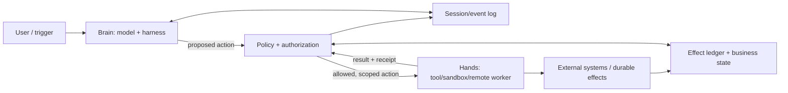
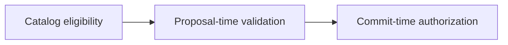
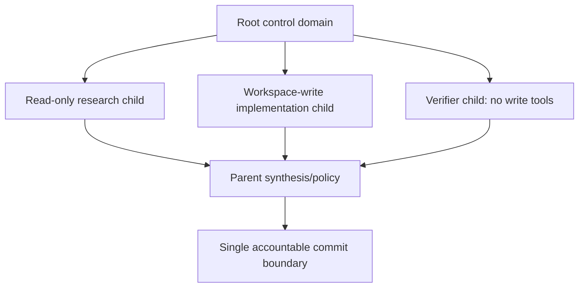

# Execution Boundaries: Brain, Policy, Hands, and Session

> **Status:** Research-backed draft  
> **Last researched:** 2026-08-30  
> **Scope:** Separating model judgment from authority, execution environments, recoverable state, and external effects  
> **Research packet:** [Core agent loop and runtime boundary](../research/packets/core-agent-runtime.md)

## Recommended production boundary

Treat the agent as a set of independently replaceable and independently failing components:



- **Brain:** assembles context, asks the model for semantic decisions, and interprets proposals.
- **Policy plane:** validates arguments, identity, resource scope, current authorization, budgets, approval, and risk.
- **Hands:** execute a bounded operation in a controlled environment.
- **Session:** stores the recoverable event/history stream independently of what fits in the next model context.
- **Effect ledger/business state:** records what was requested, attempted, committed, or reconciled.

This separation is not necessarily a microservice architecture. It is a responsibility boundary. A small application may implement the components in one process while preserving their contracts.

## Why this boundary exists

The model is probabilistic and processes untrusted content. The executor has deterministic access to credentials, files, networks, and APIs. Combining them creates ambient authority: any model mistake or injected instruction can immediately become an effect.

Separating the components provides:

- **Security:** the model never becomes the authorization system.
- **Reliability:** session and effect state survive brain or worker replacement.
- **Debuggability:** a trace distinguishes proposal, policy decision, execution, and commit.
- **Performance:** expensive execution environments can be provisioned only when needed.
- **Portability:** models, harnesses, sandboxes, and tools can evolve independently.
- **Multi-agent control:** delegation can share bounded hands without sharing ambient credentials or process state.

Anthropic describes a production version of this pattern in [Managed Agents](https://www.anthropic.com/engineering/managed-agents), separating “brain,” “hands,” and a durable session log. Its reported latency gains are workload-specific, but the architectural lesson is broader: stable interfaces outlive assumptions embedded in a harness.

## Component contracts

### Brain contract

Inputs:

- bounded context view and policy-safe tool catalog;
- current objective and unresolved obligations;
- selected authoritative facts and previous observations;
- remaining run budgets.

Outputs:

- typed proposal: final candidate, tool/handoff call, question, refusal, or escalation;
- no direct authority to commit an external effect.

The brain may be stateful at the logical level but should be replaceable at the process level. Durable truth belongs outside model memory and process-local variables.

### Policy contract

For each proposal, determine:

1. Is this tool/capability eligible for this run and user?
2. Are arguments structurally and semantically valid?
3. Is the exact target resource within scope?
4. Is the proposed action read-only, reversible, destructive, or externally communicative?
5. Is approval required, present, legible, and still fresh?
6. Does the action fit remaining budgets and concurrency constraints?
7. What stable operation ID and effect policy apply?
8. Which sandbox, identity, network, and data controls must the executor receive?

Policy returns an allow/deny/pause decision plus an execution envelope. It should never return raw long-lived credentials to the model.

### Hands contract

Conceptually:

```text
execute(execution_envelope, operation_id, cancellation) -> result + effect_receipt
```

The envelope includes only the authority needed for the specific action. The executor enforces:

- filesystem and network scope;
- resource/time/output limits;
- identity and credential isolation;
- idempotency or deduplication key;
- cooperative cancellation and process termination policy;
- result redaction and size limits;
- audit metadata.

### Session contract

The session is an append-oriented record of accepted inputs, model proposals, policy decisions, tool results, approvals, checkpoints, budget changes, and terminal outcomes. The model context is a derived view of this record, not the record itself.

This supports:

- resume after brain replacement;
- multiple context-compaction strategies;
- audit and replay without assuming every event fits in context;
- model/harness migration;
- debugging the difference between “the event happened” and “the model saw the event.”

### Effect ledger contract

Record at minimum:

| Field | Purpose |
|---|---|
| Operation ID | Stable identity across retry/replay |
| Intent hash/version | Detect changed arguments under a reused ID |
| Actor, tenant, policy version | Audit authority and isolation |
| Target and effect class | Bound blast radius and reconciliation |
| Status | Proposed, authorized, started, committed, failed, unknown, compensated |
| External receipt/version | Query authoritative downstream outcome |
| Approval reference and validity | Prove what was reviewed and whether it was fresh |
| Timestamps/attempts | Diagnose retries, orphans, and stale work |

## Availability is not authorization

An agent framework may conditionally expose a tool. That reduces selection noise and accidental use, but it does not authorize the model's eventual arguments. Current OpenAI Agents SDK documentation makes this distinction explicit: conditional tool availability runs before arguments exist, so resource-level authorization still belongs inside execution or a tool guardrail.

Use three layers:



1. **Catalog eligibility:** do not show tools the run can never use.
2. **Proposal-time validation:** reject invalid arguments and out-of-scope intent before expensive work or approval.
3. **Commit-time authorization:** recheck current identity, resource state, approval freshness, and policy immediately before effect.

Commit-time checks matter because a run may pause, retry, migrate workers, or operate on a target that changes between proposal and execution. Recent research on “temporary authority, permanent effects” is still emerging, but it reinforces a familiar distributed-systems principle: stale evidence should not authorize a current commit.

## Approval and containment solve different problems

| Control | Best at | Weakness |
|---|---|---|
| Human approval | Ambiguous user intent, high-consequence semantic choices, exceptions | Fatigue, poor legibility, delay, stale state |
| Deterministic policy | Stable rules, identity, scopes, amounts, environments | Cannot resolve every semantic ambiguity |
| Sandbox/containment | Hard blast-radius caps on filesystem, process, and network access | Configuration and escape-risk maintenance |
| Least-privilege identity | Preventing cross-resource or cross-tenant access | Does not detect malicious but in-scope intent |
| Model/classifier guard | Reducing suspicious proposals and injected behavior | Probabilistic; cannot stand alone |
| Audit/detection | Investigation and response | Does not prevent the first effect |

Anthropic's containment reporting documents high approval rates and declining reviewer attention, while its sandboxing work emphasizes hard filesystem/network boundaries. The correct conclusion is layered control, not “never ask” or “always ask.”

Use approval when the reviewer can see:

- the exact action and target;
- the important arguments and estimated impact;
- the evidence or reason;
- whether the action is reversible;
- what will happen on rejection or timeout;
- whether parallel sibling actions are paused.

## Parallel and nested work

A root run should own a **control domain**:

- identity and tenant;
- allowed capability scopes;
- maximum cost, time, tool calls, and parallel width;
- cancellation token/fence;
- approval policy;
- effect ledger namespace;
- trace lineage.

Subagents and handoffs receive a narrowed child domain. They do not automatically inherit every credential or tool. Child results return through the parent policy boundary before becoming trusted evidence or triggering effects.



This isolates context and capability while preserving one accountable effect boundary.

## Deployment shapes

| Shape | When useful | Trade-offs |
|---|---|---|
| Single process, explicit modules | Short, low-risk runs; early production | Simple operations; process failure loses in-memory progress unless persisted |
| Stateless brains + shared session store | Many runs, model/harness scaling, long contexts | Requires durable event schema and concurrency control |
| Remote hands/sandboxes | Untrusted code, customer VPCs, expensive environments | Provisioning, transport, identity, and result-delivery complexity |
| Durable workflow control plane | Long waits, restarts, approvals, external effects | Replay constraints and operational platform cost |
| Remote agent boundary | Organizational or vendor isolation | Protocol trust, identity delegation, partial failure, and observability gaps |

Do not split components into services merely to match the diagram. Split deployment when failure isolation, security, scaling, ownership, or placement requires it.

## Weak implementations

- Model process holds broad cloud/database credentials.
- Tool descriptions contain policy but executor does not enforce it.
- Approval grants a tool forever rather than one scoped effect or bounded session.
- Session state is only a chat transcript; pending calls and effect receipts are lost.
- Sandbox controls the parent command but not spawned processes or network egress.
- Remote tool output is trusted because the connector itself was approved.
- Subagents inherit root tools and secrets without need.
- Policy checks only at proposal time, then commits after a long approval wait.
- The executor returns unlimited logs or secrets into model context.

## Production checklist

- [ ] Brain, policy, execution, session, and effect responsibilities are named even if colocated.
- [ ] Model proposals cannot bypass deterministic authorization.
- [ ] Tool catalog filtering and argument/resource authorization are separate.
- [ ] Credentials are scoped, short-lived where possible, and never placed in model-visible output.
- [ ] Every write has a stable operation identity and reconciliation path.
- [ ] Session history and model context are separate artifacts.
- [ ] Approval records bind exact action, target, arguments, and validity window.
- [ ] Authorization is rechecked at commit.
- [ ] Sandbox includes descendants, filesystem, and network boundaries appropriate to risk.
- [ ] Child agents receive narrowed control domains.
- [ ] Cancellation prevents late commits and cleans up remote/orphan work.
- [ ] Result redaction, provenance, and size limits are enforced before context insertion.

## Signals to change the architecture

- Provisioning execution environments dominates time-to-first-token: consider lazy remote hands.
- Brain crashes lose progress: externalize session/run state.
- Tool changes require prompt rewrites across the system: stabilize tool and policy contracts.
- Incidents involve unused ambient permissions: narrow identities and tool catalogs.
- Reviewers approve reflexively: replace frequent prompts with containment and risk-based approval.
- Recovery cannot determine whether a write occurred: add an effect ledger and downstream idempotency.
- Subagent work is untraceable or exceeds root budgets: add a root control domain and lineage.

## Related guides

- [The production agent loop](../foundations/agent-loop.md)
- [Choosing an agent runtime language](../languages/choosing-an-agent-runtime-language.md)
- [Run controls](run-controls.md)
- [Durable execution](durable-execution.md)
- [Idempotency and side effects](../reliability/idempotency-and-side-effects.md)
- [Agent threat model](../security/agent-threat-model.md)
- [Permissions, sandboxing, and secrets](../security/permissions-sandboxing-and-secrets.md)

## Research notes

The component split is synthesized from [Anthropic Managed Agents](https://www.anthropic.com/engineering/managed-agents), [Anthropic containment and sandboxing reports](https://www.anthropic.com/engineering/how-we-contain-claude), current [OpenAI tool authorization guidance](https://openai.github.io/openai-agents-js/guides/tools/), durable-engine semantics, and newer commit-time authorization research. Production measurements are attributed in the [research packet](../research/packets/core-agent-runtime.md) and are not generalized as expected results.
