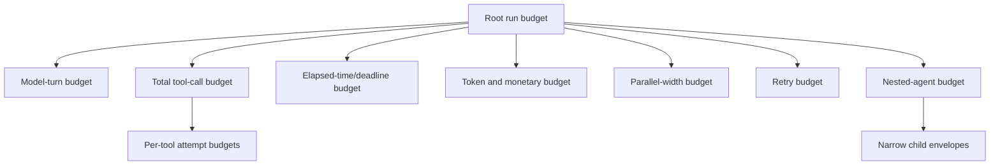
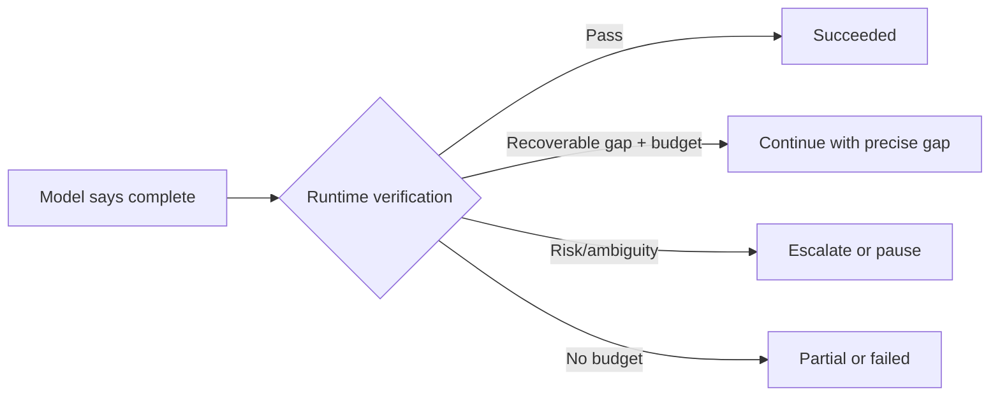
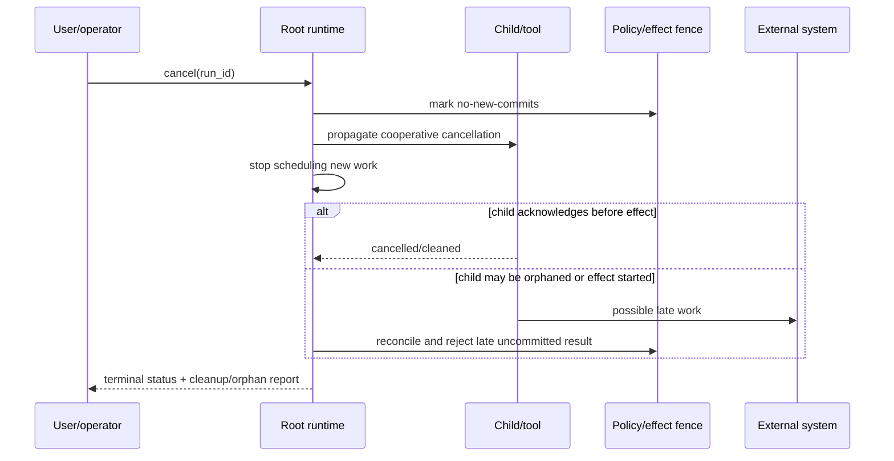

# Run Controls: Budgets, Stopping, Timeouts, and Cancellation

> **Status:** Research-backed draft  
> **Last researched:** 2026-08-30  
> **Scope:** Bounding and interrupting model turns, tools, nested work, approvals, and effects  
> **Research packet:** [Core agent loop and runtime boundary](../research/packets/core-agent-runtime.md)

## Core rule

A production agent must be able to stop for several independent reasons. “The model will know when it is done” is a completion hint, not a resource, safety, or reliability control.

## Budget envelope

| Budget | Prevents | Important nuance |
|---|---|---|
| Model turns | Unbounded proposal/observation loops | A turn may contain several parallel tools |
| Total tool calls | Tool storms hidden inside few model turns | Count nested and deferred tools |
| Per-tool attempts | One broken tool dominating the run | A success-resetting counter can still allow many failures |
| Repeated-action detector | Semantically identical loops with varied syntax | Normalize tool name, target, and meaningful arguments |
| Wall-clock deadline | Runs surviving indefinitely | Deadline does not automatically stop remote or synchronous work |
| Per-call timeout | One model/tool attempt blocking progress | Distinguish connect, read, execution, and cleanup time |
| Token budget | Context/output/reasoning runaway | Include nested agents and retries |
| Monetary budget | Cross-provider/tool/infrastructure cost | Use reserved and actual cost when calls are concurrent |
| Parallel width | Resource spikes and sibling effects | Separate provider proposal parallelism from executor concurrency |
| Approval wait | Abandoned paused runs | Define expiry, rejection, and cleanup |
| Nested depth/count | Recursive delegation and context explosion | Children consume root budget, not an independent unlimited pool |

Use workload evals to set numbers. Avoid universal defaults; a five-turn support action and a multi-hour coding task need different envelopes.

## Terminal outcomes

Every stop must map to an explicit terminal or waiting state:

| Outcome | Meaning | User/operator contract |
|---|---|---|
| Succeeded | Completion contract verified | Deliver result and receipts |
| Partial | Useful output exists; named obligations remain | State what completed, what did not, and whether effects occurred |
| Waiting | Durable pause for approval, user input, timer, or event | Expose reason, expiry, and resume identity |
| Failed | Non-recoverable error or exhausted retry/budget | Preserve diagnostics and safe resume/restart options |
| Cancelled | Cancellation fence reached; no further commits allowed | Report cleanup/orphan status |
| Unknown effect | External outcome cannot yet be proven | Enter reconciliation; never label simple failure or retry blindly |

## Stop conditions and completion

Current frameworks implement different units. OpenAI's runner uses a model-turn limit, Vercel AI SDK uses step conditions, and LangGraph uses a graph recursion/step guard. These limits prevent infinite execution but do not prove task completion.

Use two layers:

1. **Structural stop controls:** limits, deadline, cancellation, policy denial, provider terminal error.
2. **Semantic completion contract:** artifact/state verification, tests, required evidence, unresolved-obligation check.

## Timeouts are layered

| Timeout | What it bounds | What may continue afterward |
|---|---|---|
| Provider request timeout | One network/model attempt | Provider-side computation may have been accepted; replay safety matters |
| Tool invocation timeout | Caller waiting for a tool result | Thread, subprocess, remote job, or effect may continue unless cancelled/killed |
| Sandbox command timeout | A bounded process in a controllable environment | Descendants if process-group containment is wrong |
| Turn timeout | Model plus tools for one loop turn | Independently scheduled children or remote calls |
| Run deadline | Scheduling of the overall run | In-flight work without propagated cancellation/fence |
| Approval expiry | How long a decision remains usable | The run may remain stored; target/business state may change |

OpenAI's current model timeout documentation explicitly states that it does not limit the full agent run, tool execution, or retry backoff. Pydantic AI documents that a synchronous Python tool's worker thread cannot be forcibly stopped by normal cancellation. These are examples of a general rule: a timeout stops waiting only if the runtime also controls and confirms the work's termination.

## Cancellation semantics

Define cancellation at four levels:

1. **Stop scheduling:** no new model, tool, or child work.
2. **Propagate request:** cooperative tokens/signals reach all in-flight descendants.
3. **Enforce termination:** kill or revoke controlled processes/leases where appropriate.
4. **Fence commits:** late results cannot authorize new effects or overwrite newer state.

Cancellation should be idempotent. Repeated cancel requests return the same or a later terminal state.

### Process and remote-work considerations

- Use process groups/containers for untrusted or uncooperative commands.
- Give remote jobs stable IDs and an explicit cancel/status API.
- Revoke or expire leases/credentials when cancelling sensitive work.
- Drain or mark tool results so histories remain structurally valid.
- Record whether cleanup is confirmed, pending, or impossible.
- Do not reuse a cancelled run's authority automatically when resuming or restarting.

## Approval pause semantics

An approval is a durable interruption, not a chat question.

Persist:

- proposed tool/action and exact arguments;
- target resource version or freshness witness;
- requesting run/agent/tenant;
- policy version and reason for approval;
- side-effect class and reversibility;
- expiry and allowed reviewer identity;
- sibling-branch state;
- decision and custom rejection guidance.

On resume:

1. authenticate reviewer and decision;
2. load the same pending call by stable ID;
3. revalidate arguments, target state, policy, and authority;
4. ensure the call was not already committed;
5. apply approval once;
6. continue or return a model-visible rejection;
7. expire unresolved approvals deliberately.

> [!WARNING]
> If parallel siblings can execute effects while one branch awaits approval, the reviewer is not approving the whole observed plan. Make branch/barrier behavior explicit and test it.

## Parallel execution controls

Provider-side parallel tool calling and runtime execution concurrency are separate. Even if a model proposes five calls, the executor may serialize, cap, reject, or require coordination.

### Safe parallelization test

Parallelize only if all answers are yes:

- Are the calls independent under current arguments?
- Are they read-only, idempotent, or safely coordinated?
- Is their combined authority acceptable?
- Can cancellation stop/fence every sibling?
- Can result order be normalized without changing meaning?
- Will combined output fit memory/context budgets?
- Is the root budget reserved before starting them?

Otherwise serialize or build an explicit deterministic workflow.

## Retry controls

Inventory every layer:

| Layer | Typical owner | Same semantic action? | Main risk |
|---|---|---|---|
| HTTP/provider transport | SDK/client | Usually | Provider may have accepted the request |
| Model fallback | Model router | Yes, different model | Behavior/schema drift |
| Model proposal correction | Agent runner | No; revised action | Loop and token growth |
| Tool argument correction | Model-visible tool error | Revised arguments | Fresh retry budgets per invented tool/name |
| Tool transport/execution | Tool/runtime | Intended same action | Duplicate side effects |
| Durable activity/step | Workflow engine | Same recorded step | At-least-once incomplete effect |
| Whole run/job delivery | Queue/scheduler | Same objective | Repeating all prior effects |

Set both per-layer and root total budgets. A system with three retries at four nested layers can perform far more attempts than “three retries” suggests.

### Retry decision matrix

| Condition | Default |
|---|---|
| Definitively not accepted; transient failure; no effect | Retry with backoff/jitter within budget |
| Invalid model arguments and actionable correction exists | Return concise correction to model |
| Policy or authorization denial | Do not retry unchanged; stop or choose allowed alternative |
| Effect committed and receipt exists | Reuse receipt; never repeat |
| Effect outcome unknown | Reconcile by operation ID before any retry |
| Timeout with unconfirmed termination | Fence, reconcile orphan, then decide |
| Deterministic bug/schema incompatibility | Fail fast; retrying infrastructure wastes budget |

## Loop detection

Count structural and semantic repetition:

- same tool, normalized target, and arguments;
- alternating pair/cycle of tools without new authoritative information;
- repeated plan text with no state delta;
- repeated validation error category;
- rising cost with unchanged completion score;
- repeated child delegation for the same objective.

On detection, return a precise observation such as “three searches produced no new sources” or terminate with a loop reason. Merely raising the maximum turn count converts a bounded failure into a more expensive one.

## Test matrix

- [ ] Model never emits a final answer.
- [ ] Model repeats the same read tool with cosmetic argument changes.
- [ ] Tool returns malformed, huge, or delayed output.
- [ ] Provider times out before and after accepting a request.
- [ ] Synchronous tool ignores cancellation.
- [ ] Subprocess spawns a child and exceeds timeout.
- [ ] One parallel branch needs approval while another can write.
- [ ] Approval arrives after policy or target state changed.
- [ ] Cancellation races with external commit.
- [ ] Process crashes after effect but before receipt persistence.
- [ ] Durable replay meets an unknown effect outcome.
- [ ] Nested agent exhausts root cost/turn budget.
- [ ] Tool error classification is serialized across a durable boundary.
- [ ] Run resumes twice from the same interruption.

## Operational metrics

Track distributions, not only averages:

- turns and tools per successful/failed run;
- repeated-action and loop-guard trips;
- retry attempts by layer and cause;
- timeout versus confirmed termination versus orphan counts;
- cancellation propagation and cleanup latency;
- approval rate, wait time, expiry, rejection, and post-approval invalidation;
- parallel width and sibling cancellation leakage;
- tokens/cost at terminal reason;
- unknown-effect and reconciliation outcomes.

## Production checklist

- [ ] Root and child budgets are explicit and compositional.
- [ ] Completion verification is separate from structural stop limits.
- [ ] Timeout scope is named for every model/tool/command call.
- [ ] Cancellation stops scheduling, propagates, enforces where possible, and fences commit.
- [ ] Approval is durable, scoped, expiring, and commit-time revalidated.
- [ ] Provider parallelism and executor concurrency are configured independently.
- [ ] Total retry amplification is calculated across layers.
- [ ] Unknown effect outcomes enter reconciliation.
- [ ] Loop detection uses semantic state delta, not only turn count.
- [ ] Every terminal outcome preserves diagnostics and effect status.
- [ ] The failure test matrix runs in CI or a controlled pre-production environment.

## Related guides

- [The production agent loop](../foundations/agent-loop.md)
- [Go cancellation and runtime ownership](../languages/go-agent-runtimes.md)
- [Python cancellation and runtime ownership](../languages/python-agent-runtimes.md)
- [TypeScript/Node.js abort and runtime ownership](../languages/typescript-node-agent-runtimes.md)
- [Execution boundaries](execution-boundaries.md)
- [Durable execution](durable-execution.md)
- [Idempotency and side effects](../reliability/idempotency-and-side-effects.md)
- [Runtime failure taxonomy](../reliability/failure-taxonomy.md)
- [Permissions, sandboxing, and secrets](../security/permissions-sandboxing-and-secrets.md)
- [Trajectory and reliability evaluation](../evaluation/trajectory-and-reliability-evaluation.md)
- [Planning and replanning](../orchestration/planning-and-replanning.md)
- [Delegation, handoffs, and shared state](../orchestration/delegation-handoffs-and-shared-state.md)
- [Queues, scheduling, and backpressure](../operations/queues-scheduling-and-backpressure.md)
- [Model routing, cost, and latency](../operations/model-routing-cost-and-latency.md)

## Research notes

Mechanics were cross-checked against current [OpenAI Agents SDK run controls](https://openai.github.io/openai-agents-python/running_agents/), [model timeout scope](https://openai.github.io/openai-agents-python/models/), [Vercel loop control](https://ai-sdk.dev/docs/agents/loop-control), [Pydantic retry and cancellation semantics](https://github.com/pydantic/pydantic-ai/blob/main/docs/tools-advanced.md), and [LangGraph loop guards](https://github.com/langchain-ai/langgraph/blob/main/libs/langgraph/langgraph/errors.py). [Stop Means Stop](https://arxiv.org/abs/2607.14166) is treated as emerging failure evidence and a source of test cases, not settled prevalence data.
