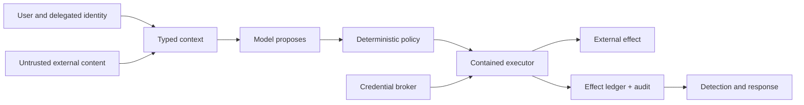

# Security and Safety Engineering

> **Status:** Research-backed core available; protocol, tenant-isolation, and incident-response deep dives remain queued.  
> **Last researched:** 2026-08-30  
> **Evidence:** [Security, evaluation, context, and memory research packet](../research/packets/security-evaluation-context-memory.md)

## Read in this order

1. [Agent threat model](agent-threat-model.md) — assets, actors, boundaries, failure paths, and control architecture.
2. [Prompt injection and untrusted data](prompt-injection-and-untrusted-data.md) — direct/indirect injection, information flow, adaptive testing, and delayed memory attacks.
3. [Permissions, sandboxing, and secrets](permissions-sandboxing-and-secrets.md) — least privilege, approvals, containment, egress, credentials, and MCP authorization.

## Control map

## Stable baseline

- Model output is an untrusted proposal, never authority.
- Trusted connectors can return untrusted content.
- Authorization is revalidated against canonical facts at commit time.
- Approvals bind to exact effects and supplement rather than replace containment.
- Filesystem and network boundaries both matter; long-lived credentials stay outside the sandbox.
- Security evaluation measures benign utility, adaptive attacks, repeated attempts, and reachable blast radius.
- Durable memory writes are security-sensitive effects.

## Remaining research queue

- Multi-tenant isolation, regional data boundaries, retention, and deletion architecture.
- Incident response, forensics, key rotation, quarantine, and compromise recovery.
- MCP-specific server admission, tool metadata mutation, roots, sampling, elicitation, and supply-chain review.
- Workload-specific controls for browser/computer use, coding, infrastructure, finance, and support agents.
- Comparative validation of 2026 information-flow and memory-poisoning defenses.
