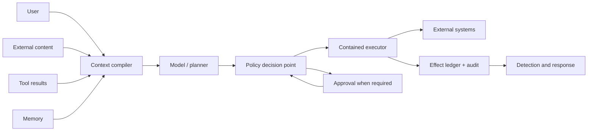
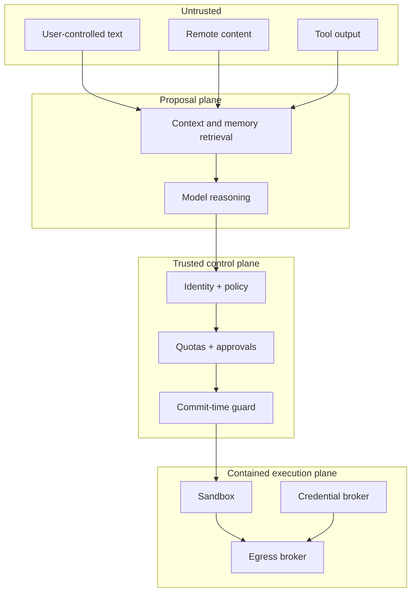

# Agent Threat Model

> **Status:** Research-backed draft  
> **Last researched:** 2026-08-30  
> **Scope:** Threat modeling for tool-using, stateful, and multi-step agents; organizational risk management and protocol-specific server hardening remain separate reviews.  
> **Evidence:** [Security, evaluation, context, and memory research packet](../research/packets/security-evaluation-context-memory.md)  
> **Section index:** [Security and safety engineering](README.md)

An agent is not just a model endpoint. It is a principal-like system that interprets untrusted content, proposes actions, receives ambient authority through tools, and may preserve influence across time. Threat-model the complete path from input to external effect—not only the prompt.

## The core security invariant

> **A model output is an untrusted proposal. It acquires authority only after deterministic policy checks at the execution boundary.**

This holds even when the output is well-formed, the model is aligned, the tool schema validates, and the content arrived through an approved connector. Those facts reduce some risks; none proves the action is authorized or safe.

## Assets, actors, and trust boundaries

### Assets worth naming explicitly

| Asset | Failure impact | Typical hidden path |
|---|---|---|
| User and tenant data | Disclosure, corruption, cross-tenant leak | Prompt/trace capture, broad search, memory retrieval, tool output |
| Credentials and delegated tokens | Account takeover, lateral movement | Environment variables, files, logs, unscoped token forwarding |
| External effects | Financial, operational, legal, or reputational loss | Retries, stale approvals, wrong resource, unsafe tool argument |
| Policy and instructions | Goal hijack or control bypass | Untrusted text inserted into privileged context lanes |
| Durable state and memory | Persistent compromise or silent drift | Automatic extraction, poisoned retrieved examples, bad consolidation |
| Runtime and host | Code execution, escape, denial of service | Shell tools, interpreters, project configuration, dependencies, SSRF |
| Evidence and audit trail | Failed forensics or false assurance | Missing causal IDs, mutable logs, secret-bearing traces, self-reports |
| Availability and budget | Resource exhaustion, queue starvation | Loops, recursive delegation, tool storms, oversized context |

### Threat actors and failure origins

Do not limit the model to a malicious end user. The same harmful proposal can originate from:

- a legitimate user making a mistake or pasting a malicious instruction;
- an attacker controlling a webpage, email, issue, document, repository, or tool result;
- a compromised or malicious tool, MCP server, plugin, package, or peer agent;
- an over-privileged operator, service account, or integration;
- the model misinterpreting the task, inventing a fact, or finding an unexpected path;
- stale or poisoned memory, an unsafe prior trajectory, or a faulty compaction summary;
- ordinary software defects in authorization, path handling, retries, parsing, or isolation.

### Trust boundaries to draw

The proposal plane may be compromised without permission to rewrite the control plane. Put policy, credential issuance, tenant filters, quotas, effect-state transitions, and audit integrity outside model-editable state.

## Threat taxonomy by stage

| Stage | Representative threats | Required control family |
|---|---|---|
| Admission | Direct/indirect injection, spoofed source, malicious attachment, oversized input | Provenance, content/type limits, isolation, risk labeling |
| Context assembly | Instruction/data confusion, stale conflict, secret inclusion, cross-tenant retrieval | Typed lanes, precedence outside prose, authorization-first retrieval, redaction |
| Planning | Goal hijack, unsafe decomposition, hidden delegation, policy evasion | Proposal-only semantics, plan budgets, required invariants, no ambient authority |
| Tool selection | Name/description poisoning, excessive capability, confused deputy | Trusted catalog, capability scopes, server admission, identity binding |
| Arguments | Shell/SQL/path injection, SSRF, wrong tenant/resource, data over-sharing | Typed validation, canonicalization, resource policy, destination/method controls |
| Authorization | Stale approval, privilege aggregation, token passthrough, TOCTOU | Exact-effect approval, audience-bound identity, commit-time revalidation |
| Execution | Host RCE, sandbox escape, filesystem/network exfiltration, denial of service | OS/VM isolation, egress enforcement, secret broker, quotas, kill controls |
| Recovery | Duplicate effects, replay under changed policy, unknown outcome | Idempotency key, effect ledger, policy version, reconciliation |
| Memory | Poisoned write, cross-user recall, sensitive retention, stale truth | Write gate, tenant ACL, provenance, TTL, supersession, deletion audit |
| Observability | Secret leakage, missing causality, log tampering, unbounded capture | Data classification, content opt-in, immutable IDs, retention, access controls |

OWASP's agentic list and MITRE ATLAS are useful prompts for coverage. They do not replace this system-specific dataflow: every tool and effect needs a named caller, resource, authority source, failure mode, and evidence trail.

## Risk is likelihood times reachable loss

Model defenses can lower the probability that a bad instruction succeeds. Containment lowers what a successful attack can reach. Production risk needs both terms:

| Dimension | Questions |
|---|---|
| Attempt likelihood | Who can place content in context? Can they retry or adapt? Is the attack visible to the user? |
| Proposal susceptibility | Does the model distinguish data from instructions? Are classifiers and adversarial training evaluated against adaptive attacks? |
| Authority | Which identity, roles, resources, operations, and data classes can this run access? |
| Reachability | Which filesystem paths, hosts, methods, APIs, accounts, tenants, and downstream functions are reachable? |
| Persistence | Can the attack write memory, configuration, skills, files, or tasks that survive the run? |
| Recoverability | Can effects be rolled back? Are writes idempotent? Is the result known after timeout? |
| Detectability | Will policy denials, unusual egress, new memory, or repeated failures generate actionable signals? |

An apparently low injection rate is not acceptable justification for broad credentials or unrestricted network access. Attackers can retry, and ordinary mistakes do not need adversarial sophistication.

## Control architecture

### 1. Admission and provenance

- Identify the origin, tenant, user, connector, and retrieval path of every context item.
- Preserve content as data; do not interpolate remote text into developer/system instructions.
- Enforce file type, size, decompression, nesting, and parser limits before model access.
- Treat local repositories and configuration as untrusted until the user or policy establishes trust.

### 2. Context and information flow

- Use typed lanes for authority, verified state, user intent, untrusted evidence, and model scratch.
- Keep secrets out of model-visible context unless the task strictly requires them.
- Constrain untrusted-to-privileged transformations with schemas and explicit allowlists.
- Prevent model-generated text from silently becoming policy, tool metadata, or durable memory.

### 3. Authorization and approvals

- Bind authorization to principal, tenant, resource, operation, parameters, policy version, and time.
- Recheck immediately before the irreversible effect, not only when the plan is proposed.
- Ask for approval only when human intent can resolve risk; show the actual effect and data movement.
- Expire approvals and invalidate them when arguments, target state, identity, or policy changes.

### 4. Containment and credential brokerage

- Restrict filesystem, process, device, network, DNS, and metadata-service access.
- Keep long-lived credentials outside the agent sandbox; mint short-lived, audience-bound capability tokens.
- Treat egress rules as capabilities over destination, method, account, and function—not domain names alone.
- Prefer mature OS, hypervisor, identity, and network primitives over bespoke filters.

### 5. Evidence, detection, and response

- Record proposal, policy decision, approval reference, execution attempt, effect identity, and observed outcome.
- Alert on denied high-risk attempts, novel destinations, repeated approval requests, memory changes, and tenant mismatches.
- Preserve immutable raw events while allowing redacted derived views.
- Maintain kill, credential-revocation, quarantine, and reconciliation procedures.

## Architecture review questions

### Authority

- [ ] Can any model-written string change policy, permissions, tool definitions, or credential scope?
- [ ] Does every effect identify the end user and workload identity separately?
- [ ] Are combined permissions reviewed, not only each tool in isolation?
- [ ] Are tokens audience-bound, short-lived, and never passed through to another service unchanged?

### Data flow

- [ ] Is every remote or tool-provided value labeled untrusted regardless of connector trust?
- [ ] Does tenant authorization happen before semantic retrieval or ranking?
- [ ] Can an untrusted document cause a durable memory/configuration/skill write?
- [ ] Are sensitive values absent from prompts, traces, errors, and sandbox environment variables by default?

### Effects

- [ ] Is policy revalidated at commit with canonical resource identifiers?
- [ ] Are retries safe under timeouts and unknown outcomes?
- [ ] Does the system know whether an effect happened, rather than trusting the final answer?
- [ ] Can cancellation stop new commits even if an in-flight model or tool call cannot be interrupted?

### Containment and response

- [ ] Does isolation cover both filesystem and network paths?
- [ ] Are symlinks, redirects, DNS changes, localhost, cloud metadata, and server-side fetch considered?
- [ ] Can operators revoke credentials and disable tools without redeploying the model?
- [ ] Can an incident be reconstructed without retaining unnecessary sensitive prompt content?

## Failure patterns to reject

| Weak pattern | Why it fails | Stronger replacement |
|---|---|---|
| “The system prompt says never…” | Competes with adversarial and conflicting context | Deterministic denial at the effect boundary |
| “The connector is approved” | The data behind it may be attacker-controlled | Per-item provenance and untrusted-data handling |
| “The arguments match JSON Schema” | Syntax is not authorization or semantic safety | Canonicalize, authorize resource and operation, validate business invariants |
| “Ask the user every time” | Approval fatigue and expertise mismatch | Safe defaults, containment, and selective effect-bound approval |
| “Only allow trusted domains” | Trusted domains expose upload, redirect, and multi-account functions | Method/path/account-aware egress plus credential provenance |
| “Run it in a container” | Containers vary; mounts, network, daemon sockets, and kernel exposure matter | Explicit isolation profile and adversarial boundary tests |
| “We log the transcript” | A transcript may omit effects and leak secrets | Typed effect ledger, policy decisions, content-minimized traces |

## Related guides

- [Prompt injection and untrusted data](prompt-injection-and-untrusted-data.md)
- [Permissions, sandboxing, and secrets](permissions-sandboxing-and-secrets.md)
- [Execution boundaries](../runtime/execution-boundaries.md)
- [Idempotency and side effects](../reliability/idempotency-and-side-effects.md)
- [Memory architecture](../context-memory/memory-architecture.md)
- [Trajectory and reliability evaluation](../evaluation/trajectory-and-reliability-evaluation.md)
- [Multi-agent topologies](../orchestration/multi-agent-topologies.md)
- [Protocol selection](../protocols/protocol-selection.md)
- [Production agent control plane](../architectures/production-agent-control-plane.md)
- [Deployment, release, and incident response](../operations/deployment-release-and-incident-response.md)

## Selected sources

- [NIST AI RMF and current revision status](https://www.nist.gov/itl/ai-risk-management-framework)
- [OWASP Agentic Top 10 2026](https://genai.owasp.org/resource/owasp-top-10-for-agentic-applications-for-2026/)
- [MITRE ATLAS](https://atlas.mitre.org/)
- [MCP authorization security considerations, 2026-07-28](https://github.com/modelcontextprotocol/modelcontextprotocol/blob/main/docs/specification/2026-07-28/basic/authorization/security-considerations.mdx)
- [Anthropic containment engineering report, 2026-05-25](https://www.anthropic.com/engineering/how-we-contain-claude)
- [Microsoft prompt-to-shell vulnerability report, 2026-05-07](https://www.microsoft.com/en-us/security/blog/2026/05/07/prompts-become-shells-rce-vulnerabilities-ai-agent-frameworks/)
