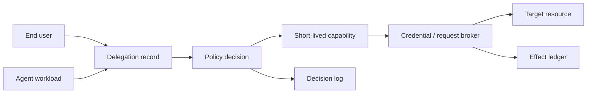
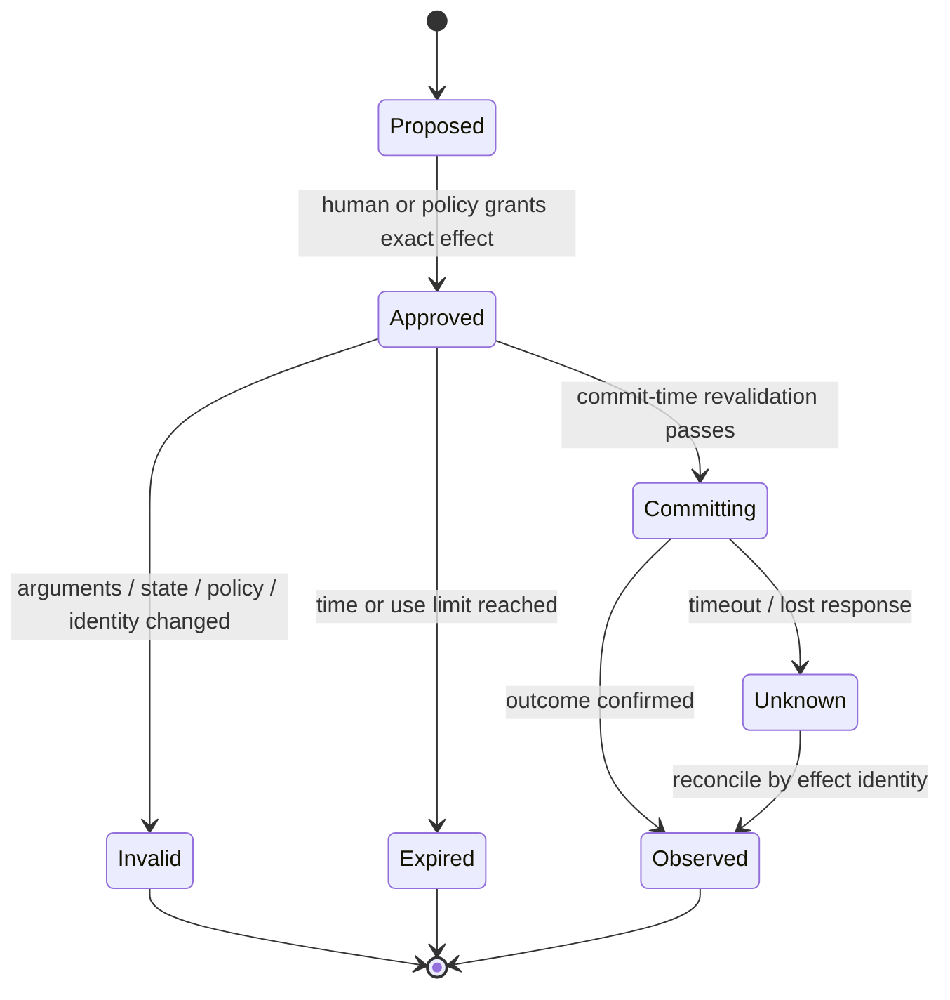
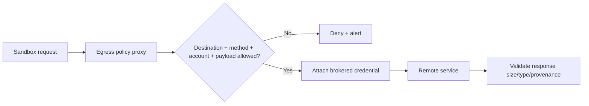

# Permissions, Sandboxing, and Secrets

> **Status:** Research-backed draft  
> **Last researched:** 2026-08-30  
> **Scope:** Least privilege, authorization, approval, execution isolation, network egress, and credential delivery for agents. It does not replace platform-specific hardening or a formal tenant-isolation review.  
> **Evidence:** [Security, evaluation, context, and memory research packet](../research/packets/security-evaluation-context-memory.md)  
> **Section index:** [Security and safety engineering](README.md)

The safest permission is one the agent never receives. When an action is necessary, grant a narrow capability for the specific principal, resource, operation, and time—then execute it inside a boundary that limits damage if the proposal is wrong.

## Separate the identities

Do not collapse the end user, agent workload, operator, tool server, and downstream service into one service account. A downstream audit should be able to answer:

- which human or tenant initiated the work;
- which agent version and workload executed it;
- which policy and delegation authorized it;
- which exact resource and operation were allowed;
- which credential or token instance was used;
- what effect occurred.

## Permission model

### Capability tuple

Represent effective authority as a tuple, not a role name:

| Dimension | Examples |
|---|---|
| Principal | User, tenant, workload, tool server |
| Resource | Repository, mailbox, table row set, cloud project, filesystem subtree |
| Operation | Read, append, update fields, delete, execute, transfer |
| Constraints | Amount, recipient class, branch, path, query shape, data classification |
| Context | Approved task, run ID, environment, policy version |
| Time | Not-before, expiry, maximum uses |
| Obligations | Approval, logging, dual control, dry run, postcondition check |

The authorizer should compute aggregate reach across all tools. Two individually reasonable capabilities—read secrets and send arbitrary network requests—combine into exfiltration authority.

### Permission tiers

| Tier | Examples | Default control |
|---|---|---|
| Observe | Read public docs, list non-sensitive metadata | Pre-authorize with rate and tenant limits |
| Sensitive read | Customer records, source, internal logs | Purpose-bound access, redaction, no arbitrary egress |
| Reversible write | Draft, branch, staged configuration | Narrow scope, diff, idempotency, rollback |
| Irreversible/high impact | Send, publish, delete, transfer, deploy, permission change | Exact-effect approval or deterministic workflow gate, dual control where appropriate |
| Execute code | Shell, interpreter, browser script, package install | Strong sandbox, no ambient secrets, controlled egress, resource quotas |
| Change authority | Create token, modify policy, install tool/skill | Usually outside agent authority; separate administrative workflow |

## Approval is a delegation artifact

An approval should contain the effect digest, not merely the tool name:

- principal and tenant;
- canonical target and operation;
- material parameters or a reviewable diff;
- data leaving a boundary and its destination;
- reversibility and expected postcondition;
- policy/version and run identity;
- expiry and permitted use count.

If anything material changes, request a new approval. Never replay an approval against regenerated arguments.

## Choose the isolation boundary by adversary and asset

| Boundary | Good fit | Strengths | Common gaps |
|---|---|---|---|
| Language/process restrictions | Trusted application logic | Low overhead | Weak against native code, child processes, interpreters |
| OS sandbox (for example namespace/seatbelt-style controls) | Local developer agent with scoped workspace | Fast, auditable filesystem/process policy | Platform variance; network and helper processes need separate controls |
| Container | Service isolation with controlled images | Packaging, cgroups, namespaces, ephemeral filesystems | Shared kernel, dangerous mounts/capabilities, daemon sockets, metadata/egress |
| User-space kernel / hardened container | Multi-tenant code execution | Stronger syscall boundary than ordinary containers | Operational complexity and compatibility |
| MicroVM / VM | Hostile or high-impact code, non-expert users | Separate kernel, strong host boundary, explicit mounts | Boot/cost overhead; isolation can hide activity from host EDR |
| Separate account/project/host | High-value cloud and tenant boundaries | Limits credential and control-plane reach | Higher operational cost; cross-boundary services must be secured |

The word “sandbox” is not a guarantee. Document the exact filesystem mounts, write/delete semantics, processes, devices, syscalls, network paths, DNS behavior, proxy, credentials, metadata access, lifetime, and cleanup.

## Filesystem containment

- Resolve and canonicalize paths before authorization.
- Resolve symlinks and junctions against the authorized root; do not validate only the textual prefix.
- Prefer explicit mounts to host-wide deny lists.
- Separate read-only inputs, writable workspace, artifact output, and executable/configuration locations.
- Deny access to sockets, credential stores, browser profiles, SSH agents, cloud configuration, package caches with tokens, and container daemons.
- Treat repository-local hooks, settings, startup files, and dependencies as code from an untrusted origin until trust is established.
- Offer write-without-delete or staging areas when the workflow permits.
- Snapshot or use version control for recovery, but do not confuse recoverability with permission.

## Network and egress containment

Avoid a domain-only allowlist. An allowed domain may support arbitrary uploads, redirects, webhooks, server-side URL fetching, multiple attacker-controlled accounts, or a broad API surface. Bind the rule to:

- resolved destination and redirect chain;
- scheme, port, method, and path or API operation;
- expected account/tenant and credential provenance;
- request and response sizes and content types;
- source/destination data classifications;
- DNS rebinding, localhost, private ranges, metadata services, and proxy bypass;
- rate, concurrency, and total bytes.

When internet access is not required, deny it. When package installation is required, use a curated mirror, pinned lock data, signature/provenance checks, and a build phase separated from secret-bearing execution.

## Keep secrets out of the reasoning plane

### Credential broker pattern

1. The model proposes a typed action using a logical connection or resource ID.
2. Policy authorizes the principal, operation, resource, and data movement.
3. A trusted broker resolves the logical ID and obtains a short-lived audience-bound token.
4. The broker performs or signs the request without returning the secret to the model or sandbox.
5. The effect and token identifier—not the token value—are logged.

This prevents a fully compromised prompt from reading long-lived credentials. It also makes revocation, rotation, and audit tractable.

### Secret handling checklist

- [ ] No long-lived secrets in prompts, memory, traces, model-visible files, or general environment variables.
- [ ] Tokens are audience- and resource-bound, short-lived, and use-limited where supported.
- [ ] Upstream OAuth tokens are never forwarded unchanged through an MCP or proxy server.
- [ ] The sandbox cannot query cloud metadata or local credential agents.
- [ ] Logs redact authorization headers, URLs with tokens, tool arguments, and exception payloads.
- [ ] Different tenants and environments have distinct identities and encryption boundaries.
- [ ] Revocation can stop new effects immediately, including queued or resumed runs.

## MCP and remote tool authorization

Current MCP security guidance requires servers to accept tokens intended for themselves and forbids token passthrough. Apply the broader implications:

- treat a local MCP server like installed software, with host-level privileges appropriate to its process;
- pin or review server origin, version, command, dependencies, tool metadata, and requested scopes;
- do not assume tool annotations are enforcement;
- separate the MCP server's token from any token it uses for an upstream API;
- validate OAuth state, PKCE, exact redirect URIs, audience/resource indicators, and metadata URLs;
- defend dynamic client registration and upstream authorization against confused-deputy attacks;
- require reauthorization when server capabilities or scopes materially change.

## Containment trade-offs

| Choice | Gains | Costs and compensating controls |
|---|---|---|
| Stronger VM boundary | Smaller host blast radius | Startup/cost; add guest telemetry and health recovery |
| Network deny by default | Stops many exfiltration paths | Breaks installs/search; use narrow brokers and mirrors |
| Credential outside sandbox | Prevents direct theft | Broker becomes critical; harden, rate-limit, and audit it |
| Read-only workspace | Prevents corruption | Limits usefulness; use staged writable output and reviewed merge |
| Fewer approvals inside strong boundary | Lower fatigue and latency | Boundary must be explicit, tested, and visible to user/operator |
| Rich isolation | Strong containment | Reduced endpoint visibility; design secure telemetry export before launch |

## Verification plan

Test the boundary, not only the policy configuration:

- attempt symlink/junction/path traversal and alternate encodings;
- probe child processes, interpreters, debugger interfaces, sockets, device files, and daemon APIs;
- test DNS rebinding, redirects, IPv6/private ranges, localhost, metadata endpoints, and allowed-domain uploads;
- place canary secrets outside allowed mounts and in forbidden environment/credential paths;
- simulate token theft, expiry, wrong audience, replay, and policy revocation during a run;
- kill the worker during commit and prove reconciliation prevents a duplicate effect;
- attempt to mutate startup configuration, tool catalogs, skills, hooks, and memory;
- verify telemetry still explains a blocked or successful effect without storing the secret.

## Production readiness checklist

- [ ] Effective authority is represented as principal × resource × operation × constraints × time.
- [ ] User identity and workload identity remain distinct end to end.
- [ ] Commit-time policy uses canonical resource facts and current state.
- [ ] Approvals are exact, expiring, and invalidated by change.
- [ ] Filesystem and network constraints are both enforced outside the model.
- [ ] Long-lived credentials never enter the sandbox.
- [ ] Egress rules cover function/account/data movement, not only domains.
- [ ] Aggregate capabilities cannot silently create an exfiltration or privilege-escalation path.
- [ ] Boundary tests run in CI and before isolation/runtime upgrades.
- [ ] Operators can revoke, quarantine, reconcile, and investigate.

## Related guides

- [Agent threat model](agent-threat-model.md)
- [Prompt injection and untrusted data](prompt-injection-and-untrusted-data.md)
- [Execution boundaries](../runtime/execution-boundaries.md)
- [Run controls](../runtime/run-controls.md)
- [Idempotency and side effects](../reliability/idempotency-and-side-effects.md)

## Selected sources

- [MCP authorization security considerations, 2026-07-28](https://github.com/modelcontextprotocol/modelcontextprotocol/blob/main/docs/specification/2026-07-28/basic/authorization/security-considerations.mdx)
- [MCP repository security and trust assumptions](https://github.com/modelcontextprotocol/modelcontextprotocol/security)
- [Microsoft least privilege for AI agents](https://learn.microsoft.com/en-us/security/zero-trust/sfi/least-privilege-for-ai-agents)
- [Anthropic containment engineering report](https://www.anthropic.com/engineering/how-we-contain-claude)
- [Anthropic Claude Code sandboxing](https://www.anthropic.com/engineering/claude-code-sandboxing)
- [Microsoft prompt-to-shell vulnerability report](https://www.microsoft.com/en-us/security/blog/2026/05/07/prompts-become-shells-rce-vulnerabilities-ai-agent-frameworks/)
