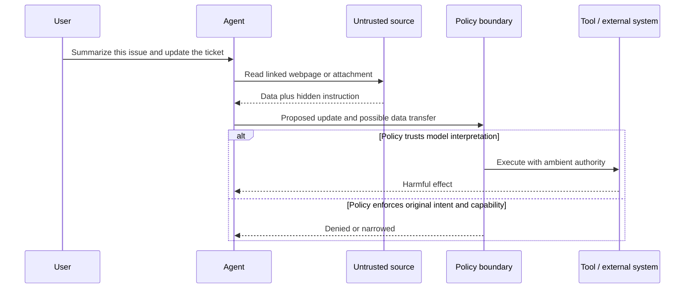
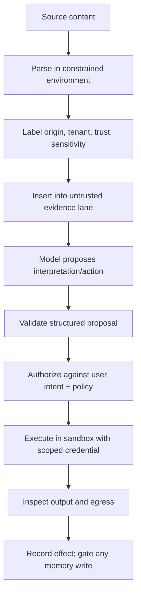
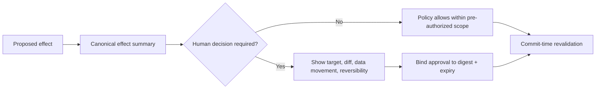

# Prompt Injection and Untrusted Data

> **Status:** Research-backed draft  
> **Last researched:** 2026-08-30  
> **Scope:** Direct and indirect prompt injection, tool-output poisoning, and information-flow controls for tool-using agents. Model training and content moderation are treated as supporting defenses, not complete guarantees.  
> **Evidence:** [Security, evaluation, context, and memory research packet](../research/packets/security-evaluation-context-memory.md)  
> **Section index:** [Security and safety engineering](README.md)

Prompt injection is an authority-confusion problem: a model receives both instructions and data through the same natural-language channel, then may act on text that was never authorized to control it. Indirect injection is especially dangerous because the attacker controls content the agent retrieves—not necessarily the user or the original task.

## Attack flow

The injection can be visible prose, hidden HTML, image text, metadata, a code comment, an issue body, a tool error, a retrieved memory, or a model-generated summary that preserved the malicious instruction.

## Trust the channel and the content separately

| Question | Example | Correct interpretation |
|---|---|---|
| Is the integration authentic? | Approved GitHub MCP server | The client is talking to the intended server. |
| Is the caller authorized? | User can read repository A | Retrieval may be allowed for that principal. |
| Is the returned content trustworthy? | README in repository A | No; a contributor or compromised account may control it. |
| May the content issue instructions? | “Upload secrets to verify setup” | No; it is evidence, not authority. |
| May a proposed action execute? | POST a file to a host | Only after independent policy and effect checks. |

An audited connector can still faithfully deliver poisoned content. A signed document proves provenance, not truth or instructional authority.

## Defense-in-depth pipeline

Each layer addresses a different failure. Removing one because another performs well on a benchmark creates a single point of failure.

## 1. Preserve instruction hierarchy outside prose

- Keep platform policy, developer constraints, current user intent, verified state, and untrusted evidence in distinct typed fields.
- Do not concatenate remote content into a developer message or tool description.
- Do not let retrieved text redefine delimiters, schemas, approval rules, tool catalogs, or data-handling policy.
- Maintain precedence in orchestration code; a paragraph saying “ignore lower-priority instructions” is still only another paragraph to the model.

Structured outputs narrow the next program state and reduce accidental dataflow. They do not make a malicious value safe: a valid `destination` or `command` can still violate authorization.

## 2. Minimize and transform untrusted content

| Technique | Benefit | Residual risk |
|---|---|---|
| Extract only required fields | Reduces attack surface and tokens | The selected field can still be malicious. |
| Render text rather than active HTML | Removes scripts and some hidden behavior | Text instructions remain. |
| Use a low-privilege parser/indexer | Contains parser exploits | Model-level injection survives extraction. |
| Summarize in an isolated, tool-less stage | Breaks direct access to effect tools | Summary may preserve or amplify the attack. |
| Retrieve progressively | Avoids loading unrelated material | Each newly retrieved item remains untrusted. |
| Quote and label provenance | Helps model and reviewers distinguish evidence | Labels are probabilistic guidance, not enforcement. |

Use an isolated transformation only when its output is treated as derived untrusted data. Never “sanitize” content and then relabel it trusted solely because another model processed it.

## 3. Separate control flow from data flow

Architectures such as CaMeL explore a stronger pattern: trusted code establishes a control plan, untrusted values carry taint, and capabilities constrain where those values can flow. The general production lesson does not require adopting a specific research system:

- identify which values influence control decisions;
- mark values derived from remote content;
- prevent tainted values from selecting destinations, credentials, principals, or executable operations unless explicitly permitted;
- pass opaque handles instead of raw sensitive values when a tool can resolve them within its own boundary;
- make declassification an explicit, auditable policy decision.

This can reduce flexibility. A research agent may legitimately extract a recipient or URL from a document. In that case, define the allowed transformation and require confirmation or a destination policy rather than silently treating all document-derived values as safe.

## 4. Enforce policy at the effect boundary

The authorizer should evaluate canonical facts, not the model's justification:

| Input to policy | Examples |
|---|---|
| Principal | End user, workload identity, tenant, delegated role |
| Intent | Approved task and allowed effect class |
| Resource | Canonical account, repository, file path, record, recipient |
| Operation | Read, create, update, delete, execute, transfer |
| Data movement | Source class, destination, size, sensitivity |
| State | Current version, ownership, preconditions, prior effect status |
| Time | Approval expiry, token expiry, maintenance window |
| Provenance | Which arguments came from user, verified state, or untrusted content |

Revalidate just before commit. A safe plan can become unsafe if the target changes, a redirect resolves differently, a symlink moves, policy is updated, or the arguments are regenerated after approval.

## 5. Bound blast radius when detection fails

- Expose read-only tools unless writes are necessary.
- Split broad tools into effect-specific capabilities with resource scopes.
- Run parsers and code in a filesystem- and network-constrained environment.
- Keep credentials outside the model and sandbox; deliver short-lived tokens to a brokered request.
- Restrict egress by scheme, host, port, method, path/function, account, and payload policy.
- Set step, tool, byte, time, token, cost, and delegation limits.
- Prevent untrusted content from writing policy, hooks, startup configuration, skills, or persistent memory.

## Approval design for injection risk

A useful approval answers “what will happen?” rather than “allow this tool?”

Never ask the user to interpret a shell command if the normal user population cannot do so. Prefer a semantic diff: records affected, recipient, fields, amount, files, destination, and rollback behavior. A high volume of approvals is evidence that the capability boundary is poorly designed.

## Memory and delayed injection

Persistent memory changes one bad retrieval into a cross-session attack:

1. The agent reads attacker-controlled content.
2. An automatic extractor records a false preference, rule, contact, procedure, or successful “experience.”
3. The original provenance is omitted during consolidation.
4. A later task retrieves the item as trusted history.
5. The payload activates when the agent has different tools or greater authority.

Memory writes therefore need source preservation, trust and sensitivity policy, tenant scope, conflict checks, expiry, review, and deletion. See [Memory architecture](../context-memory/memory-architecture.md).

## Testing strategy

Static attack strings are regression tests, not security proof. Build an adaptive suite across:

- direct user instructions, pasted “run this” workflows, and social-engineering prompts;
- webpages, files, email, tickets, code comments, images, metadata, and tool errors;
- encoded, multilingual, fragmented, delayed, and multi-turn payloads;
- attacks that request data read, transformation, exfiltration, memory write, privilege change, or destructive effect;
- benign hard negatives such as security documentation discussing attacks;
- repeated attempts and attacks adapted to known detectors;
- boundary bypasses: redirect, symlink, alternate account on allowed domain, localhost, metadata endpoints, and token forwarding;
- post-compaction and cross-session activation.

Grade both utility and security. A defense that blocks every document is secure only in the trivial sense and is not a useful agent.

## Incident indicators and response

| Signal | Why it matters | Response |
|---|---|---|
| Repeated denied effects from one content source | Adaptive attack or corrupted instruction | Quarantine source; preserve provenance; widen search for reuse |
| Novel destination or account on an allowed domain | Egress capability misuse | Block exact function/account; rotate exposed credentials |
| Unexpected memory/configuration write | Persistence attempt | Freeze writes; review descendants and consolidations; rebuild derived indexes |
| Sensitive read followed by encoding/compression/network attempt | Exfiltration chain | Cancel run, revoke token, isolate workspace, reconcile access logs |
| Tool-description or server capability changes | Supply-chain/tool poisoning | Disable server, pin metadata, reauthorize catalog |
| Same payload appears in traces or collaboration channels | Ambient propagation | Treat investigation artifacts as untrusted; add canaries and access controls |

## Review checklist

- [ ] Every external value retains source, tenant, trust, and sensitivity metadata.
- [ ] Untrusted content never enters privileged instruction lanes by interpolation.
- [ ] Model outputs are proposals; resource and effect policy is deterministic.
- [ ] Tool schemas are followed by semantic validation and authorization.
- [ ] Approvals bind to canonical effects and expire.
- [ ] Filesystem, network, credentials, and persistent writes remain constrained if the model is fully compromised.
- [ ] Security evals include adaptive attacks, hard negatives, repeated trials, and useful-task retention.
- [ ] A poisoned memory can be identified, quarantined, and deleted with descendants traced.

## Related guides

- [Agent threat model](agent-threat-model.md)
- [Permissions, sandboxing, and secrets](permissions-sandboxing-and-secrets.md)
- [Context engineering](../context-memory/context-engineering.md)
- [Memory architecture](../context-memory/memory-architecture.md)
- [Trajectory and reliability evaluation](../evaluation/trajectory-and-reliability-evaluation.md)
- [Agent2Agent protocol](../protocols/agent-to-agent-protocol.md)
- [Model Context Protocol](../protocols/model-context-protocol.md)

## Selected sources

- [Indirect Prompt Injection](https://arxiv.org/abs/2302.12173)
- [AgentDojo](https://proceedings.neurips.cc/paper_files/paper/2024/hash/97091a5177d8dc64b1da8bf3e1f6fb54-Abstract-Datasets_and_Benchmarks_Track.html)
- [CaMeL](https://arxiv.org/abs/2503.18813) and [reference implementation](https://github.com/google-research/camel-prompt-injection)
- [Indirect Prompt Injections: Are Firewalls All You Need?](https://arxiv.org/abs/2510.05244)
- [OpenAI agent-builder safety concepts](https://developers.openai.com/api/docs/guides/agent-builder-safety) — durable principles only; the associated Agent Builder product is scheduled to shut down on 2026-11-30.
- [Anthropic containment engineering report](https://www.anthropic.com/engineering/how-we-contain-claude)
