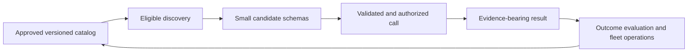

# Tools and External Capabilities

> **Status:** Research-backed contract and fleet core available.  
> **Research baseline:** 2026-08-30  
> **Evidence:** [Core runtime packet](../research/packets/core-agent-runtime.md) and [tool fleet engineering packet](../research/packets/tool-fleet-engineering.md)

Tools turn model proposals into observations and effects. This section covers the complete path from one safe contract to catalog-scale discovery, versioning, result evidence, and fleet operations.

## Guides

| Guide | Core concern |
|---|---|
| [Tool contracts for nondeterministic callers](tool-contracts.md) | Model-facing schemas, validation layers, errors, effects, idempotency, and evaluation |
| [Tool discovery and selection](tool-discovery-and-selection.md) | Policy-first eligibility, progressive disclosure, retrieval/ranking, abstention, and selection evaluation |
| [Tool registries, versioning, and lifecycle](tool-registries-versioning-and-lifecycle.md) | Registry trust, approved catalogs, fingerprints, semantic compatibility, promotion, deprecation, and retirement |
| [Tool results, artifacts, and provenance](tool-results-artifacts-and-provenance.md) | Evidence envelopes, structured results, deterministic reduction, raw artifacts, provenance, and trust labels |
| [Tool fleet operations](tool-fleet-operations.md) | Ownership, gateway controls, SLOs, health, quotas, canaries, circuits, telemetry, and incidents |

## Stable position

- Search ranks only capabilities the principal is already eligible to discover; it does not grant permission.
- Full schemas are loaded progressively from pinned, fingerprinted catalog entries.
- Registry namespace, popularity, annotations, and version strings are metadata—not certification.
- Tool changes include descriptions, examples, defaults, effects, credentials, and reducers, not only JSON shape.
- Raw results live as governed artifacts; bounded model views preserve provenance, truncation, and effect state.
- Tool fleets need owners, SLOs, quotas, circuits, release gates, kill switches, and effect reconciliation.

## Remaining research queue

- Code, shell, filesystem, browser, and computer-use tool safety by workload.
- Specialized database, search, RAG, and API-generation tools.
- Cross-provider conformance and performance experiments for deferred/programmatic tool calling.
- Private catalog federation, signed attestations, and enterprise identity standards as they mature.
