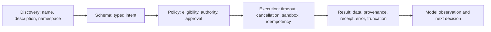
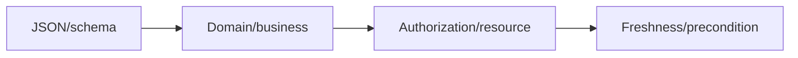

# Tool Contracts for Nondeterministic Callers

> **Status:** Research-backed draft  
> **Last researched:** 2026-08-30  
> **Scope:** Designing tool surfaces, schemas, execution policies, results, and errors that models can use reliably and safely  
> **Research packet:** [Core agent loop and runtime boundary](../research/packets/core-agent-runtime.md)

## Core rule

A tool is not merely an API endpoint wrapped in JSON. It is a contract between a nondeterministic caller and a deterministic capability boundary.

The model must be able to discover the right operation, form valid intent, interpret the result, and recover from mistakes. The runtime must still enforce authorization, side-effect safety, resource limits, and auditability.

## Contract layers

| Layer | Must answer |
|---|---|
| Discovery | What outcome does this tool produce, and when should it be used? |
| Schema | Which inputs are required, constrained, and mutually dependent? |
| Policy | Who may call it, on which resource, under what approval and budget? |
| Execution | How is work bounded, cancelled, deduplicated, and isolated? |
| Result | What happened, how authoritative/fresh is it, and what should happen next? |

## Choose operations by agent intent

Raw service APIs are optimized for deterministic callers that already know endpoint sequences. Agents benefit from tools that represent meaningful, bounded domain operations.

### Prefer

- `search_customers(query, limit, cursor)` over `list_all_customers()`.
- `prepare_refund(order_id, reason)` plus `commit_refund(operation_id, approval)` over one ambiguous `update_order` tool.
- `get_deployment_status(deployment_id)` over returning an entire provider event log.
- `apply_workspace_patch(files, base_revision)` over unrestricted host shell for routine edits.

### Avoid both extremes

| Too fine-grained | Too coarse |
|---|---|
| Model must reconstruct a brittle API choreography, spending turns/tokens and creating partial-failure points | One tool hides major decisions/effects, weakens review, and returns an opaque result |

Choose a tool boundary where:

- one call has a coherent user/domain meaning;
- authorization and effect class are clear;
- the result provides enough evidence for the next decision;
- retry/idempotency semantics can be documented;
- important intermediate decisions remain observable where needed.

Anthropic's [tool engineering report](https://www.anthropic.com/engineering/writing-tools-for-agents) reached a similar conclusion from tool evaluations: wrapping every existing API endpoint is not automatically ergonomic for an agent.

## Name and description

The name and description are selection features, not prose decoration.

Include:

- the outcome, not implementation internals;
- when to use and when not to use it;
- important preconditions and scope;
- whether it reads, writes, communicates, deletes, or starts long work;
- whether approval is expected;
- result shape and pagination/truncation behavior;
- major error categories and retry safety.

Keep shared policy in the runtime/system layer; do not repeat a long policy paragraph in every description. Use consistent namespaces to separate domains and reduce collisions.

### Weak description

> Updates an order.

### Stronger description

> Prepares a refund quote for one order without changing external state. Returns eligibility, amount, policy evidence, and a short-lived quote ID. Use the separate commit tool after required approval.

The stronger version distinguishes read/prepare from commit and tells the model what evidence it receives.

## Schema design

Use strict structured schemas where the provider supports them. OpenAI's current function-calling guidance recommends strict mode and requires closed object schemas with required properties (nullable where optional). Strictness improves structural adherence but is not semantic validity.

### Schema principles

- Use domain types and enums instead of free-form strings when the set is stable.
- Put descriptions on fields whose meaning is not obvious.
- Reject unknown fields for effectful operations.
- Avoid mutually contradictory flags; use tagged unions/variants when possible.
- Separate resource identity from display names.
- Include expected versions/preconditions for concurrent writes.
- Do not ask the model to supply trusted actor/tenant IDs that the runtime already knows.
- Do not accept credentials or secrets as model-generated arguments.
- Keep payloads small; pass artifact/reference IDs for large content.
- Version schemas and tool semantics.

### Four validations

1. **Structural:** types, required fields, ranges, format.
2. **Domain:** the action makes sense under business rules.
3. **Authorization:** the current actor may act on the exact resource.
4. **Freshness:** expected state/version and approval are still current.

Passing the first does not imply the others.

## Tool availability and discovery

More visible tools can reduce selection quality and consume substantial context. Use:

- task-scoped allowlists;
- namespaces and domain grouping;
- lazy/deferred tool loading for large catalogs;
- policy filtering before model visibility;
- search/ranking with telemetry and evals;
- a small stable core of common tools;
- explicit unavailable-capability responses rather than hallucinated substitutes.

Anthropic reported tool definitions consuming tens of thousands of tokens in large MCP configurations, including a 134K-token case before optimization; that is a vendor observation, not a universal threshold. It demonstrates why catalog size must be measured. OpenAI's current tool-search feature similarly defers rarely used definitions.

> [!CAUTION]
> Tool search moves complexity; it does not remove it. Ranking errors, malicious metadata, name collisions, stale catalogs, and dynamic authorization become new failure surfaces.

## Execute under a runtime envelope

Every call should receive runtime-owned metadata that is not model-controlled:

- actor, tenant, run, trace, and call IDs;
- deadline and cancellation signal;
- scoped credentials/capability token;
- operation/idempotency ID for effects;
- workspace/sandbox/network policy;
- output byte/token budget;
- policy and tool version;
- logging/redaction rules.

The tool implementation must enforce the envelope. Describing a timeout or read-only mode to the model is not enforcement.

## Result contract

Return the smallest result that preserves the evidence required for a correct next step.

### Recommended result envelope

| Field | Purpose |
|---|---|
| `status` | `ok`, `partial`, `invalid`, `denied`, `conflict`, `failed`, `unknown`, `cancelled` |
| `summary` | Short model-oriented meaning |
| `data` | Typed relevant result, paged/bounded |
| `provenance` | Source IDs, versions, timestamps, query/target scope |
| `effect` | Operation ID, receipt, committed state, reversibility |
| `truncation` | Whether data is incomplete and how to page/fetch artifact |
| `next_actions` | Optional allowed recovery or follow-up hints |
| `error` | Stable category and actionable safe detail |

Do not require identical JSON for every tool if the provider/framework expects text; the logical fields still matter.

### Separate model context from artifacts

Large logs, tables, files, and search results should go to bounded artifact storage. Return:

- a concise summary;
- stable artifact ID/location;
- size/format;
- provenance and freshness;
- selective read/search/paging instructions.

This reduces context overflow and makes evidence reusable without repeatedly paying token cost.

## Error semantics

The runtime needs to distinguish correction from retry and failure.

| Error meaning | Who acts next? | Model sees |
|---|---|---|
| Invalid/missing arguments | Model | Exact safe correction, consumed attempt count |
| Business-rule conflict | Model or user | Current rule/state and allowed alternatives |
| Authorization/policy denial | Runtime/user | Denial and allowed escalation; no secret policy internals |
| Transient transport before effect | Runtime | Usually normalized delay, not raw stack trace |
| Tool internal bug | Operator/runtime | Stable failure ID; model should not repeatedly experiment |
| Effect outcome unknown | Reconciler/operator | Pending/unknown; never “please try again” |
| Timeout with confirmed termination | Runtime/model | Safe retry possibility if idempotent |
| Timeout with possible orphan | Runtime/operator | Orphan/reconciliation state |
| Partial result | Model | Exact completeness and continuation cursor |

Pydantic AI's retry documentation demonstrates why names matter: a model correction consumes a model round trip, while a transport retry is invisible to the model. Conflating them amplifies attempts and cost.

## Side effects

For every effectful tool, document and enforce:

- effect class and reversibility;
- required approval/policy;
- stable operation ID and intent binding;
- downstream idempotency behavior and retention;
- preconditions/expected version;
- authoritative receipt/status lookup;
- cancellation and late-commit behavior;
- compensation/reconciliation path.

Split **prepare** and **commit** when review needs a stable, legible proposal. Keep commit narrow and revalidate at execution. See [Idempotency and side effects](../reliability/idempotency-and-side-effects.md).

## Parallel calls

The model's ability to emit multiple calls and the runtime's decision to execute concurrently are separate. Default to:

- parallel bounded reads on independent resources;
- serialization or explicit coordination for writes;
- no unsafe sibling effects while approval is pending;
- deterministic result ordering and per-call IDs;
- aggregate output and cost reservations before start.

Tool authors should state concurrency safety. A tool that relies on shared process-global state is not safely parallel merely because it is `async`.

## Security boundary

- Treat all model arguments and external tool results as untrusted.
- Enforce resource authorization inside policy/execution, not tool visibility alone.
- Use scoped identities; never forward ambient host credentials.
- Sandbox code/shell/computer tools and control descendants, filesystem, and egress.
- Redact secrets and sensitive records from results and traces.
- Pin/trust MCP servers and tool versions; discovery metadata is not proof of trust.
- Limit SSRF-capable URLs, redirects, protocols, and internal address ranges.
- Record attempted denied actions for detection without teaching the model secret controls.

The complete threat model remains in the [security research queue](../security/README.md); this guide establishes the tool-specific boundary only.

## Evaluation

Build tool evals before optimizing descriptions by intuition.

### Dataset dimensions

- should call / should not call;
- correct tool among confusable alternatives;
- correct arguments and resource identity;
- correct ordering/dependency;
- policy-required denial or approval;
- malformed/partial/large results;
- transient, terminal, conflict, and unknown errors;
- repeated-run reliability;
- token, latency, call count, and error count;
- adversarial tool metadata/result content;
- schema/tool version changes.

### Metrics

- task/final-state success;
- tool-selection precision/recall;
- argument validity and semantic correctness;
- unnecessary and repeated calls;
- effect correctness and duplicate count;
- policy violation attempts and blocked/escaped effects;
- result tokens and truncation recovery;
- latency, cost, and retries;
- `pass^k`-style repeated reliability.

Read traces. Aggregate accuracy can hide a wrong tool call rescued by later luck.

## Anti-patterns

- One tool per raw REST endpoint.
- Vague names such as `run`, `execute`, or `update` without domain namespace.
- Schemas that accept arbitrary dictionaries for effectful actions.
- Actor, tenant, or authorization scope supplied by the model.
- Tool output that is an unbounded dump.
- Raw exceptions used as model instructions.
- Retrying every failure in the tool implementation.
- “Approval required” only in description text.
- Returning success before an asynchronous external effect has a trackable job/receipt.
- Assuming strict JSON means safe execution.
- Loading hundreds of tools without measuring selection and context cost.

## Production checklist

- [ ] The tool represents one coherent domain outcome.
- [ ] Name, namespace, and description distinguish it from alternatives.
- [ ] Schema is strict, bounded, versioned, and excludes runtime-owned identity/secrets.
- [ ] Structural, domain, authorization, and freshness validation are separate.
- [ ] Effect and concurrency class are documented and enforced.
- [ ] Runtime supplies deadline, cancellation, policy, scope, and operation IDs.
- [ ] Results are compact, structured, attributable, and explicit about truncation.
- [ ] Large outputs use artifacts and selective retrieval.
- [ ] Error categories route to runtime retry, model correction, reconciliation, or stop.
- [ ] Effects have idempotency/receipt/compensation semantics.
- [ ] Tool discovery is policy-filtered and evaluated.
- [ ] Security controls apply to arguments, execution environment, and returned content.
- [ ] Repeated-run trajectory evals cover success, cost, and policy.

## Related guides

- [The production agent loop](../foundations/agent-loop.md)
- [Execution boundaries](../runtime/execution-boundaries.md)
- [Run controls](../runtime/run-controls.md)
- [Idempotency and side effects](../reliability/idempotency-and-side-effects.md)
- [Prompt injection and untrusted data](../security/prompt-injection-and-untrusted-data.md)
- [Context engineering](../context-memory/context-engineering.md)
- [Trajectory and reliability evaluation](../evaluation/trajectory-and-reliability-evaluation.md)
- [Model Context Protocol](../protocols/model-context-protocol.md)
- [Delegation, handoffs, and shared state](../orchestration/delegation-handoffs-and-shared-state.md)
- [Tool discovery and selection](tool-discovery-and-selection.md)
- [Tool registries, versioning, and lifecycle](tool-registries-versioning-and-lifecycle.md)
- [Tool results, artifacts, and provenance](tool-results-artifacts-and-provenance.md)
- [Tool fleet operations](tool-fleet-operations.md)

## Research notes

Guidance was triangulated from [Anthropic's evaluated tool-design practices](https://www.anthropic.com/engineering/writing-tools-for-agents), [OpenAI function-calling semantics](https://developers.openai.com/api/docs/guides/function-calling), current SDK error/timeout/concurrency mechanics, and [τ-bench](https://proceedings.iclr.cc/paper_files/paper/2025/hash/1b126cc38b8638e07bef37e7b2bb72bf-Abstract-Conference.html) reliability evidence. Large-catalog token figures are attributed vendor observations, not universal design thresholds.
