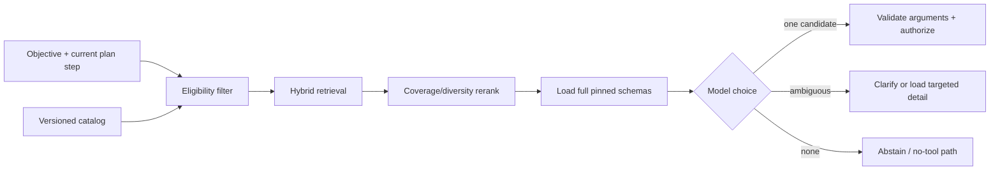
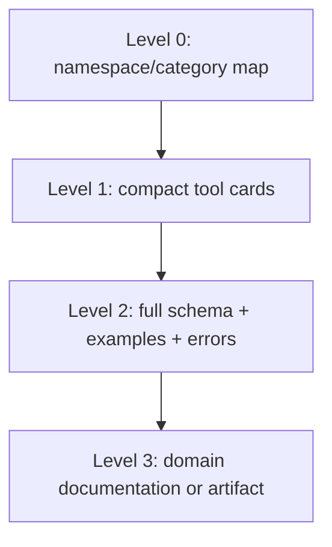
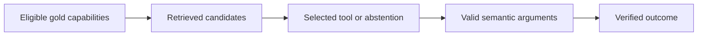

# Tool Discovery and Selection

> **Status:** Research-backed draft  
> **Last researched:** 2026-08-30  
> **Scope:** Eligibility filtering, tool-card retrieval, ranking, schema loading, model selection, abstention, and evaluation for large catalogs.  
> **Evidence:** [Tool fleet engineering research packet](../research/packets/tool-fleet-engineering.md)  
> **Section index:** [Tools and external capabilities](README.md)

Tool discovery narrows a catalog into a small relevant candidate set. It must not decide authority. A production path filters capabilities by policy first, retrieves compact metadata second, loads pinned schemas third, and still validates and authorizes the exact call at execution.

## Selection pipeline

## Filter before search

Remove candidates that violate any hard constraint:

- tenant, principal, role, purpose, and workflow-stage eligibility;
- region, residency, retention, network, and data-class policy;
- effect/risk class and required approval or sandbox profile;
- runtime, modality, provider/model, and protocol compatibility;
- lifecycle state, release pin, incident disablement, and feature flag;
- current credential/grant availability and spend/quota class.

This prevents a retriever from leaking hidden capability names or schemas and prevents ranking from turning popularity into permission. Recheck at call time because arguments and target state are not yet known.

## Use progressive disclosure

Load the minimum level required. A compact card should include stable identity, purpose, when/not-when guidance, domain keywords, effect/risk class, key input/output concepts, owner/version, and operational constraints. Full JSON schemas and examples are loaded only for finalists. Deep domain documentation should be a cited artifact, not repeated in every prompt.

## Write retrieval-grade metadata

| Field | Good property | Failure smell |
|---|---|---|
| Stable identity | Namespaced, unique, independent of display label | `search`, `create`, or collision-prone aliases |
| Purpose | Describes the one outcome or domain boundary | “Powerful tool that handles everything” |
| When to use | Concrete task and preconditions | Only repeats the name |
| When not to use | Differentiates close alternatives | Missing for overlapping read/write or search tools |
| Parameters | Semantics, units, identifiers, defaults, constraints | Internal variable names or implied units |
| Outputs | Field types, freshness, pagination, effect evidence, errors | “Returns results” |
| Examples | Representative complex/ambiguous calls | Examples with unsafe defaults or hidden privileges |
| Risk/operations | Effect, data, auth, timeout, cost/rate, idempotency | Untrusted annotations accepted as policy truth |

Generate a candidate schema from source signatures if useful, but review it as a model-facing product contract. Function names and docstrings written for human callers are often too ambiguous for retrieval and selection.

## Retrieval and reranking

Use multiple signals when the catalog is heterogeneous:

1. exact identity, namespace, entity, and operation matches;
2. lexical/BM25-style search for distinctive domain language;
3. dense semantic retrieval for paraphrases;
4. a small reranker or classifier if local evidence justifies its cost;
5. deterministic boosts for workflow stage, tenant integrations, recent verified success, and required capabilities;
6. diversity/coverage so near-duplicate tools do not fill every candidate slot.

Never train ranking directly on invocation count: popular tools become more visible, creating a feedback loop. Use reviewed task labels, verified outcomes, negative examples, and counterfactual audit samples. Keep retrieval scores out of authorization.

Top-k is workload-specific. Too small misses multi-tool plans or ambiguous alternatives; too large adds context and selection noise. Tune against recall, wrong-tool severity, latency, and context cost by task class.

## Dynamic exposure strategies

| Strategy | Prefer when | Limitation |
|---|---|---|
| Fixed small set | One workflow has few stable capabilities | Does not scale across products/domains |
| Workflow-stage rules | The controller already knows the legal next operations | Brittle for open-ended tasks; must handle exceptional branches |
| Semantic retrieval | Natural-language tasks span a large catalog | Retriever errors, adversarial metadata, extra latency |
| Namespace/category drill-down | Catalog has strong hierarchy and the model can search iteratively | More turns; hierarchy may reflect organization, not user intent |
| Specialist/agent routing | Tools naturally belong to isolated domains or authority zones | Coordination overhead and indirect failure visibility |

Combine them: hard policy and workflow-stage filters, then semantic retrieval within the remaining domain.

## Selection and abstention

The model sees full schemas only for the final candidates. Tell it how alternatives differ, when to clarify, and when no tool is needed. Preserve a no-tool answer for stable knowledge or unsupported requests. For effectful tools, selection produces structured intent—not permission.

If two candidates are semantically equivalent, prefer an explicit policy winner based on data location, reliability, cost, or tenant configuration rather than letting wording decide. Do not silently substitute a fallback with different freshness, scope, or effect semantics.

## Evaluate the whole funnel

| Stage | Measure |
|---|---|
| Eligibility | forbidden exposure rate, missing eligible tools |
| Retrieval | recall@k, rank, latency, correct-version recall, candidate diversity |
| Selection | correct tool, unnecessary call, no-tool and clarification precision |
| Arguments | syntactic plus semantic validity; entity/resource correctness |
| Trajectory | tool order, repeat/loop rate, stale schema use, safe parallelism |
| Outcome | verified task/effect success, policy violations, cost and deadline |

Test ordinary and adversarial cases: overlapping names, vague requests, misspellings, new/deprecated versions, permission changes, malicious descriptions, no valid tool, unavailable tool, multi-tool plans, and result-driven reselection. Repeat trials because selection is stochastic.

Benchmark findings such as ToolRet and BFCL identify failure categories; they do not set a production threshold. Use the actual catalog, model, prompt, router, and gateway.

## Readiness checklist

- [ ] Eligibility removes forbidden capabilities before retrieval.
- [ ] Compact cards and full schemas are separately versioned.
- [ ] Names, descriptions, negative guidance, examples, and output/error semantics are reviewed.
- [ ] Retrieval combines exact/domain signals with evaluated semantic ranking.
- [ ] Candidate sets preserve coverage without near-duplicate flooding.
- [ ] No-tool and clarification paths are first-class.
- [ ] Selected tools are revalidated and authorized at call time.
- [ ] Dynamic catalog and permission changes are exercised.
- [ ] Metrics connect impression → retrieval → selection → outcome.
- [ ] Adversarial metadata, popularity bias, and wrong-tool severity are evaluated.

## Related guides

- [Tool contracts](tool-contracts.md)
- [Tool registries, versioning, and lifecycle](tool-registries-versioning-and-lifecycle.md)
- [Tool fleet operations](tool-fleet-operations.md)
- [Permissions, sandboxing, and secrets](../security/permissions-sandboxing-and-secrets.md)
- [Evaluation-driven development](../evaluation/evaluation-driven-development.md)

## Selected sources

- [Anthropic tool search](https://platform.claude.com/docs/en/agents-and-tools/tool-use/tool-search-tool)
- [Anthropic: Define tools](https://platform.claude.com/docs/en/agents-and-tools/tool-use/define-tools)
- [OpenAI current tool-search/allowed-tools guidance](https://developers.openai.com/api/docs/guides/latest-model)
- [ToolRet, Findings of ACL 2025](https://aclanthology.org/2025.findings-acl.1258/)
- [BFCL, ICML 2025](https://proceedings.mlr.press/v267/patil25a.html)
- [BiasBusters, ICLR 2026](https://www.microsoft.com/en-us/research/publication/biasbusters-uncovering-and-mitigating-tool-selection-bias-in-large-language-models/)

