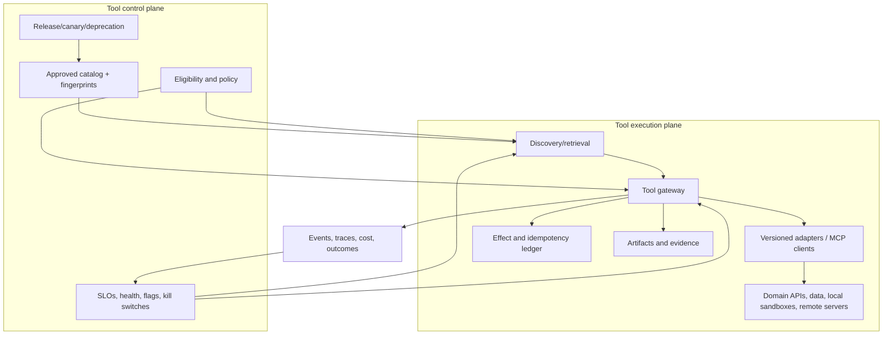
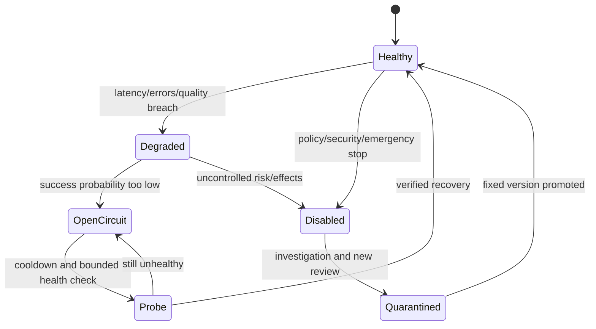
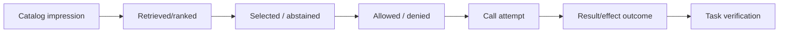

# Tool Fleet Operations

> **Status:** Research-backed draft  
> **Last researched:** 2026-08-30  
> **Scope:** Tool gateway/control plane, ownership, health, quotas, reliability, observability, canaries, containment, incident response, and fleet-level SLOs.  
> **Evidence:** [Tool fleet engineering research packet](../research/packets/tool-fleet-engineering.md)  
> **Section index:** [Tools and external capabilities](README.md)

A production tool fleet needs the same ownership, versioning, capacity, SLO, release, and incident discipline as any distributed service—plus model-selection telemetry and external-effect reconciliation.

## Fleet control and execution path

The gateway is a logical boundary; it can be a library for a small system. It should still centralize stable identity, contract/version resolution, authorization hooks, quotas, deadlines, error normalization, effect IDs, tracing, and emergency disablement. Domain services remain the authority for business rules and state.

## Ownership model

Assign per tool/version:

- product/domain owner for semantics and successor decisions;
- engineering owner/on-call for adapter, dependency, and SLO;
- security/data owner for permissions, egress, retention, and supply chain;
- catalog steward for metadata quality, collisions, and lifecycle;
- named consumer/workload owners for critical dependencies.

No production tool should be “owned by the agent platform” if the platform team cannot define its domain semantics or repair its effects.

## Operational states

Separate availability from eligibility. A healthy tool may be forbidden for this tenant; an eligible tool may be unhealthy. The discovery layer should not advertise a route whose circuit is open unless the model needs to explain unavailability rather than call it.

## Tool-level SLOs

| Dimension | Useful indicator |
|---|---|
| Discovery | approved definition available with correct version/fingerprint |
| Invocation | admitted calls receive a valid terminal classification within deadline |
| Correctness | contract/domain validation and postcondition checks pass |
| Effect safety | intended effects are authorized and verified; unknown/duplicate rate |
| Freshness | source observation meets workload-specific age target |
| Result integrity | output schema/provenance complete; truncation declared |
| Capacity | throttle and schedule delay by tenant/workload stay within objective |
| Selection | wrong/unnecessary/missed tool rates on evaluated samples |
| Economics | cost per verified successful task/operation |

Tool availability is not enough. A fast tool returning stale data or ambiguous receipts is unhealthy for a task that requires current verified state.

## Limits and dependency protection

Apply concurrency, request/token/byte, result-size, cost, fan-out, and effect-rate limits by tool, tenant, workload, and cell. Respect downstream `Retry-After` and quotas. One retry owner should classify transient versus permanent/ambiguous failures and count SDK retries.

Use circuit breakers when success probability collapses. Opening a circuit should:

- stop new calls and retries for the affected route;
- preserve protected reconciliation/read capacity if safe;
- remove or mark the tool unavailable in discovery;
- fail fast with a structured reason and retry horizon;
- avoid switching effectful calls until the original outcome is reconciled.

A fallback must match semantics, data governance, authorization, output/effect contract, and evaluation floor. Fallback is a release/configuration decision—not an exception handler that picks the next similarly named tool.

## Health and synthetic tests

Health checks should verify DNS/network/auth, protocol handshake/discovery version, schema fingerprint, minimal read, latency, and dependency freshness. Do not probe writes against real customer resources.

For effectful tools, use one of:

- dry-run/validate/prepare without commit;
- a dedicated sandbox tenant and fixture;
- create, verify, compensate, and verify cleanup under one test identity;
- read-only status of a known synthetic operation;
- shadow comparison of proposals.

Record synthetic traffic separately and cap it. A shallow process/liveness probe cannot establish semantic health.

## Telemetry spine

Correlate tool logical/version/deployment ID, catalog fingerprint, rank and candidate set, model/release, run/step/attempt, tenant/workload/risk, sanitized argument shape, deadline, latency, retries, result size/reduction, artifacts/evidence, effect state, and task outcome.

Keep raw sensitive content out of default telemetry. Store policy decisions and effect transitions durably even when traces are sampled. Monitor selection and result-provenance quality through evaluated samples; ordinary service metrics cannot see them.

## Changes and canaries

Treat code, endpoint, package digest, dependency, schema, description, examples, risk metadata, credentials/scopes, timeout, quota, and result reducer as releases. Run contract, compatibility, selection, policy, security, load, and failure tests.

Canary read-only traffic or effect proposals first. For writes, use a sandbox, prepare/dry-run, human-approved bounded cohort, or explicit two-phase boundary. Compare verified outcomes, effect anomalies, wrong-tool rate, latency, result size/provenance, retry, and cost. Retain old adapters for pinned active runs where safe.

## Incident containment

Independent controls should disable:

- discovery of one version, namespace, supplier, or catalog source;
- calls by tenant, workload, risk/effect class, route, or cell;
- a credential, egress destination, local package, MCP server, or protocol capability;
- writes while preserving safe reads/reconciliation;
- automatic retries or fallbacks;
- result ingestion/memory writes from a compromised source.

On incident: stop amplification, snapshot catalog and observed fingerprints, revoke credentials, preserve traces/artifacts/effect ledger, identify exposed tenants/runs, reconcile unknown effects, quarantine results/memory derived from the tool, then roll forward or back through the normal reviewed catalog.

## Failure drills

- definition changes without version change;
- public/supplier registry unavailable or compromised;
- tool name squatting/collision and malicious description update;
- expired/revoked credentials during a long run;
- dependency 429s, slow tail, malformed structured output, huge output;
- timeout after a write and fallback pressure;
- one hot tenant exhausts a shared tool quota;
- list-change storm/cache inconsistency;
- deprecated version remains referenced by queued or waiting work;
- compromised result injects instructions or poisons memory;
- kill switch/control plane unavailable during tool failure.

## Readiness checklist

- [ ] Every production tool has semantic, operational, security, and catalog owners.
- [ ] Gateway resolution uses approved immutable versions and observed fingerprints.
- [ ] Eligibility, health, and authorization remain distinct decisions.
- [ ] Limits protect every scarce downstream resource and tenant.
- [ ] Retry, circuit, fallback, and ambiguous-effect behavior are explicit.
- [ ] Health probes verify semantics without uncontrolled production writes.
- [ ] Discovery-to-outcome telemetry supports selection and incident analysis.
- [ ] Every metadata, contract, adapter, and credential change follows release gates.
- [ ] Kill switches can disable discovery, calls, writes, sources, and credentials independently.
- [ ] Registry outage, drift, supply-chain compromise, poison results, and reconciliation are drilled.

## Related guides

- [Tool discovery and selection](tool-discovery-and-selection.md)
- [Tool registries, versioning, and lifecycle](tool-registries-versioning-and-lifecycle.md)
- [Tool results, artifacts, and provenance](tool-results-artifacts-and-provenance.md)
- [Queues, scheduling, and backpressure](../operations/queues-scheduling-and-backpressure.md)
- [Deployment, release, and incident response](../operations/deployment-release-and-incident-response.md)
- [Production agent control plane](../architectures/production-agent-control-plane.md)

## Selected sources

- [MCP 2026-07-28 release](https://blog.modelcontextprotocol.io/posts/2026-07-28/)
- [Official MCP Registry overview](https://modelcontextprotocol.io/registry/about)
- [NSA MCP security design considerations](https://www.nsa.gov/Portals/75/documents/Cybersecurity/CSI_MCP_SECURITY.pdf)
- [Microsoft Agent Framework middleware](https://learn.microsoft.com/en-us/agent-framework/agents/middleware/)
- [Google ADK `MCPToolset`](https://adk.dev/api-reference/typescript/classes/MCPToolset.html)
- [OpenAI current programmatic tool-calling guidance](https://developers.openai.com/api/docs/guides/latest-model)
