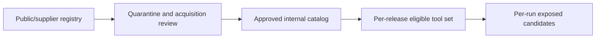
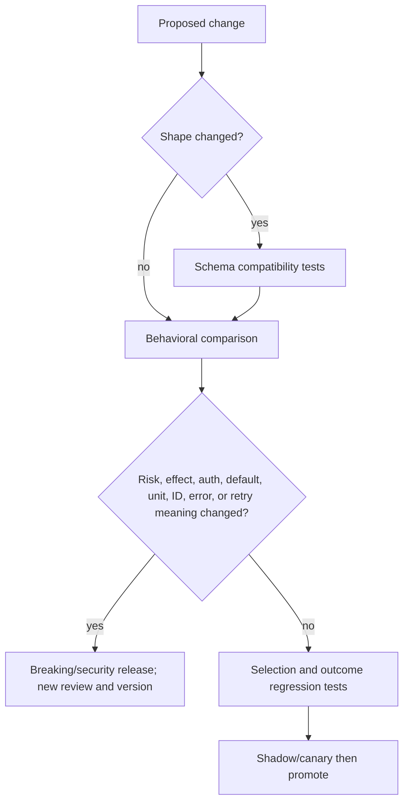
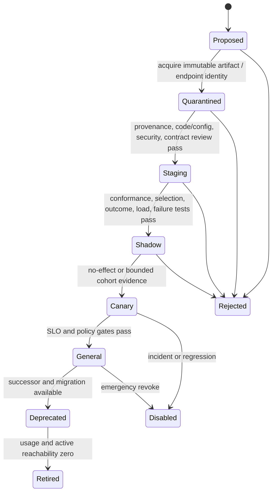

# Tool Registries, Versioning, and Lifecycle

> **Status:** Research-backed draft  
> **Last researched:** 2026-08-30  
> **Scope:** Tool identity, internal catalogs, external registries, supply-chain review, semantic compatibility, definition fingerprints, rollout, deprecation, and retirement.  
> **Evidence:** [Tool fleet engineering research packet](../research/packets/tool-fleet-engineering.md)  
> **Section index:** [Tools and external capabilities](README.md)

A registry tells you what exists. It does not prove what is safe, compatible, authorized, or currently running. Build an approved internal catalog that turns supplier metadata into a pinned, reviewed, owned production capability.

## Three inventory layers

| Layer | Contains | Does not establish |
|---|---|---|
| Public/supplier registry | Publisher namespace, package/endpoint, version and install metadata | Safety, quality, uptime, least privilege, compatibility with your host |
| Internal catalog | Reviewed immutable artifact/endpoint, owner, contracts, policies, operations, provenance | Permission for every tenant or operation |
| Release/run set | Pinned eligible versions and configuration for a workload | Commit-time authorization of generated arguments |

The official MCP Registry is currently preview and explicitly positions itself as unopinionated metadata for downstream aggregators. It does not host packages, cover private servers, or provide uptime/data-durability guarantees. Namespace verification links a publisher to a name; it is not certification.

## Catalog record

Record at least:

| Category | Fields |
|---|---|
| Identity | stable logical ID, namespaced call name, display name, owner/on-call, supplier, lifecycle state |
| Provenance | repository and publisher identity, artifact/package/image digest, dependency lock/SBOM/attestation where available, review evidence |
| Contract | semantic version, definition fingerprint, input/output schema dialect and hashes, examples, errors, protocol/capability versions |
| Behavior | purpose, negative guidance, effect and data classes, idempotency/reconciliation, open-world behavior, runtime/sandbox needs |
| Access | tenant/role eligibility, auth flow, credential owner, scopes, region/residency, egress destinations |
| Operations | endpoint/cell, timeout, limits, cost class, SLO, health method, circuit/fallback, dependency and certificate expiry |
| Lifecycle | introduced, last verified, deprecation/sunset, successor/adapters, active-run/version usage |

Tool-provided annotations are evidence, not policy facts. MCP explicitly calls its read-only, destructive, idempotent, and open-world annotations hints. Verify security-relevant behavior and keep the organization's classification authoritative.

## Identity and fingerprints

Separate:

- **logical tool ID:** stable meaning across compatible releases;
- **call name:** unique, namespaced model-visible identifier;
- **contract version:** claimed semantic version;
- **artifact identity:** immutable package/image/build digest;
- **definition fingerprint:** canonical hash of name, descriptions, schemas, examples, annotations, endpoint/server identity, and relevant capabilities;
- **deployment identity:** observed instance/cell/version that executed a call.

A version string can be wrong or reused. Compare observed fingerprints at discovery/connect time and quarantine unexpected drift. Display labels, registry ratings, and server-reported version strings must not make authorization decisions.

## Semantic compatibility

Treat these as breaking unless proven otherwise:

- remove/rename fields, add required inputs, narrow values, or change types;
- change units, defaults, ordering, freshness, identifier resolution, or error meanings;
- expand data access, external reach, side effects, credential scope, or runtime privileges;
- change idempotency, timeout, polling, completion, or reconciliation semantics;
- turn a synchronous result into an untracked asynchronous operation;
- change description/examples in a way that affects retrieval or model selection.

Adding an optional input or output field is only compatible if old callers/strict validators and model behavior remain correct. Pin the JSON Schema dialect and supported subset. Schema validation cannot detect a field whose type stayed `string` while its meaning changed.

## Onboarding and promotion

Review local MCP/server packages like executable dependencies: publisher and repository, immutable artifact, transitive dependencies, install scripts, requested credentials, filesystem/network/process access, update channel, vulnerability handling, and responsible owner. Run them in the least-privileged sandbox with explicit egress and secrets. NSA and NIST supply-chain guidance provide baselines beyond protocol semantics.

Conformance tests should cover schema dialect, pagination, structured results, error mapping, cancellation, timeouts, retries, content types, and protocol revision. Security tests cover cross-tenant IDs, prompt injection in descriptions/results, credential leakage, SSRF/redirects, tool squatting, unauthorized writes, and resource exhaustion.

## MCP discovery and cache changes

Under MCP 2026-07-28, protocol requests are stateless, list results carry cache guidance, and subscriptions replace older notification transport. `tools/list` is server capability discovery, not marketplace discovery. A list-change signal makes cached definitions stale; it does not authorize immediate production exposure.

On change:

1. fetch and canonicalize the complete paginated list;
2. compare definition/capability fingerprints;
3. continue serving the last approved snapshot where safe;
4. quarantine new or changed tools from high-risk eligibility;
5. run compatibility, selection, policy, and conformance gates;
6. promote through a new behavior release;
7. invalidate prompt/schema caches coherently.

Framework pages can lag protocol releases. Pin the protocol version actually served and test the wire behavior rather than relying on an adapter's conceptual description.

## Deprecation and retirement

Publish owner, successor, change rationale, migration guide, last-new-run date, sunset date, and emergency-revoke conditions. Instrument discovery, load, call, and active-run usage by version.

For long-running work:

- pin the old compatible implementation until completion;
- migrate at a tested checkpoint with explicit state/semantic adapter; or
- quarantine/cancel and reconcile if the old version is unsafe.

Keep a tombstone after removal so stale plans receive a deterministic “retired; use successor” error rather than accidentally resolving to a reused name. Never reuse a retired logical/call identity for different semantics.

## Readiness checklist

- [ ] Public registry metadata is separated from the approved catalog.
- [ ] Every tool/version has an owner, immutable artifact/endpoint identity, and definition fingerprint.
- [ ] Supplier claims and annotations do not directly grant policy status.
- [ ] Schema dialect and semantic compatibility rules are explicit.
- [ ] Metadata-only changes pass selection and outcome regression gates.
- [ ] Local servers run with least privilege, pinned provenance, and explicit egress/secrets.
- [ ] Catalog changes are quarantined, staged, shadowed, and canaried.
- [ ] Active runs record and retain their tool-contract version.
- [ ] Deprecation usage and migration are observable.
- [ ] Emergency disablement leaves tombstones and reconciles in-flight effects.

## Related guides

- [Tool discovery and selection](tool-discovery-and-selection.md)
- [Tool contracts](tool-contracts.md)
- [Tool fleet operations](tool-fleet-operations.md)
- [Model Context Protocol](../protocols/model-context-protocol.md)
- [Deployment, release, and incident response](../operations/deployment-release-and-incident-response.md)

## Selected sources

- [MCP 2026-07-28 release](https://blog.modelcontextprotocol.io/posts/2026-07-28/)
- [Official MCP Registry overview](https://modelcontextprotocol.io/registry/about)
- [MCP Registry aggregator caveats](https://modelcontextprotocol.io/registry/registry-aggregators)
- [MCP tool annotations risk vocabulary](https://blog.modelcontextprotocol.io/posts/2026-03-16-tool-annotations/)
- [NSA MCP security design considerations](https://www.nsa.gov/Portals/75/documents/Cybersecurity/CSI_MCP_SECURITY.pdf)
- [NIST software supply-chain guidance](https://www.nist.gov/itl/executive-order-14028-improving-nations-cybersecurity/software-supply-chain-security-guidance-14)
- [JSON Schema 2020-12](https://json-schema.org/draft/2020-12/json-schema-core)
