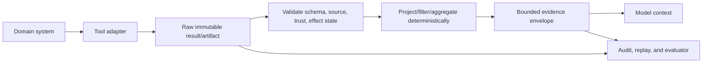
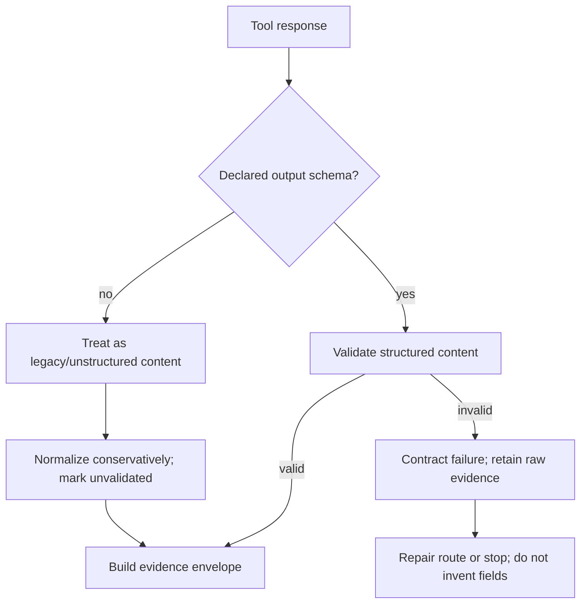
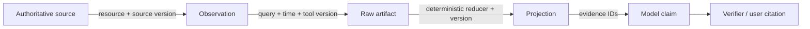

# Tool Results, Artifacts, and Provenance

> **Status:** Research-backed draft  
> **Last researched:** 2026-08-30  
> **Scope:** Result envelopes, structured outputs, raw artifacts, deterministic reduction, pagination, trust labels, provenance, errors, effects, and context lifecycle.  
> **Evidence:** [Tool fleet engineering research packet](../research/packets/tool-fleet-engineering.md)  
> **Section index:** [Tools and external capabilities](README.md)

A tool result should tell the controller what happened, give the model only the evidence needed for its next decision, and preserve enough raw provenance to verify the claim later. Dumping an API response into the transcript does none of these reliably.

## Result architecture

The raw artifact and the model view serve different purposes. Keep large records, files, logs, pages, screenshots, query results, and native receipts outside the prompt under normal access and retention controls. Give the model a structured projection plus references that can be expanded when needed.

## Evidence envelope

| Field group | Required meaning |
|---|---|
| Identity | `tool_id`, contract/deployment version, call/attempt ID, trace and run lineage |
| Status | transport status, domain status, partial/unknown flag, retry classification |
| Summary | concise factual result; no new instructions |
| Structured data | output-schema-valid fields required by the next decision |
| Provenance | source system/resource, query or operation, observed/retrieved time, source version/ETag |
| Coverage | pagination/cursor, total if known, filters, truncation, omitted fields, sampling |
| Trust | source and content trust labels, sensitivity/data class, validation performed |
| Effects | semantic effect ID, intended/dispatched/acknowledged/verified/unknown/compensated state, receipt/postcondition references |
| Warnings | stale data, degraded source, ambiguous entity, incomplete evidence, schema fallback |
| Artifacts | immutable/versioned references, content type, size/hash, access and retention class |

Do not encode an application/domain error as successful prose. Distinguish:

- protocol/transport failure;
- authentication/authorization/policy denial;
- invalid arguments or unresolved entity;
- dependency transient overload/unavailable;
- successful read with zero matches;
- partial/truncated result;
- write accepted but not completed;
- write outcome unknown;
- verified effect or verified not-committed result.

This classification drives safe retry, clarification, recovery, and user messaging.

## Structured output and raw content

Pin the schema dialect and supported subset. MCP 2026-07-28 permits `structuredContent` to be any JSON value conforming to the declared output schema; earlier clients may assume an object. Preserve a text/content representation where interoperability requires it, but do not parse arbitrary prose into trusted fields without validation and uncertainty.

Output validation proves shape only. Verify entity identity, units, freshness, completeness, domain constraints, and external postconditions separately.

## Control size at the source

Prefer, in order:

1. a narrow tool designed for the task;
2. server-side query filters, projections, aggregation, sort, limits, and pagination;
3. a typed cursor/view that supports targeted expansion;
4. deterministic processing in a sandbox or trusted service;
5. model summarization only when semantic judgment is truly required.

Set byte, row, item, image, file, and token limits. Return an explicit truncated/partial state and cursor rather than silently cutting data. Allow callers to request a detail level such as summary, selected fields, page, or artifact reference. Do not make “return everything” the default.

## Direct versus programmatic processing

| Shape | Preferred path | Reason |
|---|---|---|
| One small result requiring semantic judgment | Direct tool call | Code/runtime overhead provides little value |
| Many independent structured reads | Programmatic fan-out plus deterministic reduction | Saves model turns and context; easier aggregation |
| Large table/log/page with a precise filter | Server-side query or sandboxed deterministic filter | Model should not scan irrelevant raw content |
| Every result changes the next semantic decision | Direct iterative calls | A fixed program cannot make the needed judgment safely |
| Approval or external write | Direct controlled path | User/policy boundary and effect evidence must stay visible |
| Citation/native artifact must be preserved | Direct reference-bearing path or reducer that emits exact evidence IDs | A summary can sever provenance |

OpenAI and Anthropic both document programmatic tool calling for bounded filtering, joining, deduplication, aggregation, and validation. Anthropic also reports that small sequential workloads can cost more. Compare task success, evidence completeness, tokens, latency, calls, and retries on representative work.

Generated reducer code is untrusted. Restrict it to read-only eligible tools, bounded data, no ambient network/secrets, CPU/time/memory/output limits, and an explicit output schema. Record every underlying call and result reference even if intermediate data never enters model context.

## Provenance chain

For each derived value, retain a route back to the source or raw observation. A tool's narrative “according to the database” is not provenance. Record source identifiers and time; distinguish current authoritative data from cached snapshots and model-derived inference.

If an artifact is mutable, store its content hash/version or copy the exact observed bytes under policy. Re-reading a URL later may produce different evidence. Apply tenant isolation and authorization to artifact access; an opaque artifact ID is not a capability token.

## Untrusted result data

Tool results can carry prompt injection, malicious Markdown/HTML, URLs, file content, formulas, scripts, or misleading instructions. Label all external/open-world content as data. Escape or sanitize it for the consuming channel, disable active content, restrict URL fetching, and keep it from changing policy or tool eligibility.

Separate trusted adapter metadata from untrusted source content. A source document cannot set `is_safe`, `approval_granted`, `tenant_id`, or retry policy. Tool-provided annotations are still untrusted unless the server and release are approved.

## Lifecycle in long runs

Do not carry full old results forever. Preserve:

- outcome and effect receipt;
- durable artifact/evidence reference;
- source/version/time and trust label;
- facts still required by active plan nodes;
- unresolved errors, unknowns, and cursors.

Then remove or compact stale model-view content while retaining the raw audit record according to policy. A later step should refresh mutable facts instead of relying on an old summary.

## Readiness checklist

- [ ] Transport, domain, partial, and effect states are distinct.
- [ ] Structured results validate against a pinned output schema.
- [ ] Raw artifacts remain accessible for authorized audit and replay.
- [ ] Every projection preserves source, time, version, reducer, and evidence IDs.
- [ ] Pagination, filtering, sampling, and truncation are explicit.
- [ ] Large results are reduced deterministically before model context where possible.
- [ ] Generated processing is sandboxed, read-only, bounded, and traced.
- [ ] External content is labeled untrusted and cannot set policy metadata.
- [ ] Writes return receipts and postcondition evidence; unknown is first-class.
- [ ] Compaction removes prompt bulk without deleting required provenance.

## Related guides

- [Tool contracts](tool-contracts.md)
- [Context engineering](../context-memory/context-engineering.md)
- [Compaction and continuity](../context-memory/compaction-and-continuity.md)
- [Idempotency and side effects](../reliability/idempotency-and-side-effects.md)
- [Observability and tracing](../evaluation/observability-and-tracing.md)

## Selected sources

- [OpenAI current programmatic tool-calling guidance](https://developers.openai.com/api/docs/guides/latest-model)
- [Anthropic programmatic tool calling](https://platform.claude.com/docs/en/agents-and-tools/tool-use/programmatic-tool-calling)
- [Anthropic: Code execution with MCP](https://www.anthropic.com/engineering/code-execution-with-mcp)
- [Anthropic: Define tools](https://platform.claude.com/docs/en/agents-and-tools/tool-use/define-tools)
- [MCP PHP SDK structured output/version notes](https://php.sdk.modelcontextprotocol.io/servers/tools/)

